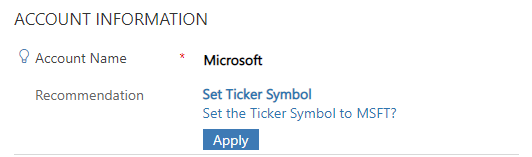

# addNotification (Client API reference)

Displays an error or recommendation notification for a control, and lets you specify actions to execute based on the notification. When you specify an error type of notification, a red "X" icon appears next to the control. When you specify a recommendation type of notification, an "i" icon appears next to the control. On Dynamics 365 mobile clients, tapping on the icon will display the message, and let you perform the configured action by clicking the **Apply** button or dismiss the message. 

## Control types supported

All

## Syntax

`formContext.getControl(arg).addNotification(notification);`

## Parameters

<table style="width:100%">
<tr>
<th>Name</th>
<th>Type</th>
<th>Required</th>
<th>Description</th>
</tr>
<tr>
<td>notification</td>
<td>Object</td>
<td>Yes</td>
<td>The notification to add. The object contains the following parameters:
<ul>
<li><b>actions</b>: (Optional) Array of objects. A collection of objects with the following parameters:
<ul>
<li><b>message</b>: (Optional) String. The body message of the notification to be displayed to the user. Limit your message to 100 characters for optimal user experience.</li>
<li><b>actions</b>: (Optional) Array of functions. The corresponding actions for the message.</li>
</ul>
<li><b>messages</b>: Array of Strings. The message to display in the notification. In the current release, only the first message specified in this array will be displayed. The string that you specify here appears as bold text in the notification, and is typically used for title or subject of the notification. You should limit your message to 50 characters for optimal user experience.</li>
<li><b>notificationLevel</b>: String. Defines the type of notification. Valid values are ERROR or RECOMMENDATION.</li>
<li><b>uniqueId</b>: String. The ID to use to clear this notification when using the <b>clearNotification</b> method.</li>
</ul></td>
</tr>

</table>

[!INCLUDE[cc-terminology](../../../../data-platform/includes/cc-terminology.md)]

## Return Value

**Type**: Boolean

**Description**: Indicates whether the method succeeded.


## Remarks

In web client the **addNotification** method displays a notification with the messages you specified and two standard buttons: **Apply** and **Dismiss**. Clicking **Apply** executes the action you define; clicking **Dismiss** closes the notification message.

In Unified Interface:

- There is no **Dismiss** button.
- The **Apply** button only appears when the notification level is set to **RECOMMENDATION**, not **ERROR**.

## Example

The following sample code displays a notification on the **Account Name** column of the account form to set the **Ticker Symbol** if the **Account Name** column contains "Microsoft", and the ticker symbol is not already set to "MSFT". Clicking **Apply** in the notification will set the **Ticker Symbol** column to "MSFT".

```JavaScript
function addTickerSymbolRecommendation(executionContext) {
    var formContext = executionContext.getFormContext();
    var myControl = formContext.getControl('name');
    var accountName = formContext.data.entity.attributes.get('name');
    var tickerSymbol = formContext.data.entity.attributes.get('tickersymbol');

    if (accountName.getValue() == 'Microsoft' && tickerSymbol.getValue() != 'MSFT') {
        var actionCollection = {
            message: 'Set the Ticker Symbol to MSFT?',
            actions: null
        };

        actionCollection.actions = [function () {
            tickerSymbol.setValue('MSFT');
            myControl.clearNotification('my_unique_id');
        }];

        myControl.addNotification({
            messages: ['Set Ticker Symbol'],
            notificationLevel: 'RECOMMENDATION',
            uniqueId: 'my_unique_id',
            actions: [actionCollection]
        });
    }
    else
        console.log("Notification not set");
}
```

This how the notification appears in model-driven apps:

> [!div class="mx-imgBorder"]
> 

### Related topics

[clearNotification](clearNotification.md)

[setNotification](setNotification.md)


[!INCLUDE[footer-include](../../../../../includes/footer-banner.md)]