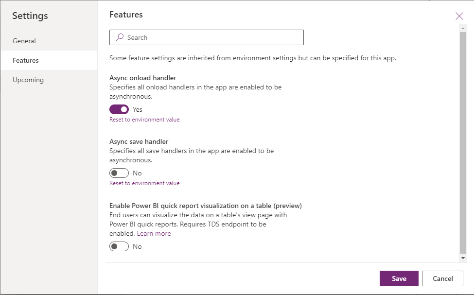

# Form OnLoad event

This event occurs whenever the form is loaded, specifically:

- On initial page load.
- After a new record is first saved (created). 
 
Use the formContext.ui.[addOnLoad](../formContext-ui/addOnLoad.md) and formContext.ui.[removeOnLoad](../formContext-ui/removeOnLoad.md) methods to manage event handlers for this event. 

> [!NOTE] 
> Controls in a form may not be ready when a form's `OnLoad` event occurs. Use the `OnLoad` event of the control to wait for it to be ready. More information: [Add or remove event handler function to event using UI](../../events-forms-grids.md#add-or-remove-event-handler-function-to-event-using-ui)

## Asynchronous OnLoad event handler support

The `OnLoad` event handler has the ability to wait for promises returned by event handlers to settle before loading a form which allows for an OnLoad event to be asynchronous ("async").  The `OnLoad` event becomes async when the event handler returns a promise.

The form loads when each promise returned by the event handler is resolved. For any promises that are returned, there is a 10 second limit for each promise. After that, the platform considers promises to be timed out. This timeout is applied per promise. For example, if you have five promises returned, the total wait time is 50 seconds.
Suppose the promise is rejected or timed out. In that case, the form load operation behaves similarly to the current script errors.

The `OnLoad` event will only wait for one promise returned per handler. If multiple promises are required, it is recommended to wrap all the promises in the `Promise.all()` method and return the single resulting promise. For multiple handlers that return a promise, we recommend that you create one handler that calls all the events and return a single promise that wraps all required promises. This is to minimize wait times caused by the timeout.

### Enable Async OnLoad using app setting

To use async onLoad handlers, you will need to enable it through the app setting.
An app setting is a platform component that allows you to turn supported features on or off for your app.
To enable the async Onload event handlers for a specific app:

1. Go to https://make.powerapps.com.
2. Make sure you select the correct environment.
3. Select **Apps** from the left navigation pane.
4. Select the app and then select **...** (ellipses). Select **Edit**.
5. Select **Settings** in the command bar.
6. When the dialog opens, select **Features**.
7. Turn on **Async onload handler**.
8. Select **Save**.

    
    
### Async OnLoad timeouts

When using an async handler, a form load will wait for the promise to be fulfilled, but only up to 10 seconds. This is to ensure that the form loads within a reasonable amount of time.

There may be scenarios where you want to pause OnLoad for a longer period of time.  An example is opening a dialog in the async OnLoad handler and waiting for the user's input before saving. To make sure the async operation will wait, you can invoke the event argument **disableAsyncTimeout** as follows `executioncontext.getEventArgs().disableAsyncTimeout()`.
When **disableAsyncTimeout** is set, the timeout for that handler will not be applied. It will continue to wait for that handler's promise to be fulfilled.

This should be used with caution as it might affect the performance of the form load.

[!INCLUDE[footer-include](../../../../../includes/footer-banner.md)]
