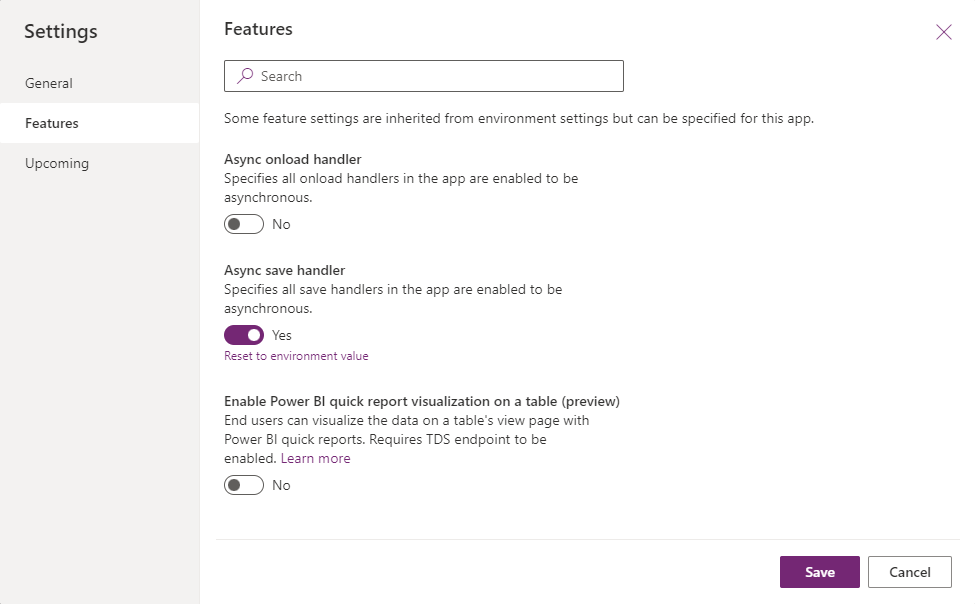

# Form OnSave event (Client API reference) in model-driven apps

The `OnSave` event occurs when:

- The user selects the **Save** or **Refresh** button in the command bar, even when there's no changed data to be saved.
- Code executes the [formContext.data.entity.save](../formContext-data-entity/save.md) method, even when there's no changed data to be saved.
- The user navigates away from the form and there's unsaved data in the form.
- The AutoSave option is enabled, 30 seconds after data has changed and there's unsaved data in the form.
- Code executes the [formContext.data.save](../formContext-data/save.md) method and there's unsaved data in the form.
- Code executes the [formContext.data.refresh](../formContext-data/refresh.md) method passing a true value as the first parameter and there's unsaved data in the form.

[!INCLUDE [cc_book-instead-of-save](../../../../../includes/cc_book-instead-of-save.md)]

To determine which button was clicked to perform the save, use the [getSaveMode method](../save-event-arguments/getSaveMode.md) method.

You can cancel the save action by using the preventDefault method within the event arguments object. The preventDefault method is accessible by using the getEventArgs method that is part of the execution context. Execution context is automatically passed to the form event handler.

## Asynchronous event handler support

The OnSave event has ability to wait for promises returned by event handlers to settle before saving, allowing the `OnSave` event to be asynchronous ("async").

The `OnSave` event becomes async when the `OnSave` event handler returns a promise. Saving of the record happens when each promise returned by a handler is resolved. For any promises that are returned, there's a 10-second limit for each promise, after that the platform considers promises to be timed out. This timeout is applied per promise. For example, if we have five promises returned, the total wait time is 50 seconds.  

If the promise is rejected or timed out, the save operation continues to behave similarly to the current script errors. Use the [preventDefault](../save-event-arguments/preventDefault.md) method within the event arguments object in that particular handler if you want to prevent the save event to happen if there's a script error/rejected promise or handler times out.

You can also cancel the save operation irrespective of the error in the handler or not using the [preventDefault](../save-event-arguments/preventDefault.md) method within the event arguments object. If this method is called, the Async OnSave event waits for all the promises to settle, but the save won't occur. Calling this method means the logic within `.then()` & `.catch()` will execute.

The `OnSave` event waits for one promise returned per handler. If multiple promises are required, it's recommended to wrap all the promises in the `Promise.all()` method and return the single resulting promise. For multiple handlers that all return a promise, we recommend you to create one handler that calls all the events and return a single promise that wraps all required promises.  This practice is to minimize wait times caused by the timeout.

### Example scenario on when to use async OnSave handlers

Consider creating a Work Order Service Task, you need to validate that the Customer Asset selected has the same account listed in the Work Order. Fetching the account on the Work Order and Customer Asset are both asynchronous processes and need to be completed before the validation can occur. 

In this scenario, since there are multiple async processes and both calls return a single promise by wrapping both in the `Promise.all()` method.

> [!NOTE] 
> The `preventDefault` method can only be used synchronously.

For example:

```JavaScript
 function myHandler(context) {
    return new Promise((resolve) => {
       setTimeout( () => {
          context.getEventArgs().preventDefault();
       }, 1000);
   });
 }
```

### Enable Async OnSave using app setting 

To use async onSave handlers, you need to enable it through an app setting:

1. Go to https://make.powerapps.com.
2. Make sure select the correct environment.
3. Select **Apps** from the left navigation pane.
4. Select the app and then select **...** (ellipses). Select **Edit**.
5. Select **Settings** from the command bar.
6. When the dialog opens, select **Features**.
7. Turn on **Async onSave handler**.
8. Select **Save**.

    

### Async OnSave timeouts

When you use an async `OnSave` handler, the form waits for the promise returned by the handler to be fulfilled. To ensure that the form save completes in a timely manner, the handler will throw a timeout exception after 10 seconds to let you know to tune the async `OnSave` handler for better performance.

There are scenarios where pausing the `OnSave` handler for longer than 10 seconds is needed. An example is opening a dialog and waiting for the user's input before continuing to save. To make sure the async operation waits for the promise to resolve, use the **disableAsyncTimeout** method.

> [!NOTE]
> You must call `disableAsyncTimeout` before any await statements or async calls.

For example:

```JavaScript
async function myHandler(context) {  
     context.getEventArgs().disableAsyncTimeout();
     // The 10000ms time out will not be disabled if the above line does not come before all async awaits
     await Xrm.Navigation.openConfirmDialog({ text: "Are you sure you want to save?" });
 }
```

When **disableAsyncTimeout** is called, the timeout for that handler isn't applied. It continues to wait for that handler's promise to be fulfilled.

This pattern should be used with caution as it might affect the performance of the form save.

### Related article

[Grid OnSave Event](grid-onsave.md)  


[!INCLUDE[footer-include](../../../../../includes/footer-banner.md)]
