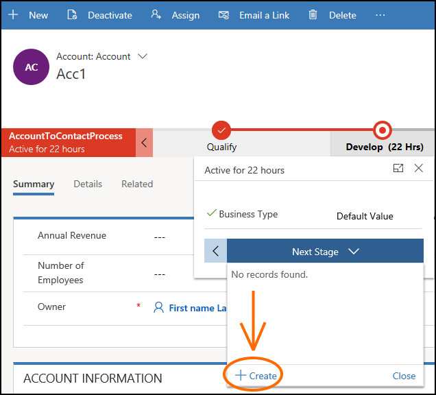

# getNavigationBehavior (Client API reference)

[!INCLUDE[./includes/getNavigationBehavior-description.md](./includes/getNavigationBehavior-description.md)]

> [!NOTE]
> This method is available only for [Unified Interface](/dynamics365/get-started/whats-new/customer-engagement/new-in-version-9#unified-interface-framework-for-new-apps). 

## Syntax

```
stageObj.getNavigationBehavior().allowCreateNew = function () {
    return true|false;
}
```

[!INCLUDE[cc-terminology](../../../../../data-platform/includes/cc-terminology.md)]

## Returns

**Type**: Object 

**Description**: An object with the `allowCreateNew` property that lets you define whether the **Create** button will be available in a stage so that user can create an instance of tableB from the tableA form in a cross-table business process flow navigation scenario. 

For example, here is the **Create** button in the **Develop** stage of the **AccountToContactProcess** sample business process flow that lets you create a Contact record from the Account form.



The `allowCreateNew` property will return **undefined** for business process flow records that do not implement cross-table navigation.

## Example

The following sample code shows how you can hide or display the **Create** button for an active stage of a business process flow depending on its name.

```JavaScript
function sampleFunction(executionContext) {
    var formContext = executionContext.getFormContext();
    formContext.data.process.getActiveStage().getNavigationBehavior().allowCreateNew = function () {
        if (formContext.data.process.getName() === 'Test Process') {
            return false; // Create button is not available
        }
        else {
            return true; // Create button is available
        }
    }
}
```

### Related articles
 
[formContext.data.process](../../formContext-data-process.md)

[!INCLUDE[footer-include](../../../../../../includes/footer-banner.md)]
