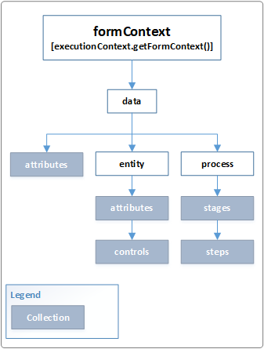

# formContext.data (Client API reference)

Provides properties and methods to work with the data on a form.

## Properties

|Name|Description|
|--|--|
|attributes|Collection of non-entity data on the form. Items in this collection are of the same type as the attributes collection, but they are not attributes of the form entity.  More information: [Collections](collections.md)|
|entity|Provides methods to retrieve information specific to the record displayed on the page, the save method, and a collection of all the attributes included on the form. Attribute data is limited to attributes represented by fields on the form.  More information: [formContext.data.entity](formContext-data-entity.md)|
|process|Provides objects and methods to interact with the business process flow data on a form. More information: [formContext.data.process](formContext-data-process.md)|

## Methods 

|Name|Description|
|--|--|
|[addOnLoad](formContext-data/addOnload.md)|[!INCLUDE[formContext-data/includes/addOnLoad-description.md](formContext-data/includes/addOnLoad-description.md)]|
|[getIsDirty](formContext-data/getIsDirty.md)|[!INCLUDE[formContext-data/includes/getIsDirty-description.md](formContext-data/includes/getIsDirty-description.md)]|
|[isValid](formContext-data/isValid.md)|[!INCLUDE[formContext-data/includes/isValid-description.md](formContext-data/includes/isValid-description.md)]|
|[refresh](formContext-data/refresh.md)|[!INCLUDE[formContext-data/includes/refresh-description.md](formContext-data/includes/refresh-description.md)]|
|[removeOnLoad](formContext-data/removeOnLoad.md)|[!INCLUDE[formContext-data/includes/removeOnLoad-description.md](formContext-data/includes/removeOnLoad-description.md)]|
|[save](formContext-data/save.md)|[!INCLUDE[formContext-data/includes/save-description.md](formContext-data/includes/save-description.md)]|

### Related topics

[formContext.data.entity](formContext-data-entity.md)

[formContext.data.process](formContext-data-process.md)

