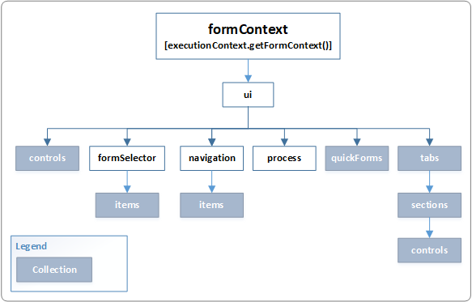

# formContext.ui (Client API reference)

Provides properties and methods to retrieve information about the user interface (UI) as well as collections for several sub components of the form.

## Properties

|Name|Description|
|--|--|
|controls|Collection of all the controls on the page. See [Collections](collections.md) for information about the collections and [Controls](controls.md) for information about the control objects in the collection.|
|formSelector|Use the formSelector.getCurrentItem method to retrieve information about the form currently in use. Use the formSelector.items collection to return information about all the forms available for the user. **formSelector** is not available for Microsoft Dynamics 365 for tablets.|
|navigation|An object containing a property **items**, which is a collection of all the navigation items on the page. See [Collections](collections.md) for information about the collection methods and [formContext.ui.navigation item](formContext-ui-navigation.md) for information about the items in the collection. **navigation** is not available for Microsoft Dynamics 365 for tablets.|
|process|Provides objects and methods to interact with the business process flow control on a form. More information: [formContext.ui.process](formContext-ui-process.md)|
|quickForms|A collection of all the quick view controls on a form using the new form rendering engine (also called "turbo forms"). More information: [formContext.ui quickForms](formContext-ui-quickforms.md)|
|tabs|A collection of all the tabs on the page. See [Collections](collections.md) for information about the collection methods and [formContex.ui tab](formContext-ui-tabs.md)  for information about the items in the collection.|

[!INCLUDE[cc-terminology](../../../data-platform/includes/cc-terminology.md)]

## Methods 

|Name|Description|
|--|--|
|[addOnLoad](formContext-ui/addOnload.md)|[!INCLUDE[formContext-ui/includes/addOnLoad-description.md](formContext-ui/includes/addOnLoad-description.md)]|
|[clearFormNotification](formContext-ui/clearFormNotification.md)|[!INCLUDE[formContext-ui/includes/clearFormNotification-description.md](formContext-ui/includes/clearFormNotification-description.md)]|
|[close](formContext-ui/close.md)|[!INCLUDE[formContext-ui/includes/close-description.md](formContext-ui/includes/close-description.md)]|
|[getFormType](formContext-ui/getFormType.md)|[!INCLUDE[formContext-ui/includes/getFormType-description.md](formContext-ui/includes/getFormType-description.md)]|
|[getViewPortHeight](formContext-ui/getViewPortHeight.md)|[!INCLUDE[formContext-ui/includes/getViewPortHeight-description.md](formContext-ui/includes/getViewPortHeight-description.md)]|
|[getViewPortWidth](formContext-ui/getViewPortWidth.md)|[!INCLUDE[formContext-ui/includes/getViewPortWidth-description.md](formContext-ui/includes/getViewPortWidth-description.md)]|
|[refreshRibbon](formContext-ui/refreshRibbon.md)|[!INCLUDE[formContext-ui/includes/refreshRibbon-description.md](formContext-ui/includes/refreshRibbon-description.md)]|
|[removeOnLoad](formContext-ui/removeOnLoad.md)|[!INCLUDE[formContext-ui/includes/removeOnLoad-description.md](formContext-ui/includes/removeOnLoad-description.md)]|
|[setFormEntityName](formContext-ui/setFormEntityName.md)|[!INCLUDE[formContext-ui/includes/setFormEntityName-description.md](formContext-ui/includes/setFormEntityName-description.md)]|
|[setFormNotification](formContext-ui/setFormNotification.md)|[!INCLUDE[formContext-ui/includes/setFormNotification-description.md](formContext-ui/includes/setFormNotification-description.md)]|

### Related topics

[formContext](../clientapi-form-context.md)

[!INCLUDE[footer-include](../../../../includes/footer-banner.md)]