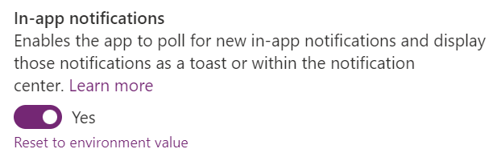
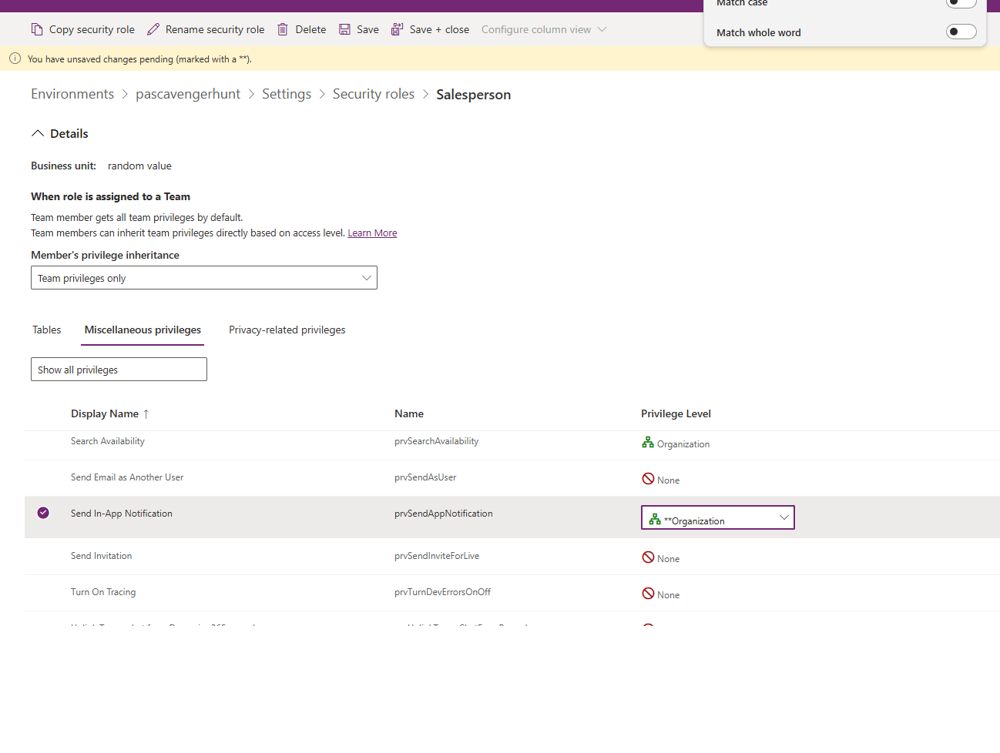

# Send in-app notifications within model-driven apps

Developers of model-driven apps can configure notifications to display to app users as a toast or within the notification center. Your model-driven app automatically polls the system for new notifications and displays them to the user. The notification sender or your system administrator can configure how the notification is shown and how it can be dismissed. Notifications appear in the notification center until the recipient dismisses them or they expire. By default, a notification expires after 14 days but your administrator can override this setting.

Notifications are user-specific. Each notification is intended for a single user, identified as the recipient when the notification is sent. Sending a notification to a team isn't supported. If you need to send notifications to multiple users, you must create notifications for each individual user.

This article outlines the steps for how to send in-app notifications to a specific user. To see how these notifications appear in applications, see [In-app notifications in model-driven apps](/powerapps/user/notifications).

## Enable the in-app notification feature

To use the in-app notification feature, you need to enable the **In-app notifications** setting. This setting is stored within the model-driven app.

1. Sign in to [Power Apps](https://make.powerapps.com).

1. Open the solution that contains the model-driven app.  

1. Select the model-driven app and select the **Edit** split menu to open it by using the modern app designer.

1. Open **Settings** and switch to **Features**.

1. Enable **In-app notifications**.

    > [!div class="mx-imgBorder"]
    > 

1. Select **Save** to save the settings change.

1. Select **Publish** on the model-driven app.


## Send basic in-app notifications

Use the `SendAppNotification` message to send notifications.

For more information about the message and its parameters, see [SendAppNotification Action](xref:Microsoft.Dynamics.CRM.SendAppNotification). 

The Dataverse SDK for .NET doesn't currently include request and response classes for the `SendAppNotification` message. To get strongly typed classes for this message, you must generate classes or use the underlying <xref:Microsoft.Xrm.Sdk.OrganizationRequest> and <xref:Microsoft.Xrm.Sdk.OrganizationResponse> classes. For more information, see [Use messages with the SDK for .NET](../../data-platform/org-service/use-messages.md).

The `SendAppNotification` message uses open types, which enable dynamic properties on the in-app notification. For example, a notification can have zero to many actions, and each action can have different action types. Open types enable having dynamic properties for the actions depending on the action types selected. For more information, see [Use open types with custom APIs](../../data-platform/use-open-types.md).

The following basic examples show how to use the API to send in-app notifications.

> [!div class="mx-imgBorder"]
> 

#### [Client API](#tab/clientapi)

This example uses the custom `Example.SendAppNotificationRequest` function described in [Creating a function for your client script](#creating-a-function-for-your-client-script) section.

```javascript
var SendAppNotificationRequest = new Example.SendAppNotificationRequest(
    title = "Welcome",
    recipient = "/systemusers(<GUID of the user>)",
    body = "Welcome to the world of app notifications!",
    priority = 200000000,
    iconType = 100000000,
    toastType = 200000000,
);

Xrm.WebApi.online.execute(SendAppNotificationRequest).then(function (response) {
    if (response.ok) {
        console.log("Status: %s %s", response.status, response.statusText);

        return response.json();
    }
})
.then(function (responseBody) {
    console.log("Response Body: %s", responseBody.NotificationId);
})
.catch(function (error) {
    console.log(error.message);
});
```
#### [Web API](#tab/webapi)

**Request:**

```http
POST [Organization URI]/api/data/v9.2/SendAppNotification
Content-Type: application/json; charset=utf-8
OData-MaxVersion: 4.0
OData-Version: 4.0
Accept: application/json

{
  "Title": "Welcome",
  "Body": "Welcome to the world of app notifications!",
  "Recipient": "/systemusers(<Guid of the user>)",
  "IconType": 100000000, // info
  "ToastType": 200000000 // timed
}
```

**Response:**

```http
HTTP/1.1 204 No Content
OData-Version: 4.0
```

For more information, see [Use Web API actions](../../data-platform/webapi/use-web-api-actions.md).

#### [SDK for .NET](#tab/sdk)

```csharp
/// <summary>
/// Example of SendAppNotification
/// </summary>
/// <param name="service">Authenticated client implementing the IOrganizationService interface</param>
/// <param name="userId">The Id of the user to send the notification to.</param>
/// <returns>The app notification id</returns>
public static Guid SendAppNotificationExample(IOrganizationService service, Guid userId)
{
    var request = new OrganizationRequest()
    {
        RequestName = "SendAppNotification",
        Parameters = new ParameterCollection
        {
            ["Title"] = "Welcome",
            ["Recipient"] = new EntityReference("systemuser", userId),
            ["Body"] = "Welcome to the world of app notifications!",
            ["IconType"] = new OptionSetValue(100000000), //info
            ["ToastType"] = new OptionSetValue(200000000) //timed
        }
    };

    OrganizationResponse response = service.Execute(request);
    return (Guid)response.Results["NotificationId"];
}
```

For more information, see [IOrganizationService Interface](../../data-platform/org-service/iorganizationservice-interface.md).

---

## Notification polling

In-app notifications use polling to retrieve notifications periodically when the app is running. The app retrieves new notifications at the start of the model-driven app and when a page navigation occurs as long as the last retrieval is more than one minute ago. If a user stays on a page for a long duration, the app doesn't retrieve new notifications until the user navigates to another page.

## Notification table

The app stores notifications sent by using the `SendAppNotification` message in the [Notification (appnotification) table](../../data-platform/reference/entities/appnotification.md) (Web API <xref:Microsoft.Dynamics.CRM.appnotification?displayProperty=nameWithType>). The following table shows the selected columns for the table.

|Display Name|Schema Name|Description|
|---|---|---|
|**Title**|`Title`|The title of the notification.|
|**Owner**|`OwnerId`|The *user* who receives the notification. While this column can be set to either a user or team, set it only to a user. You can't set the notification to a team.|
|**Body**|`Body`|Details about the notification.|
|IconType|`IconType`|The list of predefined icons. The default value is `Info`. For more information, see [Changing the notification icon](#changing-the-notification-icon) later in this article.|
|**Toast Type**|`ToastType`|The list of notification behaviors. The default value is `Timed`. For more information, see [Changing the notification behavior](#changing-the-notification-behavior) later in this article.|
|**Priority** | `Priority` |Enables prioritization of notifications, which determines the order in which the notifications are displayed in the notification center. For more information, see [Changing the notification behavior](#changing-the-notification-behavior) later in this article. |
|**Expiry (seconds)**|`TTLInSeconds`|The number of seconds from when the notification should be deleted if not already dismissed.|
|**Data**|`Data`|JSON that's used for extensibility and parsing richer data into the notification. The maximum length is 5,000 characters.|

  > [!NOTE]
  > The table doesn't use the `appmoduleid` field.

## Customizing the notification

In addition to the basic properties of the notification, you can customize the notification delivered to the user. Customizing the notification involves changing the styles in the `Title` and `Body` of the notification, customizing the notification icon, and changing the behavior of the notification.

### Using markdown in title and body

The `Title` and `Body` parameters of the `SendAppNotification` message don't support markdown defined within the properties. You can adjust the styles of these properties by using markdown in the `OverrideContent` property. This field supports overriding the `Title` and `Body` simple strings with a limited subset of markdown styles.

The following table shows the supported markdown.

|Text Style|Markdown|
|---|---|
|Bold|`**Bold**`|
|Italic|`_Italic_`|
|Bullet list|`- Item 1\r- Item 2\r- Item 3`|
|Numbered list|`1. Green\r2. Orange\r3. Blue`|
|Hyperlinks|`[Title](url)`|

Include newlines in the body by using `\n\n\n\n`.

This example shows how to create a notification by adding a custom body definition that includes an inline link.

> [!div class="mx-imgBorder"]
> 

#### [Client API](#tab/clientapi)

This example uses the custom `Example.SendAppNotificationRequest` function described in [Creating a function for your client script](#creating-a-function-for-your-client-script) section.

```javascript
var SendAppNotificationRequest = new Example.SendAppNotificationRequest(title = "SLA critical",
    recipient = "/systemusers(<GUID of the user>)",
    body = "Record assigned to you is critically past SLA.",
    iconType = 100000003,
    toastType = 200000000,
    overrideContent = {
        "@odata.type": "#Microsoft.Dynamics.CRM.expando",
        "title": "**SLA critical**",
        "body": "Case record [Complete overhaul required (sample)](?pagetype=entityrecord&etn=incident&id=0a9f62a8-90df-e311-9565-a45d36fc5fe8) assigned is critically past SLA and has been escalated to your manager."

    }
);

Xrm.WebApi.online.execute(SendAppNotificationRequest).then(function (response) {
    if (response.ok) {
        console.log("Status: %s %s", response.status, response.statusText);

        return response.json();
    }
})
.then(function (responseBody) {
    console.log("Response Body: %s", responseBody.NotificationId);
})
.catch(function (error) {
    console.log(error.message);
});
```
#### [Web API](#tab/webapi)

```http
POST [Organization URI]/api/data/v9.2/SendAppNotification
Content-Type: application/json; charset=utf-8
OData-MaxVersion: 4.0
OData-Version: 4.0
Accept: application/json

{
  "Title": "SLA critical",
  "Body": "Record assigned to you is critically past SLA.",
  "Recipient": "/systemusers(<Guid of the user>)",
  "IconType": 100000003, // warning
  "ToastType": 200000000, // timed
  "OverrideContent": {
    "@odata.type": "#Microsoft.Dynamics.CRM.expando",
    "title": "**SLA critical**",
    "body": "Case record [Complete overhaul required (sample)](?pagetype=entityrecord&etn=incident&id=0a9f62a8-90df-e311-9565-a45d36fc5fe8) assigned is critically past SLA and has been escalated to your manager."
  }
}
```
#### [SDK for .NET](#tab/sdk)

```csharp
/// <summary>
/// Example of SendAppNotification with overridden content
/// </summary>
/// <param name="service">Authenticated client implementing the IOrganizationService interface</param>
/// <param name="userId">The Id of the user to send the notification to.</param>
/// <returns>The app notification id</returns>
public static Guid SendAppNotificationWithOveriddenContent(IOrganizationService service, Guid userId)
{

    var request = new OrganizationRequest()
    {
        RequestName = "SendAppNotification",
        Parameters = new ParameterCollection
        {
            ["Title"] = "SLA critical",
            ["Recipient"] = new EntityReference("systemuser", userId),
            ["Body"] = "Record assigned to you is critically past SLA.",
            ["IconType"] = new OptionSetValue(100000003), //warning
            ["ToastType"] = new OptionSetValue(200000000), //timed
            ["OverrideContent"] = new Entity()
            {
                Attributes =
                  {
                  ["title"] = "**SLA critical**",
                  ["body"] = "Case record [Complete overhaul required (sample)](?pagetype=entityrecord&etn=incident&id=0a9f62a8-90df-e311-9565-a45d36fc5fe8) assigned to you is critically past SLA and has been escalated to your manager."
                  }
            }
        }
    };

    OrganizationResponse response = service.Execute(request);
    return (Guid)response.Results["NotificationId"];

}
```

---

This example adds a custom title and a body definition that allows multiple links, bold formatting, and italic formatting.

> [!div class="mx-imgBorder"]
> 

#### [Client API](#tab/clientapi)

This example uses the custom `Example.SendAppNotificationRequest` function described in [Creating a function for your client script](#creating-a-function-for-your-client-script) section.

```javascript
var SendAppNotificationRequest = new Example.SendAppNotificationRequest(title = "Complete overhaul required (sample)",
    recipient = "/systemusers(<GUID of the user>)",
    body = "Maria Campbell mentioned you in a post.",
    priority = 200000000,
    iconType = 100000004,
    toastType = 200000000,
    expiry = 120000,
    overrideContent = {
        "@odata.type": "#Microsoft.Dynamics.CRM.expando",
        "title": "[Complete overhaul required (sample)](?pagetype=entityrecord&etn=incident&id=0a9f62a8-90df-e311-9565-a45d36fc5fe8)",
        "body": "[Maria Campbell](?pagetype=entityrecord&etn=contact&id=43m770h2-6567-ebm1-ob2b-000d3ac3kd6c) mentioned you in a post: _\"**[@Paul](?pagetype=entityrecord&etn=contact&id=03f770b2-6567-eb11-bb2b-000d3ac2be4d)** we need to prioritize this overdue case, [@Robert](?pagetype=entityrecord&etn=contact&id=73f970b2-6567-eb11-bb2b-000d3ac2se4h) will work with you to engage with engineering team ASAP.\"_"
    }
);

// Use the request object to execute the function
Xrm.WebApi.online.execute(SendAppNotificationRequest).then(function (response) {
    if (response.ok) {
        console.log("Status: %s %s", response.status, response.statusText);

        // Use response.json() to access the content of the response body.
        return response.json();
    }
})
.then(function (responseBody) {
    console.log("Response Body: %s", responseBody.NotificationId);
})
.catch(function (error) {
    console.log(error.message);
    // handle error conditions
});

```

#### [Web API](#tab/webapi)

**Request:**

```http
POST [Organization URI]/api/data/v9.2/SendAppNotification
Content-Type: application/json; charset=utf-8
OData-MaxVersion: 4.0
OData-Version: 4.0
Accept: application/json

{
  "Title": "Complete overhaul required (sample)",
  "Body": "Maria Campbell mentioned you in a post.",
  "Recipient": "/systemusers(<Guid of the user>)",
  "IconType": 100000004, // mention
  "OverrideContent": {
    "@odata.type": "#Microsoft.Dynamics.CRM.expando",
    "title": "[Complete overhaul required (sample)](?pagetype=entityrecord&etn=incident&id=0a9f62a8-90df-e311-9565-a45d36fc5fe8)",
    "body": "[Maria Campbell](?pagetype=entityrecord&etn=contact&id=43m770h2-6567-ebm1-ob2b-000d3ac3kd6c) mentioned you in a post: _\"**[@Paul](?pagetype=entityrecord&etn=contact&id=03f770b2-6567-eb11-bb2b-000d3ac2be4d)** we need to prioritize this overdue case, [@Robert](?pagetype=entityrecord&etn=contact&id=73f970b2-6567-eb11-bb2b-000d3ac2se4h) will work with you to engage with engineering team ASAP.\"_"
  }
}
```

**Response:**

```http
HTTP/1.1 204 No Content
OData-Version: 4.0
```

#### [SDK for .NET](#tab/sdk)

```csharp
/// <summary>
/// Example of SendAppNotification with formatted content
/// </summary>
/// <param name="service">Authenticated client implementing the IOrganizationService interface</param>
/// <param name="userId">The Id of the user to send the notification to.</param>
/// <returns>The app notification id</returns>
public static Guid SendAppNotificationWithFormattedContent(IOrganizationService service, Guid userId)
{

    var request = new OrganizationRequest()
    {
        RequestName = "SendAppNotification",
        Parameters = new ParameterCollection
        {
            ["Title"] = "Complete overhaul required (sample)",
            ["Recipient"] = new EntityReference("systemuser", userId),
            ["Body"] = "Maria Campbell mentioned you in a post.",
            ["IconType"] = new OptionSetValue(100000004), //mention
            ["OverrideContent"] = new Entity()
            {
                Attributes =
                {
                    ["title"] = "[Complete overhaul required (sample)](?pagetype=entityrecord&etn=incident&id=0a9f62a8-90df-e311-9565-a45d36fc5fe8)",
                    ["body"] = "[Maria Campbell](?pagetype=entityrecord&etn=contact&id=43m770h2-6567-ebm1-ob2b-000d3ac3kd6c) mentioned you in a post: _\"**[@Paul](?pagetype=entityrecord&etn=contact&id=03f770b2-6567-eb11-bb2b-000d3ac2be4d)** we need to prioritize this overdue case, [@Robert](?pagetype=entityrecord&etn=contact&id=73f970b2-6567-eb11-bb2b-000d3ac2se4h) will work with you to engage with engineering team ASAP.\"_"
                }
            }
        }
    };

    OrganizationResponse response = service.Execute(request);
    return (Guid)response.Results["NotificationId"];
}
```

---

>[!NOTE]
> Power Fx with the `xSendAppNotification` function doesn't support `OverrideContent`.

<!-- TODO: Add link to where this function is documented -->

### Change the notification behavior

Change the in-app notification behavior by setting `ToastType` to one of the following values.

|Toast Type|Behavior|Value|
|---|---|---|
|Timed|The notification appears for a brief duration (the default is four seconds) and then disappears.|`200000000`|
|Hidden|The notification appears only in the notification center and not as a toast notification.|`200000001`|

### Change the notification icon

Change the in-app notification icon by setting `IconType` to one of the following values. When you use a custom icon, specify the `iconUrl` parameter within the `OverrideContent` parameter.

|Icon Type|Value|Image|
|---|---|---|
|Info|`100000000`|:::image type="content" source="media/send-in-app-notifications/app-notification-info-icon.png" alt-text="Info Icon":::|
|Success|`100000001`|:::image type="content" source="media/send-in-app-notifications/app-notification-success-icon.png" alt-text="Success Icon":::|
|Failure|`100000002`|:::image type="content" source="media/send-in-app-notifications/app-notification-failure-icon.png" alt-text="Failure Icon":::|
|Warning|`100000003`|:::image type="content" source="media/send-in-app-notifications/app-notification-warning-icon.png" alt-text="Warning Icon":::|
|Mention|`100000004`|:::image type="content" source="media/send-in-app-notifications/app-notification-mention-icon.png" alt-text="Mention Icon":::|
|Custom|`100000005`| |

The following example demonstrates using Web API to send a notification with a custom icon.

```http
POST [Organization URI]/api/data/v9.2/SendAppNotification 
HTTP/1.1
Content-Type: application/json; charset=utf-8
OData-MaxVersion: 4.0
OData-Version: 4.0
Accept: application/json

{
  "Title": "Welcome",
  "Body": "Welcome to the world of app notifications!",
  "Recipient": "/systemusers(<Guid of the user>)",
  "IconType": 100000005, // custom
  "OverrideContent": {
    "@odata.type": "#Microsoft.Dynamics.CRM.expando",
    "iconUrl": "/WebResources/cr245_AlertOn" //URL of the image file to be used for the notification icon
  }
}
```

### Setting the notification priority

You can change the order in which notifications display in the notification center by setting the `Priority`. The following values are available:

|Priority | Value |
|---------|-------|
|Normal |`200000000`|
|High |`200000001`|

The default value is `Normal`. The notification center sorts notifications by **Priority** and **Created On** date, in descending order. High priority notifications appear at the top of the list in the notification center.

## Notification actions

In-app notifications support zero to many actions on the notification card. Three action types are supported:

- **URL**: When you select this action, the web browser goes to the defined URL.
- **Side Pane**: When you select this action, a side pane opens in the app and loads the defined context in the pane.
- **Teams Chat**: When you select this action, a Teams chat starts with defined users in the context of a Dynamics 365 record.

### Defining a URL action

The URL action type enables navigation from the action on the app notification to a defined URL. The following table lists the parameters for this action type:

|Parameter | Required | Data type | Description |
|-------------|-------------|-------------|-------------|
|`url` | Yes | String | The URL of the web address to open when the action is selected. |
|`navigationTarget` | No | String | This parameter controls where a navigation link opens. The options are:<br><ul><li>`dialog`: Opens in the center dialog.</li><li>`inline`: Default. Opens in the current page.</li><li>`newWindow`: Opens in a new browser tab.</li></ul> |

The following example shows how to create a notification with a single URL action.

> [!div class="mx-imgBorder"] 
> 

#### [Client API](#tab/clientapi)

This example uses the custom `Example.SendAppNotificationRequest` function described in [Creating a function for your client script](#creating-a-function-for-your-client-script) section.
  
```javascript
var SendAppNotificationRequest = new Example.SendAppNotificationRequest(title = "Congratulations",
    recipient = "/systemusers(<GUID of the user>)",
    body = "Your customer rating is now an A. You resolved 80% of your cases within SLA thi week and average customer rating was A+",
    iconType = 100000001,
    toastType = 200000000,
    overrideContent = {
        "@odata.type": "#Microsoft.Dynamics.CRM.expando",
        "title": "**SLA critical**",
        "body": "Case record [Complete overhaul required (sample)](?pagetype=entityrecord&etn=incident&id=0a9f62a8-90df-e311-9565-a45d36fc5fe8) assigned is critically past SLA and has been escalated to your manager."

    },
    actions = {
        "@odata.type": "Microsoft.Dynamics.CRM.expando",
        "actions@odata.type": "#Collection(Microsoft.Dynamics.CRM.expando)",
        "actions": [
            {
                "title": "View cases",
                "data": {
                    "@odata.type": "#Microsoft.Dynamics.CRM.expando",
                    "type": "url",
                    "url": "?pagetype=entitylist&etn=incident&viewid=00000000-0000-0000-00aa-000010001028&viewType=1039",
                    "navigationTarget": "newWindow"
                }
            }
        ]
    }
);

Xrm.WebApi.online.execute(SendAppNotificationRequest).then(function (response) {
    if (response.ok) {
        console.log("Status: %s %s", response.status, response.statusText);

        return response.json();
    }
})
.then(function (responseBody) {
    console.log("Response Body: %s", responseBody.NotificationId);
})
.catch(function (error) {
    console.log(error.message);
});
```
#### [Web API](#tab/webapi)

```http
POST [Organization URI]/api/data/v9.2/SendAppNotification
Content-Type: application/json; charset=utf-8
OData-MaxVersion: 4.0
OData-Version: 4.0
Accept: application/json

{
  "Title": "Congratulations",
  "Body": "Your customer rating is now an A. You resolved 80% of your cases within SLA thi week and average customer rating was A+",
  "Recipient": "/systemusers(<GUID of user>)",
  "IconType": 100000001, // success
  "ToastType": 200000000, // timed
  "Actions": {
      "@odata.type":"Microsoft.Dynamics.CRM.expando",
      "actions@odata.type":"#Collection(Microsoft.Dynamics.CRM.expando)",
      "actions": [
        {
            "title": "View cases",
            "data": {
                "@odata.type": "#Microsoft.Dynamics.CRM.expando",
                "type": "url",
                "url": "?pagetype=entitylist&etn=incident&viewid=00000000-0000-0000-00aa-000010001028&viewType=1039",
                "navigationTarget": "newWindow"
            }
        }
      ]
  }
}
```

#### [SDK for .NET](#tab/sdk)

```csharp
/// <summary>
/// Example of SendAppNotification with URl Action
/// </summary>
/// <param name="service">Authenticated client implementing the IOrganizationService interface</param>
/// <param name="userId">The Id of the user to send the notification to.</param>
/// <returns>The app notification id</returns>
public static Guid SendAppNotificationWithUrlAction(IOrganizationService service, Guid userId)
{
    var request = new OrganizationRequest()
    {
        RequestName = "SendAppNotification",
        Parameters = new ParameterCollection
        {
            ["Title"] = "Congratulations",
            ["Recipient"] = new EntityReference("systemuser", userId),
            ["Body"] = "Your customer rating is now an A. You resolved 80% of your cases within SLA thi week and average customer rating was A+",
            ["IconType"] = new OptionSetValue(100000000), //info
            ["ToastType"] = new OptionSetValue(200000000), //timed
            ["Actions"] = new Entity()
            {
                Attributes =
                {
                    ["actions"] = new EntityCollection()
                    {
                        Entities =
                        {
                            new Entity()
                            {
                                Attributes =
                                {
                                    ["title"] = "View cases",
                                    ["data"] = new Entity()
                                    {
                                        Attributes =
                                        {
                                            ["type"] = "url",
                                            ["url"] = "?pagetype=entitylist&etn=incident&viewid=00000000-0000-0000-00aa-000010001028&viewType=1039",
                                            ["navigationTarget"] = "newWindow"
                                        }
                                    }
                                }
                            }
                        }
                    }
                }
            }
        }
    };
```

---
  
### Defining a side pane action

A side pane action enables opening a side pane to load a defined page when you select the action from the app notification. For more information, see [Creating side panes by using a client API](./create-app-side-panes.md).

When you use the side pane action type, you control the options of the side pane itself, and the page that loads in the side pane.
- See [createPane](./reference/xrm-app/xrm-app-sidepanes/createpane.md) for the optional parameters for the pane that is created.
- See [navigateTo (Client API reference)](./reference/xrm-navigation/navigateto.md) for the parameters to define for the page that loads in the side pane.
  
The following example shows creating an app notification with two side pane actions.
  
#### [Client API](#tab/clientapi)

This example uses the custom `Example.SendAppNotificationRequest` function described in [Creating a function for your client script](#creating-a-function-for-your-client-script) section.
  
```javascript
var SendAppNotificationRequest = new Example.SendAppNotificationRequest(title = "New task",
    recipient = "/systemusers(<GUID of the user>)",
    body = "A new task has been assigned to you to follow up on the Contoso account",
    iconType = 100000000,
    toastType = 200000000,
    actions = {
        "@odata.type": "Microsoft.Dynamics.CRM.expando",
        "actions@odata.type": "#Collection(Microsoft.Dynamics.CRM.expando)",
        "actions": [
            {
                "title": "View task",
                "data": {
                    "@odata.type": "#Microsoft.Dynamics.CRM.expando",
                    "type": "sidepane",
                    "paneOptions": {
                        "@odata.type": "#Microsoft.Dynamics.CRM.expando",
                        "title": "Task Record",
                        "width": 400
                    },
                    "navigationTarget": {
                        "@odata.type": "#Microsoft.Dynamics.CRM.expando",
                        "pageType": "entityrecord",
                        "entityName": "task",
                        "entityId": "<Task ID>"
                    }
                }
            }
        ]
    }
);

Xrm.WebApi.online.execute(SendAppNotificationRequest).then(function (response) {
    if (response.ok) {
        console.log("Status: %s %s", response.status, response.statusText);

        return response.json();
    }
})
.then(function (responseBody) {
    console.log("Response Body: %s", responseBody.NotificationId);
})
.catch(function (error) {
    console.log(error.message);
});
```
#### [Web API](#tab/webapi)

```http
POST [Organization URI]/api/data/v9.2/SendAppNotification 
Content-Type: application/json; charset=utf-8
OData-MaxVersion: 4.0
OData-Version: 4.0
Accept: application/json

{
  "Title": "New task",
  "Body": "A new task has been assigned to you to follow up on the Contoso account",
  "Recipient": "/systemusers(<User ID>)",
  "IconType": 100000000, // info
  "ToastType": 200000000, // timed
  "Actions": {
      "@odata.type":"Microsoft.Dynamics.CRM.expando",
      "actions@odata.type":"#Collection(Microsoft.Dynamics.CRM.expando)",
      "actions": [
        {
          "title": "View task",
          "data" : {
                "@odata.type": "#Microsoft.Dynamics.CRM.expando",
                "type": "sidepane",
                "paneOptions": {
                    "@odata.type": "#Microsoft.Dynamics.CRM.expando",
                    "title": "Task Record",
                    "width": 400
                },
                "navigationTarget": {
                    "@odata.type": "#Microsoft.Dynamics.CRM.expando",
                    "pageType": "entityrecord",
                    "entityName": "task",
                    "entityId": "<Task ID>"
                }
           }
        },
        {
          "title": "View account",
          "data" : {
                "@odata.type": "#Microsoft.Dynamics.CRM.expando",
                "type": "sidepane",
                "paneOptions": {
                    "@odata.type": "#Microsoft.Dynamics.CRM.expando",
                    "title": "Account Record",
                    "width": 400
                },
                "navigationTarget": {
                    "@odata.type": "#Microsoft.Dynamics.CRM.expando",
                    "pageType": "entityrecord",
                    "entityName": "account",
                    "entityId": "<Account ID>"
                }
           }
        }
      ]
  }
}
```

#### [SDK for .NET](#tab/sdk)

```csharp
/// <summary>
/// Example of SendAppNotification with side pane actions
/// </summary>
/// <param name="service">Authenticated client implementing the IOrganizationService interface</param>
/// <param name="userId">The Id of the user to send the notification to.</param>
/// <returns>The app notification id</returns>
public static Guid SendAppNotificationWithSidePaneActions(IOrganizationService service, Guid userId)
{

    var request = new OrganizationRequest()
    {
        RequestName = "SendAppNotification",
        Parameters = new ParameterCollection
        {
            ["Title"] = "New task",
            ["Recipient"] = new EntityReference("systemuser", userId),
            ["Body"] = "A new task has been assigned to you to follow up on the Contoso account",
            ["IconType"] = new OptionSetValue(100000000), //info
            ["ToastType"] = new OptionSetValue(200000000), //timed
            ["Actions"] = new Entity()
            {
                Attributes =
    {
    ["actions"] = new EntityCollection()
      {
         Entities =
         {
            new Entity()
            {
               Attributes =
               {
                  ["title"] = "View task",
                  ["data"] = new Entity()
                  {
                     Attributes =
                     {
                        ["type"] = "sidepane",
                        ["paneOptions"] = new Entity
                        {
                           Attributes =
                           {
                              ["title"] = "Task",
                              ["width"] = 400
                           }
                        },
                     ["navigationTarget"] = new Entity
                        {
                           Attributes =
                           {
                              ["pageType"] = "entityrecord",
                              ["entityName"] = "task",
                              ["entityId"] = "<GUID of the table record>"
                           }
                        }
                     }
                  }
               }
            },
            new Entity()
            {
                  Attributes =
                  {
                  ["title"] = "View account",
                  ["data"] = new Entity()
                  {
                     Attributes =
                     {
                        ["type"] = "sidepane",
                        ["paneOptions"] = new Entity
                        {
                           Attributes =
                           {
                              ["title"] = "Account",
                              ["width"] = 400
                           }
                        },
                        ["navigationTarget"] = new Entity
                        {
                           Attributes =
                           {
                              ["pageType"] = "entityrecord",
                              ["entityName"] = "account",
                              ["entityId"] = "<GUID of the table record>"
                           }
                        }
                     }
                  }
               }
            }
         }
      }
    }
            }
        }
    };

    OrganizationResponse response = service.Execute(request);
    return (Guid)response.Results["NotificationId"];
}
```

---

### Defining a Teams chat action

A Teams chat action enables scenarios where a Teams chat is initiated from the app notification. This action uses the embedded Teams feature for Dynamics 365 apps, which provides sellers and agents the ability to chat in Microsoft Teams from within the customer engagement apps, such as Sales Hub, Customer Service Hub, and custom apps. 

>[!NOTE]
>To use the Teams chat action type, you must enable Microsoft Teams chat in Dynamics 365. For more information, see [Work with Microsoft Teams chat in Dynamics 365](/dynamics365/teams-integration/enable-teams-chat).

The action type provides the following options:
- Create a new chat session or open an existing chat session.
- Link the chat session to a Dynamics 365 record or create an unlinked chat.

The following table describes the parameters for defining a Teams chat action on the app notification.

|Parameter | Data type | Description |
|----------|-----------|-------------|
|`chatId`    |String     |Define a value for the chat ID to open an existing chat. This value is the ID of the Teams chat session, which you can get from the **id** property of the **chat** entity in Microsoft Graph. For more information, see [Get chat](/graph/api/chat-get). For Teams chat sessions that you link to Dynamics 365 records, the association is stored in the **Microsoft Teams chat association entity (msdyn_teamschatassociation)** table in Dataverse. The ID for the chat session is stored in the **Teams Chat Id** property of this table.<br><br> Leave this parameter blank to start a new chat session. |
|`memberIds` |GUID[]|An array of the Microsoft Entra ID user ID values of each of the participants that you want to include in a new chat session. Don't define member ID values if you define a value for the **chatId** parameter. If you define the **chatId**, you open the existing chat, and the members of the existing chat are included in the chat when opened. |
|`entityContext` | Expando |The entity context provides the Dynamics 365 record to which the chat session should be linked. For example, if the chat session is regarding a specific customer account record, define the account record in this parameter to have the chat session linked to the account and display in the account's timeline. <br><br>The entity context includes the **entityName** and **recordId** parameters, which you must define to identify the record for the entity context.<br><br> Don't define an entity context if you define a value for the **chatId** parameter. If you define the **chatId**, you open the existing chat, and the `entityContext`, whether linked or unlinked, is already defined for the existing chat. If the action is creating a new chat session (that is, you didn't provide the **chatId** parameter), and you don't define the entity context, then the new chat session isn't linked to a Dynamics 365 record. |
|`entityName` | String | Part of the entity context, the logical name of the Dataverse table for the record to which the chat is related to. |
|`recordId` | GUID | Part of the entity context, this is the ID property of the table defined in the **entityName** parameter for the record to which the chat will be linked. |
|`chatTitle` | String | The title of the Teams chat. |
|`initialMessage` | String | The text of an introduction message you can optionally provide that is automatically sent when the chat is created. |

The following example shows creating an app notification with a single Teams chat action. When the user selects the action on the toast notification, it initiates the chat with the participants defined. The chat is linked to a defined account record.
  
#### [Client API](#tab/clientapi)

This example uses the custom `Example.SendAppNotificationRequest` function described in [Creating a function for your client script](#creating-a-function-for-your-client-script) section.
  
```javascript
var SendAppNotificationRequest = new Example.SendAppNotificationRequest(title = "New order posted",
    recipient = "/systemusers(<GUID of the user>)",
    body = "A new sales order has been posted for Contoso",
    iconType = 100000000,
    toastType = 200000000,
    actions = {
        "@odata.type": "Microsoft.Dynamics.CRM.expando",
        "actions@odata.type": "#Collection(Microsoft.Dynamics.CRM.expando)",
        "actions": [
            {
                "title": "Chat with sales rep",
                "data": {
                    "@odata.type": "#Microsoft.Dynamics.CRM.expando",
                    "type": "teamsChat",
                    "memberIds@odata.type": "#Collection(String)",
                    "memberIds": ["<Microsoft Entra ID User ID 1>", "<Microsoft Entra ID User ID 2>"],
                    "entityContext": {
                        "@odata.type": "#Microsoft.Dynamics.CRM.expando",
                        "entityName": "account",
                        "recordId": "<Account ID value>"
                    }
                }
            }
        ]
    }
);

Xrm.WebApi.online.execute(SendAppNotificationRequest).then(function (response) {
    if (response.ok) {
        console.log("Status: %s %s", response.status, response.statusText);

        return response.json();
    }
})
.then(function (responseBody) {
    console.log("Response Body: %s", responseBody.NotificationId);
})
.catch(function (error) {
    console.log(error.message);
});
```

#### [Web API](#tab/webapi)

```http
POST [Organization URI]/api/data/v9.2/SendAppNotification 
Content-Type: application/json; charset=utf-8
OData-MaxVersion: 4.0
OData-Version: 4.0
Accept: application/json

{
  "Title": "New order posted",
  "Body": "A new sales order has been posted for Contoso",
  "Recipient": "/systemusers(<Guid of the user>)",
  "IconType": 100000000, // info
  "ToastType": 200000000, // timed
  "Actions": {
      "@odata.type":"Microsoft.Dynamics.CRM.expando",
      "actions@odata.type":"#Collection(Microsoft.Dynamics.CRM.expando)",
      "actions": [
        {
            "title": "Chat with sales rep",
            "data": {
                "@odata.type":"#Microsoft.Dynamics.CRM.expando",
                "type": "teamsChat",
                "memberIds@odata.type": "#Collection(String)",
                "memberIds": ["<Microsoft Entra ID user ID 1>","<Microsoft Entra ID user ID 2>"],
                "entityContext": {
                  "@odata.type": "#Microsoft.Dynamics.CRM.expando",
                  "entityName": "account",
                  "recordId": "<Account ID value>"
                }
            }
        }
      ]
  }
}
```

#### [SDK for .NET](#tab/sdk)

<!-- TODO test this line:  ["memberIds"] = Array.ConvertAll(userIds, x => x.ToString()), -->

```csharp
/// <summary>
/// Example of SendAppNotification with single Teams chat action.
/// </summary>
/// <param name="service">Authenticated client implementing the IOrganizationService interface</param>
/// <param name="userId">The Id of the user to send the notification to.</param>
/// <param name="userIds">The Ids of the users in the teams chat.</param>
/// <returns>The app notification id</returns>
public static Guid SendAppNotificationWithTeamChatAction(
   IOrganizationService service, 
   Guid userId, 
   Guid[] userIds)
{

    var request = new OrganizationRequest()
    {
        RequestName = "SendAppNotification",
        Parameters = new ParameterCollection
        {
            ["Title"] = "New order posted",
            ["Recipient"] = new EntityReference("systemuser", userId),
            ["Body"] = "A new sales order has been posted for Contoso",
            ["IconType"] = new OptionSetValue(100000000), //info
            ["ToastType"] = new OptionSetValue(200000000), //timed
            ["Actions"] = new Entity()
            {
                Attributes =
    {
      ["actions"] = new EntityCollection()
      {
         Entities =
         {
            new Entity()
            {
               Attributes =
               {
                  ["title"] = "Chat with sales rep",
                  ["data"] = new Entity()
                  {
                     Attributes =
                     {
                        ["type"] = "teamsChat",
                        ["memberIds"] = Array.ConvertAll(userIds, x => x.ToString()),
                        ["entityContext"] = new Entity
                        {
                           Attributes =
                           {
                              ["entityName"] = "account",
                              ["recordId"] = "<Account ID value>"
                           }
                        }
                     }
                  }
               }
            }
         }
      }
    }
            }
        }
    };

    OrganizationResponse response = service.Execute(request);
    return (Guid)response.Results["NotificationId"];

}
```

---

## Creating a function for your client script
The client API examples in this topic provide examples of client scripting to send in-app notifications. The examples call a `SendAppNotificationRequest` function. To complete the examples, you need to create the reusable function in your environment. The following code shows an example of the function.
  
```javascript
var Example = window.Example || {};
Example.SendAppNotificationRequest = function (
   title, 
   recipient, 
   body, 
   priority, 
   iconType, 
   toastType, 
   expiry, 
   overrideContent, 
   actions) 
{
    this.Title = title;
    this.Recipient = recipient;
    this.Body = body;
    this.Priority = priority;
    this.IconType = iconType;
    this.ToastType = toastType;
    this.Expiry = expiry;
    this.OverrideContent = overrideContent;
    this.Actions = actions;
};

Example.SendAppNotificationRequest.prototype.getMetadata = function () {
    return {
        boundParameter: null,
        parameterTypes: {
            "Title": {
                "typeName": "Edm.String",
                "structuralProperty": 1
            },
            "Recipient": {
                "typeName": "mscrm.systemuser",
                "structuralProperty": 5
            },
            "Body": {
                "typeName": "Edm.String",
                "structuralProperty": 1
            },
            "Priority": {
                "typeName": "Edm.Int",
                "structuralProperty": 1
            },
            "IconType": {
                "typeName": "Edm.Int",
                "structuralProperty": 1
            },
            "ToastType": {
                "typeName": "Edm.Int",
                "structuralProperty": 1
            },
            "Expiry": {
                "typeName": "Edm.Int",
                "structuralProperty": 1
            },
            "OverrideContent": {
                "typeName": "mscrm.expando",
                "structuralProperty": 5
            },
            "Actions": {
                "typeName": "mscrm.expando",
                "structuralProperty": 5
            },
        },
        operationType: 0, 
        operationName: "SendAppNotification",
    };
};

```

For more examples of client scripting by using client API, see [Walkthrough: Write your first client script](walkthrough-write-your-first-client-script.md).

## Managing security for notifications

The in-app notification feature uses three tables. A user needs the correct security roles to receive notifications and to send notifications to themselves or other users.  

In addition to the appropriate table permissions, a user must be assigned the **Send In-App Notification** `prvSendAppNotification` privilege to execute the `SendAppNotification` message. The privilege is granted to the **Environment Maker** role by default. It's not required for sending in-app notifications by directly creating `appnotification` entity records without executing the `SendAppNotification` message. It's not required to receive notifications.

|Usage|Required table privileges|
|------------|----------------|
|User has no in-app notification bell and receives no in-app notification |None |
|User can receive in-app notifications|<ul><li>Basic: Read privilege on the app notification table.</li><li>Create, Read, Write, and Append privileges on the model-driven app user setting.</li><li>Read and AppendTo privileges on setting definition.</li></ul> |
|User can send in-app notifications to self |Basic: Create privilege on the app notification table. Additionally, Send In-App Notification privilege is needed if using `SendAppNotification` message. |
|User can send in-app notifications to others |Create privilege with Local, Deep, or Global access level on the app notification table based on the receiving user's business unit. Additionally, Send In-App Notification privilege is needed if using `SendAppNotification` message. |
|User can delete in-app notifications |Global: Delete privileges on the app notification table. |

Add the Send In-App Notification privilege to a role by using the Role Privilege Picker under the `Miscellaneous privileges` tab.

> [!div class="mx-imgBorder"] 
> 

## Notification storage

Because the app notification table uses the organization's database storage capacity, consider the volume of notifications sent and the expiration setting. For more information, see [Microsoft Dataverse storage capacity](/power-platform/admin/capacity-storage).

## In-app notifications vs. push notifications

The Power Apps Notification connector is for push notifications, which are separate from in-app notifications. Push notifications only appear on the mobile device notifications list to open the app. In-app notifications appear when the app is open. Limit the use of push notifications to high-priority items, so you don't overwhelm the user. For more information, see:

- [Power Apps Notification connector](/connectors/powerappsnotification)
- [Power Apps Notification V2 connector](/connectors/powerappsnotificationv2/)
- [Create push notifications for Power Apps Mobile](../../../mobile/power-apps-mobile-notification.md)

### Related articles

[SendAppNotification Action](xref:Microsoft.Dynamics.CRM.SendAppNotification)<br />
[Create a table row using the Web API](../../data-platform/webapi/create-entity-web-api.md)<br />
[createRecord (Client API reference)](reference/xrm-webapi/createrecord.md)<br />
[In-app notifications in model-driven apps](/powerapps/user/notifications)<br />
[appnotification EntityType](/power-apps/developer/data-platform/webapi/reference/appnotification)<br />
[Notification (appnotification) table/entity reference](../../data-platform/reference/entities/appnotification.md)
