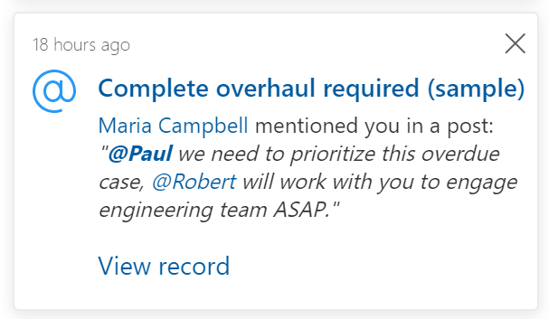

# Preview: Send in-app notifications within model-driven apps 

[!INCLUDE [cc-beta-prerelease-disclaimer](../../../includes/cc-beta-prerelease-disclaimer.md)]

App notifications use the notification table to store notifications for each user. Your model-driven app will automatically check the system for new notifications and displays them in the notification center. The notification sender or your system administrator can configure how a toast is shown and how it can be dismissed. Notifications appear in notification center until you dismiss them or until they expire. By default, notification expires after 14 days but your administrator can override this time.

This article outlines the steps on how to send in-app notifications to a specific user using [Client API](reference.md).

  > [!IMPORTANT]
  > - This is a preview feature, and isn't available in all regions.
  > - [!INCLUDE[cc_preview_features_definition](../../../includes/cc-preview-features-definition.md)]

## Enable in-app notification feature

To use the in-app notification feature: , enable the `AllowNotificationsEarlyAccess` app setting in model-driven app

1. Sign-in to [Power Apps admin center](https://admin.powerapps.com).
1. Select the **Flag** icon on the top-right corner. Search for **AllowNotificationsEarlyAccess** and turn on the switch.

## Send basic in-app notifications

Since the notification system uses a table, any of the table functionalities can be used to create new notifications.  

> [!div class="mx-imgBorder"] 
> [Welcome notification](../media/welcome-notification.png "Welcome notification")


The following examples use the notification table and a notification record to create notifications.

### Send basic in-app notification using client API

In-app notifications can be sent by [Creating record using client API](reference/xrm-webapi/createrecord.md).

```javascript
var data =
{
  "title": "Welcome",
  "body": "Welcome to the world of app notifications!",
  "owner": "GUID of the user.",
  "icontype": 100000000, // info
  "toasttype": 200000000 // timed
}
// Create notification record
Xrm.WebApi.createRecord("appnotification", data).
  then(
      function success(result) {
          console.log("notification created with ID: " + result.id);
      },
      function (error) {
          console.log(error.message);
          // handle error conditions
      }
  );
```

### Send basic in-app notification using Web API

In-app notifications can be sent by [Creating a table row using the Web API](../../data-platform/webapi/create-entity-web-api.md).

```Http
POST [Organization URI]/api/data/v9.0/appnotifications 
HTTP/1.1
Content-Type: application/json; charset=utf-8
OData-MaxVersion: 4.0
OData-Version: 4.0
Accept: application/json

{
  "title": "Welcome",
  "body": "Welcome to the world of app notifications!",
  "owner": <Guid of the user.>,
  "icontype": 100000000, // info
  "toasttype": 200000000 // timed
}
```

## Notification table

The following are the columns for the notification table:

|Column|Description|
|---|---|
|Title|Title of the notification.|
|Owner|User who receives the notification.|
|Body|Details of the notification.|
|Icon Type|List of predefined icons. The default value is `Info`. More information: [Notification icons](#changing-the-notification-icon)|
|Toast Type|List of toast behaviors. The default value is `Timed`. More information: [Toast types](#changing-the-toast-notification-behavior)|
|Expires on|Date when notification should be deleted if not already dismissed.|

### Changing the toast notification behavior

An in-app notification behavior can be changed by setting **Toast Type** to one of the following values:

|Toast Type|Behavior|Value|
|---|---|---|
|Timed|Notification appears for a brief duration and then disappears. (default 4 seconds)|200000000|
|Hidden|Notification appears only in the notification center and not as a toast.|200000001|

### Changing the notification icon

An in-app notification icon can be changed by setting **Icon Type** to one of the following values:

|Icon Type|Value|
|---|---|
|Info|100000000|
|Success|100000001|
|Failure|100000002|
|Warning|100000003|
|Mention|100000004|
|Custom|100000005|

### Changing the navigation target in notification link

You can display notifications in different locations by setting the `navigationTarget` parameter. 

|Navigation target|Behavior|Example|
|----------|-----------|-----------|
|Dialog|Opens in center dialog.|`"navigationTarget": "dialog"` |
|Inline|Default. Opens in the current page.|`"navigationTarget": "inline"` |
|newWindow|Opens in the new browser tab.|`"navigationTarget": " newWindow"` |

## Examples

### Notification with action link

The following examples show how to create notifications with actions, custom body, and custom icons.

#### Action with title and URL

This example shows how to create a notification by adding title and URL to the **actions** parameter.

```json
{
  "data": {
    "actions": [
      {
        "title": "Open Bing",
        "data" : {
          "url": "https://bing.com"
        }
      }
    ]
  }
}
```

### Notification with one action 

This example shows how to create a notification by adding one action to the **actions** parameter.

```JavaScript
var notificationRecord = 
{ 
  "title": "Congratulations!", 
  "body": "Your customer rating is now an A. You resolved 80% of your cases within SLA this week and average customer rating was A+.", 
  "owner": "Guid of the user", 
  "icontype": 100000001, // success 
  "data": JSON.stringify({ 
    "actions": [ 
      { 
        "title": "View Cases", 
        "data": { 
        "url": "?pagetype=entitylist&etn=incident&viewid=bad2fbea-2673-df11-986c-00155d2e3002&viewType=1039" 
        } 
      } 
    ] 
  }) 
} 

Xrm.WebApi.createRecord("appnotification", notificationRecord);
then(
      function success(result) {
          console.log("notification created with single action: " + result.id);
      },
      function (error) {
          console.log(error.message);
          // handle error conditions
      }
  );
``` 

### Notification with multiple primary actions 

This example shows how to create a notification with a custom body along with an inline link and bold styling.

```javascript
// Notification with multiple primary actions as center dialog 
var notificationRecord = 
{ 
  "title": "Upcoming Service Reminder", 
  "body": "", 
  "owner": "GUID of the user", 
  "icontype": 100000005, // custom 
  "data": JSON.stringify({ 
    "body": "Coho Winery has a service appointment coming up on 4/1/2021. Call **[Jim Glynn](?pagetype=entityrecord&etn=contact&id=03f770b2-6567-eb11-bb2b-000d3ac2be4d)** to confirm the appointment.", 
    "iconUrl": "/WebResources/contoso_Phone", 
    "actions": [ 
      { 
        "title": "Coho Winery", 
        "data": { 
          "url": "?pagetype=entityrecord&etn=account&id=9df670b2-6567-eb11-bb2b-000d3ac2be4d", 
          "navigationTarget": "dialog" 
        } 
      }, 
      { 
        "title": "Service Appointment", 
        "data": { 
          "url": "?pagetype=entityrecord&etn=appointment&id=03f770b2-6567-eb11-bb2b-000d3ac2be4d", 
          "navigationTarget": "dialog" 
        } 
      } 
    ] 
  }) 
} 

Xrm.WebApi.createRecord("appnotification", notificationRecord);
then(
      function success(result) {
          console.log("notification created with multiple actions: " + result.id);
      },
      function (error) {
          console.log(error.message);
          // handle error conditions
      }
  );
``` 

### Notification with custom body 

This example shows how to create a notification by adding custom body with an inline link and bold styling. 

```javascript
var notificationRecord = 
{ 
  "title": "SLA critical", 
  "body": "Case record assigned to you is critically past SLA", 
  "owner": "<user-guid>", 
  "icontype": 100000002, // failure 
  "data": JSON.stringify({ 
    "body": "Case record [Complete overhaul required (sample)](?pagetype=entityrecord&etn=incident&id=b1f670b2-6567-eb11-bb2b-000d3ac2be4d) assigned to you is **critically** past SLA and has been escalated to your manager." 
  }) 
} 
Xrm.WebApi.createRecord("appnotification", notificationRecord);
```

This is another example with a custom body with an inline link and bold styling. 

```javascript
var notificationRecord = 
{ 
  "title": "SLA missed", 
  "body": "Case record assigned to you is critically past SLA", 
  "owner": "<user-guid>", 
  "icontype": 100000003, // warning 
  "data": JSON.stringify({ 
    "body": "Case record [Average order shipment time (sample)](?pagetype=entityrecord&etn=incident&id=aff670b2-6567-eb11-bb2b-000d3ac2be4d) assigned to you just went out of SLA." 
  }) 
} 

Xrm.WebApi.createRecord("appnotification", notificationRecord);
```

### Notification with custom icon

This example shows how to create a notification by adding custom icons. Within the notification, set **iconType** to **Custom** and in the body include **iconUrl** with a value pointing to a web resource.  The notification work with either SVG or PNG file types.


```json
var data =
{
  "title": "Welcome",
  "body": "Welcome to the world of app notifications!",
  "owner": "<user-guid>",
  "icontype": 100000005, // custom
  "data": "{ 'data': { 'iconUrl': '/WebResources/cr245_AlertOn' } }"
}
```

### Notification with custom title and body

This notification example adds custom title and body definition, which allow multiple links, bold, and italics. 

> [!div class="mx-imgBorder"] 
> 

```json
var data =
{
  "title": "Complete overhaul required (sample)",
  "body": "Maria Campbell mentioned you in a post",
  "owner": "<user-guid>",
  "icontype": 100000004, // mention
  "data": "{
    "title": "[Complete overhaul required (sample)](?pagetype=entityrecord&etn=incident&id=b1f670b2-6567-eb11-bb2b-000d3ac2be4d)",
    "body": "[Maria Campbell](?pagetype=entityrecord&etn=contact&id=f7f670b2-6567-eb11-bb2b-000d3ac2be4d) mentioned you in a post: _\"**[@Paul](?pagetype=entityrecord&etn=contact&id=fff670b2-6567-eb11-bb2b-000d3ac2be4d)** we need to prioritize this overdue case, [@Robert](?pagetype=entityrecord&etn=contact&id=fdf670b2-6567-eb11-bb2b-000d3ac2be4d) will work with you to engage engineering team ASAP.\"_",
    "actions": [
      {
        "title": "View record",
        "data": {
          "url": "?pagetype=entityrecord&etn=incident&id=b1f670b2-6567-eb11-bb2b-000d3ac2be4d"
        }
      }
    ]
  }
}"
}

```

## In-app notifications vs. push notifications

Power Apps Notification Connector is for push notifications and is separate from the in-app notification. Push notification only appears on the mobile device notifications list to open the app.  The in-app notification appears when the app is open.  We recommend limiting the use of push notification to higher priority items to avoid overwhelming the user.

- [Power Apps Notification Connector](https://docs.microsoft.com/connectors/powerappsnotification)
- [Power Apps Notification Connector V2](https://docs.microsoft.com/connectors/powerappsnotificationv2/)
- [Create push notifications for the Power Apps mobile app](../../../mobile/power-apps-mobile-notification.md)

## Related articles

- [Create an entity record using the Web API](../../developer/data-platform/webapi/create-entity-web-api.md)
- [Create an entity record with Client API](reference/xrm-webapi/createrecord.md)
- [Use in-app notifications](../../user/notifications.md)