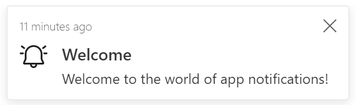
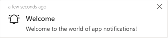

# Send in-app notifications within model-driven apps (preview) 

[!INCLUDE [cc-beta-prerelease-disclaimer](../../../includes/cc-beta-prerelease-disclaimer.md)]

The notification table stores notifications for each user. Your model-driven app automatically checks the system for new notifications and displays them in the notification center. The notification sender or your system administrator can configure how the notification is shown and how it can be dismissed. Notifications appear in the notification center until the recipient dismisses them or they expire. By default, a notification expires after 14 days but your administrator can override this setting.

Each notification row is meant for a single user, identified by the **Owner** column value. If a notification needs to be sent to multiple users, a record needs to be added for each recipient. The sender controls the recipient through the **Owner** column.

This topic outlines the steps for how to send in-app notifications to a specific user by using a [client API](reference.md).

  > [!IMPORTANT]
  > - This is a preview feature, and isn't available in all regions.
  > - [!INCLUDE[cc_preview_features_definition](../../../includes/cc-preview-features-definition.md)]

## Enable the in-app notification feature

To use the in-app notification feature, you need to enable the `AllowNotificationsEarlyAccess` app setting in a model-driven app.

1. Sign in to your model-driven app.

1. Select the app where you want to use this feature.
1. Copy the following code:

   ```javascript
   fetch(window.origin + "/api/data/v9.1/SaveSettingValue()",{
    method: "POST", 
	  headers: {'Content-Type': 'application/json'},
	  body: JSON.stringify({AppUniqueName: "Your app unique name", SettingName:"AllowNotificationsEarlyAccess", Value: "true"})
	  });
   ```

1. Select **F12** on your keyboard to open the browser console.

1. In the browser console, paste the code that you copied in step 3. Enter the name of your app in the `AppUniqueName` parameter, and then select **Enter**.

   > [!TIP]
   > You can find the logical name of your model-driven app in the solution explorer in the **Name** column. 

1. Sign in to [Power Apps](https://make.powerapps.com).

1. On the left pane, select **Solutions** > **New solution**. Enter the details, and then select **Create**. 

1. Open the solution that you created. Select **Add** > **App** > **Model-driven app**. From the list of apps, select the model-driven app where you want to see the notifications feature.

1. Select **Publish all customizations**, and then refresh the model-driven app. You'll see a bell icon in the upper-right corner.

## Send basic in-app notifications

Because the notification system uses a table, you can use any table functionality to create new notifications.  

> [!div class="mx-imgBorder"] 
> 

The following examples use the notification table and a notification record to create notifications.

### Send basic in-app notification by using a client API

In-app notifications can be sent by using the [createRecord](reference/xrm-webapi/createrecord.md) API.

```javascript
var systemuserid = "Guid of the user";
var notificationRecord =
{
  "title": "Welcome",
  "body": "Welcome to the world of app notifications!",
  "ownerid@odata.bind": "/systemusers(" + systemuserid + ")",
  "icontype": 100000000, // info
  "toasttype": 200000000 // timed
}
// Create notification record
Xrm.WebApi.createRecord("appnotification", notificationRecord).
  then(
      function success(result) {
          console.log("notification created with ID: " + result.id);
      },
      function (error) {
          console.log(error.message);
          // handle error conditions
      }
  );
```

### Send basic in-app notifications by using the Web API

In-app notifications can be sent by using the Web API. More information: [Create a table row using the Web API](../../data-platform/webapi/create-entity-web-api.md).

```http
POST [Organization URI]/api/data/v9.0/appnotifications 
HTTP/1.1
Content-Type: application/json; charset=utf-8
OData-MaxVersion: 4.0
OData-Version: 4.0
Accept: application/json

{
  "title": "Welcome",
  "body": "Welcome to the world of app notifications!",
  "ownerid@odata.bind": "/systemusers(<Guid of the user>)",
  "icontype": 100000000, // info
  "toasttype": 200000000 // timed
}
```

## Notification table

The following are the columns for the notification table.

|Column|Description|
|---|---|
|Title|The title of the notification.|
|Owner|The user who receives the notification.|
|Body|Details about the notification.|
|Icon Type|The list of predefined icons. The default value is `Info`. For more information, go to [Changing the notification icon](#changing-the-notification-icon) later in this topic.|
|Toast Type|The list of notification behaviors. The default value is `Timed`. For more information, go to [Changing the notification behavior](#changing-the-notification-behavior) later in this topic.|
|Expiry (seconds)|The number of seconds from when the notification should be deleted if not already dismissed.|
|Data|JSON that's used for extensibility and parsing richer data into the notification. The maximum length is 5,000 characters.|

### Changing the notification behavior

You can change in-app notification behavior by setting **Toast Type** to one of the following values.

|Toast Type|Behavior|Value|
|---|---|---|
|Timed|The notification appears for a brief duration (the default is four seconds) and then disappears.|200000000|
|Hidden|The notification appears only in the notification center and not as a toast notification.|200000001|

### Changing the notification icon

You can change the in-app notification icon by setting **Icon Type** to one of the following values. When using a custom icon, specify the `iconUrl` parameter within the `data` parameter.

|Icon Type|Value|
|---|---|
|Info|100000000|
|Success|100000001|
|Failure|100000002|
|Warning|100000003|
|Mention|100000004|
|Custom|100000005|

### Changing the navigation target in a notification link

You can control where a navigation link opens by setting the `navigationTarget` parameter. 

|Navigation target|Behavior|Example|
|----------|-----------|-----------|
|Dialog|Opens in the center dialog.|`"navigationTarget": "dialog"` |
|Inline|Default. Opens in the current page.|`"navigationTarget": "inline"` |
|newWindow|Opens in a new browser tab.|`"navigationTarget": "newWindow"` |

### Managing security for notifications

The in-app notification feature uses three tables. A user needs to have the correct security roles to receive notifications and to send notifications to themselves or other users.  

|Usage|Required table privileges|
|------------|----------------|
|User has no in-app notification bell and receives no in-app notification |None: Read privilege on the app notification table. |
|User can receive in-app notifications|<ul><li>Basic: Read privilege on the app notification table.</li><li>Create, Read, Write, and Append privileges on the model-driven app user setting.</li><li>Read and AppendTo privileges on setting definition.</li></ul> |
|User can send in-app notifications to self |Basic: Create and Read privileges on the app notification table. |
|User can send in-app notifications to others |Read privilege with Local, Deep, or Global access level on the app notification table based on the receiving user's business unit. |


### Notification storage

The app notification table uses the organization's database storage capacity. Because of this, it's important to consider the volume of notifications sent and the expiration setting. More information: [Microsoft Dataverse storage capacity](/power-platform/admin/capacity-storage)

## Examples

The following examples show how to create notifications that include actions, custom body definitions, and custom icons.

### Notification with an action that has a title and URL

This example shows how to create a notification by adding title and URL to the **actions** parameter.
```json
{
  "data": {
    "actions": [
      {
        "title": "Open Bing",
        "data" : {
          "url": "https://bing.com"
        }
      }
    ]
  }
}
```

### Notification with one action 

This example shows how to create a notification by adding one action to the **actions** parameter.

> [!div class="mx-imgBorder"] 
> 

```javascript
var systemuserid = "<user-guid>";
var notificationRecord = 
{
    "title": "Congratulations",
	  "body": "Your customer rating is now an A. You resolved 80% of your cases within SLA thi week and average customer rating was A+",
	  "ownerid@odata.bind": "/systemusers(" + systemuserid + ")",
    "icontype": 100000001, // success
    "data": JSON.stringify({
	 "actions": [
	  {
        "title": "View cases",
        "data": {
		"url": "?pagetype=entitylist&etn=incident&viewid=00000000-0000-0000-00aa-000010001028&viewType=1039"
		}		
	  }
	 ]
	})
}
Xrm.WebApi.createRecord("appnotification", notificationRecord).
  then(
      function success(result) {
          console.log("notification created with single action: " + result.id);
      },
      function (error) {
          console.log(error.message);
          // handle error conditions
      }
  );
``` 

### Notification with multiple actions 

This example shows how to create a notification that includes multiple actions.

> [!div class="mx-imgBorder"] 
> 


```javascript
// Notification with multiple actions as center dialog 
var systemuserid = "<user-guid>";
var notificationRecord = 
{
    "title": "Upcoming Service Reminder",
	  "body": "This is to inform you that you have an upcoming service request for your vehicle.",
	  "ownerid@odata.bind": "/systemusers(" + systemuserid + ")",
    "icontype": 100000000, // info
    "data": JSON.stringify({
	   "actions": [
	    {
        "title": "Coho Winery",
        "data": {
		    "url": "?pagetype=entityrecord&etn=account&id=b0a19cdd-88df-e311-b8e5-6c3be5a8b200",
		    "navigationTarget": "dialog"
		       }		
	    },
	    {
	      "title": "Service Appointment",
        "data": {
		    "url": "?pagetype=entityrecord&etn=appointment&id=96db3cf0-e605-ec11-94ef-000d3a36469a",
		    "navigationTarget": "dialog"
	        }
	    }
	 ]
	})
}
Xrm.WebApi.createRecord("appnotification",notificationRecord).
  then(
      function success(result) {
          console.log("notification created with multiple actions: " + result.id);
      },
      function (error) {
          console.log(error.message);
          // handle error conditions
      }
  );
``` 

### Notification with a custom body definition

This example shows how to create a notification by adding a custom body definition that includes an inline link.

> [!div class="mx-imgBorder"] 
> 

<!--note from editor: Please note that in lines 309 and 339, it should be "records... are critically" or "record... is critically". I assume it's okay to have two "body" definitions in these code blocks?-->

```javascript
var systemuserid = "<user-guid>";
var notificationRecord = 
{
    "title": "SLA critical",
	"body": "Records assigned to you is critically past SLA.",
	"ownerid@odata.bind": "/systemusers(" + systemuserid + ")",
    "icontype": 100000002, // failure
    "data": JSON.stringify({
	 "body": "Case record [Complete overhaul required (sample)](?pagetype=entityrecord&etn=incident&id=0a9f62a8-90df-e311-9565-a45d36fc5fe8) assigned to you is critically past SLA and has been escalated to your manager."
	 })
}
Xrm.WebApi.createRecord("appnotification",notificationRecord).
  then(
      function success(result) {
          console.log("notification created with custom body: " + result.id);
      },
      function (error) {
          console.log(error.message);
          // handle error conditions
      }
  );
```

The following is another example of a custom body definition. This one includes an inline link and bold formatting.

> [!div class="mx-imgBorder"] 
> 

```javascript
var systemuserid = "<user-guid>";
var notificationRecord = 
{
    "title": "SLA Missed",
	"body": "Records assigned to you is critically past SLA.",
	"ownerid@odata.bind": "/systemusers(" + systemuserid + ")",
    "icontype": 100000003, // warning
    "data": JSON.stringify({
	 "body": "Case record [Average order shipment time (sample)](?pagetype=entityrecord&etn=incident&id=0a9f62a8-90df-e311-9565-a45d36fc5fe8) **assigned** to you just went out of SLA."
	 })
}
Xrm.WebApi.createRecord("appnotification",notificationRecord).
then(
      function success(result) {
          console.log("notification created with custom body and bold styling: " + result.id);
      },
      function (error) {
          console.log(error.message);
          // handle error conditions
      }
  );
```

### Notification with a custom icon

This example shows how to add a custom icon to a notification<!--note from editor: Edit okay?-->. Within the notification, set **iconType** to **Custom** and in the body, include **iconUrl** with a value pointing to a web resource. The icon can be either an SVG or PNG file type.

> [!div class="mx-imgBorder"] 
> 

```javascript
var systemuserid = "<user-guid>";
var notificationRecord = 
{
  "title": "Welcome",
  "body": "Welcome to the world of app notifications!",
  "ownerid@odata.bind": "/systemusers(" + systemuserid + ")",
  "icontype": 100000005, // custom
  "data": "{ 'data': { 'iconUrl': '/WebResources/cr245_AlertOn' } }"
}
Xrm.WebApi.createRecord("appnotification", notificationRecord).
  then(
      function success(result) {
          console.log("notification created with custom icon: " + result.id);
      },
      function (error) {
          console.log(error.message);
          // handle error conditions
      }
  );
```

### Notification with a custom title and body

This example adds a custom title and a body definition that allows multiple links, bold formatting, and italic formatting.

> [!div class="mx-imgBorder"] 
> 

```javascript
var systemuserid = "<user-guid>";
var notificationRecord = 
{
    "title": "Complete overhaul required (sample)",
	"body": "Maria Campbell mentioned you in a post.",
	"ownerid@odata.bind": "/systemusers(" + systemuserid + ")",
    "icontype": 100000004, // mention
    "data": JSON.stringify({
	 "title": "[Complete overhaul required (sample)](?pagetype=entityrecord&etn=incident&id=0a9f62a8-90df-e311-9565-a45d36fc5fe8)",
	 "body": "[Maria Campbell](?pagetype=entityrecord&etn=contact&id=43m770h2-6567-ebm1-ob2b-000d3ac3kd6c) mentioned you in a post: _\"**[@Paul](?pagetype=entityrecord&etn=contact&id=03f770b2-6567-eb11-bb2b-000d3ac2be4d)** we need to prioritize this overdue case, [@Robert](?pagetype=entityrecord&etn=contact&id=73f970b2-6567-eb11-bb2b-000d3ac2se4h) will work with you to engage with engineering team ASAP.\"_",
	  "actions": [
	   {
	     "title": "View record",
		 "data": {
		 "url": "?pagetype=entityrecord&etn=incident&id=0a9f62a8-90df-e311-9565-a45d36fc5fe8"
		 }
	   }
	  ]
	 })
}
Xrm.WebApi.createRecord("appnotification",notificationRecord).
  then(
      function success(result) {
          console.log("notification created with custom title and body: " + result.id);
      },
      function (error) {
          console.log(error.message);
          // handle error conditions
      }
  );
```

## In-app notifications vs. push notifications

The Power Apps Notification connector is for push notifications, which are separate from in-app notification. Push notifications only appear on the mobile device notifications list to open the app. In-app notifications appear when the app is open. We recommend limiting the use of push notifications to high-priority items, to avoid overwhelming the user. For more information, go to:

- [Power Apps Notification connector](/connectors/powerappsnotification)
- [Power Apps Notification V2 connector](/connectors/powerappsnotificationv2/)
- [Create push notifications for Power Apps Mobile](../../../mobile/power-apps-mobile-notification.md)

## Related articles

- [Create a table row using the Web API](../../data-platform/webapi/create-entity-web-api.md)
- [createRecord (Client API reference)](reference/xrm-webapi/createrecord.md)
- [In-app notifications in model-driven apps](/powerapps/user/notifications)
