# Walkthrough: Write your first client script


Ready to write your first client script to see things in action. Lets get started; we'll keep it simple.

## Objective

After completing this walkthrough, you will know how to use your JavaScript code in Customer Engagement, which involves the following steps at a high level:
- Write your JavaScript code to address a business issue
- Upload your JavaScript code as a web resource in Customer Engagement
- Associate the JavaScript functions in the web resource to different client-side events in Customer Engagement.

We will draw your attention to important facts during the walkthrough, and provide references to actual methods as appropriate.

## Step 1: Write your custom JavaScript code

The first step is to identify the business issue you are trying to address using client scripting. Once you have identified it, you need to write your JavaScript code containing the custom business logic that addresses your business issue. 

Dynamics 365 Customer Engagement does not provide a JavaScript editor. So, you can use an external authoring tool that provides features to specifically support editing JavaScript files, such as [Notepad++](https://notepad-plus-plus.org/), [Visual Studio Code](https://code.visualstudio.com/docs/languages/javascript), or [Microsoft Visual Studio](https://docs.microsoft.com/en-us/scripting/javascript/).

You can review the complete sample code used in the walkthrough later in this topic.

Let's look at the code in detail:
 
### Detailed code explanation
- **Define namespace**: The code starts by defining a namespace for your custom script. As a best practice, you should always create namespaced JavaScript libraries to avoid having your functions overriden by functions in another library.

    ```JavaScript
    var Sdk = window.Sdk || {};
    ``` 
    In this case, all the functions defined in this library can be used as `Sdk.[functionName]`.

- **Define global variables**: The following section defines some global variables to be used in the script. Note that you now don't need to go through the form context to get the user name. Context information is now available globally using the **Xrm.Utility.**[getGlobalContext](reference/xrm-utility/getGlobalContext.md) method.

    ```JavaScript
    // Define some global variables
    var myUniqueId = "_myUniqueId"; // Define an ID for the notification
    var currentUserName = Xrm.Utility.getGlobalContext().userSettings.userName; // get current user name
    var message = currentUserName + ": Your JavaScript code in action!";
    ```
- **Code to execute on the OnLoad event**: This section contains the code that will be executed when the account form loads. For example, when you create a new account record or when you open an existing account record.

    The code uses the `executionContext` object to get the `formContext` object. When we attach our code with the form event later, we will remember to select the option to pass the [execution context](clientapi-execution-context.md) to this function. Next, we display a form level notification using the [setFormNotification](reference/formContext-ui/setFormNotification.md) method. Next, we use the **setTimeOut** method to delay the execution of the [clearFormNotification](reference/formContext-ui/clearFormNotification.md) method to clear the notification after 5 seconds.

    ```JavaScript
    // Code to run in the form OnLoad event
    this.formOnLoad = function (executionContext) {
        var formContext = executionContext.getFormContext();

        // display the form level notification as an INFO
        formContext.ui.setFormNotification(message, "INFO", myUniqueId);
        
        // Wait for 5 seconds before clearing the notification
        window.setTimeout(function () { formContext.ui.clearFormNotification(myUniqueId); }, 5000);        
    }
    ```
- **Code to execute on the OnChange event**: Code in this sections will be associated with the **Account Name** field in the account form so that it gets executed **only** when you change the account name value.

    The code performs a case-insensitive search for "Contoso" in the account name, and if present, automatically sets values for some fields in the account form.

    ```JavaScript
    // Code to run in the attribute OnChange event 
    this.attributeOnChange = function (executionContext) {
        var formContext = executionContext.getFormContext();

        // Automatically set some field values if the account name contains "Contoso"
        var accountName = formContext.getAttribute("name").getValue();
        if (accountName.toLowerCase().search("contoso") != -1) {
            formContext.getAttribute("websiteurl").setValue("http://www.contoso.com");
            formContext.getAttribute("telephone1").setValue("425-555-0100");
            formContext.getAttribute("description").setValue("Website URL, Phone and Description set using custom script.");
        }
    }
    ```

- **Code to execute on the OnSave event**: The code in this section displays an alert dialog box using the [openAlertDialog](reference/xrm-navigation/openalertdialog.md) method. This dialog box displays a message with the **OK** button; user can close the alert by clicking **OK**.

    Note that we are not passing in the execution context in this function as its not required to execute **Xrm.Utility.*** methods. 

    ```JavaScript
    // Code to run in the form OnSave event 
    this.formOnSave = function () {
        // Display an alert dialog
        Xrm.Navigation.openAlertDialog({ text: "Record saved." });
    }
    ```

## Step 2: Add your JavaScript code in a Script web resource

Now that your code is ready, you want to associate it with events in Customer Engagement. You use [Script web resources](../script-jscript-web-resources.md) in Customer Engagement to upload the script to your Customer Engagement instance, and then associate it with events.

1. Navigate to your Customer Engagement instance in browser, and go to **Settings** > **Customizations**.
2. In the Customization area, choose **Customize the System**.
3. In the solutions explorer, under **Components**, choose **Web Resources**.  
4. Choose **New** to create a web resource.
5. In the new web resource dialog, specify the **Name** and **Display Name** for your web resource. For example: "mySampleScript.js" and "Sample: Walkthrough" Script. 
6. Select **Script (JScript)** from the **Type** drop-down list. You can either upload a file containing your JavaScript code by selecting **Choose File**, or select **Text Editor** and then paste your JavaScript code in the editor.
    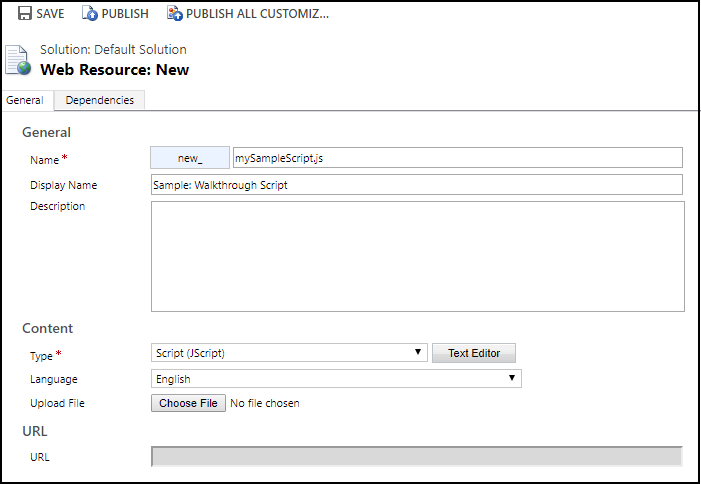
1. Choose **Save** to create the web resource containing your JavaScript code.
2. Choose **Publish** to publish your web resource.

## Step 3: Associate Script web resource to a form

Associate the web resource containing your JavaScript code to Customer Engagement forms to be able to associate functions in your code with events. As the JavaScript code in this walkthrough is targeted at the account record, we will associate the web resource with the account form.

1. Navigate to your Customer Engagement instance in browser, and go to **Sales** > **Accounts** or **Service** > **Accounts**.
2. Open an account record, and select **Form** to open the form editor.

    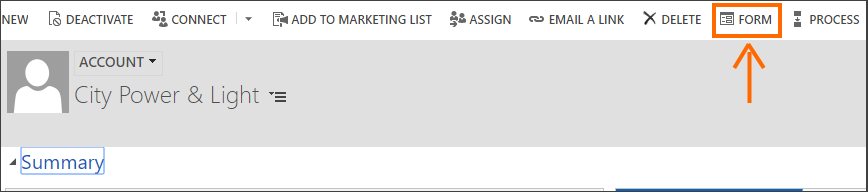
1. In the form editor, select **Form Properties**.
2. In the **Form Properties** dialog box, under the **Events** tab, click **Add** to search and add your web resource.

    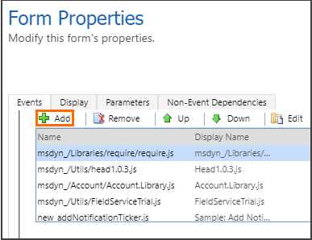
1. In the next dialog box, search for your web resource name, select it, and then click **Add** to add it as a JavaScript library for the account form.

    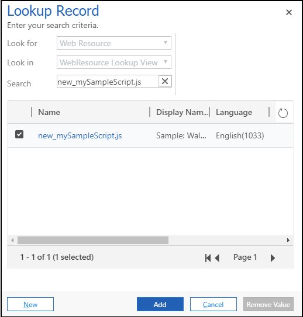

This makes the web resource available to be selected under the **Event Hadlers** section in the **Form Properties** dialog. Remember that we have three functions in our JavaScript code to be associated with approprite events in the form.

1. Under the **Event Handlers** section, select **Form** as the control and **OnLoad** as the **Event**; click **Add** to add an event handler for the OnLoad event.

   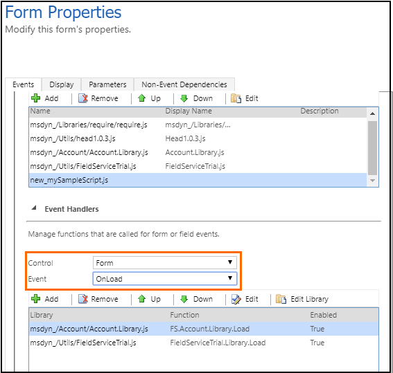
1. In the **Handler Properties** dialog box:   

    - Select the name of your web resource from the **Library** drop-down list, and specify **Sdk.formOnLoad** in the **Function** field. The function name is [Namespace].[Function] from your JavaScript code.
    - Select **Pass execution context as first parameter** to pass in the execution context as a parameter to this function. If you review the function definition in the code, we are passing an **executionContext** object to our function definition, and selecting this option wires them up.
    
      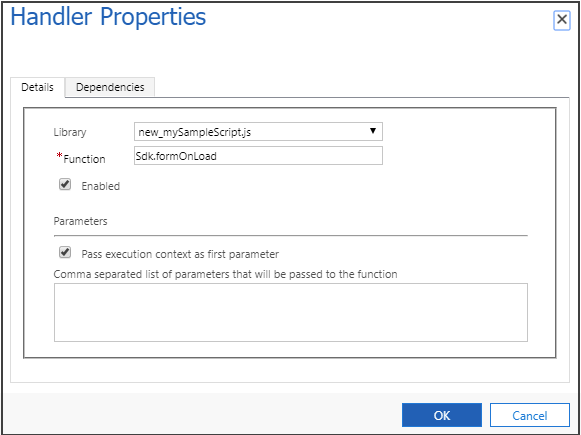

1. Click **OK** to return to the **Form Properties** diaog box.
2. Under the **Event Handlers** section, select **OnSave** as the **Event** this time, and click **Add** to add an event handler for the Form OnSave event.

    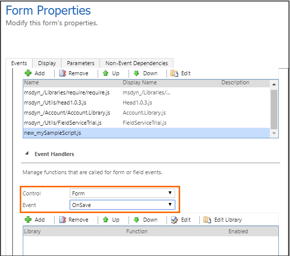

1. In the **Handler Properties** dialog box, select the name of your web resource from the **Library** drop-down list, and specify **Sdk.formOnSave** in the **Function** field. We won't pass the execution context to the function this time as the **Sdk.formOnSave** function code does not require it.

    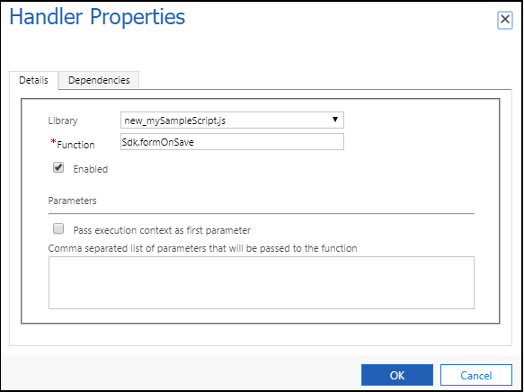

1. Click **OK** to return to the **Form Properties** diaog box.
2. Under the **Event Handlers** section, select **Account Name** as the control and **OnChange** as the event; click **Add** to add an event handler for the OnChange event.

    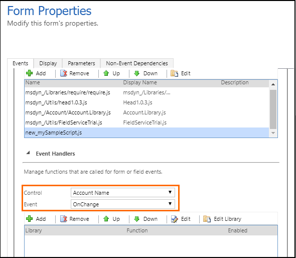

1. In the **Handler Properties** dialog box:   

    - Select the name of your web resource from the **Library** drop-down list, and specify **Sdk.attributeOnChange** in the **Function** field.
    - Select **Pass execution context as first parameter** to pass in the execution context as a parameter to this function. If you review the function definition in the code, we are passing an **executionContext** object to our function definition, and selecting this option wires them up.
    
       
1. Click **OK** to return to the **Form Properties** diaog box.
2. Click **OK** in the **Form Properties** diaog box to return to the form editor.
3. Click **Save** to save the changes to the form.
4. Click **Publish** to publish the form changes.

Thats it! You have completed the steps to configure the account form to use custom business logic specified in your JavaScript code.

## Test your JavaScript code

Its recommended that you refresh your browser for the changes to take effect in your Customer Engagement instance. To test custom business logic you configured in this walkthrough:

1. Sign in to your Customer Engagement instance.
2. Browse to **Accounts**, and try to open or create a new account. In this case, we will open an existing account to load the account form. You will see a notification conytaining your user name that will automatically disappear in 5 seconds.

      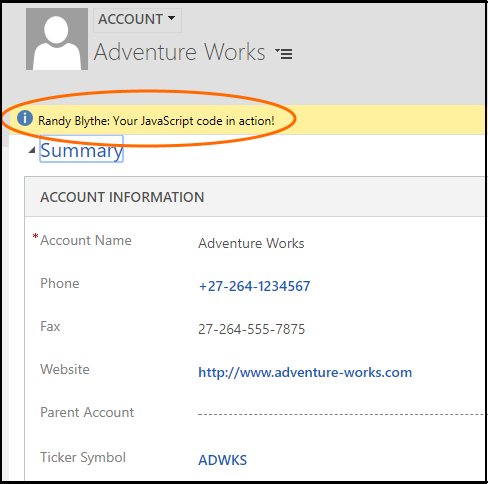

1. Edit the account name to add "Contoso" in the name and move to the next field by pressing TAB. This will fire the OnChange event, and will automatically update the **Phone**, **Website** and **Description** fields with the value specified in the code.

      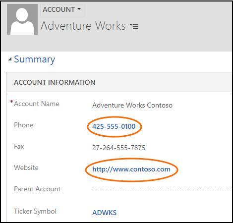

1. Finally clicking **Save** will fire the OnSave event, and will display the alert dialog with a message that you configured in your code. Click **OK** to close the alert.

      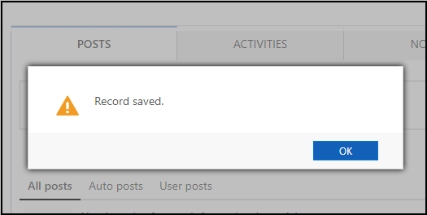

## Complete sample code used in the walkthrough

```JavaScript
// A namespace defined for the sample code
// As a best practice, you should always define 
// a unique namespace for your libraries
var Sdk = window.Sdk || {};
(function () {
    // Define some global variables
    var myUniqueId = "_myUniqueId"; // Define an ID for the notification
    var currentUserName = Xrm.Utility.getGlobalContext().userSettings.userName; // get current user name
    var message = currentUserName + ": Your JavaScript code in action!";

    // Code to run in the form OnLoad event
    this.formOnLoad = function (executionContext) {
        var formContext = executionContext.getFormContext();

        // display the form level notification as an INFO
        formContext.ui.setFormNotification(message, "INFO", myUniqueId);

        // Wait for 5 seconds before clearing the notification
        window.setTimeout(function () { formContext.ui.clearFormNotification(myUniqueId); }, 5000);
    }

    // Code to run in the attribute OnChange event 
    this.attributeOnChange = function (executionContext) {
        var formContext = executionContext.getFormContext();

        // Automatically set some field values if the account name contains "Contoso"
        var accountName = formContext.getAttribute("name").getValue();
        if (accountName.toLowerCase().search("contoso") != -1) {
            formContext.getAttribute("websiteurl").setValue("http://www.contoso.com");
            formContext.getAttribute("telephone1").setValue("425-555-0100");
            formContext.getAttribute("description").setValue("Website URL, Phone and Description set using custom script.");
        }
    }

    // Code to run in the form OnSave event 
    this.formOnSave = function () {
        // Display an alert dialog
        Xrm.Navigation.openAlertDialog({ text: "Record saved." });
    }
}).call(Sdk);
```