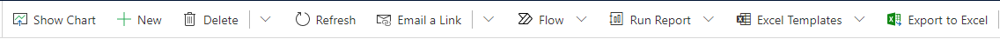

# Command bar or ribbon presentation

Data defining commands in Microsoft Dataverse can be presented in several different ways depending on the client and differences in how some table are treated. You need to take these factors into consideration as you change ribbon commands or define new ones.
  

## Different presentations of commands 

There are three different ways that command data can be displayed.  
  
### Updated user experience  

 This is the presentation of the command bar throughout the application and for forms for table that have the updated user experience.  
  
 
  
 In this experience, only few commands are displayed and any remaining commands are available in a flyout menu.  
  
 Enable rules will hide commands that should not be used.  
  
 Subgrids have a limited number of controls. Only controls to allow adding records, deleting records, or opening a view of the grid are available. But these commands are still defined by ribbon data and can be customized.  
  
   
  
 To perform more actions on the list of records displayed in a subgrid, select the option to open a view of the grid.  
  
 For more information about the behavior of subgrid controls and how they can be customized, see [Subgrid ribbons](/dynamics365/customer-engagement/developer/customize-dev/ribbons-available-microsoft-dynamics-365#BKMK_SubGridRibbons).  

   

### Dynamics 365 for tablets  
 Dynamics 365 for tablets presents commands in a manner optimized for touch experiences. Commands appear in the command bar at the bottom right of the screen in order from right to left.  
  
   
  
> [!NOTE]
>  Icons configured for commands will not display and labels that are too long will be truncated.  
> 
> Dynamics 365 for tablets does not support adding dynamic elements to `<FlyoutAnchor>` or `<SplitButton>` elements at runtime.  
  
 Subgrid commands are displayed when people tap and press the subgrid control. These commands are shown on the bottom left of the screen in order from left to right.  
  
   
  
   

## Command data  
 Despite these different presentations, the data that defines the commands for tables is consistent regardless of how the commands are presented. It contains definitions for tabs and groups with scaling, but the visible parts of these containers for controls are only displayed in the classic user interface.  
  
 In both the updated user experience and Dynamics 365 for tablets, tabs and groups still act as containers for controls, but there is no visual indication of these containers and scaling is not applied.  
  
   

## Filtering commands based on presentation and client  
  
> [!IMPORTANT]
>  Including some kind of rule to filter the display of your commands is necessary unless you want the command to be available for all clients and presentations.  
  
 With this release, there is a new element that can be used in display and enable rules to adapt the commands you display with the presentation.  
  
 `<CommandClientTypeRule>` contains a `Type` parameter that will be evaluated based on the presentation. The following valid options correspond to the presentation:  
  
- `Refresh`: Updated user experience  
  
- `Legacy`: Classic user experience  
  
- `Modern`: Dynamics 365 for tablets  
  
  Use this element as you define commands to control whether they display in the different presentations.  
  
  There is also a pre-existing `<CrmClientTypeRule>` element, but the `Type` parameter for element can only differentiate between `Web` and `Outlook` clients. This rule will evaluate the Dynamics 365 for tablets client as the web client.  
  
### See also  

 [Customize commands and the ribbon](customize-commands-ribbon.md)   
 [Ribbons available](./ribbons-available.md)   
 [Export ribbon definitions](export-ribbon-definitions.md)   
 [Troubleshoot ribbon issues](/troubleshoot/power-platform/power-apps/ribbon-issues-button-hidden?tabs=delete)

[!INCLUDE[footer-include](../../includes/footer-banner.md)]