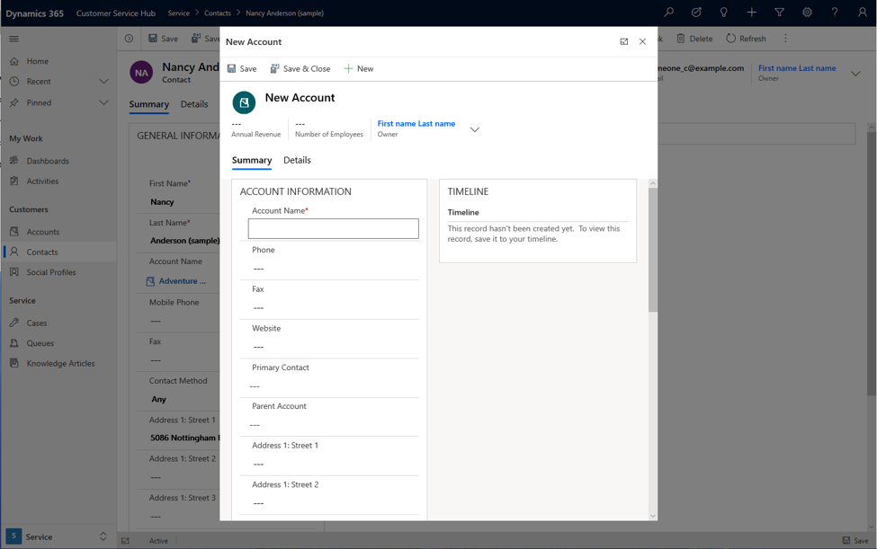
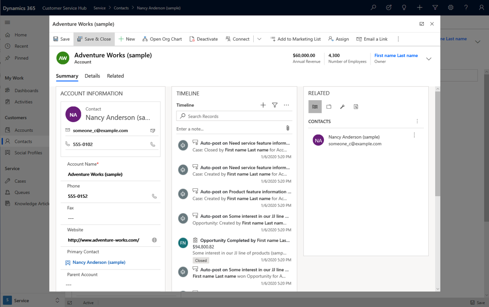
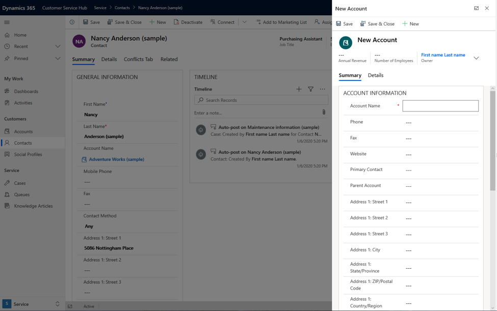

# Customize forms

Forms provide the user interface (UI) that people use to create, view, or edit table records. Use the form designer in the customization tools to create and edit forms. More information: [Create and design forms](../../maker/model-driven-apps/create-design-forms.md) for information about tasks related to working with forms in the application.  

This topic will provide information necessary to create or edit forms programmatically.  

[!INCLUDE[cc-terminology](../data-platform/includes/cc-terminology.md)]

<a name="BKMK_AccessingFormDefinitions"></a>   

## Access form definitions  

Forms are stored in the `SystemForm` table along with dashboards and visualizations. There are two ways that you can inspect the form definitions for a table:  

- Include the table in an unmanaged solution and export the solution.  

- Query the `SystemForm` table  

<a name="BKMK_ViewingFormXml"></a>   

### View FormXML from a exported table  

 Only definitions of system forms that have been customized are included in exported managed solution. To view the definition of a system form, you must either change it in some way, or create a new form by saving the existing form with a new name.  

 After you export the solution, extract the contents and view the customizations.xml file. You'll find the definition of the forms in `ImportExportXml` > `Entities` > `Entity` > `FormXml`. 
 In the `<FormXml>` node, you'll find each type of form is grouped in a `<forms>` element with the `type` parameter specifying the type of form.  

<a name="BKMK_FormProperties"></a>   

## Form properties  

 The following table describes key `SystemForm` table columns and the corresponding data included in the XML elements exported with the solution.  


|  SystemForm property  |                 FormXML element                 |                                                                                                              Description                                                                                                              |
|-----------------------|-------------------------------------------------|---------------------------------------------------------------------------------------------------------------------------------------------------------------------------------------------------------------------------------------|
|   `AncestorFormId`    |                  `<ancestor>`                   |                      Unique identifier of the parent form. This is set when you create a new form by using **Save As** for an existing form or by using <xref:Microsoft.Crm.Sdk.Messages.CopySystemFormRequest>.                      |
|    `CanBeDeleted`     |                `<CanBeDeleted>`                 |                                    Information that specifies whether this component can be deleted.This managed property is only applied if the form was created by importing a managed solution.                                    |
|     `Description`     |                `<Descriptions>`                 | `Description` is a string and `<Descriptions>` contains any localized labels for the description of the form.<br /><br /> The localized labels can be retrieved using the <xref:Microsoft.Crm.Sdk.Messages.RetrieveLocLabelsRequest>. |
| `FormActivationState` |             `<FormActivationState>`             |                                  Specifies the state of the form.<br /><br /> Only forms of type "main" can be deactivated.<br /><br /> Valid Values:<br /><br /> -   0: Inactive<br />-   1: Active                                  |
|       `FormId`        |                   `<formid>`                    |                                                                                                     Unique identifier of the form                                                                                                     |
|  `FormPresentation`   |              `<FormPresentation>`               |                                     Specifies whether this form is in the updated UI layout in Microsoft Dataverse.                                      |
|       `FormXml`       |                    `<form>`                     |                                                                                                XML representation of the form layout.                                                                                                 |
|  `IntroducedVersion`  |              `<IntroducedVersion>`              |                                                                                          Version of the solution that the form was added in.                                                                                          |
|     `IsAIRMerged`     |                       N/A                       |                                           Specifies whether this form is merged with the updated UI layout in Dataverse.                                           |
|   `IsCustomizable`    |               `<IsCustomizable>`                |                            Information that specifies whether this component can be customized.<br /><br /> This managed property is only applied if the form was created by importing a managed solution.                            |
|      `IsDefault`      |                       N/A                       |                                                                          Information that specifies whether the form or the dashboard is the system default.                                                                          |
|        `Name`         |               `<LocalizedNames>`                |       `Name` is a string and `<LocalizedNames>` contains any localized labels for the name of the form.<br /><br /> The localized labels can be retrieved using the <xref:Microsoft.Crm.Sdk.Messages.RetrieveLocLabelsRequest>.       |
|   `ObjectTypeCode`    | The form is a decedent of the `Entity` element. |                                                                                        The `ObjectTypeCode` value is the table logical name.                                                                                         |
|        `Type`         |       `<forms>` element `type` parameter        |                                                       Valid values for forms are:<br /><br /> -   2: `main`<br />-   5: `mobile`<br />-   6: `quick`<br />-   7: `quickCreate`                                                        |

<a name="BKMK_CreateAndEditForms"></a>   

## Create and edit forms  

 You can only create new forms for a table where <xref:Microsoft.Xrm.Sdk.Metadata.EntityMetadata>. <xref:Microsoft.Xrm.Sdk.Metadata.EntityMetadata.CanCreateForms> allows it.  

 You can create new forms using either a <xref:Microsoft.Xrm.Sdk.Messages.CreateRequest> or the <xref:Microsoft.Crm.Sdk.Messages.CopySystemFormRequest>. When using <xref:Microsoft.Crm.Sdk.Messages.CopySystemFormRequest> or using **Save As** in the form editor, note that there is no inheritance between forms. Therefore, changes to the base form aren't automatically applied to any forms created from it.  

 Editing the form definitions from an exported managed solution and then re-importing the solution is a supported method to edit forms. When manually editing forms we strongly recommend you use an XML editor that allows for schema validation. More information: [Edit the customizations XML file with schema validation](edit-customizations-xml-file-schema-validation.md)  

## Open main form in a dialog using client API

To open the main form in a dialog using client API, you need to invoke the call using the [Xrm.Navigation.navigateTo](./clientapi/reference/xrm-navigation/navigateto.md) method. The [Xrm.Navigation.navigateTo](./clientapi/reference/xrm-navigation/navigateto.md) API method allows you to open the dialog with several options, including the size and position.


> [!NOTE]
> [Xrm.Navigation.openForm](./clientapi/reference/xrm-navigation/openform.md) method is not supported to open a main form as a dialog.

## Examples

### Open a new record

In this example, the dialog opens a new account form for creating a new record. The dialog pops up in the center using up to 50% of the available window as a modal on top of the form it was invoked or called from.

```JavaScript
var pageInput = {
    pageType: "entityrecord",
    entityName: "account",
    formType: 2,
};
var navigationOptions = {
    target: 2,
    width: {value: 50, unit:"%"},
    position: 1
};
Xrm.Navigation.navigateTo(pageInput, navigationOptions);
```

> [!div class="mx-imgBorder"]
> 

### Open an existing record

In this example, the dialog opens an existing account record using the account id value over the contact form. Replace the id with any record id value you want to open the record in the dialog.

```JavaScript
var pageInput = {
    pageType: "entityrecord",
    entityName: "account",
    formType: 2,
    entityId: "5a57f2c3-5672-ea11-a812-000d3a339706" //replace with actual ID
};
var navigationOptions = {
    target: 2,
    width: {value: 80, unit:"%"},
    position: 1
};
Xrm.Navigation.navigateTo(pageInput, navigationOptions);
```
> [!div class="mx-imgBorder"]
> 

### Open a new record on the side pane

In this example, the dialog opens a new record in the right corner of the window. This can be achieved by using the pixel options.

```JavaScript
var pageInput = {
    pageType: "entityrecord",
    entityName: "account",
    formType: 2,
};
var navigationOptions = {
    target: 2,
    width: {value: 500, unit:"px"},
    position: 2
};
Xrm.Navigation.navigateTo(pageInput, navigationOptions);
```
> [!div class="mx-imgBorder"]
> 

### Open main form in a dialog with callback method

This example shows how a main form dialog is invoked with a callback method after saving a record and closing the dialog.

```Javascript
var pageInput = {
    pageType: "entityrecord",
    entityName: "account",
    formType: 2
};
var navigationOptions = {
    target: 2,
    width: {value: 80, unit:"%"},
    position: 2  
};
Xrm.Navigation.navigateTo(pageInput, navigationOptions).then(
    function success(result) {
            console.log("Record created with ID: " + result.savedEntityReference[0].id + 
            " Name: " + result.savedEntityReference[0].name)
            // Handle dialog closed
    },
    function error() {
            // Handle errors
    }
);
```

### See also  

 [Create and design forms](../../maker/model-driven-apps/create-design-forms.md)   
 [SystemForm table](../data-platform/reference/entities/systemform.md)  
 [Form XML schema](form-xml-schema.md)<br/>
 [Xrm.Navigation.navigateTo](./clientapi/reference/xrm-navigation/navigateto.md)


[!INCLUDE[footer-include](../../includes/footer-banner.md)]
