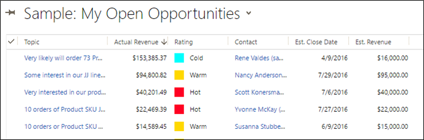

# Customize entity views

<!-- https://docs.microsoft.com/en-us/dynamics365/customer-engagement/developer/customize-dev/customize-entity-views -->

Entity views are special saved queries that retrieve data by using a specific filter. They also contain information about how the data in the view should be displayed in the application. Entity views are `SavedQuery` records that you can create programmatically. You can also define them as XML, and import them into Dynamics 365 Common Data Service for Apps with an unmanaged solution.  
  
 An Entity view is different from a `UserQuery`. A user query, called a Saved view in the application, is owned by an individual user, can be assigned and shared with other users, and can be viewed by other users depending on the query's access privileges. This is appropriate for frequently used queries that span entity types and queries that perform aggregation. More information: [UserQuery (Saved View) Entity](userquery-saved-view-entity.md) 
  
 You can also use the customization tool in Dynamics 365 to customize views. More information: [Create and edit views](../../maker/model-driven-apps/create-edit-views.md)
  
<a name="BKMK_TypesOfViews"></a>   
## Types of views  
 The following table lists the five types of views that are supported for customization. The type code of a view is stored in the `SavedQuery.QueryType` attribute. Note that there are other valid values for the `QueryType` attribute not listed here because this entity is also used to store Office Outlook filters and templates. For more information, see [Offline and Outlook Filters and Templates](../common-data-service/outlook-client/offline-outlook-filters-templates.md). 
  
 When views are defined for a specific entity, the `SavedQuery.ReturnedTypeCode` attribute returns the entity logical name.  
  
|View Type|Type Code|Description|  
|---------------|---------------|-----------------|  
|**Public**|0|- **Occurrence**: Many<br />- **Actions**: Create, Update, Delete<br />- **Comments**: You can set one of these views as the default public view by setting `SavedQuery.IsDefault` to true.|  
|**Advanced Find**|1|- **Occurrence**: 1<br />- **Actions**: Update only.<br />- **Comments**: By default, this view is displayed when results are shown in **Advanced Find**.|  
|**Associated**|2|- **Occurrence**: 1<br />- **Actions**: Update only,<br />- **Comments**: By default, this view is displayed when a grid of related records appears in the navigation pane of a record.|  
|**Quick Find**|4|- **Occurrence**: 1<br />- **Actions**: Update only.<br />- **Comments**: This view defines the columns that will be searched when a user searches for records by using the search field in a list view.|  
|**Lookup**|64|- **Occurrence**: 1<br />- **Actions**: Update only.<br />- **Comments**: This is the default view that will be used to look up a record when no other view has been configured for the lookup field.|  
  
<a name="BKMK_ViewTasks"></a>   
## View tasks  
 Because views are SavedQuery records, you can create, update, retrieve, delete and deactivate them. In addition you can edit filter criteria or configure sorting, edit columns or set a view as a default view.
  
<a name="BKMK_CreateViews"></a>   
### Create views  
 To create a public view, specify the following properties:
  
- `SavedQuery.Name`: A unique identifier for the saved query.
  
- `SavedQuery.ReturnedTypeCode`: Matches the logical name of the entity. 
  
- `SavedQuery.FetchXml`: See [Use FetchXML to Construct a Query](../common-data-service/use-fetchxml-construct-query.md).  
  
- `SavedQuery.LayoutXml`: See the `layoutxml` element in the [Customization solutions file schema](../common-data-service/customization-solutions-file-schema.md)  for the valid elements.
  
- `SavedQuery.QueryType`: Must always be zero (0).  
  
  The following sample creates a new public view for the opportunity entity:  
  
  ```csharp
  System.String layoutXml =
@"<grid name='resultset' object='3' jump='name' select='1' 
    preview='1' icon='1'>
    <row name='result' id='opportunityid'>
    <cell name='name' width='150' /> 
    <cell name='customerid' width='150' /> 
    <cell name='estimatedclosedate' width='150' /> 
    <cell name='estimatedvalue' width='150' /> 
    <cell name='closeprobability' width='150' /> 
    <cell name='opportunityratingcode' width='150' /> 
    <cell name='opportunitycustomeridcontactcontactid.emailaddress1' 
        width='150' disableSorting='1' /> 
    </row>
</grid>";

                    System.String fetchXml =
                    @"<fetch version='1.0' output-format='xml-platform' 
    mapping='logical' distinct='false'>
    <entity name='opportunity'>
    <order attribute='estimatedvalue' descending='false' /> 
    <filter type='and'>
        <condition attribute='statecode' operator='eq' 
        value='0' /> 
    </filter>
    <attribute name='name' /> 
    <attribute name='estimatedvalue' /> 
    <attribute name='estimatedclosedate' /> 
    <attribute name='customerid' /> 
    <attribute name='opportunityratingcode' /> 
    <attribute name='closeprobability' /> 
    <link-entity alias='opportunitycustomeridcontactcontactid' 
        name='contact' from='contactid' to='customerid' 
        link-type='outer' visible='false'>
        <attribute name='emailaddress1' /> 
    </link-entity>
    <attribute name='opportunityid' /> 
    </entity>
</fetch>";

                    SavedQuery sq = new SavedQuery
                    {
                        Name = "A New Custom Public View",
                        Description = "A Saved Query created in code",
                        ReturnedTypeCode = "opportunity",
                        FetchXml = fetchXml,
                        LayoutXml = layoutXml,
                        QueryType = 0
                    };
                    
                    _customViewId = _serviceProxy.Create(sq);
                    Console.WriteLine("A new view with the name {0} was created.", sq.Name);```  
  
<a name="BKMK_UpdateViews"></a>   
### Update views  
 If the `SavedQuery.IsCustomizable` managed property allows the view to be updated, you can use the <xref:Microsoft.Xrm.Sdk.IOrganizationService>.<xref:Microsoft.Xrm.Sdk.IOrganizationService.Update*> method or the <xref:Microsoft.Xrm.Sdk.Messages.UpdateRequest> message to update the view.  
  
<a name="BKMK_DeleteViews"></a>   
### Delete views  
 You should only delete saved queries that you have created. A solution component or part of the application may depend on a specific saved query. If there are queries you do not want to appear in the application, you should deactivate them.  
  
<a name="BKMK_RetrieveViews"></a>   
### Retrieve views  
 Use a <xref:Microsoft.Xrm.Sdk.Messages.RetrieveMultipleRequest> or <xref:Microsoft.Xrm.Sdk.IOrganizationService>.<xref:Microsoft.Xrm.Sdk.IOrganizationService.RetrieveMultiple*> to retrieve saved query records.  
  
 The following sample retrieves all the public views for the opportunity entity:  
  
 ```csharp
 QueryExpression mySavedQuery = new QueryExpression
        {
            ColumnSet = new ColumnSet("savedqueryid", "name", "querytype", "isdefault", "returnedtypecode", "isquickfindquery"),
            EntityName = SavedQuery.EntityLogicalName,
            Criteria = new FilterExpression
            {
                Conditions =
{
    new ConditionExpression
    {
        AttributeName = "querytype",
        Operator = ConditionOperator.Equal,
        Values = {0}
    },
    new ConditionExpression
    {
        AttributeName = "returnedtypecode",
        Operator = ConditionOperator.Equal,
        Values = {Opportunity.EntityTypeCode}
    }
}
            }
        };
        RetrieveMultipleRequest retrieveSavedQueriesRequest = new RetrieveMultipleRequest { Query = mySavedQuery };

        RetrieveMultipleResponse retrieveSavedQueriesResponse = (RetrieveMultipleResponse)_serviceProxy.Execute(retrieveSavedQueriesRequest);

        DataCollection<Entity> savedQueries = retrieveSavedQueriesResponse.EntityCollection.Entities;

        //Display the Retrieved views
        foreach (Entity ent in savedQueries)
        {
            SavedQuery rsq = (SavedQuery)ent;
            Console.WriteLine("{0} : {1} : {2} : {3} : {4} : {5},", rsq.SavedQueryId, rsq.Name, rsq.QueryType, rsq.IsDefault, rsq.ReturnedTypeCode, rsq.IsQuickFindQuery);
        }
```
  
<a name="BKMK_DeactivateViews"></a>   
### Deactivate views  
 If you do not want a public view to appear in the application, you can deactivate it. You cannot deactivate a public view that is set as the default view. The following sample deactivates the **Closed Opportunities in Current Fiscal Year** view for the Opportunity entity:  
  
 ```csharp
 System.String SavedQueryName = "Closed Opportunities in Current Fiscal Year";
QueryExpression ClosedOpportunitiesViewQuery = new QueryExpression
{
    ColumnSet = new ColumnSet("savedqueryid", "statecode", "statuscode"),
    EntityName = SavedQuery.EntityLogicalName,
    Criteria = new FilterExpression
    {
        Conditions =
        {
            new ConditionExpression
            {
                AttributeName = "querytype",
                Operator = ConditionOperator.Equal,
                Values = {0}
            },
            new ConditionExpression
            {
                AttributeName = "returnedtypecode",
                Operator = ConditionOperator.Equal,
                Values = {Opportunity.EntityTypeCode}
            },
                            new ConditionExpression
            {
                AttributeName = "name",
                Operator = ConditionOperator.Equal,
                Values = {SavedQueryName}
            }
        }
    }
};

RetrieveMultipleRequest retrieveOpportuntiesViewRequest = new RetrieveMultipleRequest { Query = ClosedOpportunitiesViewQuery };

RetrieveMultipleResponse retrieveOpportuntiesViewResponse = (RetrieveMultipleResponse)_serviceProxy.Execute(retrieveOpportuntiesViewRequest);

SavedQuery OpportunityView = (SavedQuery)retrieveOpportuntiesViewResponse.EntityCollection.Entities[0];
_viewOriginalState = (SavedQueryState)OpportunityView.StateCode;
_viewOriginalStatus = OpportunityView.StatusCode;


SetStateRequest ssreq = new SetStateRequest
{
    EntityMoniker = new EntityReference(SavedQuery.EntityLogicalName, (Guid)OpportunityView.SavedQueryId),
    State = new OptionSetValue((int)SavedQueryState.Inactive),
    Status = new OptionSetValue(2)
};
_serviceProxy.Execute(ssreq);
 ```  
  
<a name="BKMK_EditFilterOrSorting"></a>   
### Edit filter criteria or configure sorting  
 To edit the filter or edit how the data is sorted, you must set the `SavedQuery.FetchXml` attribute. For more information, see [Building Queries with FetchXML](/dynamics365/customer-engagement/developer/org-service/build-queries-fetchxml) <!-- TODO need to update the link in the powerapps repo-->.  
  
> [!TIP]
>  If you are not familiar with FetchXML the following messages can be used to convert between QueryExpression and FetchXML:<xref:Microsoft.Crm.Sdk.Messages.QueryExpressionToFetchXmlRequest> and <xref:Microsoft.Crm.Sdk.Messages.FetchXmlToQueryExpressionRequest>.  
  
<a name="BKMK_EditColumns"></a>   
### Edit columns  
 The columns that you want to display in views can be taken from the entity or related entities. 
 For more information about how to specify the columns to display, see the `layoutxml` element in the [Customization solutions file schema](../common-data-service/customization-solutions-file-schema.md).  
  
<a name="BKMK_CustomIcons"></a>   
### Add custom icons with tooltip for a column  
 You can add custom icon with tooltip text to display in a column depending on the column value; you can also specify localized tooltip text. This can be done by adding the custom icons as image web resources in your Dynamics 365 instance and then using a [!INCLUDE[pn_JavaScript](../../includes/pn-javascript.md)] web resource to add [!INCLUDE[pn_JavaScript](../../includes/pn-javascript.md)] code for a column to display the icons depending on the column value.  
  
> [!NOTE]
>  This feature was introduced in the [!INCLUDE[pn_crm_8_2_0_both](../../includes/pn-crm-8-2-0-both.md)]. Adding custom icons with tooltip is supported only for the read-only grids; this feature isn't supported for the editable grids. For more information about editable grids, see [Use editable grids](/dynamics365/customer-engagement/developer/customize-dev/use-editable-grids-dynamics-365). <!-- TODO need to update the link in the powerapps repo-->  
  
 Two new attributes, `imageproviderwebresource` and `imageproviderfunctionname`,  are added to the `cell` element of the layoutxml of 
 savedquery that lets you specify the name of a web resource 
 and a [!INCLUDE[pn_JavaScript](../../includes/pn-javascript.md)] function name to display custom icons and tooltip text for a column. 
 The [!INCLUDE[pn_JavaScript](../../includes/pn-javascript.md)] code gets executed when the page loads.  
  
 You can also use the new **Web Resource** and **Function Name** fields in the **Column Properties** page while modifying the property of an attribute (column) in a view definition in the Dynamics 365 web client to specify the web resource name and [!INCLUDE[pn_JavaScript](../../includes/pn-javascript.md)] function name.  
  
 The following sample code demonstrates how you can programmatically specify a web resource and a [!INCLUDE[pn_JavaScript](../../includes/pn-javascript.md)] function name for adding custom icons and tooltip for the `opportunityratingcode` column in layoutxml:  
  
```csharp  
System.String layoutXml =  
@"<grid name='resultset' object='3' jump='name' select='1'  
  preview='1' icon='1'>  
  <row name='result' id='opportunityid'>  
    <cell name='name' width='150' />  
    <cell name='customerid' width='150' />  
    <cell name='estimatedclosedate' width='150' />  
    <cell name='estimatedvalue' width='150' />  
    <cell name='closeprobability' width='150' />  
    <cell name='opportunityratingcode' width='150' imageproviderwebresource='new_SampleWebResource'  
          imageproviderfunctionname='displayIconTooltip' />  
    <cell name='opportunitycustomeridcontactcontactid.emailaddress1'  
        width='150' disableSorting='1' />  
  </row>  
</grid>";  
```  
  
 The [!INCLUDE[pn_JavaScript](../../includes/pn-javascript.md)] function for displaying custom icons and tooltip text expects the following two arguments: the entire row object specified in layoutxml and the calling user’s Locale ID (LCID). The LCID parameter enables you to specify tooltip text for the icon in multiple languages. For more information about the languages supported by CRM, see [Enable additional languages](/dynamics365/customer-engagement/customize/enable-additional-languages) <!-- TODO need to update the link in the powerapps repo--> and [Install or upgrade Language Packs for Microsoft Dynamics 365](https://technet.microsoft.com/library/hh699674.aspx). For a list of locale ID (LCID) values that you can use in your code, see [Locale IDs Assigned by Microsoft](https://go.microsoft.com/fwlink/?linkid=829588).  
  
 Assuming you will most likely be adding custom icons for an option set type of attribute as it has a limited set of predefined options, make sure you use the integer value of the options instead of label to avoid breaking the code due to changes in the localized label string. Also, in your JavaScript function, specify just the name of an image web resource that you want to use as an icon for a value in the attribute. The image should be of 16x16 pixels size; larger images will be automatically scaled down to 16x16 pixels size.  
  
 The following sample code displays different icons and tooltip text based on one of the values (1: Hot, 2: Warm, 3: Cold) in the `opportunityratingcode (Rating)` attribute. The sample code also shows how to display localized tooltip text. For this sample to work, you must create three image web resources each with 16x16 images (, , and ) in your Dynamics 365 instance with the following names respectively: `new_Hot`, `new_Warm`, and `new_Cold`.  
  
```javascript 
function displayIconTooltip(rowData, userLCID) {      
    var str = JSON.parse(rowData);  
    var coldata = str.opportunityratingcode_Value;  
    var imgName = "";  
    var tooltip = "";  
    switch (coldata) {  
        case 1:  
            imgName = "new_Hot";  
            switch (userLCID) {  
                case 1036:  
                    tooltip = "French: Opportunity is Hot";  
                    break;  
                default:  
                    tooltip = "Opportunity is Hot";  
                    break;  
            }  
            break;  
        case 2:  
            imgName = "new_Warm";  
            switch (userLCID) {  
                case 1036:  
                    tooltip = "French: Opportunity is Warm";  
                    break;  
                default:  
                    tooltip = "Opportunity is Warm";  
                    break;  
            }  
            break;  
        case 3:  
            imgName = "new_Cold";  
            switch (userLCID) {  
                case 1036:  
                    tooltip = "French: Opportunity is Cold";  
                    break;  
                default:  
                    tooltip = "Opportunity is Cold";  
                    break;  
            }  
            break;  
        default:  
            imgName = "";  
            tooltip = "";  
            break;  
    }  
    var resultarray = [imgName, tooltip];  
    return resultarray;  
}  
```  
  
 This results in displaying the values in the `Rating` column with appropriate icons depending on the value, and icon tooltip text when you hover over the icons.  
  
   
  
<a name="BKMK_SetAsDefault"></a>   
### Set as default  
 Only one active public view can be set as the default view. To make a view the default view, set the `IsDefault` property to true.  
  
### See also  
 [Sample: Work with Views](/dynamics365/customer-engagement/developer/customize-dev/sample-work-views)   <!-- TODO need to update the link-->
 [Building Queries with FetchXML](/dynamics365/customer-engagement/developer/org-service/build-queries-fetchxml) <!-- TODO need to update the link-->
 [Extend the Metadata Model for Microsoft Dynamics 365](/dynamics365/customer-engagement/developer/org-service/use-organization-service-metadata)   <!-- TODO need to update the link-->
 [Customize Entity Forms in Microsoft Dynamics 365](customize-entity-forms.md)   
 [Customize Global Option Sets in Microsoft Dynamics 365](/dynamics365/customer-engagement/developer/org-service/customize-global-option-sets)   <!-- TODO need to update the link-->
 [Customize Dynamics 365 Common Data Service for Apps](/dynamics365/customer-engagement/developer/customize-dev/customize-applications) <!-- TODO need to update the link-->