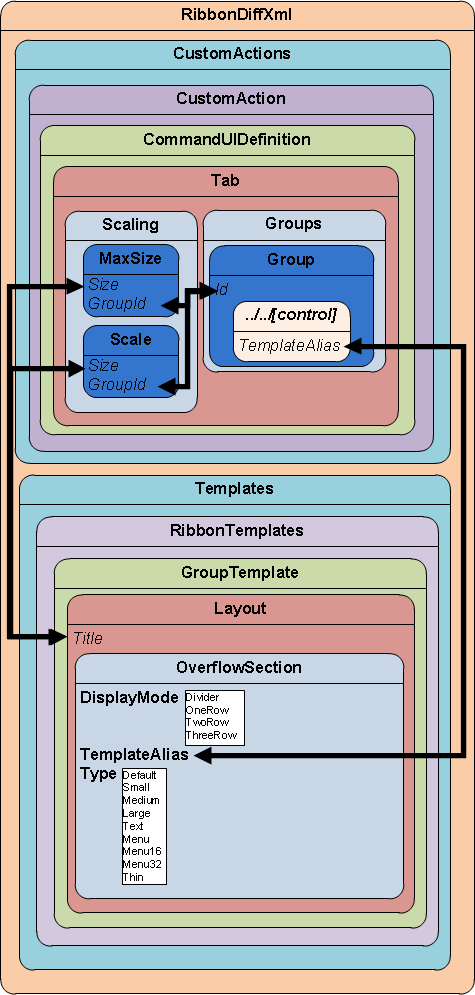
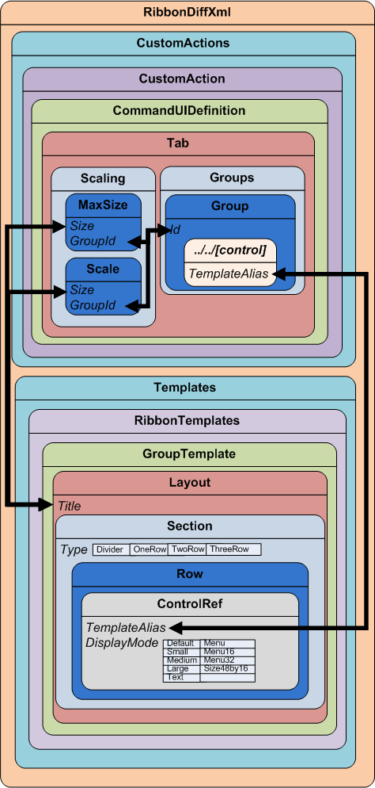

# Define scaling for ribbon elements

For application ribbons and updated form ribbons there is no scaling. Scaling only applies to forms for tables that weren’t updated and list ribbons displayed using Dynamics 365 for Outlook.  
  
The goal of the ribbon is to maintain visibility of relevant controls even when the horizontal size of the window changes. To achieve this, the UI definition allows you to control how controls in a group change size in response to changes in the size of the window. This is known as *scaling*.  

[!INCLUDE[cc-terminology](../data-platform/includes/cc-terminology.md)]
  
## Associate groups and controls to layout templates  

Each `<Group>` element in the ribbon is associated with a `<GroupTemplate>`. The `GroupTemplate` specifies one or more ways the controls in the group can be presented using `<Layout>` elements. Each `Layout` may contain one of two types of definition for how the controls in the group are displayed.  
  
- An `<OverflowSection>` allows for controls to change relative position depending on the available space.  
  
- A `<Section>` controls the number of rows to display and where each control is displayed.  
  
Almost all the `Layout` elements used in ribbons use `OverflowSection` elements.  
  
Each `<Tab>` element must contain one `<MaxSize>` in the `<Scaling>`. The `MaxSize` element is required because it establishes the default presentation of each `Group` in a `Tab` without any scaling applied. Scaling occurs when a `Tab` is associated with one or more `<Scale>`. Each `MaxSize` and `Scale` element is associated via the `Size` parameter with one of the `Layout` elements in the `GroupTemplate` used by each `Group` within a `Tab`.  
  
> [!NOTE]
> The value of the `Size` parameter of any `MaxSize` or `Scale` element must match the `Title` of the available `Layout` elements specified in the `GroupTemplate`. 
> These values are strings and there is no validation in the XSD to help you select values that are a match. The XML is always case-sensitive.  
  
The following diagram shows how `MaxSize`, `Scale`, `Group`, `Layout` and `OverflowSection` elements must reference each other to enable scaling when you are using a `<OverflowSection>` element.  
  
   
  
 The following diagram shows how `MaxSize`, `Scale`, `Group`, `Layout` and `ControlRef` elements must reference each other to enable scaling when you 
 are using a `<Section>` element.  
  
  
  
### Use existing group templates  
 When creating a new group, instead of defining new group templates, you can re-use existing `GroupTemplate` elements.  
  
 Associate your new group to that template. For each control in the group, use a `TemplateAlias` value from one of 
 the `<Section>` 
 or `<OverflowSection>` elements found in one of the `Layout` elements used by that `GroupTemplate`. 
 Each `<OverflowSection>` includes an `isv``TemplateAlias` that is not used. This `TemplateAlias` is provided to allow ISVs to add controls to that group.  
  
### Control how scaling is applied  
 Each `Scale` element in the `Scaling` element for a particular tab represents one scale step. Each `Scale` is applied sequentially by the order in which the `Scale` element appears. When reducing the horizontal space available for the ribbon, each scale element is applied in order from top down. When increasing the horizontal space available, from the smallest space the bottom scale element is in effect. Each of the available `Scale` elements are applied in order from the bottom to the top until all the `MaxSize` elements are in effect.  
  
> [!NOTE]
> The `Scale` element `Sequence` values aren’t used to determine the order in which scaling is applied. Scaling is applied by the relative order the `MaxSize` and `Scale` elements appear in the RibbonDiffXML. The `Sequence` value is important for both `MaxSize` and `Scale` elements because all the `MaxSize` elements must be grouped together above the `Scale` elements. When you add new `MaxSize` or `Scale` elements, be sure that you review the `Sequence` default value ranges assigned to all the `MaxSize` elements and the `Scale` elements. A common error is to assign `Sequence` values that could cause the ranges to overlap.  
  
### See also  
 [Customize commands and the ribbon](customize-commands-ribbon.md)   
 [Define custom actions to modify the ribbon](define-custom-actions-modify-ribbon.md)   
 [Define ribbon tab display rules](define-ribbon-tab-display-rules.md)

[!INCLUDE[footer-include](../../includes/footer-banner.md)]