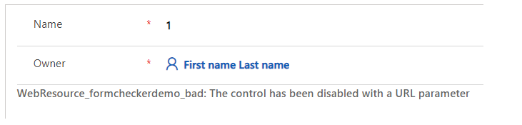
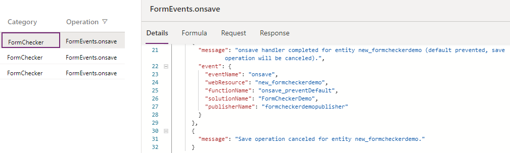
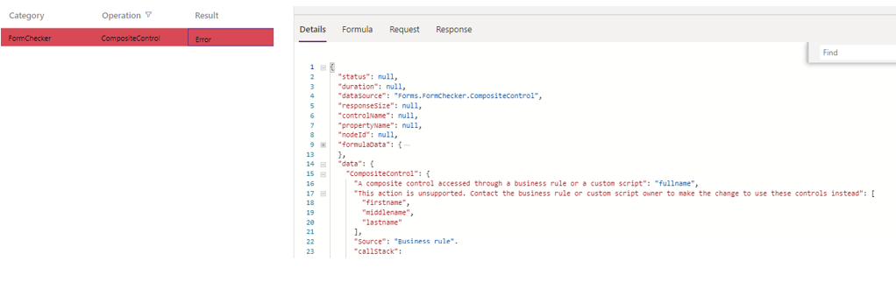
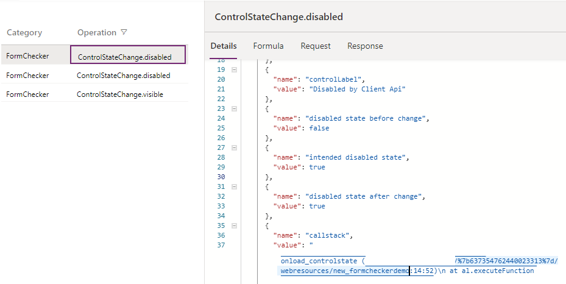
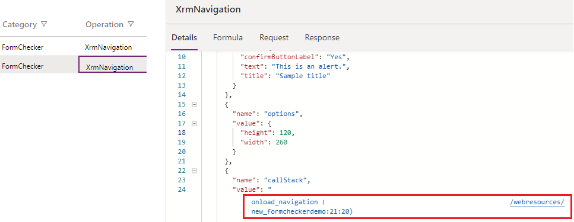

# Overview

Troubleshooting issues in Unified Interface is very important when you're working with forms and trying to fix the issues that happen when loading a form, running a script, working with events, or saving data. 

This article helps fix some common issues that you might encounter while working with model-driven app forms. Where applicable, workarounds are provided.

Use the [Monitoring Tool](https://docs.microsoft.com/powerapps/maker/model-driven-apps/monitor-form-checker) to open up form events.

> [!IMPORTANT]
> - The tools mentioned in this article are only designed for troubleshooting purposes and are not intended to be used in the production scenarios. For example, the URL flags that disable some form components should only be used to narrow down the source of the issue, and should not be leveraged to permanently disable these form components when using the app in your daily operations.
> - The tools affect the current user session unless otherwise called out (such as the browser tab that's accessing the model-driven app). They do not change system customizations or affect any other users or sessions. Once the current session is closed, the effect is no longer applied.
> - Most of the tools are available in production environments. Some of the tools mentioned in the guide may not have been deployed to your organization yet as new tools are added periodically.
> - The tools listed in this article can be used independently to troubleshoot a certain category of issues.


## Utilizing URL parameters to disable various form components

You require the URL parameter to disable various form components that helps narrow down many issues to a specific component. It is recommended that you use the flags one at a time to narrow down the cause of the issue. The following are a list of URL parameters that are used:

- DisableFormCommandbar

- DisableFormHandlers

- DisableFormLibraries

- DisableWebResourceControls

- DisableFormControl

- DisableBusinessProcessFlow

- navbar (this is not a "flag" parameter, instead use "&navbar=off" in the URL)

Below are some examples on how to use the flags listed above.

```Http
https://myorg.crm.dynamics.crm/main.aspx?appid=00000000-0000-0000-0000-000000000000&pagetype=entityrecord&id=00000000-0000-0000-0000-000000000000**&flags=DisableFormHandlers=true
```

You can also add multiple URL parameters separated with comma ",":  

```Http
https://myorg.crm.dynamics.crm/main.aspx?appid=00000000-0000-0000-0000-000000000000&pagetype=entityrecord&id=00000000-0000-0000-0000-000000000000**&flags=DisableFormHandlers=true,DisableWebResourceControls=true,DisableFormCommandbar=true,DisableBusinessProcessFlow=true&navbar=off
```

```Http
https://myorg.crm.dynamics.crm/main.aspx?appid=00000000-0000-0000-0000-000000000000&pagetype=entityrecord&id=00000000-0000-0000-0000-000000000000**&flags=DisableFormCommandbar=true
```

## View registered form event handlers and libraries

To see registered form event handles and libraries you can view the `FormEvents` operation.

> [!div class="mx-imgBorder"]
> 

You'll need the `eventIndex` and `libraryIndex` parameter values when using the **DisableFormHandlers** or **DisableFormLibraries** URL flags. Once an event or library is disabled the **disabledByConfigFlag** will be true, and you'll also see such events in the actual event handling.

> [!div class="mx-imgBorder"]
> 

## Disable form handlers

The following flags disable the form handlers but does not prevent the containing web resource files from being loaded.

- **&flags=DisableFormHandlers=\<event name\>**: Disables the form handlers by specifying the event name, such as `DisableFormHandlers=OnLoad`. If you use `DisableFormHandlers=true`, it disables the following event handlers: [OnLoad](https://docs.microsoft.com/powerapps/developer/model-driven-apps/clientapi/reference/events/form-onload), [OnSave](https://docs.microsoft.com/powerapps/developer/model-driven-apps/clientapi/reference/events/form-onsave), businessrule, [OnChange](https://docs.microsoft.com/powerapps/developer/model-driven-apps/clientapi/reference/events/attribute-onchange), and [TabStateChange](https://docs.microsoft.com/powerapps/developer/model-driven-apps/clientapi/reference/events/tabstatechange).

- **&flags=DisableFormHandlers=\<event name\>_\<event index\>**: Disables the form handlers by specifying the event name and the event index value. For example, `DisableFormHandlers=true_0` disables the form handler at index 0. `DisableFormHandlers=onload_2` disables the  form handler at index 2 of the [OnLoad](https://docs.microsoft.com/powerapps/developer/model-driven-apps/clientapi/reference/events/form-onload) event.

- **&flags=DisableFormHandlers=\<event name\>\<starting index\>\<end index\>**: Disables all the form handlers by specifying the event name and the given index range. For example, `DisableFormHandlers=true_0_2` disables the form handlers at index from 0 to 2 (0 and 2 are included). `DisableFormHandlers=onload_2_5` disables the [OnLoad](https://docs.microsoft.com/powerapps/developer/model-driven-apps/clientapi/reference/events/form-onload) handlers at index from 2 to 5.

## Disabling form libraries

To disable form libraries, use the following:

- **&flags=DisableFormLibraries=true**:  Disables all the form libraries.

- **&flags=DisableFormLibraries=\<library index\>**: Disables the form libraries by specifying the library index value. For example, `DisableFormLibraries=0` disables form library at index 0.

- **&flags=DisableFormLibraries=\<starting index\>_\<ending index\>**: Disables the form libraries by specifying the library index range. For example, `DisableFormLibraries=0_2` disables the form libraries at index from 0 to 2 (0 and 2 are included).

### Differences between DisableFormHandlers and DisableFormLibraries

The main difference between disabling form libraries and form handlers are:

- `DisableFormHandlers` disables form handlers regardless of the containing form libraries, while `DisableFormLibraries` disables form libraries (web resources) regardless of the functions (event handlers) included in the libraries.

- `DisableFormHandlers` does not prevent the containing form library from being loaded, thus does not prevent the JavaScript code that is present in the library but not registered as an event handler from being executed.  For example, if a form library `new_myscript.js` is written in the following way:

  - Assuming the `myOnloadHandler` is registered as an onload handler.
  - `DisableFormHandlers=true` only prevents the second alert dialog, while `DisableFormLibraries=true` prevents both the alert dialogs.

### Disable web resource controls

To disable web resource controls on a form, use the following: 

**&flags=DisableWebResourceControls=true** : Disables all the web resource controls.

Here is the screenshot of what it looks like in your application.

> [!div class="mx-imgBorder"]
> 

### Disable controls on a form

To disable controls on a form, use the following: 

**&flags=DisableFormControl=true**: Disables all the controls on a form.

> [!NOTE]
> The **&flags=DisableFormControl=new_mycontrol** flag disables specific control on the form. If the issue gets resolved when `&flags=DisableWebResourceControls=true` is used, there may be more than one web resource control on the form and you can use this flag to further identify the control that is causing the issue.

## Disable business process flow

To disable a business process flow on the form, use the following:

**&flags=DisableBusinessProcessFlow=true**: Disables a business process flow on the form.

## Unexpected behaviors when loading a form

You see unexpected behaviors when you open a form. Some of the common issues include:

- Fields or controls do not have an expected value.

- Controls are not disabled/enabled.

- Controls are not shown/hidden.

Any of the above behavior appears after the form is opened,for example, you see a value or control for a second, and then the value changes or the control disappears.

There are many possible causes for the unexpected behaviors when a form opens. One of the most common is the [OnLoad](https://docs.microsoft.com/powerapps/developer/model-driven-apps/clientapi/reference/events/form-onload) script that runs synchronously or asynchronously to change the field/control behavior. To determine if your script is causing the issue you can disable the form handlers using the URL parameters by appending `**&flags=DisableFormHandlers=true**` flag at the end of your app URL.

If the form loads normally after you disable the form handler, this indicates that there is an issue with the script that is blocking or causing an
error when a form is loading.

## Intermittent form errors

There are many possible causes for intermittent or random form errors. Using the unsupported [Client API](https://docs.microsoft.com/powerapps/developer/model-driven-apps/clientapi/reference) methods could be one of the main reason why you see errors and usually have some of the following characteristics:

- Occurs on some records, users, regions, browsers, or only during a certain period when the network or service load is high.

- Occurs rarely on support instances.

- The repro may only occur once on a computer, and it may occur again after clearing browser cache.

- [formContext.getControl](https://docs.microsoft.com/powerapps/developer/model-driven-apps/clientapi/reference/controls/getcontrol)  or [formContext.getControl(arg).getAttribute()](https://docs.microsoft.com/powerapps/developer/model-driven-apps/clientapi/reference/controls/getattribute) randomly returns null for a valid control or attribute.

There are many ways to write unsupported client API methods and all share a common pattern that they are not written in a supported way and they cause a race condition in the form load pipeline. Because they introduce a race condition, the issue only occurs when the custom script is executed before the form is fully ready to be accessed via client API depending on many factors:

- In the JavaScript web resource, code is put into a global scope that is executed immediately when the web resource file is loaded without waiting for the form to be accessible. You should make sure the code is executed inside a valid form handler, such as an [OnLoad](https://docs.microsoft.com/powerapps/developer/model-driven-apps/clientapi/reference/events/form-onload) handler.

- In the Power Apps component framework component script file, client API methods are accessed inside the [init](https://docs.microsoft.com/powerapps/developer/component-framework/reference/control/init) or [updateView](https://docs.microsoft.com/powerapps/developer/component-framework/reference/control/updateview) function. The `init()` and `updateView()` is executed immediately when the component is loaded without waiting for the form to be readily accessible. Client API should not be used in the Power Apps component framework components.

- In the web resource file, client API is accessed inside a `window.setTimeout()` function. The page state is unpredictable when the `setTimeout()` method executes the wrapped function due to the nature of the timer function, so when the execution happens the page may be in a transitional state (during page load, or save) that's not readily accessible by client API.

Using the [Monitoring Tool](https://docs.microsoft.com/powerapps/maker/model-driven-apps/monitor-form-checker), you can access information that helps you determine when the unsupported client access occurs and when the access happens at the wrong time due to race condition.

The below sample event shows the call stack of the unsupported script (the call stack has been modified for demonstration purposes). The call stack tells what exact web resource, function, line and the row number is causing the error.

> [!div class="mx-imgBorder"]
> 

This is caused by unsupported scripting. Follow up with the script owner to fix the problematic script code.

## **Save in Progress** error dialog

When the form saves, you see the **Save in Progress** error dialog. This error occurs when the form [OnSave](https://docs.microsoft.com/powerapps/developer/model-driven-apps/clientapi/reference/events/form-onsave) event is triggered before the previous [OnSave](https://docs.microsoft.com/powerapps/developer/model-driven-apps/clientapi/reference/events/form-onsave) event is complete. This is not supported and the error dialog is by design because calling the `OnSave` event before the previous `OnSave` event is complete would cause recursive save loops with unintended behaviors.

A typical cause of this error is the script that calls `save]()` in [OnSave](https://docs.microsoft.com/powerapps/developer/model-driven-apps/clientapi/reference/events/form-onsave) handler. Another possible cause is the concurrent `save()` calls in `setTimeout()`, and which could cause the error dialog to intermittently show up, depending on whether the prior `save()` call is completed when another save() call is made.

**Resolution**:

Below is a sample Form Checker monitor event (the callstack has been modified for demonstration purpose). The callstack tells what exact web resource,
function, line and the row number is causing the error. Form Checker won't be able to detect the error when this issue is not reproducing.

> [!div class="mx-imgBorder"]
> 

## The form/record is not saved when you try to save the form

A very common cause is an [OnSave](https://docs.microsoft.com/powerapps/developer/model-driven-apps/clientapi/reference/events/form-onsave) handler that has called `executionContext.getEventArgs().preventDefault()` method to cancel the save operation.

**Resolution**:

Below is a sample Form Checker monitor event to explain why the save is canceled that's not explicit enough from the form UI itself:

> [!div class="mx-imgBorder"]
> 

## Form script errors

If you see a form script error during form OnLoad, [OnSave](https://docs.microsoft.com/powerapps/developer/model-driven-apps/clientapi/reference/events/form-onsave), OnChange, business rule execution, or other events, the error dialog itself may not contain sufficient information to troubleshoot.

**Resolution**:

For example, the customer has an onload handler, say `onload(controlName)`, and they checked "Pass execution context as first parameter" option in the event handler editor in the form designer. In their code:

```javascript
function onload(controlName)
{
  Xrm.Page.getControl(controlName);

}
```

This causes a problem because the first parameter for the onload function is executionContext, however, the script incorrectly uses it as the control name for getControl(). Client API code thus throws this error:

> [!div class="mx-imgBorder"]
> 

Once you launch Form Checker, you'll be able to see more details including the full callstack (the callstack has been modified for demonstration purpose) because callstack may be truncated if you're not in a monitor session which discloses the exact web resource and code location that causes this error.

> [!div class="mx-imgBorder"]
> 

## Form freezes or is very slow or throws unexplained errors

- Form loads very slow

- Form throws unexplainable errors

- Form throws **Web resource method does not exist** script error

There are many possible reasons for a form to freeze or is slow, or throws an error that is not a typical script error dialog. Some of the many possible reasons are:

1. It's not only slow or freezes on forms, it also occurs in other places such as sitemap/navigation pane, grids, or dashboards

2. Bad onload scripts

3. Web resource controls

4. Command button scripts and rules

5. Synchronous network requests

6. Custom plugins

7. Business Process Flow errors

This troubleshooting guide details these reasons which would help narrow down the troubleshooting scope.

**Resolution**:

Determine if the issue reproduces without involving forms. If it does, then there is a broader issue that should not be investigated by the forms team. Actual ownership of the issue depends on the particular details case by case.

If you believe this issue only occurs on forms, please refer to [Utilizing URL parameters to disable various form components](https://dynamicscrm.visualstudio.com/OneCRM/_wiki/wikis/OneCRM.wiki/9351/Form-Checker?anchor=utilizing-url-parameters-to-disable-various-form-components#utilizing-url-parameters-to-disable-various-form-components)"
to help narrow down the component that's causing the issue.

Also, check for and fix synchronous network requests as described here:

- <https://powerapps.microsoft.com/blog/turbocharge-your-model-driven-apps-by-transitioning-away-from-synchronous-requests/> 

- <https://docs.microsoft.com//powerapps/developer/model-driven-apps/best-practices/business-logic/interact-http-https-resources-asynchronously> 

## Business rule or custom script is not working

This can happen if a business rule/custom script used to work in web client, stopped working in Unified Interface. One of the main reasons this can occur is when a business rule or script in Unified Interface is referencing a control that is not available in the Unified Interface.

An example of a common issue where this can happen is when a composite control is included in a script that exists in web client, but in the Unified Interface the composite control is broken down into parts and is stored this way. For example, if a field `fullname` is part of the business rule or custom script, the fields `firstname`, `middlename`, or `lastname` should be used instead.

Once you launch the [Monitoring Tool](https://docs.microsoft.com/powerapps/maker/model-driven-apps/monitor-form-checker), you'll be able to see more details including the composite control that is causing the problem, the fields that can be used in the business rule or custom script instead, and a full callstack (the callstack has been modified for
demonstration purpose).

> [!div class="mx-imgBorder"]
> 

## Related Menu/Related tab

There are many reasons why a related menu item doesn't show in the tab or have incorrect labels. Below is an example where you can use the [Monitoring Tool](https://docs.microsoft.com/powerapps/maker/model-driven-apps/monitor-form-checker)to check the `RelatedMenu` event.

In this example, it shows the reasons why a related entity "role" (Security Role) does not show in the "team" form is because "role" is not available in
Unified Interface.

> [!div class="mx-imgBorder"]
> 

There are also a few sources where a record can be included as an option for the related menu tab. The following example includes details the indicate the label "Activities" in account form related menu comes from the related entity's plural display name.

> [!div class="mx-imgBorder"]
> 

You will need to follow up with the owner of the related menu item indicated in the Related Menu event in the monitoring tool.

## Why a control is disabled/enabled/visible/hidden

There're many possible reasons why a control is disabled or hidden when the form loads. In the example below, you can use the [Monitoring Tool](https://docs.microsoft.com/powerapps/maker/model-driven-apps/monitor-form-checker) to view the "FormControls" event will include details on the initial control state as demonstrated below

> [!div class="mx-imgBorder"]
> 

Another example is a "ControlStateChange" operation that explains why a control's disabled/visible state is changed by client Api or Business Rules. This can occur during a form load or triggered after the form is loaded using an onchange handler (the callstack has been modified for demonstration purpose). The details in the callstack will include the web resource, function, and line and row number causing the control state change.

> [!div class="mx-imgBorder"]
> 

> [!NOTE]
> The difference between "FormControls" and "ControlStateChange" is that the former reflects the initial control state when the form loads, while the latter reflects the state change at any time on the form. For example, if control is disabled for security reasons, it's very unlikely to be enabled after the form is loaded, so the initial state can be found in "FormControls" and not likely found in "ControlStateChange". Even if a Client API function tries to enable the control, it will not be effective, and you'll see "ControlStateChange" event of the disabled state change intention by the script without success, and you'll be able to find out why the intention is unsuccessful in "FormControls".

You will need to follow up with the owner of the web resource/business rules indicated in the state reason to change or fix the behavior.

## Why a tab or section is visible or hidden

There are many possible reasons why a tab or section is hidden or visible. "TabStateChange" or "SectionStateChange" explains the visible state change as demonstrated below (the callstack has been modified for demonstration purpose). The callstack tells what exact web resource, function, and line and the row number is
causing the control state change.

> [!div class="mx-imgBorder"]
> 

You will need to follow up with the owner of the web resource/business rules indicated in the state reason to change or fix the behavior.

## Unexpected dialogs or navigation

There are many possible reasons why an expected dialog or navigation happens. One of the common causes is when you use the XrmNavigation Client API to open
another record or form. For example, when you open a form, an expected dialog as below is shown:

> [!div class="mx-imgBorder"]
> 

The "XrmNavigation" event in the [Monitoring Tool](https://docs.microsoft.com/powerapps/maker/model-driven-apps/monitor-form-checker) will help you identify the script causing the unexpected behavior (the callstack has been modified for demonstration purpose). The callstack in the details of the event will include the web resource, function, line, and row number causing the issue.

> [!div class="mx-imgBorder"]
> 

You will need to follow up with the owner of the web resource to change or fix the behavior.

## Example on how to troubleshoot a form

Below is an example of how you can use the tools outlined above to help troubleshoot an issue and solve problems using these troubleshooting tools.

### Issue: A form freezes when you try to open it

There're many reasons a form can be frozen, to narrow it down we'll try to leverage some of the URL flags to disable individual components and see if the issue goes away.

- First use the **DisableFormCommandbar** flag. When you refresh or reload the page, notice the command bar/ribbon disappears. If the issue goes away, the problem is caused by some command customization. The next step is to further analyze individual commands to the root cause of the problem which is out of range of this document.

- If the issue still persists, use **DisableFormHandlers=true** flag. If the issue goes away, we'll further pinpoint the exact event handler function that's causing the problem.

- Assuming the form has 10 libraries, and 20 onload handlers, we can use a binary search approach to narrow down the handler index range.

    - Open the [Monitoring Tool](https://docs.microsoft.com/powerapps/maker/model-driven-apps/monitor-form-checker) to view the registered form event handlers and libraries to get the list of onload handlers of indices ranging from 0 to 19 and form libraries of indices ranging from 0 to 9.

    - Use DisableFormHandlers=onload_0_9 which is more precise (or true_0_9 which might be a bit overkilling but should also work for form load scenario) to see if the issue goes away. If it does, it proves the issue is caused by some handlers between index 0 and 9 (both included); otherwise, the issue is caused by handlers between index 10 and 19.

    - Assuming the issue is caused by handlers of index 0 to 9, use DisableFormHandlers=onload_0_4 (or true_0_4) to disable handlers of an index between 0 and 4. Keep doing that until the range is small enough to loop through each one individually. Assuming the range is narrowed down to 3 to 4, use the DisableFormHandlers=onload_3, then onload_4 until you pinpoint the exact handler that's causing this problem.

    - Assuming the issue is caused by the handler of index 3, read the event handler details obtained using the monitoring tool. If the handler is sampleOnloadHandler() in web resource foo.js in solution X by publisher Y. Follow up with the owner of the event handler to further analyze this issue.

- If the issue still persists, use **DisableFormLibraries=true** flag to disable all form libraries, and follow a similar binary search approach if the amount of libraries is large, or just disable them one-by-one in a similar way we leverage DisableFormHandlers flag above.

- If the issue still persists, use **DisableWebResourceControls=true** flag to disable all web resource controls. If the issue goes away, use the **DisableFormControl** flag to further pinpoint the exact web resource control. Assuming the issue goes away with DisableFormControl=foo, and follow up with the control owner to do deeper troubleshooting.

- Continue turning off form components one-by-one with the appropriate URL parameters. The component that is disabled and makes the issue go away will be the component causing the problem. You should follow up with the owner of the component for further analysis.
