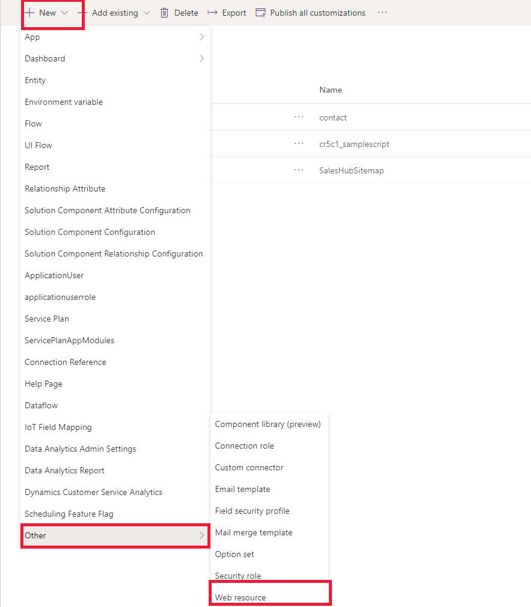
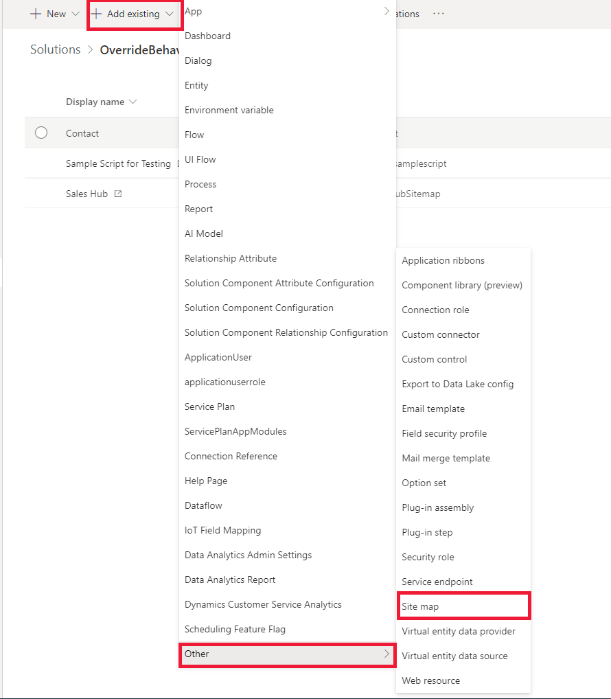
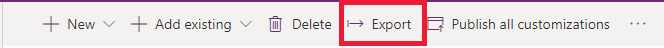
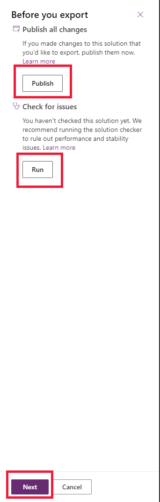
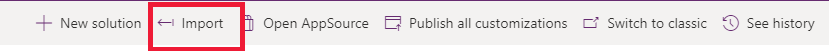

# Override the default open behavior of data rows in an entity-bound grid

By default, performing any of the following actions in a data row in an entity-bound grid opens the table record:

- Double-clicking the data row, or selecting the primary column link in the row.
- Selecting a data row, and then pressing the **Enter** key.
- On a touch-enabled device, selecting a data row.

[!INCLUDE[cc-terminology](../data-platform/includes/cc-terminology.md)]

There might be situations where you don't want the table record to open (which is the default behavior), but want a custom action to be performed such as opening a URL using JavaScript functions. You can override the default behavior and define your own custom behavior by creating a command definition for a table with `Mscrm.OpenRecordItem` as the value of the ID parameter `CommandDefinition`, and defining a custom action on the **Actions** tab. The application looks for the `Mscrm.OpenRecordItem` command ID for a table when you try to open a record from the entity-bound grid and&mdash;if one is present&mdash;will execute the custom action instead of performing the default behavior of opening the table record.

> [!NOTE] 
> - This feature is supported only for Unified Interface.
> - You can also use Ribbon Workbench, a community tool, to visually edit ribbons by using the UI. Note that tools created by the community aren't supported by Microsoft. If you have questions or issues with community tools, contact the publisher of the tool.

To specify a custom action when a table record is selected, you'll do the following:

1. Create a web resource to perform the action.
2. Create a custom button on the form by editing the customization.xml file
3. Import the customization.xml file

## Step 1: Create a web resource

Create a web resource to change the default behavior. In the following example, if you want to open a URL instead of displaying the record, you create a JavaScript web resource to perform that action.

1. Sign in to [Power Apps](https://make.powerapps.com) and select **Solutions** from the left pane. 
  
2. Select **New solution**, and then complete the required columns for the solution.
  
    |Column|Description|  
    |-----------|-----------------|  
    |**Display Name**|The name shown in the list of solutions. You can change this later.|  
    |**Name**|The unique name of the solution. This is generated by using the value you enter in the **Display Name** column. You can edit this before you save the solution, but after you save the solution, you can't change it.|  
    |**Publisher**|You can select the default publisher or create a new publisher. We recommend that you create a publisher for your organization to use consistently across the environments where you'll use the solution.|  
    |**Version**|Enter a number for the version of your solution. This is only important if you export your solution. The version number will be included in the file name when you export the solution.|  
  
3. Select **Save**.  

4. Open the solution, and then select **New** > **Other** > **Web resource**.
 
   > [!div class="mx-imgBorder"]
   > 

5. Enter the name of the web resource,  and select the **Type** as **Script(JScript)**.

6. Select **Text Editor**, copy the code shown below, paste it into the text editor, and enter the value of the URL you want to open:

   ```JavaScript
   function ChangeBehavior(){
    
    // Enter the url
    var url =  "Enter the URL";
    var OpenUrlOptions = {height: 800, width: 1000};
    Xrm.Navigation.openUrl(url, openUrlOptions);
   }
   ```
7. Save and publish the web resource.

## Step 2: Create a custom button

Create a custom button on the form where you want to change the default behavior. For example, if you have a subgrid on the accounts form that displays contact records in the subgrid, you need to create a button and add it to the contact form. You can create a button by editing the customization.xml file.

1. Open the solution that you created in step 1, and add the table where you want to create the button. It is not required to include all table components and metadata.

1. Select **Add existing** > **Other** > **Site map** to add the site map. 

    > [!div class="mx-imgBorder"]
    > 

1. From the list, select **Site Map**.

1. Save and publish the solution. 

1. Select **Export** to make edits to the customization.xml file. 

    > [!div class="mx-imgBorder"]
    > 

1. If you've made recent changes that haven't yet been published, select **Publish**, select **Run** to check whether the solution has any issues or dependencies, and then select **Next**.

    > [!div class="mx-imgBorder"]
    > 

1. With the **Unmanaged** option selected, select **Export**.

   > [!div class="mx-imgBorder"]
   > 

1. In the **Download** dialog box, select **Save**, and in the **Download complete** dialog box, select **Open Folder**.

1. Right-click to select the compressed .zip file that you downloaded, and then select **Extract All**.

1. Select a location to extract the files to, and then select **Extract**.

    The customizations.xml file is the file that you'll edit.

    > [!NOTE]
    > You can enable or disable the button; doing either will still override the open default behavior.

1. Open the customization.xml file, copy the code below, replace the code inside the `RibbonDiffXml`:

     ```XML
    <RibbonDiffXml>
      <CustomActions>
    <CustomAction Id="cr5c1.Mscrm.OpenRecordItem.CustomAction" Location="Mscrm.SubGrid.contact.MainTab.Management.Controls._children" Sequence="28">
      <CommandUIDefinition>
        <Button Alt="$LocLabels:Mscrm.OpenRecordItem.Alt" Command="Mscrm.OpenRecordItem" Id="Mscrm.OpenRecordItem" LabelText="$LocLabels:Mscrm.OpenRecordItem.LabelText" Sequence="28" TemplateAlias="o1" ToolTipTitle="$LocLabels:Mscrm.OpenRecordItem.ToolTipTitle" ToolTipDescription="$LocLabels:Mscrm.OpenRecordItem.ToolTipDescription" />
      </CommandUIDefinition>
    </CustomAction>
    </CustomActions>
     <Templates>
    <RibbonTemplates Id="Mscrm.Templates" />
    </Templates>
      <CommandDefinitions>
       <CommandDefinition Id="Mscrm.OpenRecordItem">
      <EnableRules />
      <DisplayRules />
      <Actions>
        <JavaScriptFunction FunctionName="ChangeBehavior" Library="$webresource:cr5c1_samplescript" />
      </Actions>
      </CommandDefinition>
     </CommandDefinitions>
      </RibbonDiffXml>
     ```

     > [!NOTE]
     > You need to replace the function name and also the name of the web resource in the above XML file. Edit the above example XML file to replace it with your own default publisher.

## Step 3: Import the XML file

1. After you've edited the customization.xml file, right-click to select the **customization.xml** tab, and then select **Open Containing Folder**.  
2. Select all the files or folders that were included when you extracted the solution. Right-click the selected files, select **Send To**, and then select **Compressed (zipped) folder**.  
  
   > [!NOTE]
   >  This creates a compressed .zip file in the same folder. The name of the file will vary, but will be the same as one of the other files in the folder except with a .zip file name extension.  
  
3. Sign in to [Power Apps](https://make.powerapps.com), and select **Solutions** from the left pane.  
  
4. On the command bar, select **Import**.  

    > [!div class="mx-imgBorder"]  
    >  
  
5. On the **Select Solution Package** page, select **Browse** to locate the compressed (.zip or .cab) file that contains the solution you want to import. 
  
6. Select **Next**.  
  
7. On the page that displays information about the solution, select **Import**.  
  
8. You might need to wait a few moments while the import is completed. View the results, and then select **Close**.  
  
If you've imported any changes that require publishing, you must publish customizations before they're available. 
  
If the import isn't successful, you'll see a report showing any errors or warnings that were captured. Select **Download Log File** to see details about what caused the import to fail. The most common cause for an import to fail is that the solution didn't contain some required components.  
  
When you download the log file, you'll find an XML file that you can open with Excel to view the contents.

### See also

[Ribbon Workbench](https://www.develop1.net/public/rwb/ribbonworkbench.aspx)<br/>
[Customize the ribbon](customize-commands-ribbon.md)


[!INCLUDE[footer-include](../../includes/footer-banner.md)]