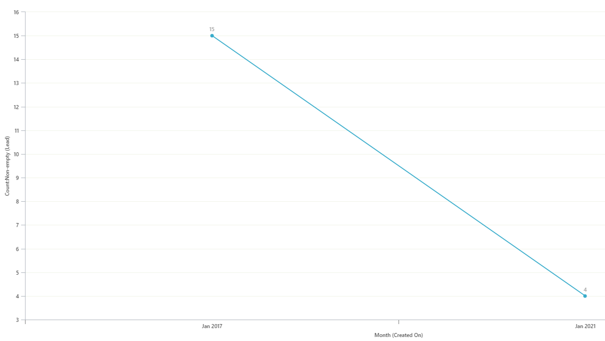
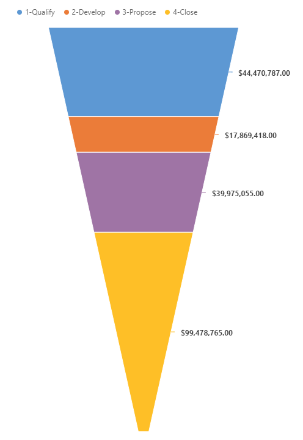

# Sample charts

<!-- https://docs.microsoft.com/en-us/dynamics365/customer-engagement/developer/customize-dev/sample-charts -->

This topic contains sample charts along with the respective data description and presentation XML strings. You can specify the:  
  
-   *Data description XML string* for a chart using the `SavedQueryVisualization.DataDescription` or `UserQueryVisualization.DataDescription` attribute for the organization-owned or user-owned chart respectively.  
  
-   *Presentation description XML string* for a chart using the `SavedQueryVisualization.PresentationDescription` or `UserQueryVisualization. PresentationDescription` attribute for the organization-owned or user-owned chart respectively.  
  
<a name="ColumnChart"></a>   
## Column Chart  
 The following is a column chart that shows the account by industry. We modified the presentation description of the existing Account By Industry default chart available in Model-driven apps for the `Account` entity to change it to a column chart.  
  
   
  
### Data Description  
 The following is the contents of the data description XML string for this chart.  
  
```xml  
<datadefinition>  
  <fetchcollection>  
    <fetch mapping="logical" aggregate="true">  
      <entity name="account">  
        <attribute groupby="true" alias="groupby_column" name="industrycode" />  
        <attribute alias="aggregate_column" name="name" aggregate="count" />  
      </entity>  
    </fetch>  
  </fetchcollection>  
  <categorycollection>  
    <category>  
      <measurecollection>  
        <measure alias="aggregate_column" />  
      </measurecollection>  
    </category>  
  </categorycollection>  
</datadefinition>  
  
```  
  
### Presentation Description  
 The following is the contents of the presentation description XML string for this chart.  
  
```xml  
<Chart>  
  <Series>  
    <Series ChartType="Column" IsValueShownAsLabel="True" Color="149, 189, 66" BackGradientStyle="TopBottom" BackSecondaryColor="112, 142, 50" Font="{0}, 9.5px" LabelForeColor="59, 59, 59" CustomProperties="MinPixelPointWidth=5, PointWidth=0.75, MaxPixelPointWidth=40">  
      <SmartLabelStyle Enabled="True" />  
    </Series>  
  </Series>  
  <ChartAreas>  
    <ChartArea BorderColor="White" BorderDashStyle="Solid">  
      <AxisY IsLabelAutoFit="False" TitleForeColor="59, 59, 59" TitleFont="{0}, 10.5px" LineColor="165, 172, 181" IsReversed="False">  
        <MajorGrid LineColor="239, 242, 246" />  
        <LabelStyle Font="{0}, 10.5px" ForeColor="59, 59, 59" />  
      </AxisY>  
      <AxisX IsLabelAutoFit="True" TitleForeColor="59, 59, 59" TitleFont="{0}, 10.5px" LineColor="165, 172, 181" IsReversed="False">  
        <MajorGrid Enabled="False" />  
        <MajorTickMark Enabled="False" />  
        <LabelStyle Font="{0}, 10.5px" ForeColor="59, 59, 59" />  
      </AxisX>  
    </ChartArea>  
  </ChartAreas>  
  <Titles>  
    <Title Name="Chart Title" DockingOffset="-3" Font="{0}, 13px" ForeColor="59, 59, 59" Alignment="TopLeft"></Title>  
  </Titles>  
</Chart>  
```  
  
<a name="BarChart"></a>   
## Bar Chart  
 The following is a bar chart that shows the top 10 customers. This is one of the default charts available in MDA for the `Opportunity` entity.  
  
   
  
### Data Description  
 The following is the contents of the data description XML string for this chart.  
  
```xml  
<datadefinition>  
  <fetchcollection>  
    <fetch mapping="logical" count="10" aggregate="true">  
      <entity name="opportunity">  
        <attribute name="estimatedvalue" aggregate="sum" alias="sum_estimatedvalue" />  
        <attribute name="customerid" groupby="true" alias="customerid" />  
        <order alias="sum_estimatedvalue" descending="true" />  
      </entity>  
    </fetch>  
  </fetchcollection>  
  <categorycollection>  
    <category>  
      <measurecollection>  
        <measure alias="sum_estimatedvalue" />  
      </measurecollection>  
    </category>  
  </categorycollection>  
</datadefinition>  
  
```  
  
### Presentation Description  
 The following is the contents of the presentation description XML string for this chart.  
  
```xml  
<Chart>  
  <Series>  
    <Series ChartType="Bar" IsValueShownAsLabel="True" Color="149, 189, 66" BackGradientStyle="TopBottom" BackSecondaryColor="112, 142, 50" Font="{0}, 9.5px" LabelForeColor="59, 59, 59" CustomProperties="MinPixelPointWidth=5, PointWidth=0.75, MaxPixelPointWidth=40">  
      <SmartLabelStyle Enabled="True" />  
    </Series>  
  </Series>  
  <ChartAreas>  
    <ChartArea BorderColor="White" BorderDashStyle="Solid">  
      <AxisY IsLabelAutoFit="False" TitleForeColor="59, 59, 59" TitleFont="{0}, 10.5px" LineColor="165, 172, 181" IsReversed="False">  
        <MajorGrid LineColor="239, 242, 246" />  
        <LabelStyle Font="{0}, 10.5px" ForeColor="59, 59, 59" />  
      </AxisY>  
      <AxisX IsLabelAutoFit="False" TitleForeColor="59, 59, 59" TitleFont="{0}, 10.5px" LineColor="165, 172, 181" IsReversed="False">  
        <MajorGrid Enabled="False" />  
        <MajorTickMark Enabled="False" />  
        <LabelStyle Font="{0}, 10.5px" ForeColor="59, 59, 59" />  
      </AxisX>  
    </ChartArea>  
  </ChartAreas>  
  <Titles>  
    <Title DockingOffset="-3" Font="{0}, 13px" ForeColor="59, 59, 59" Alignment="TopLeft"></Title>  
  </Titles>  
</Chart>  
```  
  
<a name="AreaChart"></a>   
## Area Chart  
 The following is an area chart that shows the number of records generated between a given date range.  
  
   
  
### Data Description  
 The following is the contents of the data description XML string for this chart.  
  
```xml
<datadefinition>  
      <fetchcollection>  
        <fetch mapping="logical" aggregate="true">  
          <entity name="incident">  
            <attribute name="createdon" groupby="true" alias="_CRMAutoGen_groupby_column_Num_0" dategrouping="day" />  
            <attribute name="incidentid" aggregate="count" alias="_CRMAutoGen_aggregate_column_Num_0" />  
          </entity>  
        </fetch>  
      </fetchcollection>  
      <categorycollection>  
        <category alias="_CRMAutoGen_groupby_column_Num_0">  
          <measurecollection>  
            <measure alias="_CRMAutoGen_aggregate_column_Num_0" />  
          </measurecollection>  
        </category>  
      </categorycollection>  
    </datadefinition>   
```  
  
### Presentation Description  
 The following is the contents of the presentation description XML for this chart.  
  
```xml
<Chart Palette="None" PaletteCustomColors="149,189,66; 197,56,52; 55,118,193; 117,82,160; 49,171,204; 255,136,35; 168,203,104; 209,98,96; 97,142,206; 142,116,178; 93,186,215; 255,155,83">  
      <Series>  
        <Series ChartType="StackedArea" Font="{0}, 9.5px" LabelForeColor="59, 59, 59" CustomProperties="PointWidth=0.75, MaxPixelPointWidth=40" />  
      </Series>  
      <ChartAreas>  
        <ChartArea BorderColor="White" BorderDashStyle="Solid">  
          <AxisY LabelAutoFitMinFontSize="8" TitleForeColor="59, 59, 59" TitleFont="{0}, 10.5px" LineColor="165, 172, 181" IntervalAutoMode="VariableCount">  
            <MajorGrid LineColor="239, 242, 246" />  
            <MajorTickMark LineColor="165, 172, 181" />  
            <LabelStyle Font="{0}, 10.5px" ForeColor="59, 59, 59" />  
          </AxisY>  
          <AxisX LabelAutoFitMinFontSize="8" TitleForeColor="59, 59, 59" TitleFont="{0}, 10.5px" LineColor="165, 172, 181" IntervalAutoMode="VariableCount">  
            <MajorTickMark LineColor="165, 172, 181" />  
            <MajorGrid LineColor="Transparent" />  
            <LabelStyle Font="{0}, 10.5px" ForeColor="59, 59, 59" />  
          </AxisX>  
        </ChartArea>  
      </ChartAreas>  
      <Titles>  
        <Title Alignment="TopLeft" DockingOffset="-3" Font="{0}, 13px" ForeColor="59, 59, 59" />  
      </Titles>  
      <Legends>  
        <Legend Alignment="Center" LegendStyle="Table" Docking="right" IsEquallySpacedItems="True" Font="{0}, 11px" ShadowColor="0, 0, 0, 0" ForeColor="59, 59, 59" />  
      </Legends>  
    </Chart>  
```  
  
<a name="LineChart"></a>   
## Line Chart  
 The following is a line chart that shows the number of leads generated in the last five months. This is one of the default charts available in MDA for the `Lead` entity. 
  
 --> 
  
### Data Description  
 The following is the contents of the data description XML string for this chart.  
  
```xml  
<datadefinition>  
  <fetchcollection>  
    <fetch mapping="logical" count="5" aggregate="true">  
      <entity name="lead">  
        <attribute name="leadid" aggregate="countcolumn" alias="count_leadid" />  
        <attribute name="createdon" groupby="true" dategrouping="month" usertimezone="false" alias="createdon" />  
        <order alias="createdon" descending="false" />  
      </entity>  
    </fetch>  
  </fetchcollection>  
  <categorycollection>  
    <category>  
      <measurecollection>  
        <measure alias="count_leadid" />  
      </measurecollection>  
    </category>  
  </categorycollection>  
</datadefinition>  
```  
  
### Presentation Description  
 The following is the contents of the presentation description XML string for this chart.  
  
```xml  
<Chart>  
  <Series>  
    <Series IsValueShownAsLabel="True" BorderWidth="3" ChartType="Line" Color="49, 171, 204" MarkerStyle="Square" MarkerSize="9" MarkerColor="37, 128, 153"></Series>  
  </Series>  
  <ChartAreas>  
    <ChartArea BorderColor="White">  
      <AxisY LabelAutoFitMinFontSize="8" TitleForeColor="59, 59, 59" TitleFont="{0}, 10.5px" LineColor="165, 172, 181">  
        <MajorGrid LineColor="239, 242, 230" />  
        <MajorTickMark LineColor="165, 172, 181" />  
        <LabelStyle Font="{0}, 10.5px" ForeColor="59, 59, 59" />  
      </AxisY>  
      <AxisX LabelAutoFitMinFontSize="8" TitleForeColor="59, 59, 59" TitleFont="{0}, 10.5px" LineColor="165, 172, 181">  
        <MajorGrid Enabled="False" />  
        <LabelStyle Font="{0}, 10.5px" ForeColor="59, 59, 59" />  
      </AxisX>  
    </ChartArea>  
  </ChartAreas>  
  <Titles>  
    <Title DockingOffset="-3" Font="{0}, 13px" ForeColor="59, 59, 59" Alignment="TopLeft"></Title>  
  </Titles>  
</Chart>  
```  
  
<a name="PieChart"></a>   
## Pie Chart  
 The following is a pie chart that shows the total number of leads and their importance. This is one of the default charts available in MDA for the `Lead` entity.  
  
   
  
### Data Description  
 The following is the contents of the data description XML string for this chart.  
  
```xml  
<datadefinition>  
  <fetchcollection>  
    <fetch mapping="logical" aggregate="true">  
      <entity name="lead">  
        <attribute groupby="true" alias="groupby_column" name="leadqualitycode" />  
        <attribute alias="aggregate_column" name="fullname" aggregate="count" />  
      </entity>  
    </fetch>  
  </fetchcollection>  
  <categorycollection>  
    <category>  
      <measurecollection>  
        <measure alias="aggregate_column" />  
      </measurecollection>  
    </category>  
  </categorycollection>  
</datadefinition>  
  
```  
  
### Presentation Description  
 The following is the contents of the presentation description XML string for this chart.  
  
```xml  
<Chart Palette="None" PaletteCustomColors="97,142,206; 209,98,96; 168,203,104; 142,116,178; 93,186,215; 255,155,83; 148,172,215; 217,148,147; 189,213,151; 173,158,196; 145,201,221; 255,180,138">  
  <Series>  
    <Series ShadowOffset="0" IsValueShownAsLabel="true" Font="{0}, 9.5px" LabelForeColor="59, 59, 59" CustomProperties="PieLabelStyle=Inside, PieDrawingStyle=Default" ChartType="pie">  
      <SmartLabelStyle Enabled="True" />  
    </Series>  
  </Series>  
  <ChartAreas>  
    <ChartArea>  
      <Area3DStyle Enable3D="false" />  
    </ChartArea>  
  </ChartAreas>  
  <Legends>  
    <Legend Alignment="Center" LegendStyle="Table" Docking="right" Font="{0}, 11px" ShadowColor="0, 0, 0, 0" ForeColor="59, 59, 59" />  
  </Legends>  
  <Titles>  
    <Title Alignment="TopLeft" DockingOffset="-3" Font="{0}, 13px" ForeColor="0, 0, 0"></Title>  
  </Titles>  
</Chart>  
```  
  
<a name="FunnelChart"></a>   
## Funnel Chart  
 The following is a funnel chart that shows the sum of estimated revenue in each stage of the sales pipeline. This is one of the default charts available in MDA for the `Opportunity` entity.  
  
   
  
### Data Description  
 The following is the contents of the data description XML string for this chart.  
  
```xml  
<datadefinition>  
  <fetchcollection>  
    <fetch mapping="logical" count="10" aggregate="true">  
      <entity name="opportunity">  
        <attribute name="estimatedvalue" aggregate="sum" alias="sum_estimatedvalue" />  
        <attribute name="stepname" groupby="true" alias="stepname" />  
        <order alias="stepname" descending="false" />  
      </entity>  
    </fetch>  
  </fetchcollection>  
  <categorycollection>  
    <category>  
      <measurecollection>  
        <measure alias="sum_estimatedvalue" />  
      </measurecollection>  
    </category>  
  </categorycollection>  
</datadefinition>  
```  
  
### Presentation Description  
 The following is the contents of the presentation description XML string for this chart.  
  
```xml  
<Chart Palette="None" PaletteCustomColors="55,118,193; 197,56,52; 149,189,66; 117,82,160; 49,171,204; 255,136,35; 97,142,206; 209,98,96; 168,203,104; 142,116,178; 93,186,215; 255,155,83">  
  <Series>  
    <Series ShadowOffset="0" IsValueShownAsLabel="true" Font="{0}, 9.5px" LabelForeColor="59, 59, 59" ChartType="Funnel" CustomProperties="FunnelLabelStyle=Outside, FunnelNeckHeight=0, FunnelPointGap=1, FunnelNeckWidth=5">  
      <SmartLabelStyle Enabled="True" />  
    </Series>  
  </Series>  
  <ChartAreas>  
    <ChartArea>  
      <Area3DStyle Enable3D="True" />  
    </ChartArea>  
  </ChartAreas>  
  <Legends>  
    <Legend Alignment="Center" LegendStyle="Table" Docking="right" Font="{0}, 11px" ShadowColor="0, 0, 0, 0" ForeColor="59, 59, 59" />  
  </Legends>  
  <Titles>  
    <Title Alignment="TopLeft" DockingOffset="-3" Font="Segeo UI, 13px" ForeColor="0, 0, 0"></Title>  
  </Titles>  
</Chart>  
```  
  
<a name="MultiSeriesChart"></a> 
  
## Multi-Series Chart  

 The following is a multi-series chart that shows the estimated vs. actual revenue closed by month. You can use the chart designer in MDA or methods described in the developer documentation to create these types of charts.  
  
 A multi-series chart has multiple `<measurecollection>` elements in the data description, each mapping to the corresponding `<Series>` element in the presentation description XML string.  
  
 A multi-series chart has multiple `<Series>` elements in the presentation description; the number of `<Series>` elements is the same as the number of `<measurecollection>` elements in the data description XML string.  
  
   
  
### Data Description  
 The following is the contents of the data description XML string for this chart.  
  
```xml  
<datadefinition>  
  <fetchcollection>  
    <fetch mapping="logical" aggregate="true">  
      <entity name="opportunity">  
        <attribute name="estimatedvalue" aggregate="sum" alias="estvalue" />  
        <attribute name="actualvalue" aggregate="sum" alias="actvalue" />  
        <attribute name="actualclosedate" groupby="true" alias="actclosedate" dategrouping="month" />  
      </entity>  
    </fetch>  
  </fetchcollection>  
  <categorycollection>  
    <category>  
      <measurecollection>  
        <measure alias="estvalue" />  
      </measurecollection>  
      <measurecollection>  
        <measure alias="actvalue" />  
      </measurecollection>  
    </category>  
  </categorycollection>  
</datadefinition>  
  
```  
  
### Presentation Description  
 The following is the contents of the presentation description XML string for this chart.  
  
```xml  
<Chart Palette="BrightPastel">  
  <Series>  
    <Series _Template_="All" Color="112, 162, 213" BorderColor="164, 164, 164" BorderDashStyle="Solid" BorderWidth="1" ShadowColor="128, 128, 128, 128" ShadowOffset="1" IsValueShownAsLabel="true" Font="{0}, 6.75pt, GdiCharSet=0" BackGradientStyle="TopBottom" BackSecondaryColor="0, 102, 153" LabelForeColor="100, 100, 100" ChartType="Column">  
      <SmartLabelStyle Enabled="True" />  
      <Points />  
    </Series>  
    <Series _Template_="All" Color="204,0,0" BorderColor="204,0,0" BorderDashStyle="Solid" BorderWidth="1" ShadowColor="128, 128, 128, 128" ShadowOffset="1" IsValueShownAsLabel="true" Font="{0}, 6.75pt, GdiCharSet=0" BackSecondaryColor="0, 102, 153" LabelForeColor="100, 100, 100" ChartType="Column">  
      <SmartLabelStyle Enabled="True" />  
      <Points />  
    </Series>  
  </Series>  
  <ChartAreas>  
    <ChartArea _Template_="All" BackColor="White" BorderColor="26, 59, 105" BorderWidth="0" BorderDashStyle="Solid">  
      <AxisY LineColor="204, 204, 204" TitleFont="{0}, 8pt, GdiCharSet=0" TitleForeColor="100, 100, 100" LabelAutoFitMaxFontSize="7" LabelAutoFitMinFontSize="7">  
        <MajorTickMark LineColor="Gray" />  
        <MajorGrid Enabled="false" />  
        <LabelStyle Font="{0}, 6.75pt, GdiCharSet=0" ForeColor="100, 100, 100" />  
      </AxisY>  
      <AxisX LineColor="204, 204, 204" TitleFont="{0}, 8pt, GdiCharSet=0" TitleForeColor="100, 100, 100" LabelAutoFitMaxFontSize="7" LabelAutoFitMinFontSize="7">  
        <MajorTickMark LineColor="Gray" />  
        <MajorGrid Enabled="false" />  
        <LabelStyle Font="{0}, 6.75pt, GdiCharSet=0" ForeColor="100, 100, 100" />  
      </AxisX>  
      <Area3DStyle LightStyle="Realistic" IsClustered="True" />  
    </ChartArea>  
  </ChartAreas>  
  <Legends>  
    <Legend _Template_="All" Alignment="Center" LegendStyle="Table" Docking="Bottom" IsEquallySpacedItems="True" BackColor="White" BorderColor="228, 228, 228" BorderWidth="0" Font="{0}, 8pt, GdiCharSet=0" ShadowColor="0, 0, 0, 0" ForeColor="100, 100, 100"></Legend>  
  </Legends>  
  <Titles>  
    <Title _Template_="All" Font="{0}, 9pt, style=Bold, GdiCharSet=0" ForeColor="100, 100, 100"></Title>  
  </Titles>  
  <BorderSkin PageColor="Control" BackColor="CornflowerBlue" BackSecondaryColor="CornflowerBlue" />  
</Chart>  
  
```  
  
<a name="ComparisonChart"></a>   
## Comparison Chart (Stacked Chart)  
 The following is a comparison chart that shows the number of activities by type and priority. You can use the chart designer in MDA or methods described in the developer documentation to create these types of charts.  
  
 A comparison chart has two `groupby` clauses in the data description XML.  
  
   
  
### Data Description  
 The following is the contents of the data description XML string for this chart.  
  
```xml  
<datadefinition>  
  <fetchcollection>  
    <fetch mapping="logical" aggregate="true">  
      <entity name="activitypointer">  
        <attribute alias="aggregate_column" name="subject" aggregate="count" />  
        <attribute groupby="true" alias="groupby_column" name="activitytypecode" />  
        <attribute groupby="true" alias="groupby_priority" name="prioritycode" />  
      </entity>  
    </fetch>  
  </fetchcollection>  
  <categorycollection>  
    <category>  
      <measurecollection>  
        <measure alias="aggregate_column" />  
      </measurecollection>  
    </category>  
  </categorycollection>  
</datadefinition>  
  
```  
  
### Presentation Description  
 The following is the contents of the presentation description XML string for this chart.  
  
```xml  
<Chart Palette="None" PaletteCustomColors="41,88,145; 147, 42, 39; 112,142,50; 88,62,120; 37,128,153; 194,103,28; 74,107,155; 155,77,73; 126,153,79; 107,88,134; 71,140,162; 199,118,64; 112,131,162;164,112,111; 143,161,115;131,120,148;111,152,167; 195,137,106">  
  <Series>  
    <Series Name="Series1" ChartType="StackedColumn" ChartArea="ChartArea1" IsValueShownAsLabel="True" Font="{0}, 9.5px" LabelForeColor="59, 59, 59" CustomProperties="MinPixelPointWidth=5, PointWidth=0.75, PixelPointWidth=26, MaxPixelPointWidth=40"></Series>  
  </Series>  
  <ChartAreas>  
    <ChartArea BorderColor="Transparent" BorderDashStyle="Solid" Name="ChartArea1">  
      <AxisY TitleForeColor="59, 59, 59" TitleFont="{0}, 10.5px" LineColor="165, 172, 181" IntervalAutoMode="VariableCount">  
        <MajorGrid LineColor="239, 242, 246" />  
        <MajorTickMark LineColor="165, 172, 181" />  
        <LabelStyle Font="{0}, 10.5px" ForeColor="59, 59, 59" />  
      </AxisY>  
      <AxisX TitleForeColor="59, 59, 59" TitleFont="{0}, 10.5px" LineColor="165, 172, 181" IntervalAutoMode="VariableCount">  
        <MajorGrid LineColor="Transparent" />  
        <MajorTickMark LineDashStyle="NotSet" />  
        <LabelStyle Font="{0}, 10.5px" ForeColor="59, 59, 59" />  
      </AxisX>  
    </ChartArea>  
  </ChartAreas>  
  <Legends>  
    <Legend Alignment="Center" LegendStyle="Table" Docking="Bottom" IsEquallySpacedItems="True" Font="{0}, 11px" ShadowColor="0, 0, 0, 0" ForeColor="59,59,59"></Legend>  
  </Legends>  
  <Titles>  
    <Title Alignment="TopLeft" Name="Title1" DockingOffset="-3" Font="{0}, 13px" ForeColor="59, 59, 59"></Title>  
  </Titles>  
</Chart>  
  
```  
  
<a name="StackedChart"></a>   

## Comparison Chart (100% Stacked Chart)  

 The following is a comparison chart that shows the number of cases opened on any date, grouped by priority. You can use the chart designer in MDA or methods available in the Web Services to create these types of charts.  
  
 A comparison chart has two `groupby` clauses in the data description XML.  
  
   
  
### Data Description  
 The following is the contents of the data description XML string for this chart.  
  
```xml  
<datadefinition>  
      <fetchcollection>  
        <fetch mapping="logical" aggregate="true">  
          <entity name="incident">  
            <order alias="groupby_column" descending="false" />  
            <attribute alias="aggregate_column" name="incidentid" aggregate="count" />  
            <attribute groupby="true" alias="groupby_column" dategrouping="day" name="createdon" />  
            <attribute groupby="true" alias="groupby_priority" name="prioritycode" />  
          </entity>  
        </fetch>  
      </fetchcollection>  
      <categorycollection>  
        <category>  
          <measurecollection>  
            <measure alias="aggregate_column" />  
          </measurecollection>  
        </category>  
      </categorycollection>  
    </datadefinition>  
  
```  
  
### Presentation Description  
 The following is the contents of the presentation description XML string for this chart.  
  
```xml  
<Chart Palette="None" PaletteCustomColors="149,189,66; 197,56,52; 55,118,193; 117,82,160; 49,171,204; 255,136,35; 168,203,104; 209,98,96; 97,142,206; 142,116,178; 93,186,215; 255,155,83">  
      <Series>  
        <Series ChartType="StackedBar100" Font="{0}, 9.5px" LabelForeColor="59, 59, 59" CustomProperties="PointWidth=0.75, MaxPixelPointWidth=40">  
          <SmartLabelStyle Enabled="True" />  
        </Series>  
      </Series>  
      <ChartAreas>  
        <ChartArea BorderColor="White" BorderDashStyle="Solid">  
          <AxisY LabelAutoFitMinFontSize="8" TitleForeColor="59, 59, 59" TitleFont="{0}, 10.5px" LineColor="165, 172, 181" IntervalAutoMode="VariableCount">  
            <MajorGrid LineColor="239, 242, 246" />  
            <MajorTickMark LineColor="165, 172, 181" />  
            <LabelStyle Font="{0}, 10.5px" ForeColor="59, 59, 59" />  
          </AxisY>  
          <AxisX LabelAutoFitMinFontSize="8" TitleForeColor="59, 59, 59" TitleFont="{0}, 10.5px" LineColor="165, 172, 181" IntervalAutoMode="VariableCount">  
            <MajorGrid Enabled="False" />  
            <MajorTickMark Enabled="False" />  
            <LabelStyle Font="{0}, 10.5px" ForeColor="59, 59, 59" />  
          </AxisX>  
        </ChartArea>  
      </ChartAreas>  
      <Titles>  
        <Title Alignment="TopLeft" DockingOffset="-3" Font="{0}, 13px" ForeColor="0, 0, 0" />  
      </Titles>  
    </Chart>  
```  
  
### See also  
 [Data Visualization and Analytics](customize-visualizations-dashboards.md)   
 [Visualization Data Description Schema](visualization-data-description-schema.md)   
 [Create a Chart](create-visualization-chart.md)   
 [View Data with Visualizations (Charts)](view-data-with-visualizations-charts.md)   
 [Sample Code for Charts (Visualizations)](/dynamics365/customer-engagement/developer/customize-dev/sample-code-charts-visualizations)

