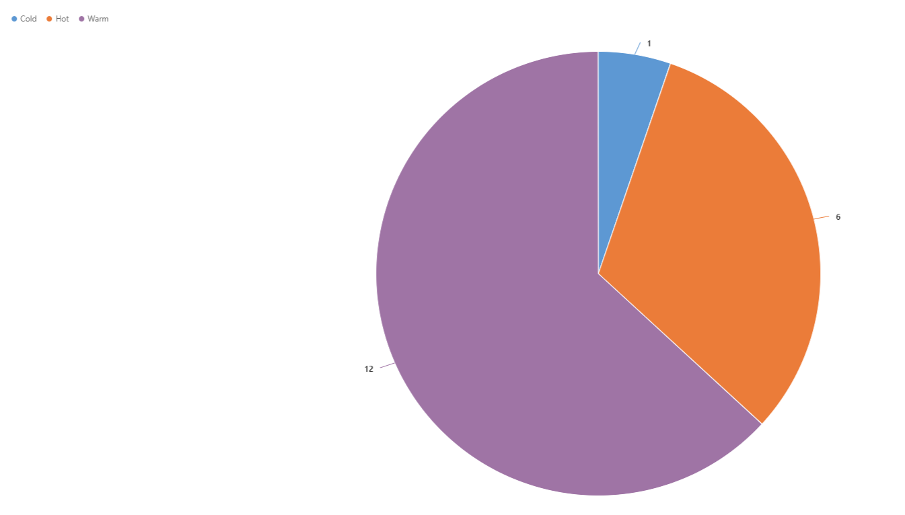

# Sample charts

This article contains sample charts along with the respective data description and presentation XML strings. You can specify the:  
  
-  *Data description XML string* for a chart using the `SavedQueryVisualization.DataDescription` or `UserQueryVisualization.DataDescription` for the organization-owned or user-owned chart respectively.  
  
-   *Presentation description XML string* for a chart using the `SavedQueryVisualization.PresentationDescription` or `UserQueryVisualization. PresentationDescription` for the organization-owned or user-owned chart respectively.  
  
<a name="ColumnChart"></a>   

## Column chart  

The following is a column chart that shows the account by industry. We modified the presentation description of the existing Account By Industry default chart available in model-driven apps for the `Account` table to change it to a column chart.  

[!INCLUDE[cc-terminology](../data-platform/includes/cc-terminology.md)]

> [!div class="mx-imgBorder"]
>   
  
### Data description  

The following is the contents of the data description XML string for this chart.  
  
```xml  
<datadefinition>
  <fetchcollection>
    <fetch mapping="logical" aggregate="true">
        <entity name="account">
          <attribute groupby="true" alias="groupby_column" name="industrycode" />
          <attribute alias="aggregate_column" name="name" aggregate="count" />
        </entity>
    </fetch>
  </fetchcollection>
  <categorycollection>
    <category>
      <measurecollection>
        <measure alias="aggregate_column" />
      </measurecollection>
    </category>
  </categorycollection>
  </datadefinition>  
```  
  
### Presentation description  

The following is the contents of the presentation description XML string for this chart.  
  
```xml  
 <Chart>
   <Series>
     <Series ChartType="Column" IsValueShownAsLabel="True" Color="91, 151, 213" BackSecondaryColor="112, 142, 50" Font="{0}, 9.5px" LabelForeColor="59, 59, 59" CustomProperties="PointWidth=0.75, MaxPixelPointWidth=40">
        <SmartLabelStyle Enabled="True" />
      </Series>
    </Series>
    <ChartAreas>
      <ChartArea BorderColor="White" BorderDashStyle="Solid">
        <AxisY LabelAutoFitMinFontSize="8" TitleForeColor="59, 59, 59" TitleFont="{0}, 10.5px" LineColor="165, 172, 181" IsReversed="False">
          <MajorGrid LineColor="239, 242, 246" />
          <LabelStyle Font="{0}, 10.5px" ForeColor="59, 59, 59" />
        </AxisY>
        <AxisX LabelAutoFitMinFontSize="8" TitleForeColor="59, 59, 59" TitleFont="{0}, 10.5px" LineColor="165, 172, 181" IsReversed="False">
          <MajorGrid Enabled="False" />
          <MajorTickMark Enabled="False" />
          <LabelStyle Font="{0}, 10.5px" ForeColor="59, 59, 59" />
        </AxisX>
       </ChartArea>
     </ChartAreas>
      <Titles>
        <Title Name="Chart Title" DockingOffset="-3" Font="{0}, 13px" ForeColor="59, 59, 59" Alignment="TopLeft" />
      </Titles>
  </Chart>
```  
  
<a name="BarChart"></a>   

## Bar chart  

 The following is a bar chart that shows the top 10 customers. This is one of the default charts available in model-driven apps for the `Opportunity` table.  

> [!div class="mx-imgBorder"]
>   
  
### Data description  

The following is the contents of the data description XML string for this chart.  
  
```xml  
<datadefinition>
  <fetchcollection>
    <fetch mapping="logical" count="10" aggregate="true">
      <entity name="opportunity">
        <attribute name="estimatedvalue" aggregate="sum" alias="sum_estimatedvalue" />
        <attribute name="customerid" groupby="true" alias="customerid" />
        <order alias="sum_estimatedvalue" descending="true" />
      </entity>
    </fetch>
   </fetchcollection>
<categorycollection>
  <category>
    <measurecollection>
      <measure alias="sum_estimatedvalue" />
    </measurecollection>
  </category>
</categorycollection>
</datadefinition> 
```  
  
### Presentation description  

The following is the contents of the presentation description XML string for this chart.  
  
```xml  
<Chart>
  <Series>
    <Series ChartType="Bar" IsValueShownAsLabel="False" Color="91, 151, 213" BackSecondaryColor="112, 142, 50" Font="{0}, 9.5px" LabelForeColor="59, 59, 59" CustomProperties="PointWidth=0.75, MaxPixelPointWidth=40">
      <SmartLabelStyle Enabled="True" />
    </Series>
   </Series>
<ChartAreas>
  <ChartArea BorderColor="White" BorderDashStyle="Solid">
    <AxisY LabelAutoFitMinFontSize="8" TitleForeColor="59, 59, 59" TitleFont="{0}, 10.5px" LineColor="165, 172, 181" IsReversed="False">
      <MajorGrid LineColor="239, 242, 246" />
      <LabelStyle Font="{0}, 10.5px" ForeColor="59, 59, 59" />
    </AxisY>
<AxisX LabelAutoFitMinFontSize="8" TitleForeColor="59, 59, 59" TitleFont="{0}, 10.5px" LineColor="165, 172, 181" IsReversed="False">
  <MajorGrid Enabled="False" />
  <MajorTickMark Enabled="False" />
  <LabelStyle Font="{0}, 10.5px" ForeColor="59, 59, 59" />
</AxisX>
</ChartArea>
</ChartAreas>
<Titles>
  <Title DockingOffset="-3" Font="{0}, 13px" ForeColor="59, 59, 59" Alignment="TopLeft" />
</Titles>
</Chart>
```  
  
<a name="AreaChart"></a> 
  
## Area chart  

The following is an area chart that shows the number of records generated between a given date range.  

> [!div class="mx-imgBorder"]
>   
  
### Data Description 
 
 The following is the contents of the data description XML string for this chart.  
  
```xml
<datadefinition>
  <fetchcollection>
    <fetch mapping="logical" aggregate="true">
      <entity name="incident"><order alias="groupby_column" descending="false" />
      <attribute alias="aggregate_column" name="incidentid" aggregate="count" />
      <attribute groupby="true" alias="groupby_column" dategrouping="day" name="createdon" />
      <attribute groupby="true" alias="groupby_priority" name="prioritycode" />
      </entity>
     </fetch>
    </fetchcollection>
<categorycollection>
  <category>
    <measurecollection>
      <measure alias="aggregate_column" />
    </measurecollection>
   </category>
</categorycollection>
</datadefinition>  
```  
  
### Presentation description  

The following is the contents of the presentation description XML for this chart.  
  
```xml
<Chart Palette="None" PaletteCustomColors="91,151,213; 237,125,49; 160,116,166; 255,192,0; 68,114,196; 112,173,71; 37,94,145; 158,72,14; 117,55,125; 153,115,0; 38,68,120; 67,104,43; 124,175,221; 241,151,90; 186,144,192; 255,205,51; 105,142,208; 140,193,104; 50,125,194; 210,96,18; 150,83,159; 204,154,0; 51,90,161; 90,138,57;">
  <Series>
    <Series ChartType="StackedColumn" Font="{0}, 9.5px" LabelForeColor="59, 59, 59" CustomProperties="PointWidth=0.75, MaxPixelPointWidth=40" />
</Series>
<ChartAreas>
  <ChartArea BorderColor="White" BorderDashStyle="Solid">
    <AxisY LabelAutoFitMinFontSize="8" TitleForeColor="59, 59, 59" TitleFont="{0}, 10.5px" LineColor="165, 172, 181" IntervalAutoMode="VariableCount">
      <MajorGrid LineColor="239, 242, 246" /><MajorTickMark LineColor="165, 172, 181" />
      <LabelStyle Font="{0}, 10.5px" ForeColor="59, 59, 59" />
    </AxisY>
<AxisX LabelAutoFitMinFontSize="8" TitleForeColor="59, 59, 59" TitleFont="{0}, 10.5px" LineColor="165, 172, 181" IntervalAutoMode="VariableCount">
  <MajorGrid Enabled="False" /><MajorTickMark Enabled="False" />
  <LabelStyle Font="{0}, 10.5px" ForeColor="59, 59, 59" />
</AxisX>
</ChartArea>
</ChartAreas>
<Titles>
  <Title Alignment="TopLeft" DockingOffset="-3" Font="{0}, 13px" ForeColor="0, 0, 0" />
</Titles>
</Chart> 
```  
  
<a name="LineChart"></a>

## Line chart  

The following is a line chart that shows the number of leads generated in the last five months. This is one of the default charts available in model-driven apps for the `Lead` table. 

> [!div class="mx-imgBorder"]
> 
  
### Data Description 
 
The following is the contents of the data description XML string for this chart.  
  
```xml  
<datadefinition>
  <fetchcollection>
    <fetch mapping="logical" count="5" aggregate="true">
      <entity name="lead">
        <attribute name="leadid" aggregate="countcolumn" alias="count_leadid" />
        <attribute name="createdon" groupby="true" dategrouping="month" usertimezone="false" alias="createdon" />
        <order alias="createdon" descending="false" />
      </entity>
    </fetch>
  </fetchcollection>
<categorycollection>
  <category>
    <measurecollection>
      <measure alias="count_leadid" />
    </measurecollection>
  </category>
 </categorycollection>
</datadefinition> 
```  
  
### Presentation description  

The following is the contents of the presentation description XML string for this chart.  
  
```xml  
<Chart>
  <Series>
    <Series IsValueShownAsLabel="True" BorderWidth="3" ChartType="Line" Color="49, 171, 204" MarkerStyle="Square" MarkerSize="9" MarkerColor="37, 128, 153" />
 </Series>
<ChartAreas>
  <ChartArea BorderColor="White">
    <AxisY LabelAutoFitMinFontSize="8" TitleForeColor="59, 59, 59" TitleFont="{0}, 10.5px" LineColor="165, 172, 181">
      <MajorGrid LineColor="239, 242, 230" /><MajorTickMark LineColor="165, 172, 181" />
      <LabelStyle Font="{0}, 10.5px" ForeColor="59, 59, 59" />
   </AxisY>
<AxisX LabelAutoFitMinFontSize="8" TitleForeColor="59, 59, 59" TitleFont="{0}, 10.5px" LineColor="165, 172, 181">
  <MajorGrid Enabled="False" />
  <LabelStyle Font="{0}, 10.5px" ForeColor="59, 59, 59" />
</AxisX>
</ChartArea>
</ChartAreas>
<Titles>
  <Title DockingOffset="-3" Font="{0}, 13px" ForeColor="59, 59, 59" Alignment="TopLeft" />
</Titles>
</Chart>
```  
  
<a name="PieChart"></a>  
 
## Pie chart  

The following is a pie chart that shows the total number of leads and their importance. This is one of the default charts available in model-driven apps for the `Lead` table.  

> [!div class="mx-imgBorder"]
>   
  
### Data description  

The following is the contents of the data description XML string for this chart.  
  
```xml  
<datadefinition>
  <fetchcollection>
    <fetch mapping="logical" aggregate="true">
      <entity name="lead"><attribute groupby="true" alias="groupby_column" name="leadqualitycode" />
      <attribute alias="aggregate_column" name="fullname" aggregate="count" />
      </entity>
    </fetch>
   </fetchcollection>
<categorycollection>
  <category>
    <measurecollection>
      <measure alias="aggregate_column" />
    </measurecollection>
  </category>
</categorycollection>
</datadefinition>  
```  
  
### Presentation description 
 
The following is the contents of the presentation description XML string for this chart.  
  
```xml  
<Chart Palette="None" PaletteCustomColors="91,151,213; 237,125,49; 160,116,166; 255,192,0; 68,114,196; 112,173,71; 37,94,145; 158,72,14; 117,55,125; 153,115,0; 38,68,120; 67,104,43; 124,175,221; 241,151,90; 186,144,192; 255,205,51; 105,142,208; 140,193,104; 50,125,194; 210,96,18; 150,83,159; 204,154,0; 51,90,161; 90,138,57;">
  <Series>
    <Series ShadowOffset="0" IsValueShownAsLabel="true" Font="{0}, 9.5px" LabelForeColor="59, 59, 59" CustomProperties="PieLabelStyle=Inside, PieDrawingStyle=Default" ChartType="pie">
      <SmartLabelStyle Enabled="True" />
    </Series>
  </Series>
<ChartAreas>
  <ChartArea>
    <Area3DStyle Enable3D="false" />
  </ChartArea>
</ChartAreas>
<Legends>
  <Legend Alignment="Center" LegendStyle="Table" Docking="right" Font="{0}, 11px" ShadowColor="0, 0, 0, 0" ForeColor="59, 59, 59" />
</Legends>
<Titles>
  <Title Alignment="TopLeft" DockingOffset="-3" Font="{0}, 13px" ForeColor="0, 0, 0" />
</Titles>
</Chart>  
```  
  
<a name="FunnelChart"></a>  
 
## Funnel chart  

The following is a funnel chart that shows the sum of estimated revenue in each stage of the sales pipeline. This is one of the default charts available in model-driven apps for the `Opportunity` table.  

> [!div class="mx-imgBorder"]
>   
  
### Data description  

The following is the contents of the data description XML string for this chart.  
  
```xml  
<datadefinition>
  <fetchcollection>
    <fetch mapping="logical" count="10" aggregate="true">
      <entity name="opportunity">
        <attribute name="estimatedvalue" aggregate="sum" alias="sum_estimatedvalue" />
        <attribute name="stepname" groupby="true" alias="stepname" />
        <order alias="stepname" descending="false" />
      </entity>
     </fetch>
   </fetchcollection>
   <categorycollection>
     <category>
       <measurecollection>
         <measure alias="sum_estimatedvalue" />
       </measurecollection>
     </category>
   </categorycollection>
</datadefinition> 
```  
  
### Presentation description  

The following is the contents of the presentation description XML string for this chart.  
  
```xml  
<Chart Palette="None" PaletteCustomColors="91,151,213; 237,125,49; 160,116,166; 255,192,0; 68,114,196; 112,173,71; 37,94,145; 158,72,14; 117,55,125; 153,115,0; 38,68,120; 67,104,43; 124,175,221; 241,151,90; 186,144,192; 255,205,51; 105,142,208; 140,193,104; 50,125,194; 210,96,18; 150,83,159; 204,154,0; 51,90,161; 90,138,57;">
  <Series>
    <Series ShadowOffset="0" IsValueShownAsLabel="true" Font="{0}, 9.5px" LabelForeColor="59, 59, 59" ChartType="Funnel" CustomProperties="FunnelLabelStyle=Outside, FunnelNeckHeight=0, FunnelPointGap=1, FunnelNeckWidth=5">
      <SmartLabelStyle Enabled="True" />
    </Series>
  </Series>
 <ChartAreas>
   <ChartArea>
     <Area3DStyle Enable3D="false" />
   </ChartArea>
 </ChartAreas>
 <Legends>
   <Legend Alignment="Center" LegendStyle="Table" Docking="right" Font="{0}, 11px" ShadowColor="0, 0, 0, 0" ForeColor="59, 59, 59" />
 </Legends>
 <Titles>
   <Title Alignment="TopLeft" DockingOffset="-3" Font="Segeo UI, 13px" ForeColor="0, 0, 0" />
 </Titles>
</Chart>
```  
  
<a name="MultiSeriesChart"></a> 
  
## Multi-Series chart  

The following is a multi-series chart that shows the estimated vs. actual revenue closed by month. You can use the chart designer in model-driven apps or methods described in the developer documentation to create these types of charts.  
  
A multi-series chart has multiple `<measurecollection>` elements in the data description, each mapping to the corresponding `<Series>` element in the presentation description XML string.  
  
A multi-series chart has multiple `<Series>` elements in the presentation description; the number of `<Series>` elements is the same as the number of `<measurecollection>` elements in the data description XML string.  

> [!div class="mx-imgBorder"]
>   
  
### Data description  

 The following is the contents of the data description XML string for this chart.  
  
```xml  
<datadefinition>
  <fetchcollection>
    <fetch mapping="logical" aggregate="true">
      <entity name="opportunity">
        <attribute name="estimatedvalue" aggregate="sum" alias="estvalue" />
        <attribute name="actualvalue" aggregate="sum" alias="actvalue" />
        <attribute name="actualclosedate" groupby="true" alias="actclosedate" dategrouping="month" />
       </entity>
     </fetch>
    </fetchcollection>
    <categorycollection>
      <category>
        <measurecollection>
          <measure alias="estvalue" />
        </measurecollection>
        <measurecollection>
          <measure alias="actvalue" />
         </measurecollection>
       </category>
     </categorycollection>
</datadefinition>  
```  
  
### Presentation description  

The following is the contents of the presentation description XML string for this chart.  
  
```xml  
<Chart>
  <Series>
    <Series Color="91, 151, 213" BackSecondaryColor="74,107,155" Font="{0}, 9.5px" LabelForeColor="59, 59, 59" CustomProperties="PointWidth=0.75, MaxPixelPointWidth=40">
      <SmartLabelStyle Enabled="True" />
      <Points />
     </Series>
    <Series Color="237, 125, 49" BackSecondaryColor="126,153,79" Font="{0}, 9.5px" LabelForeColor="59, 59, 59" CustomProperties="PointWidth=0.75, MaxPixelPointWidth=40">
      <SmartLabelStyle Enabled="True" />
      <Points />
    </Series>
  </Series>
  <ChartAreas>
    <ChartArea BorderColor="White" BorderDashStyle="Solid">
      <AxisY LabelAutoFitMinFontSize="8" TitleForeColor="59, 59, 59" TitleFont="{0}, 10.5px" LineColor="165, 172, 181">
        <MajorGrid LineColor="239, 242, 246" />
        <MajorTickMark LineColor="165, 172, 181" />
        <LabelStyle Font="{0}, 10.5px" ForeColor="59, 59, 59" />
      </AxisY>
      <AxisX LabelAutoFitMinFontSize="8" TitleForeColor="59, 59, 59" TitleFont="{0}, 10.5px" LineColor="165, 172, 181">
        <MajorGrid Enabled="False" />
        <MajorTickMark Enabled="False" />
        <LabelStyle Font="{0}, 10.5px" ForeColor="59, 59, 59" />
      </AxisX>
     </ChartArea>
    </ChartAreas>
    <Legends>
      <Legend Alignment="Center" LegendStyle="Table" Docking="Bottom" Font="{0}, 11px" ShadowColor="0, 0, 0, 0" ForeColor="59,59,59" />
    </Legends>
    <Titles>
      <Title Alignment="TopLeft" DockingOffset="-3" Font="{0}, 13px" ForeColor="59, 59, 59" />
    </Titles>
      <BorderSkin PageColor="Control" BackColor="CornflowerBlue" BackSecondaryColor="CornflowerBlue" />
</Chart>  
```  
  
<a name="ComparisonChart"></a>   

## Comparison chart (Stacked Chart)
  
The following is a comparison chart that shows the number of activities by type and priority. You can use the chart designer in model-driven apps or methods described in the developer documentation to create these types of charts.  
  
A comparison chart has two `groupby` clauses in the data description XML.  

> [!div class="mx-imgBorder"]
>   
  
### Data description  
 The following is the contents of the data description XML string for this chart.  
  
```xml  
<datadefinition>
  <fetchcollection>
    <fetch mapping="logical" aggregate="true">
      <entity name="activitypointer">
        <attribute alias="aggregate_column" name="subject" aggregate="count" />
        <attribute groupby="true" alias="groupby_column" name="activitytypecode" />
        <attribute groupby="true" alias="groupby_priority" name="prioritycode" />
       </entity>
    </fetch>
  </fetchcollection>
  <categorycollection>
      category>
        <measurecollection>
          <measure alias="aggregate_column" />
        </measurecollection>
      </category>
  </categorycollection>
</datadefinition>
  
```  
  
### Presentation description  
 The following is the contents of the presentation description XML string for this chart.  
  
```xml  
<Chart Palette="None" PaletteCustomColors="91,151,213; 237,125,49; 160,116,166; 255,192,0; 68,114,196; 112,173,71; 37,94,145; 158,72,14; 117,55,125; 153,115,0; 38,68,120; 67,104,43; 124,175,221; 241,151,90; 186,144,192; 255,205,51; 105,142,208; 140,193,104; 50,125,194; 210,96,18; 150,83,159; 204,154,0; 51,90,161; 90,138,57;">
  <Series>
    <Series ChartType="StackedColumn" Font="{0}, 9.5px" LabelForeColor="59, 59, 59" CustomProperties="PointWidth=0.75, MaxPixelPointWidth=40">
    </Series>
  </Series>
  <ChartAreas>
    <ChartArea BorderColor="White" BorderDashStyle="Solid">
      <AxisY LabelAutoFitMinFontSize="8" TitleForeColor="59, 59, 59" TitleFont="{0}, 10.5px" LineColor="165, 172, 181" IntervalAutoMode="VariableCount">
        <MajorGrid LineColor="239, 242, 246" />
        <MajorTickMark LineColor="165, 172, 181" />
        <LabelStyle Font="{0}, 10.5px" ForeColor="59, 59, 59" />
      </AxisY>
      <AxisX LabelAutoFitMinFontSize="8" TitleForeColor="59, 59, 59" TitleFont="{0}, 10.5px" LineColor="165, 172, 181" IntervalAutoMode="VariableCount">
        <MajorGrid Enabled="False" />
        <MajorTickMark Enabled="False" />
        <LabelStyle Font="{0}, 10.5px" ForeColor="59, 59, 59" />
      </AxisX>
    </ChartArea>
   </ChartAreas>
   <Legends>
     <Legend Alignment="Center" LegendStyle="Table" Docking="Bottom" Font="{0}, 11px" ShadowColor="0, 0, 0, 0" ForeColor="59,59,59">
     </Legend>
   </Legends>
   <Titles>
     <Title Alignment="TopLeft" DockingOffset="-3" Font="{0}, 13px" ForeColor="59, 59, 59">
     </Title>
   </Titles>
</Chart>  
```  
  
<a name="StackedChart"></a>   

## Comparison chart (100% Stacked Chart)  

 The following is a comparison chart that shows the number of cases opened on any date, grouped by priority. You can use the chart designer in model-driven apps or methods available in the Web Services to create these types of charts.  
  
 A comparison chart has two `groupby` clauses in the data description XML.  

> [!div class="mx-imgBorder"]
>   
  
### Data description  
 The following is the contents of the data description XML string for this chart.  
  
```xml  
<datadefinition>  
      <fetchcollection>  
        <fetch mapping="logical" aggregate="true">  
          <entity name="incident">  
            <order alias="groupby_column" descending="false" />  
            <attribute alias="aggregate_column" name="incidentid" aggregate="count" />  
            <attribute groupby="true" alias="groupby_column" dategrouping="day" name="createdon" />  
            <attribute groupby="true" alias="groupby_priority" name="prioritycode" />  
          </entity>  
        </fetch>  
      </fetchcollection>  
      <categorycollection>  
        <category>  
          <measurecollection>  
            <measure alias="aggregate_column" />  
          </measurecollection>  
        </category>  
      </categorycollection>  
    </datadefinition>  
  
```  
  
### Presentation description  
 The following is the contents of the presentation description XML string for this chart.  
  
```xml  
<Chart Palette="None" PaletteCustomColors="149,189,66; 197,56,52; 55,118,193; 117,82,160; 49,171,204; 255,136,35; 168,203,104; 209,98,96; 97,142,206; 142,116,178; 93,186,215; 255,155,83">  
      <Series>  
        <Series ChartType="StackedBar100" Font="{0}, 9.5px" LabelForeColor="59, 59, 59" CustomProperties="PointWidth=0.75, MaxPixelPointWidth=40">  
          <SmartLabelStyle Enabled="True" />  
        </Series>  
      </Series>  
      <ChartAreas>  
        <ChartArea BorderColor="White" BorderDashStyle="Solid">  
          <AxisY LabelAutoFitMinFontSize="8" TitleForeColor="59, 59, 59" TitleFont="{0}, 10.5px" LineColor="165, 172, 181" IntervalAutoMode="VariableCount">  
            <MajorGrid LineColor="239, 242, 246" />  
            <MajorTickMark LineColor="165, 172, 181" />  
            <LabelStyle Font="{0}, 10.5px" ForeColor="59, 59, 59" />  
          </AxisY>  
          <AxisX LabelAutoFitMinFontSize="8" TitleForeColor="59, 59, 59" TitleFont="{0}, 10.5px" LineColor="165, 172, 181" IntervalAutoMode="VariableCount">  
            <MajorGrid Enabled="False" />  
            <MajorTickMark Enabled="False" />  
            <LabelStyle Font="{0}, 10.5px" ForeColor="59, 59, 59" />  
          </AxisX>  
        </ChartArea>  
      </ChartAreas>  
      <Titles>  
        <Title Alignment="TopLeft" DockingOffset="-3" Font="{0}, 13px" ForeColor="0, 0, 0" />  
      </Titles>  
    </Chart>  
```  
  
### See also  

 [Data visualization and analytics](customize-visualizations-dashboards.md)   
 [Visualization data description schema](visualization-data-description-schema.md)   
 [Create a chart](create-visualization-chart.md)   
 [View data with visualizations (charts)](view-data-with-visualizations-charts.md)   
 


[!INCLUDE[footer-include](../../includes/footer-banner.md)]