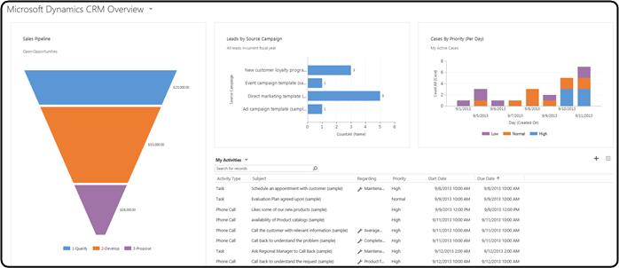

# Sample dashboards

This topic contains sample dashboards along with the respective FormXML strings. You can specify the FormXML string for a dashboard using the `SystemForm.FormXml`  for an organization-owned dashboard or `UserForm.FormXml` for a user-owned dashboard.  

[!INCLUDE[cc-terminology](../data-platform/includes/cc-terminology.md)]
  
<a name="Sample1"></a>   
## Dashboard with charts and grids  
 The following is a sample dashboard that has four components: three charts and a grid. This is one of the default organization-owned dashboards,  available in model-driven apps.  
  
   
  
### FormXML
  
 The following sample shows the FormXML for this dashboard.  
  
```xml  
<form>  
 <tabs>  
  <tab showlabel="true"  
       verticallayout="true"  
       id="{4e5d00ec-6b2a-447a-afdf-235e6c5d4599}"  
       name="{4e5d00ec-6b2a-447a-afdf-235e6c5d4599}"  
       locklevel="0"  
       expanded="true">  
   <columns>  
    <column width="100%">  
     <sections>  
      <section showlabel="false"  
               showbar="false"  
               columns="111"  
               id="{7f7bbdb7-15d6-4664-bda7-6060d0cd3105}"  
               name="{7f7bbdb7-15d6-4664-bda7-6060d0cd3105}">  
       <rows>  
        <row>  
         <cell colspan="1"  
               rowspan="12"  
               showlabel="false"  
               id="{cfa8b70b-b0f0-4b91-9cf3-c4e29925186f}"  
               auto="false">  
          <control id="Chart1"  
                   classid="{E7A81278-8635-4d9e-8D4D-59480B391C5B}">  
           <parameters>  
            <TargetEntityType>opportunity</TargetEntityType>  
            <ChartGridMode>Chart</ChartGridMode>  
            <EnableQuickFind>true</EnableQuickFind>  
            <EnableViewPicker>false</EnableViewPicker>  
            <EnableJumpBar>true</EnableJumpBar>  
            <RecordsPerPage>12</RecordsPerPage>  
            <ViewId>{00000000-0000-0000-00AA-000010003001}</ViewId>  
            <IsUserView>false</IsUserView>  
            <ViewIds></ViewIds>  
            <AutoExpand>Fixed</AutoExpand>  
            <VisualizationId>{87293554-2482-DE11-9FF3-00155DA3B012}</VisualizationId>  
            <IsUserChart>false</IsUserChart>  
            <EnableChartPicker>false</EnableChartPicker>  
            <RelationshipName></RelationshipName>  
           </parameters>  
          </control>  
         </cell>  
         <cell colspan="1"  
               rowspan="12"  
               showlabel="false"  
               id="{5fc07b79-9f15-4396-9a66-c8ca4a13cac3}"  
               auto="false">  
          <control id="Chart2"  
                   classid="{E7A81278-8635-4d9e-8D4D-59480B391C5B}">  
           <parameters>  
            <TargetEntityType>lead</TargetEntityType>  
            <ChartGridMode>Chart</ChartGridMode>  
            <EnableQuickFind>true</EnableQuickFind>  
            <EnableViewPicker>false</EnableViewPicker>  
            <EnableJumpBar>true</EnableJumpBar>  
            <RecordsPerPage>12</RecordsPerPage>  
            <ViewId>{5A926B99-3A5F-DF11-AE90-00155D2E3002}</ViewId>  
            <IsUserView>false</IsUserView>  
            <ViewIds></ViewIds>  
            <AutoExpand>Fixed</AutoExpand>  
            <VisualizationId>{3ED18B7C-5693-DE11-97D4-00155DA3B01E}</VisualizationId>  
            <IsUserChart>false</IsUserChart>  
            <EnableChartPicker>false</EnableChartPicker>  
            <RelationshipName></RelationshipName>  
           </parameters>  
          </control>  
         </cell>  
         <cell colspan="1"  
               rowspan="12"  
               showlabel="false"  
               id="{378521f2-889b-4e56-ae46-0b69e87dd0b8}"  
               auto="false">  
          <control id="Chart3"  
                   classid="{E7A81278-8635-4d9e-8D4D-59480B391C5B}">  
           <parameters>  
            <TargetEntityType>incident</TargetEntityType>  
            <ChartGridMode>Chart</ChartGridMode>  
            <EnableQuickFind>true</EnableQuickFind>  
            <EnableViewPicker>false</EnableViewPicker>  
            <EnableJumpBar>true</EnableJumpBar>  
            <RecordsPerPage>12</RecordsPerPage>  
            <ViewId>{00000000-0000-0000-00AA-000010001032}</ViewId>  
            <IsUserView>false</IsUserView>  
            <ViewIds></ViewIds>  
            <AutoExpand>Fixed</AutoExpand>  
            <VisualizationId>{DF31B045-1D63-DF11-AE90-00155D2E3002}</VisualizationId>  
            <IsUserChart>false</IsUserChart>  
            <EnableChartPicker>false</EnableChartPicker>  
            <RelationshipName></RelationshipName>  
           </parameters>  
          </control>  
         </cell>  
        </row>  
        <row></row>  
        <row></row>  
        <row></row>  
        <row></row>  
        <row></row>  
        <row></row>  
        <row></row>  
        <row></row>  
        <row></row>  
        <row></row>  
        <row></row>  
       </rows>  
      </section>  
     </sections>  
    </column>  
   </columns>  
  </tab>  
  <tab showlabel="true"  
       verticallayout="true"  
       id="{3fb82356-c884-44b6-b11e-d3292776dfb8}"  
       name="{3fb82356-c884-44b6-b11e-d3292776dfb8}"  
       locklevel="0"  
       expanded="true">  
   <columns>  
    <column width="100%">  
     <sections>  
      <section showlabel="false"  
               showbar="false"  
               columns="111"  
               id="{02aab82b-167e-4f61-8d10-9b5a3fab3d76}"  
               name="{02aab82b-167e-4f61-8d10-9b5a3fab3d76}">  
       <rows>  
        <row>  
         <cell colspan="3"  
               rowspan="12"  
               showlabel="false"  
               id="{f0114d8b-f5c9-41b2-9b59-07ff839ef176}"  
               auto="false">  
          <control id="Grid1"  
                   classid="{E7A81278-8635-4d9e-8D4D-59480B391C5B}">  
           <parameters>  
            <TargetEntityType>activitypointer</TargetEntityType>  
            <ChartGridMode>All</ChartGridMode>  
            <EnableQuickFind>false</EnableQuickFind>  
            <EnableViewPicker>true</EnableViewPicker>  
            <EnableJumpBar>true</EnableJumpBar>  
            <RecordsPerPage>8</RecordsPerPage>  
            <ViewId>{00000000-0000-0000-00AA-000010001899}</ViewId>  
            <IsUserView>false</IsUserView>  
            <ViewIds></ViewIds>  
            <AutoExpand>Fixed</AutoExpand>  
            <VisualizationId>{EDF35649-5293-DE11-97D4-00155DA3B01E}</VisualizationId>  
            <IsUserChart>false</IsUserChart>  
            <EnableChartPicker>false</EnableChartPicker>  
            <RelationshipName></RelationshipName>  
           </parameters>  
          </control>  
         </cell>  
        </row>  
        <row></row>  
        <row></row>  
        <row></row>  
        <row></row>  
        <row></row>  
        <row></row>  
        <row></row>  
        <row></row>  
        <row></row>  
        <row></row>  
        <row></row>  
       </rows>  
      </section>  
     </sections>  
    </column>  
   </columns>  
  </tab>  
 </tabs>  
</form>  
```  
  
### See also  
[Dashboards](analyze-data-with-dashboards.md)   
 


[!INCLUDE[footer-include](../../includes/footer-banner.md)]