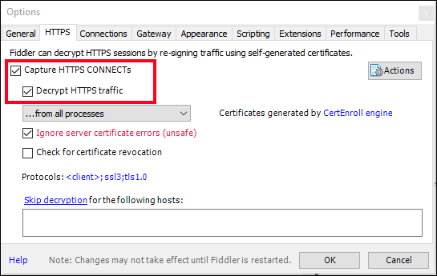
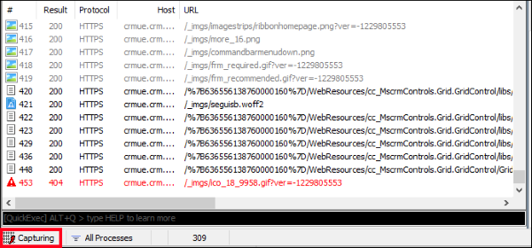
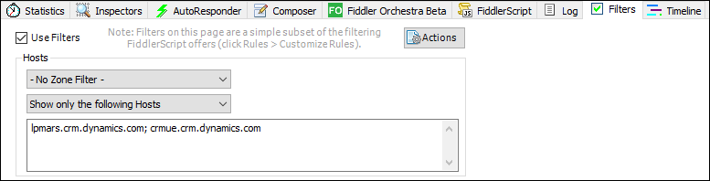
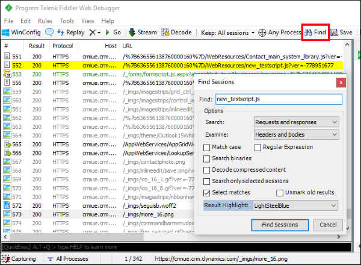
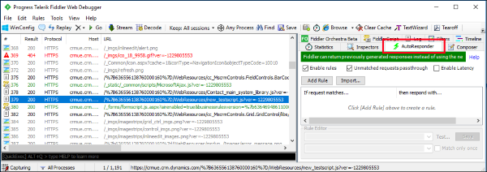
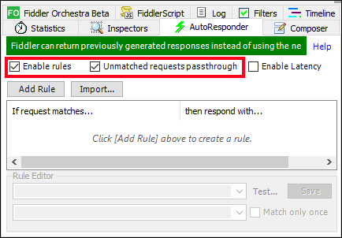
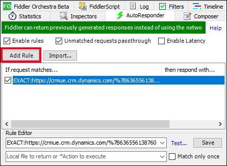

# Script web resource development using Fiddler AutoResponder

While developing and debugging JavaScript web resources, you can use AutoResponder in [Telerik Fiddler](https://www.telerik.com/fiddler) to replace the content of a web resource with content from a local file rather than uploading it in your Model-driven Apps instance and publishing each time. Use the following steps below to setup AutoResponder in Fiddler.

## Install and configure Fiddler

1. [Download](https://www.telerik.com/download/fiddler) and install Fiddler.
1. Open Fiddler and from the menu bar, go to **Tools**, and then select **Options**.
2. Select the **HTTPS** tab in the dialog box and check the **Capture HTTPS CONNECTS** and **Decrypt HTTPS traffic** checkboxes so that the HTTPS traffic is captured and then decrypted.<br />
 </br>
3. Click **OK** to close the dialog box.

> [!NOTE]
> If it is the first time you are enabling this setting, Fiddler will prompt you to install a certificate. Install the certificate and restart Fiddler so that the new settings take effect.<br />
> If you have run Fiddler in the past and get a `NET::ERR_CERT_AUTHORITY_INVALID` error, in the **HTTPS** tab, click the **Actions** button and choose **Reset All Certificates**. This will also present a number of prompts for the new certificates to be installed.

## Configure AutoResponder

1. Open the page in your Dynamics 365 instance that you want to debug.
2. Start the Fiddler trace capture by clicking the **Capturing** button in the bottom left corner.
   </br>

   > [!NOTE]
   > If you want to capture HTTPS traffic only from a particular host, on the **Filters** tab, in the **Hosts** area, in the **-No Host Filter-** drop-down select **Show only the following Hosts** from the menu and enter the list of domains from which you wish to see traffic, separated by semi-colon. More information: [Filters reference](https://docs.telerik.com/fiddler/KnowledgeBase/Filters).
   > 

3. Perform any operation necessary to load the script you are testing. You can stop the capture by clicking the same **Capturing** button again.
4. Select the trace log sessions from the left pane and search for the file you want to setup the AutoResponder for.<br /> For example, if the code you want to debug is in a JavaScript web resource named `new_testscript.js`, use the **Find** button to open the  **Find Sessions** dialog box and search for the name of the webresource. <br /><br />You will see the rows that match with your search criteria highlighted in the left pane.
5. Select that row. In the right pane, select the **AutoResponder** tab. <br /> 
6. In the **AutoResponder** tab, select the **Enable rules** and **Unmatched requests passthrough** check boxes.<br />
   <br />
7. Ensure that you still have the session related to your target file selected and then click on the **Add Rule** button in the **AutoResponder** section. This adds a new entry into the rules table.<br />
   
8. When the rule is selected, the **Rule Editor** at the bottom has the top row populated with the Session URL related to your file and prefixed with a string like `EXACT:`.<br />
   You can then edit the string to match to simplify it. With web resources, the URL will contain generated values in the URL or in a query string to make sure that the latest published version is included in the response. You will probably see the `EXACT` value will look something like this:<br />
    ```
    EXACT:https://<org URL>/%7B636556138760000160%7D/WebResources/new_testscript.js?    ver=-1229805553
    ```<br />
    You can simplify this to remove the generated values and use this instead:<br />
    ```
    /WebResources/new_testscript.js
    ```<br />
   The bottom row is left blank. Type the path to your local file on your disk on this bottom row and <strong>Save</strong>.<br />
   <br />


By following the above steps, Fiddler is configured to listen to the requests and responds with the local file instead of passing the request over the network.

## Update and test your code

1. Apply changes to your local file.
2. Start Fiddler trace capture again and go back to your browser and hard reload the page with empty cache.
3. In the browser developer tools you can see that the file that is now received will be the local one.
4. Continue repeating this process while updating your code until you get the results you require.


## See Also

[Web resources](web-resources.md)<br />
[Client scripting using JavaScript](client-scripting.md)


[!INCLUDE[footer-include](../../includes/footer-banner.md)]