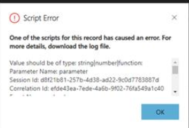
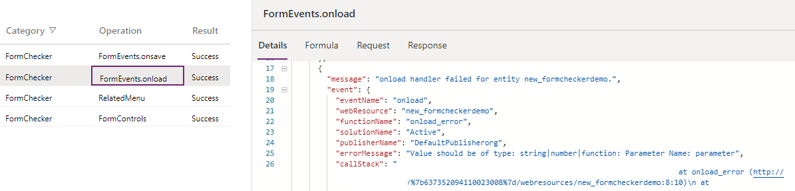

# Troubleshoot form issues in model-driven apps

Troubleshooting issues in Unified Interface is important when you're working with forms and trying to fix issues that occur when loading a form, running a script, working with events, or saving data.

This article helps you fix some common issues that you might encounter while working with model-driven app forms.

> [!IMPORTANT]
> - The workarounds described in this article are only designed for troubleshooting purposes; they aren't meant to be used in production scenarios. 
> - These workarounds affect the current user session unless otherwise noted (for example, when a browser tab accesses the model-driven app). They don't change system customizations or affect any other users or sessions. After the current session is closed, the effect is no longer applied.
> - Most of the workarounds are available in most production environments. Some of the workarounds mentioned in the guide might not have been deployed to your organization yet; new workarounds are added periodically.
> - The tools listed in this article can be used independently to troubleshoot different categories of issues.

## Use URL parameters to disable various form components

When you're troubleshooting issues with forms, you need to use URL parameters to disable components as you work to isolate the problem to a specific component. We recommend that you use the flags one at a time to narrow down the cause of the issue. You can use the following URL parameters:

- DisableFormCommandbar

- DisableFormHandlers

- DisableFormLibraries

- DisableWebResourceControls

- DisableFormControl

- DisableBusinessProcessFlow

- navbar (this isn't a **flag** parameter; instead, use **navbar=off** in the URL)

The following examples show how to use these flags.

```Http
https://myorg.crm.dynamics.crm/main.aspx?appid=00000000-0000-0000-0000-000000000000&pagetype=entityrecord&id=00000000-0000-0000-0000-000000000000**&flags=DisableFormHandlers=true
```

You can also add multiple URL parameters separated with a comma (**,**).

```Http
https://myorg.crm.dynamics.crm/main.aspx?appid=00000000-0000-0000-0000-000000000000&pagetype=entityrecord&id=00000000-0000-0000-0000-000000000000**&flags=DisableFormHandlers=true,DisableWebResourceControls=true,DisableFormCommandbar=true,DisableBusinessProcessFlow=true&navbar=off
```

```Http
https://myorg.crm.dynamics.crm/main.aspx?appid=00000000-0000-0000-0000-000000000000&pagetype=entityrecord&id=00000000-0000-0000-0000-000000000000**&flags=DisableFormCommandbar=true
```

## View registered form event handlers and libraries in Monitor

To view registered form event handles and libraries, you can view the `FormEvents` operation in [Monitor](https://docs.microsoft.com/powerapps/maker/model-driven-apps/monitor-form-checker).

> [!div class="mx-imgBorder"]
> 

You'll need the `eventIndex` and `libraryIndex` parameter values when using the **DisableFormHandlers** or **DisableFormLibraries** URL flags. After an event or library is disabled, **disabledByConfigFlag** will be true and you'll also see such events in the actual event handling.

> [!div class="mx-imgBorder"]
> 

## Disable form handlers

When you're troubleshooting issues caused by form handlers, disable the form handlers by using the following URL flags:

- **&flags=DisableFormHandlers=\<event name\>**: Disables the form handlers by specifying the event name, for example, **DisableFormHandlers=OnLoad**. If you use the **DisableFormHandlers=true** flag, it disables the following event handlers: [OnLoad](https://docs.microsoft.com/powerapps/developer/model-driven-apps/clientapi/reference/events/form-onload), [OnSave](https://docs.microsoft.com/powerapps/developer/model-driven-apps/clientapi/reference/events/form-onsave), business rule, [OnChange](https://docs.microsoft.com/powerapps/developer/model-driven-apps/clientapi/reference/events/attribute-onchange), and [TabStateChange](https://docs.microsoft.com/powerapps/developer/model-driven-apps/clientapi/reference/events/tabstatechange).

- **&flags=DisableFormHandlers=\<event name\>_\<event index\>**: Disables the form handlers by specifying the event name and the event index value. For example, **DisableFormHandlers=true_0** disables the form handler at index 0. **DisableFormHandlers=onload_2** flag disables the form handler at index 2 of the [OnLoad](https://docs.microsoft.com/powerapps/developer/model-driven-apps/clientapi/reference/events/form-onload) event.

- **&flags=DisableFormHandlers=\<event name\>\<starting index\>\<end index\>**: Disables all the form handlers by specifying the event name and the given index range. For example, **DisableFormHandlers=true_0_2** disables the form handlers at indexes from 0 through 2. **DisableFormHandlers=onload_2_5** flag disables the [OnLoad](https://docs.microsoft.com/powerapps/developer/model-driven-apps/clientapi/reference/events/form-onload) handlers at indexes from 2 through 5.

## Disabling form libraries

When you're troubleshooting issues caused by form libraries, disable the form libraries by using the following URL flags:

- **&flags=DisableFormLibraries=true**: Disables all form libraries.

- **&flags=DisableFormLibraries=\<library index\>**: Disables form libraries by specifying the library index value. For example, the **DisableFormLibraries=0** flag disables the form library at index 0.

- **&flags=DisableFormLibraries=\<starting index\>_\<ending index\>**: Disables the form libraries by specifying the library index range. For example, **DisableFormLibraries=0_2** flag disables the form libraries at indexes from 0 through 2.

### Difference between DisableFormHandlers and DisableFormLibraries

The main difference between disabling form libraries and form handlers are:

- The **DisableFormHandlers** flag disables form handlers regardless of the containing form libraries, whereas the **DisableFormLibraries** flag disables the form libraries (web resources) regardless of the functions (event handlers) included in the libraries.

- The **DisableFormHandlers** flag doesn't prevent the containing form library from being loaded, thus it doesn't prevent the JavaScript code that's present in the library&mdash;but not registered as an event handler&mdash;from being executed. For example, if a form library `new_myscript.js` is written in the following way:

  - Assuming the `myOnloadHandler` is registered as an `OnLoad` event handler.
  - The `DisableFormHandlers=true` flag only prevents the second alert, whereas the `DisableFormLibraries=true` flag prevents both alerts.

### Disable web resource controls

When you're troubleshooting issues caused by web resource controls, disable the controls by using the following URL flag:

**&flags=DisableWebResourceControls=true**: Disables all the web resource controls.

> [!div class="mx-imgBorder"]
> 

### Disable controls on a form

When you're troubleshooting issues caused by controls on a form, disable the controls by using the following URL flag:

**&flags=DisableFormControl=true**: Disables all the controls on a form.

> [!NOTE]
> **&flags=DisableFormControl=new_mycontrol** disables a specific control on the form. If the issue is resolved when the **&flags=DisableWebResourceControls=true** flag is used, there might be more than one web resource control on the form. You can use this flag to further identify the control that's causing the issue.

## Disable business process flows

If you're troubleshooting an issue caused by a business process flow, disable the flow on the form by using the following URL flag: **&flags=DisableBusinessProcessFlow=true**.

## Unexpected behaviors when loading a form

Some common issues that can cause unexpected behavior when a model-driven app form is loaded are:

- Fields or controls don't have the values you expect.

- Controls aren't disabled or aren't enabled.

- Controls aren't shown or aren't hidden.

These behaviors occur after the form is opened&mdash;for example, you see a value or control for a second, and then the value changes or the control disappears.

There are multiple reasons why unexpected behaviors occur when a form opens. One of the most common is the [OnLoad](https://docs.microsoft.com/powerapps/developer/model-driven-apps/clientapi/reference/events/form-onload) scripts that run synchronously or asynchronously to change the field or control behavior. To determine whether your script is causing the issue, you can disable the form handlers by appending **&flags=DisableFormHandlers=true** at the end of your app URL.

If the form loads normally after you disable the form handler, there's an issue with the script that's blocking or causing an error when the form is loading.

## Intermittent form errors

The most common cause of intermittent or random form errors is using unsupported [Client API](https://docs.microsoft.com/powerapps/developer/model-driven-apps/clientapi/reference) methods. These errors have the following characteristics:

- They occur only for certain records, users, regions, or browsers, or only during periods when the network load or service load is high.

- They rarely occur on support instances.

- They might occur once on a computer, and the same error might occur again after you clear the browser cache.

- [formContext.getControl](https://docs.microsoft.com/powerapps/developer/model-driven-apps/clientapi/reference/controls/getcontrol) or [formContext.getControl(arg).getAttribute()](https://docs.microsoft.com/powerapps/developer/model-driven-apps/clientapi/reference/controls/getattribute) randomly returns null for a valid control or attribute.

There are many ways to write unsupported Client API methods, and they all share a common pattern: they cause a race condition in the form load pipeline. Because they introduce a race condition, the issue only occurs when the custom script is executed before the form is fully ready to be accessed via the Client API. This can depend on many factors:

- In the JavaScript web resource, code is put into a global scope that's executed immediately when the web resource file is loaded, without waiting for the form to be accessible. Make sure the code is executed inside a valid form handler, such as an [OnLoad](https://docs.microsoft.com/powerapps/developer/model-driven-apps/clientapi/reference/events/form-onload) handler.

- In the Power Apps component framework component script file, Client API methods are accessed inside the [init](https://docs.microsoft.com/powerapps/developer/component-framework/reference/control/init) or [updateView](https://docs.microsoft.com/powerapps/developer/component-framework/reference/control/updateview) function. The `init()` and `updateView()` functions are executed immediately when the component is loaded, without waiting for the form to be readily accessible. You can't use unsupported Client API methods in Power Apps component framework components.

- In the web resource file, the Client API is accessed inside a `window.setTimeout()` function. The page state is unpredictable when the `setTimeout()` method executes the wrapped function&mdash;due to the nature of the timer function&mdash;so when the execution occurs, the page might be in a transitional state (during page load or save) that's not readily accessible by the Client API.

Using [Monitor](https://docs.microsoft.com/powerapps/maker/model-driven-apps/monitor-form-checker), you can access information that helps you determine when the unsupported client access occurred, and when the access occurred at the wrong time due to a race condition.

> [!div class="mx-imgBorder"]
> 

> [!NOTE]
> The call stack has been modified for illustration purposes. The call stack shows details like web resource, function, and the line that's causing the error.

## Save in Progress error message

Sometimes when you save a form, you see a **Save in Progress** error message. This error occurs when the form [OnSave](https://docs.microsoft.com/powerapps/developer/model-driven-apps/clientapi/reference/events/form-onsave) event is triggered before the previous [OnSave](https://docs.microsoft.com/powerapps/developer/model-driven-apps/clientapi/reference/events/form-onsave) event has been completed. This behavior isn't supported, and the error appears by design because calling the `OnSave` event before the previous `OnSave` event is complete will cause recursive save loops with unintended consequences.

A typical cause for this error is the script that calls the `save()` method in the [OnSave](https://docs.microsoft.com/powerapps/developer/model-driven-apps/clientapi/reference/events/form-onsave) event handler. Another possible cause might be concurrent `save()` calls in the `setTimeout()` method, which might cause the error to intermittently show up, depending on whether the prior `save()` call was completed before another `save()` call was made.

**Resolution**:

In [Monitor](https://docs.microsoft.com/powerapps/maker/model-driven-apps/monitor-form-checker) the `FormEvents.onsave` operation provides all the details that are causing the error. The form checker won't be able to detect the error if the issue can't be reproduced.

> [!div class="mx-imgBorder"]
> 

## The form or record isn't saved when you try to save the form

A common cause is an [OnSave](https://docs.microsoft.com/powerapps/developer/model-driven-apps/clientapi/reference/events/form-onsave) event handler that calls the `executionContext.getEventArgs().preventDefault()` method to cancel the save operation.

**Resolution**:

In [Monitor](https://docs.microsoft.com/powerapps/maker/model-driven-apps/monitor-form-checker), the `FormEvents.onsave` operation provides all the details why the save event was canceled, more details than that are available from the form UI itself.

> [!div class="mx-imgBorder"]
> 

## Form script errors

If you see a form script error during the form [OnLoad](https://docs.microsoft.com/powerapps/developer/model-driven-apps/clientapi/reference/events/form-onload), [OnSave](https://docs.microsoft.com/powerapps/developer/model-driven-apps/clientapi/reference/events/form-onsave), [OnChange](https://docs.microsoft.com/powerapps/developer/model-driven-apps/clientapi/reference/events/attribute-onchange), business rule execution, or other events, the error message itself might not contain sufficient information to troubleshoot.

For example, the customer has an `onLoad` event handler as shown below (`onload(controlName)`), and selected the **Pass execution context as first parameter** option in the form designer.

```javascript
function onload(controlName)
{
  formContext.getControl(controlName);
}
```

This causes the form script error because the first parameter for the `OnLoad` function is `executionContext`, but the script incorrectly uses this as the control name for the `getControl()` method. The script throws the error shown in the following image.

> [!div class="mx-imgBorder"]
> 

**Resolution**:

In [Monitor](https://docs.microsoft.com/powerapps/maker/model-driven-apps/monitor-form-checker), the `FormEvent.onload` operation provides all the details including the web resource, function, and the line that's causing the issue.

> [!div class="mx-imgBorder"]
> 

## Form freezes, loads slowly, or throws unexplained errors

There are many possible reasons for a form to freeze, load slowly, or throw a "Web resource method does not exist" script error or an error that isn't a regular script error. Some of the possible reasons include:

- Bad `OnLoad` scripts.

- Web resource controls.

- Ribbon button scripts and rules.

- Synchronous network requests.

- Custom plug-ins.

- Business process flow errors.

**Resolution**:

- Use the **DisableFormCommandbar** flag and refresh the page. If the issue is resolved, it was caused by some command customization. You may find it helpful to use [Command Checker](https://powerapps.microsoft.com/blog/introducing-command-checker-for-model-app-ribbons/) to identify which command is malfunctioning.  

- If the issue persists, use the **DisableFormHandlers=true** flag. If the issue still isn't resolved, you can further identify the exact event handler function that's causing the problem.

- Assuming the form has 10 libraries, and 20 `OnLoad` event handlers, you can use the binary search approach to narrow down the handler index range as described in the following example:

  1. Open [Monitor](https://docs.microsoft.com/powerapps/maker/model-driven-apps/monitor-form-checker) to view the registered form event handlers and libraries to get the list of `OnLoad` event handlers of indexes ranging from 0 through 19 and form libraries of indexes ranging from 0 through 9.

  1. Use the `DisableFormHandlers=onload_0_9` flag. If the issue is resolved, it indicates that the issue is caused by some handlers in the index range from 0 through 9; otherwise, the issue is caused by handlers in the index range from 10 through 19.

  1. Assuming the issue is caused by handlers from index 0 through 9, use the `DisableFormHandlers=onload_0_4 (or true_0_4)` flag to disable handlers for the index range from 0 through 4. Continue doing the same until the range is small enough to loop through each one individually.
  
  1. Assuming the handler index is narrowed down to 3 or 4, use `DisableFormHandlers=onload_3` and then `DisableFormHandlers=onload_4` until you identify the exact handler that's causing the issue.

  1. Assuming the issue is caused by the handler of index 3, read the details for that event handler in<!--note from editor: Edit okay?--> Monitor.

- If the issue persists, use the `DisableFormLibraries=true` flag to disable all form libraries, and follow the similar binary search approach if the number of libraries is large. If there aren't many libraries, just disable them one after another in a similar way as described earlier.

- If the issue persists, use the `DisableWebResourceControls=true` flag to disable all the web resource controls. If the issue is resolved, use the `DisableFormControl` flag to further identify the exact web resource control.

- Continue turning off form components one by one by using the appropriate URL parameters. The component that makes the issue go away when it's disabled will be the component that's causing the problem. 

Also, check for and fix synchronous network requests as described in the following:

- [Turbocharge your model-driven apps by transitioning away from synchronous requests](https://powerapps.microsoft.com/blog/turbocharge-your-model-driven-apps-by-transitioning-away-from-synchronous-requests/) (blog post) 

- [Interact with HTTP and HTTPS resources asynchronously](https://docs.microsoft.com//powerapps/developer/model-driven-apps/best-practices/business-logic/interact-http-https-resources-asynchronously)

## A business rule or custom script isn't working

This issue occurs if a business rule or custom script used to work in the legacy web client and stopped working in Unified Interface. One of the main reasons for this error to occur is when a business rule or script in Unified Interface references a control that isn't available in Unified Interface.

**Resolution**:

An example of a common issue where this can happen is when a composite control is included in a script that exists in the legacy web client, but in the Unified Interface, the composite control is divided into parts and is stored differently. For example, if the field `fullname` is part of the business rule or custom script in the legacy web client, the fields `firstname`, `middlename`, or `lastname` should be used in Unified Interface.

You can use [Monitor](https://docs.microsoft.com/powerapps/maker/model-driven-apps/monitor-form-checker) to see more details, including the composite control that's causing the problem and the fields that can be used in the business rule or custom script instead.

> [!div class="mx-imgBorder"]
> 

## Related menu/Related tab

There are many reasons why a related menu item doesn't appear on the **Related** tab or has an incorrect label.

**Resolution**:

In the following example, a related entity `role` (security role) doesn't appear in the `team` form because the `role` entity isn't available in Unified Interface.

> [!div class="mx-imgBorder"]
> 

In [Monitor](https://docs.microsoft.com/powerapps/maker/model-driven-apps/monitor-form-checker), the `RelatedMenu` operation provides all the details that are causing the issue.

There are also a few sources where a record can be included as an option for the **Related** menu tab. The following example includes details that indicate that the label `Activities` in the **Related** menu on an account form comes from the plural display name of the related entity.

> [!div class="mx-imgBorder"]
> 

## Why a control is disabled/enabled or visible/hidden

There are many possible reasons why a control might be disabled or hidden when the form is loaded. 

**Resolution**:

- You can use [Monitor](https://docs.microsoft.com/powerapps/maker/model-driven-apps/monitor-form-checker) to view the `FormControls` event that includes all the details about the initial control state.

   > [!div class="mx-imgBorder"]
   > 

- Another way is to check the `ControlStateChange` operation that explains why the control is in a disabled or visible state. This can occur during a form load, or be triggered after the form is loaded,<!--note from editor: Does this comma belong here? There's a bit of an ambiguity here as to what "by using an OnChange event handler" modifies.--> by using an `OnChange` event handler.

   > [!div class="mx-imgBorder"]
   > 

A control can be disabled by using the following list of rules. If a rule is met, the following rules are ignored. If you want to change whether a control is disabled, you must change the input to the rule used for the result or to a rule earlier in the list.

- If the flags `DisableWebResourceControls=true` or `DisableFormControl=<control name>` are passed and the control is affected by these flags, the control will be disabled.
- If the owning entity is read-only in Unified Interface in entity metadata, the control is disabled.
- If the entity isn't available in offline mode, the control is disabled.
- If the current user doesn't have write permissions on the record, the control is disabled.
- If the attribute metadata has `IsValidforCreate` set to false, the control is disabled.
- If the attribute metadata has `IsValidforUpdate` set to false, the control is disabled.
- If the current user doesn't have `Assign to` privilege, the owner attribute is disabled.
- If the user doesn't have write permissions on the attribute defined by field-level security, the control is disabled.
- If the control is disabled or enabled by the Client API script, the control disabled state will honor that setting.
- If the control is disabled in the form designer, the control is disabled.
- If the user doesn't have `Assign To` privilege for the lookup control's entity, or `Assign` privilege on the current record's entity, the lookup control is disabled

Finally, if the control passes all the above checks, the record state determines whether the control is disabled. The control is enabled by default on active records and disabled on inactive records.

> [!NOTE]
> The difference between `FormControls` and `ControlStateChange` is that the `FormControls` operation reflects the initial control state when the form is loaded, while the `ControlStateChange`operation reflects the state change at any time on the form. For example, if control is disabled for security reasons, it's very unlikely to be enabled after the form is loaded, so the initial state can be found in `FormControls` and isn't likely to be found in `ControlStateChange`. Even if a Client API function tries to enable the control, it won't be effective. You'll see the `ControlStateChange` event of the disabled state change intention by the script without success, and you'll be able to find out why the intention is unsuccessful in `FormControls`.

## Why a tab or section is visible or hidden

There are many possible reasons why a tab or section might be hidden or visible.

**Resolution**:

The `TabStateChange` or `SectionStateChange` operations in [Monitor](https://docs.microsoft.com/powerapps/maker/model-driven-apps/monitor-form-checker) explain the visible state change, as shown in the following image.

> [!div class="mx-imgBorder"]
> 

## Unexpected alerts or navigation

There are many possible reasons why an alert appears or navigation happens unexpectedly. One of the common causes is when you use the [Xrm.Navigation](https://docs.microsoft.com/powerapps/developer/model-driven-apps/clientapi/reference/xrm-navigation) API methods to open a record or a form. For example, when you open a form, an alert appears as shown in the following image.

> [!div class="mx-imgBorder"]
> 

**Resolution**:

The `XrmNavigation` operation in [Monitor](https://docs.microsoft.com/powerapps/maker/model-driven-apps/monitor-form-checker) helps you identify the script that's causing unexpected behavior.

> [!div class="mx-imgBorder"]
> ")


[!INCLUDE[footer-include](../../includes/footer-banner.md)]