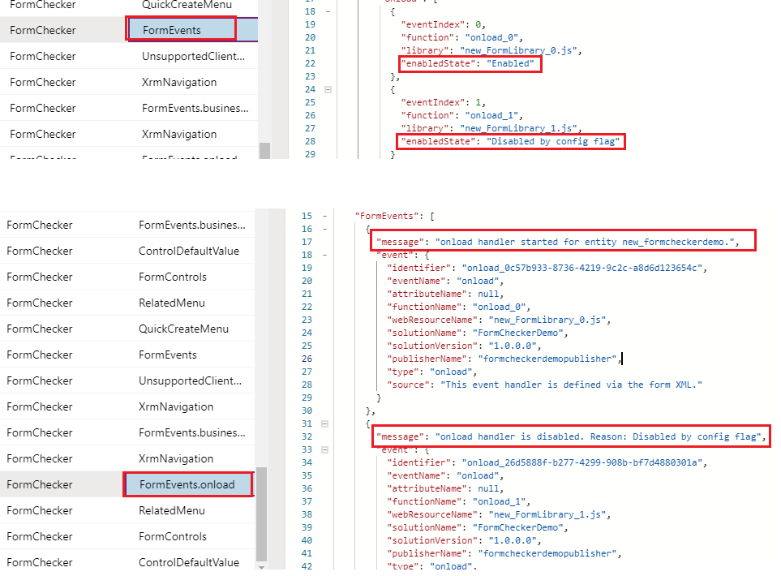

# Troubleshoot form issues in model-driven apps

This article has information to help fix some of the common issues you might encounter while working with model-driven app forms.

> [!IMPORTANT]
>
> - The tools described in this article are designed for troubleshooting purposes; they aren't meant to be used in day-to-day production scenarios, even though you can use them for troubleshooting issues in production environments.
> - These troubleshooting tools only affect the current user session unless otherwise noted (for example, when a browser tab accesses the model-driven app). They don't change system customizations or affect any other users or sessions. After the current session is closed, the effect is no longer applied.
> - Most of the tools are available in all the production environments. Some of them mentioned in the article might not have been deployed to your organization yet; new tools are added periodically.
> - Tools listed in this article are written in a scenario-driven way. You can use them independently to troubleshoot different types of issues.
> - [Use URL parameters to disable various form components](#use-url-parameters-to-disable-various-form-components) and [View registered form event handlers and libraries in Monitor](#view-registered-form-event-handlers-and-libraries-in-monitor) are critical and fundamental tools you'll frequently use to troubleshoot many scenarios.
> - For more information on how to use Monitor, see [Use Monitor to troubleshoot model-driven app form behavior](../../maker/model-driven-apps/monitor-form-checker.md)

## Use URL parameters to disable various form components

When you're troubleshooting issues with forms, you need to use the URL parameters to disable components as you work to isolate the specific component that caused the issue. We recommend that you use the flags one at a time to narrow down the cause of the issue. You can use the following URL parameters:

- **DisableFormCommandbar**  

   Disables the command bar on the form. It only disables the command bar on form pages and not supports list (grid), dashboard, etc.  

   ```http
   https://myorg.crm.dynamics.crm/main.aspx?appid=00000000-0000-0000-0000-000000000000&pagetype=entityrecord&id=00000000-0000-0000-0000-000000000000**&flags=DisableFormCommandbar=true
  ```

- **DisableFormHandlers**  

   Disables all the form handlers. If you use the **DisableFormHandlers=true** flag, it disables the following event handlers: [OnLoad](./clientapi/reference/events/form-onload.md), [OnSave](./clientapi/reference/events/form-onsave.md), business rule, [OnChange](./clientapi/reference/events/attribute-onchange.md), and [TabStateChange](./clientapi/reference/events/tabstatechange.md).

   To learn more about obtaining event or library indices for granular controls, see [View registered form event handlers and libraries in monitor](#view-registered-form-event-handlers-and-libraries-in-monitor).

   ```http
   https://myorg.crm.dynamics.crm/main.aspx?appid=00000000-0000-0000-0000-000000000000&pagetype=entityrecord&id=00000000-0000-0000-0000-000000000000**&flags=DisableFormHandlers=true
   ```

  - **&flags=DisableFormHandlers=*eventName***  

       Disables the form handler by specifying the event name, for example, ****DisableFormHandlers=onload**.

       ```http
       https://myorg.crm.dynamics.crm/main.aspx?appid=00000000-0000-0000-0000-000000000000&pagetype=entityrecord&id=00000000-0000-0000-0000-000000000000**&flags=DisableFormHandlers=true
       ```

  - **&flags=DisableFormHandlers=*eventName_index***

      Disables the event handler at the specified index for any supported event name. For example, `DisableFormHandlers=true_0` disables all the event handlers at index 0. `DisableFormHandlers=onload_2` disables the [OnLoad](./clientapi/reference/events/form-onload.md) event handler at index 2.

  - **&flags=DisableFormHandlers=*eventName_startIndex_endIndex***

      Disables all the event handlers within the given range by specifying `startIndex` and `endIndex` values (both are included). For example, `DisableFormHandlers=true_0_2` disables all the event handlers of index 0, 1, and 2. `DisableFormHandlers=onload_2_5` disables the [OnLoad](./clientapi/reference/events/form-onload.md) event handler of index 2, 3, 4, and 5. If you have more event handlers, you can use this approach to narrow down problematic handlers quickly.  
  
    > [!NOTE]
    > Business rules are authored in the business rule designer, compiled into the client-side script, and registered in multiple form events, such as `OnLoad`, `OnSave`, and `OnChange`. The way to disable business rules are similar to other form events. However, there are a few key differences:  
    > - When you use `DisableFormHandlers=true`, `businessrule`, `businessrule_*index*`, or `businessrule_*startIndex_endIndex*`, you're disabling all business rules in all the form events they're registered to.  
    > - For example, the following image shows instructions on refreshing business rules in the backend. You only need to do it once in your organization, and you can revert your changes after troubleshooting.  
    > 
    > - After you perform the above action and refresh the form, you'll see different message with additional information, as shown in the following image:  
    > 

- **DisableFormLibraries**  

   Disables form libraries and prevents the libraries from being loaded. To learn more about obtaining event or library indices for granular controls, see [View registered form event handlers and libraries in monitor](#view-registered-form-event-handlers-and-libraries-in-monitor) . The usage is similar to `DisableFormHandlers`, except it doesn't take an event name as the value.

  - **&flags=DisableFormLibraries=true**: Disable all the form libraries.
  - **&flags=DisableFormLibraries=*index***: Disable form libraries at the specified index.
  - **&flags=DisableFormLibraries=*startIndex_endIndex***: Disable form libraries in the range of startIndex and endIndex (both included).

- **DisableWebResourceControls**  

   Disables all the web resource controls on the form.  

  ```http
  https://myorg.crm.dynamics.crm/main.aspx?appid=00000000-0000-0000-0000-000000000000&pagetype=entityrecord&id=00000000-0000-0000-0000-000000000000**&flags=DisableWebResourceControls=true
  ```

  > [!div class="mx-imgBorder"]
  > 

- **DisableFormControl**  

  Disables a form control. Specify the control name to disable the control. If you see that the issue goes away with **&flags=DisableWebResourceControls=true**, and there's more than one web resource control on the form, you can use this flag to further identify the control that's causing the issue.

  ```http
  https://myorg.crm.dynamics.crm/main.aspx?appid=00000000-0000-0000-0000-000000000000&pagetype=entityrecord&id=00000000-0000-0000-0000-000000000000**&flags=DisableFormControl=controlname
  ```

- **DisableBusinessProcessFlow**  

  Disables all the business process flows on the form.  

  ```http
  https://myorg.crm.dynamics.crm/main.aspx?appid=00000000-0000-0000-0000-000000000000&pagetype=entityrecord&id=00000000-0000-0000-0000-000000000000**&flags=DisableBusinessProcessFlow=true
  ```

- **navbar**
  This isn't a **flag** parameter; instead, use **navbar=off** in the URL.

You can also add multiple URL parameters separated with a comma (**,**).

```Http
https://myorg.crm.dynamics.crm/main.aspx?appid=00000000-0000-0000-0000-000000000000&pagetype=entityrecord&id=00000000-0000-0000-0000-000000000000**&flags=DisableFormHandlers=true,DisableWebResourceControls=true,DisableFormCommandbar=true,DisableBusinessProcessFlow=true&navbar=off
```

> [!NOTE]
> The difference between **DisableFormHandlers** and **DisableFormLibraries** are:
>
> - The **DisableFormHandlers** flag disables form handlers regardless of the containing form libraries. In contrast, the **DisableFormLibraries** flag disables the form libraries (web resources) regardless of the functions (event handlers) included in the libraries. Simply put, **DisableFormLibraries** makes sure the specified JavaScript web resource files aren't loaded.
> - The **DisableFormHandlers** flag doesn't prevent the containing form library from being loaded. Thus it doesn't stop the JavaScript code present in the library but not registered as an event handler from being executed. For example, if a form library `new_myscript.js` is written in the following way (not recommended practice):  
> - You should start with **DisableFormHandlers** to see if the issue goes away, and if not, you can try **DisableFormLibraries**. Disabling any script always involves some risks of potentially breaking your form scenarios. However, the latter tend to have more side effects because of the disablement of the entire JavaScript files.
> 
> - Assuming the `myOnloadHandler` is registered as an `OnLoad` event handler, the `DisableFormHandlers=true` flag only prevents the second alert, whereas the `DisableFormLibraries=true` flag prevents both alerts.

## View registered form event handlers and libraries in monitor

To view registered form event handles and libraries, you can view the `FormEvents` operation in [Monitor](../../maker/model-driven-apps/monitor-form-checker.md).

> [!div class="mx-imgBorder"]
> 

You need the `eventIndex` and `libraryIndex` parameter values when using the **DisableFormHandlers** or **DisableFormLibraries** URL flags. After an event or library is disabled, you'll see the event enabled state in both **FormEvents** operation (an overall view of all registered event handlers of all events), and **FormEvents.*eventName*** operation (details logged when a specific event happens).

> [!div class="mx-imgBorder"]
> 

## Unexpected behaviors when loading a form

Some common issues that can cause unexpected behavior when a model-driven app form is loaded are:

- Columns or controls don't have the values you expect.
- Controls aren't disabled or aren't enabled.
- Controls aren't shown or aren't hidden.

### How to troubleshoot

There are multiple reasons why unexpected behaviors occur when a form opens. One of the most common is the [OnLoad](./clientapi/reference/events/form-onload.md) scripts that run synchronously or asynchronously to change the column or control behavior. To determine whether your script is causing the issue, you can disable the form handlers by appending **&flags=DisableFormHandlers=true** at the end of your app URL.

If the unexpected behavior stops occurring after you disabled the form handler, it's a strong indication that the specific form handler is causing this behavior. When you identify the script that's causing this behavior, follow up with the script owner to further troubleshoot this issue.  

## Saving in progress error message

Sometimes when you save a form, you see a **Saving in Progress** error message.

This error occurs when the form [OnSave](./clientapi/reference/events/form-onsave.md) event is triggered before the previous [OnSave](./clientapi/reference/events/form-onsave.md) event completes. This behavior isn't supported, and the error appears by design because calling the `OnSave` event before the previous `OnSave` event is complete causes recursive save loops with unintended consequences.

A typical cause for this error is the script that calls the `save()` method in the [OnSave](./clientapi/reference/events/form-onsave.md) event handler. Another possible cause might be concurrent `save()` calls in the `setTimeout()` method, which might cause the error to intermittently show up, depending on whether the prior `save()` call was completed before another `save()` call was made.

### How to troubleshoot

In [Monitor](../../maker/model-driven-apps/monitor-form-checker.md), the `FormEvents.onsave` operation provides all the details that are causing the error (this call stack is modified for demonstration purposes). The call stack tells what exact web resource, function, line, and row number causing this error. The form checker can't detect the error if the issue can't be reproduced.

> [!div class="mx-imgBorder"]
> 

Follow up with the script owner to further troubleshoot the issue.

## Intermittent form errors

The most common cause of intermittent or random form errors is using unsupported [client API](./clientapi/reference.md) methods. These errors have the following characteristics:

- They occur only for specific records, users, regions, or browsers, or only during periods when the network or service load is high.
- They rarely occur in support instances.
- They might occur once on a computer, and the same error might occur again after you clear the browser cache.
- [formContext.getControl](./clientapi/reference/controls/getcontrol.md) or [formContext.getControl(arg).getAttribute()](./clientapi/reference/controls/getattribute.md) randomly returns null for a valid control or column.

There are many ways to write unsupported client API methods, and they all share a common pattern: they cause a race condition in the form load pipeline. Because they introduce a race condition, the issue only occurs when the custom script executes before the form is fully ready to be accessed via the client API. Many factors can cause a race condition:

- In the JavaScript web resource, code is put into a global scope executes immediately when the web resource file is loaded, without waiting for the form to be accessible. Make sure the code is executed inside a valid form handler, such as an [OnLoad](./clientapi/reference/events/form-onload.md) handler.  

  > [!div class="mx-imgBorder"]  
  >   

- In the Power Apps component framework component script file, client API methods are accessed inside the [init](../component-framework/reference/control/init.md) or [updateView](../component-framework/reference/control/updateview.md) function. The `init()` and `updateView()` functions are executed immediately when the component is loaded, without waiting for the form to be readily accessible. You can't use unsupported Client API methods in Power Apps component framework components.

Client API is accessed inside a `window.setTimeout()` function in the web resource file. The page state is unpredictable when the `setTimeout()` method executes the wrapped function. Due to the nature of the timer function, when the execution occurs, the page might be in a transitional state (during page load or save) that's not readily accessible by the Client API.

### How to troubleshoot

Using [Monitor](../../maker/model-driven-apps/monitor-form-checker.md), you can access information that helps you determine when the unsupported client access occurred and when the access occurred at the wrong time due to a race condition. However, Form Checker doesn't report such unsupported client access when the unsupported code happens to execute at the right time that doesn't cause an issue.

> [!div class="mx-imgBorder"]
> 

> [!NOTE]
> The call stack is modified for illustration purposes. The call stack shows details like web resource, function, and the line causing the error.

Follow up with the script owner to further troubleshoot the issue.

## The form or record isn't saved when you try to save the form

A common cause is an [OnSave](./clientapi/reference/events/form-onsave.md) event handler that calls the [executionContext.getEventArgs().preventDefault()](./clientapi/reference/save-event-arguments/preventDefault.md) method to cancel the save operation.

### How to troubleshoot

In [Monitor](../../maker/model-driven-apps/monitor-form-checker.md), the `FormEvents.onsave` operation provides all the details of why the save event is canceled details than that are available from the form UI itself.

> [!div class="mx-imgBorder"]
> 

Follow up with the script owner to further troubleshoot the issue.

## Form freezes, loads slowly, or throws unexplained errors

There are many possible reasons for a form to freeze, load slowly, or throw a "Web resource method doesn't exist" script error or an error that isn't a common script error. Some of the possible reasons include:

- Bad `OnLoad` scripts.
- Web resource controls.
- Ribbon button scripts and rules.
- Synchronous network requests.
- Custom plug-ins.
- Business process flow errors.

### How to troubleshoot

Determine if the issue reproduces without involving forms. If it does, then there's a broader issue that should be investigated out of the form's context. Actual ownership of the problem depends on the particular details case by case.

- If you believe this issue only occurs on forms, see [Use URL parameters to disable various form components](#use-url-parameters-to-disable-various-form-components) to narrow down the component that's causing the issue.
- If you identify that certain form libraries/script files caused the issue, follow up with the owner who made these customizations to find out the root cause of the issue.
- If you identify that web resource controls cause the issue with the **DisableWebResourceControls** flag, then you can use the `DisableFormControl` flag to disable each one-by-one until the problem is longer reproduced. The last disabled control that doesn't reproduce the issue is the one that is causing the issue. Follow up with the owner of the control to further troubleshoot the issue.
- If you identify that the issue is caused by the command bar/ribbon with the **DisableFormCommandbar** flag, it means this isn't an issue with the form but an issue with the command bar. Use [Command Checker](https://www.microsoft.com/en-us/power-platform/blog/power-apps/introducing-command-checker-for-model-app-ribbons) to troubleshoot individual commands and identify which one is causing the issue.

## A business rule or custom script isn't working

This issue occurs if a business rule or custom script that used to work in the legacy web client stopped working in Unified Interface. One of the main reasons for this error to occur is when a business rule or script in Unified Interface references a control that isn't available in Unified Interface.

### How to troubleshoot

One of the reasons that the business rule or script isn't working in Unified Interface is that the controls that are part of them don't exist in Unified Interface.
Composite controls exist in the web client, but in Unified Interface composite control is broken down into parts and is stored differently. For example, if the column `fullname` is part of the business rule or custom script, columns `firstname`, `middlename`, or `lastname` should be used instead.

Once you launch form checker, you're able to see more details in the `CompositeControl` operation including the composite control that is causing the problem, the columns that can be used in the business rule or custom script instead and a full call stack (the call stack is modified for demonstration purposes).

> [!div class="mx-imgBorder"]
> 

Follow up with the corresponding owner of the business rule or custom script to change the control suggested by the form checker.

## Related menu item doesn't appear in Related tab

Most forms have a **Related** tab. It opens the **Related menu** with **Related menu items**.

:::image type="content" source="media/form-related-tab.png" alt-text="Related tab in a form, expanded":::

A **Related menu item** might not appear as expected.

### How to troubleshoot

A related menu item might not appear because:

#### Relationship between the main and related table isn't configured correctly

There should be a one-to-many or many-to-many relationship between the main table and the related table. A form shows a row from the main table. The related table is the one that should appear in the **Related** menu of the form. If these relationships don't exist, the related menu item doesn't appear.

To verify, go to the [Power Apps portal](https://make.powerapps.com/?utm_source=padocs&utm_medium=linkinadoc&utm_campaign=referralsfromdoc), select **Tables**, and select the table that has the relationships you want to view.

#### Dataverse created the relationship between the main and related table and isn't customizable

The **Related** menu doesn't show related tables from certain relationships created by Dataverse. These relationships are marked as noncustomizable.

The [AssociatedMenuConfiguration.IsCustomizable property](xref:Microsoft.Xrm.Sdk.Metadata.AssociatedMenuConfiguration.IsCustomizable) indicates whether the relationship can be customized. The easiest way to check is by [querying the relationship using Web API](../data-platform/webapi/query-metadata-web-api.md#querying-relationship-metadata) to view the [AssociatedMenuConfiguration complex type](xref:Microsoft.Dynamics.CRM.AssociatedMenuConfiguration) data.

Suppose you want to check whether the relationship between the [Business Unit](../data-platform/reference/entities/businessunit.md) and [Goal](../data-platform/reference/entities/goal.md) tables is customizable. The `SchemaName` of this relationship is [business_unit_goal](../data-platform/reference/entities/businessunit.md#BKMK_business_unit_goal). Enter this URL in your browser:

```http
GET [Organization URI]/api/data/v9.2/RelationshipDefinitions(SchemaName='business_unit_goal')/Microsoft.Dynamics.CRM.OneToManyRelationshipMetadata?$select=AssociatedMenuConfiguration
```

You can also get the same data by [querying the table definition](../data-platform/webapi/query-metadata-web-api.md):

```http
GET [Organization URI]/api/data/v9.2/EntityDefinitions(LogicalName='businessunit')/OneToManyRelationships(SchemaName='business_unit_goal')/AssociatedMenuConfiguration
```

The response for either request might look like this:

```json
{
    "@odata.context": "[Organization URI]/api/data/v9.2/$metadata#RelationshipDefinitions/Microsoft.Dynamics.CRM.OneToManyRelationshipMetadata(AssociatedMenuConfiguration)/$entity",
    "MetadataId": "2124b4bd-f013-df11-a16e-00155d7aa40d",
    "AssociatedMenuConfiguration": {
        "Behavior": "UseCollectionName",
        "Group": "Details",
        "Order": null,
        "IsCustomizable": false,
        "Icon": null,
        "ViewId": "00000000-0000-0000-0000-000000000000",
        "AvailableOffline": true,
        "MenuId": null,
        "QueryApi": null,
        "Label": {
            "LocalizedLabels": [],
            "UserLocalizedLabel": null
        }
    }
}
```

Observe that `IsCustomizable` is `false`. Therefore, the relationship isn't customizable and **Goal** doesn't appear in the **Related** menu.

#### Related table isn't enabled for Unified Client

If the table was created in Web Client ([deprecated since 2019](/power-platform/important-changes-coming#legacy-web-client-is-deprecated)), it might not appear because it's disabled for Unified Client.

To verify, go to [Solution explorer](../../maker/model-driven-apps/advanced-navigation.md#solution-explorer) and select the table (entity). Ensure that **Enable for Unified Client** is checked.

:::image type="content" source="media/form-related-menu-not-enabled-uci.png" alt-text="Solution explorer shows that an entity isn't enabled for Unified Client":::

Tables created with the modern designer don't have this issue. They're always enabled for Unified Client.

> [!NOTE]
> Certain system tables can't be enabled for Unified Client. For example, **Process Session** can't be used in model-driven apps.

## Audit History doesn't appear in Related tab

**Audit History** isn't in the Related menu.

### How to troubleshoot

Audit history isn't supported in these cases:

- Tables that aren't enabled for auditing. [Check the table's IsAuditEnabled property](../data-platform/auditing/configure.md?tabs=webapi#detect-which-tables-are-enabled-for-auditing) to confirm.
- [System tables that don't support Audit History](/power-platform/admin/manage-dataverse-auditing)
- Mobile apps
- Offline mode
- Dynamics for Outlook

## Unexpected related menu item appears in related tab

A **Related menu item** might appear when it shouldn't.

### How to troubleshoot

A related menu item might appear because:

#### Related table has self-referencing many-to-many relationship with the main table

The system ignores form XML customizations for self-referencing many-to-many relationships. The system ignores these customizations because it isn't possible to indicate whether the customizations are for the primary table or the related table, which are both the same table in this case. Therefore, the system ignores these customizations.

If you modify the form XML to hide the related menu item, it still appears. Any form XML customizations for self-referencing relationships are ignored, like changing the order or the label of the related item.

#### Some system tables can't be hidden

For example, custom tables always show **Activities** related menu item. It isn't possible to hide it with the form designer or by modifying the form XML.

## Related menu items aren't translated as expected

The text for related menu items aren't in the expected language.

### How to troubleshoot

If some related menu items are displaying in a different language from the user's language, check whether the form XML is missing translated labels.

Check the form XML to see if there are labels defined for each language. For example, this form XML shows that the `navContacts` item only has a US English (1033) label: `Contacts`.

```xml
<NavBarByRelationshipItem Id="navContacts" Area="Sales" Sequence="10064" RelationshipName="contact_customer_accounts" Show="true">
  <Titles>
    <Title LCID="1033" Title="Contacts" />
  </Titles>
</NavBarByRelationshipItem>
```

To fix this issue, add the translated labels to the form XML. For example, this form XML shows that the `navContacts` item with both US English (1033) and German (1031) labels.

```xml
<NavBarByRelationshipItem Id="navContacts" Area="Sales" Sequence="10064" RelationshipName="contact_customer_accounts" Show="true">
  <Titles>
    <Title LCID="1033" Title="Contacts" />
    <Title LCID="1031" Title="Kontakte" />
  </Titles>
</NavBarByRelationshipItem>
```

If the text for the user's language isn't defined, the system uses the organization's base language. If that doesn't exist either, the system uses the US English text.

## Why is a form showing or not showing in the form selector?

The form selector is a dropdown that allows users to switch between different forms for a particular table.

> [!div class="mx-imgBorder"]
> 

You need to understand the conditions that control whether the form is displayed.

### How to troubleshoot

A form is available in the selector when all of these conditions are met:

1. [User has permission to access the form](../../maker/model-driven-apps/control-access-forms.md).
1. [Form is added to the app module](../../maker/model-driven-apps/add-edit-app-components.md#add-table-assets).
1. [Form isn't hidden with Client API](./clientapi/reference/formcontext-ui-formselector/setvisible.md).
1. For Dynamics Customer Service workspace forms, [**ShowInFormSelector** is set to **True**](/dynamics365/customer-service/case-enh-config#enable-enhanced-case-experience).

If a form isn't showing in the form selector,

1. Check the affected user's security roles.
1. Check if the form is added to the app module.
1. [Disable custom scripts](/troubleshoot/power-platform/power-apps/isolate-and-troubleshoot-common-issues/isolate-model-app-issues#client-scripts).

## Why an expected default form isn't shown by default?

When there are multiple forms for a table, the desired one isn't used as the default.

### How to troubleshoot

The following criteria determine the first form shown to the user:

1. If a formId is provided when opening a form, then that form is shown. A formId can be provided through Client API functions like [openForm](./clientapi/reference/xrm-navigation/openform.md) or in a URL.
1. Otherwise, the most recent form that the user picked is shown. The system remembers the latest selection from the form selector.
1. If the user hasn't used the form selector before, the system uses the [form order](../../maker/model-driven-apps/control-access-forms.md#set-the-form-order).

If the form isn't available to the user, the system continues to find an appropriate form to show.

A form is available to the user when:

1. [User has permission to access the form](../../maker/model-driven-apps/control-access-forms.md).
1. [Form is added to the app module](../../maker/model-driven-apps/add-edit-app-components.md#add-table-assets).

If no forms are available to the user, then the [the fallback form](../../maker/model-driven-apps/control-access-forms.md#set-the-fallback-form-for-a-table) is used.

## Why a control is disabled/enabled or visible/hidden

There are many possible reasons why a control might be disabled or hidden when the form is loaded.

### How to troubleshoot

You can use [Monitor](../../maker/model-driven-apps/monitor-form-checker.md) to view the `FormControls` operation that includes all the details about the initial control state when the form loads.

> [!div class="mx-imgBorder"]
> 

Another place to check is the `ControlStateChange.visible` or `ControlStateChange.disabled` operation that explains why the control disable or visible state is changed at any time on the form. This operation explains the control state before the change, intended state change that might succeed, and the state after the change. Not all control state change attempts are successful. For a control disabled by form XML, you can enable it through client API in an `OnLoad` event handler. However, if control is disabled for security reasons, it's highly unlikely an attempt to enable it through client API would successfully change the state.

> [!div class="mx-imgBorder"]
> 

A control can be disabled by using the following list of rules in order. If a rule is met, then the following rules are ignored. If you want to change whether a control is disabled, you must change the input to the rule used for the result or to a rule earlier in the list.

- If the flags `DisableWebResourceControls=true` or `DisableFormControl=<control name>` are passed and the control is affected by these flags, the control is disabled.
- If the owning table is read-only in Unified Interface in table definitions, the control is disabled.
- If the table isn't available in offline mode, the control is disabled.
- If the current user doesn't have write permissions on the record, the control is disabled.
- If the column definition has `IsValidforCreate` set to false, the control is disabled.
- If the column definition has `IsValidforUpdate` set to false, the control is disabled.
- If the current user doesn't have `Assign to` privilege, the owner column is disabled.
- If the user doesn't have write permissions on the column defined by field-level security, the control is disabled.
- If a client API script enables or disables the control, the control disabled state honors that setting.
- If the control is disabled in the form designer, the control is disabled.
- If the user doesn't have `Append To` privilege for the lookup control's table, or `Append` privilege on the current record's table, the lookup control is disabled

Finally, if the control passes all the above checks, the record state determines whether the control is disabled. The control is enabled by default on active records and disabled on inactive records.

> [!NOTE]
> The difference between `FormControls` and `ControlStateChange` is that the `FormControls` operation reflects the initial control state when the form is loaded, while the `ControlStateChange`operation reflects the state change at any time on the form, whether it's during form load, in OnChange or OnSave events after the form is loaded.

> [!IMPORTANT]
> A control's disabled and hidden state can change multiple times when a form is first loaded. To know the reason why a control is hidden or disabled, make sure to check the **last** operation logged in the monitor. For example, if there are no `ControlStateChange.visible/ControlStateChange.hidden` operations for the control being investigated, the value and reasoning will be in the `FormControls` operation. Otherwise, it is the value and reason in the **last** `ControlStateChange.visible/ControlStateChange.hidden` operation. You can order logs by timestamp to search for the last operation.

## Why a control has a certain value on form load

A control might not have a specific value on form load as the user expected.

### How to troubleshoot

There are many possible reasons why control can have a value when a form loads. The `ControlDefaultValue` operation in [Monitor](../../maker/model-driven-apps/monitor-form-checker.md) explains the source of the default values.

> [!div class="mx-imgBorder"]
> 

If multiple updates are happening to a control's value, an `Update Sequence` indicates the final value. For example, here's a control with a default value and then overridden with a value passed with a client API script. There's a call stack provided.

> [!div class="mx-imgBorder"]
> 

There are scenarios where columns are populated based on a relationship column mapping, in which case the event shows that.

> [!div class="mx-imgBorder"]
> 

Verify where the value is coming from and take action based on the following table:

| Source | How to fix |
|--|--|
| Client API script | Contact the script owner. |
| Default value | Check the control's configuration. |
| Relationship column mapping | Check the relationship configuration and update the column mapping. |
| Value passed by page input data passed via URL | Check the API that opens the specific form with the issue, it's passing the value. |

## Why a tab or section is visible or hidden

There are many possible reasons why a tab or section might be hidden or visible.

### How to troubleshoot

The `TabStateChange` or `SectionStateChange` operations in [Monitor](../../maker/model-driven-apps/monitor-form-checker.md) explain the visible state change, as shown in the following image. If a script causes it, then the call stack would reveal the web resource file, line number, and function name that caused this behavior.

> [!div class="mx-imgBorder"]
> 

Follow up according to the suggestion in the state reason or the owner of the web resource/business rules to change or fix the behavior.

## Unexpected dialogs or navigation

There are many possible reasons why a dialog appears, or navigation happens unexpectedly. One of the common causes is the [Xrm.Navigation](./clientapi/reference/xrm-navigation.md) API methods are called to open a record or a form by a custom script. For example, when you open a form, an alert appears, as shown in the following image.

> [!div class="mx-imgBorder"]
> 

### How to troubleshoot

The `XrmNavigation` operation in [Monitor](../../maker/model-driven-apps/monitor-form-checker.md) contains call stack that helps you identify the script that's causing unexpected behavior.

> [!div class="mx-imgBorder"]
> 

Follow up with the owner of the web resource to change or fix the behavior.

## Opening another form instead of a quick create form

When opening a quick create form from a lookup or a grid, another form might open (edit or main form) instead of a quick create form. There are few reasons why this issue can happen:

- The main form dialog force flag is being set.
- Quick create form isn't available.

### How to troubleshoot

You can use [Monitor](../../maker/model-driven-apps/monitor-form-checker.md) to view the `FormType` operation that includes all the reasons why a quick create form isn't opened.

> [!div class="mx-imgBorder"]
> 

You need to follow up with the table owner who has disabled quick create through table definitions (metadata).

## Table doesn't appear in the quick create menu flyout

When opening the global quick create menu, not all tables are available. Some possible reasons:

- Table isn't enabled for quick create. [Check if the table supports quick create and that it's enabled](../../maker/model-driven-apps/create-edit-quick-create-forms.md#tables-with-quick-create-forms).
- Table isn't added to the app. [Ensure all required components are added to an app](/troubleshoot/power-platform/power-apps/create-and-use-apps/isolate-model-app-issues#ensure-all-required-components-are-added-to-an-app).
- No quick create form is available for the table. [Create a quick create form](../../maker/model-driven-apps/create-edit-quick-create-forms.md#create-a-quick-create-form).
- Table is read-only.
- User doesn't have permission to access the quick create form. Check if the user has appropriate security roles.
- User doesn't have create privilege for the table.
- Table doesn't support create privilege.

### How to troubleshoot

You can use [Monitor](../../maker/model-driven-apps/monitor-form-checker.md) to view the `QuickCreateMenu` operation, which includes all the tables and reasons why they're filtered from the quick create menu flyout.

See the following examples to understand the reasons for filtering. Based on the explanations, contact the responsible party or make changes accordingly.

> [!div class="mx-imgBorder"]
> 

> [!div class="mx-imgBorder"]
> 

> [!div class="mx-imgBorder"]
> 

## Unexpected unsaved changes message

When working on forms, you get the *unsaved changes* message on the form footer when you navigate from the current form or save the form without any changes.

### How to troubleshoot

The *unsaved changes* error appears when you change the form and when the changes aren't saved. If you didn't make any changes manually, they could come from a JavaScript, plug-in, or business rule. You can use [Monitor](../../maker/model-driven-apps/monitor-form-checker.md) to view the `UnsavedChanges` operation that helps find the source of the changes. You can filter by OperationType `UnsavedChanges`.

The `all attributes modified` section includes a quick summary of the columns causing the unsaved changes error and their values. The `unsaved changes` section shows what happened to the columns in detail. For every column, you can see a list of controls that could be causing a change. The value change is also displayed (previousValue, newValue), and a call stack.

The following screenshot shows the root cause of the issue. You can see that the change came from the `OnLoad` script.

> [!div class="mx-imgBorder"]
> 

> [!NOTE]
> If the user has manually made the changes on the form, a call stack won't be provided.

Verify where the change is coming from and if the behavior is expected or not. If a script causes the change, the original web resource can be traced back in the call stack. In most cases, it's a script. Make a decision based on the web resource itself.

## Business required column doesn't block saving

Business required columns are a usability feature that help prevent users from saving a record with an empty value in that column. In model-driven apps and Power Pages, the following scenarios don't block saving a record when a required column has an empty value:

- The column is hidden from the form, either because of [column properties](../../maker/model-driven-apps/add-move-or-delete-fields-on-form.md#configure-column-properties-on-a-form) or a client-side script using the [control.setVisible Client API](clientapi/reference/controls/setVisible.md) .
- The column is on a hidden form tab or section.
- A client-side script changes the column's required level using the [setRequiredLevel Client API](clientapi/reference/attributes/setRequiredLevel.md).
- The user isn't using model-driven apps or Power Pages to create the record. Client applications using Dataverse APIs aren't blocked from saving records when column [AttributeMetadata.RequirementLevel](/dotnet/api/microsoft.xrm.sdk.metadata.attributemetadata.requiredlevel) is set to [AttributeRequiredLevel.ApplicationRequired](/dotnet/api/microsoft.xrm.sdk.metadata.attributerequiredlevel). [Learn more about column requirement level](../data-platform/entity-attribute-metadata.md#column-requirement-level)

When you need to enforce data integrity, you should use [entity business rules](../../maker/data-platform/data-platform-create-business-rule.md) and other server-side validation instead, such as [synchronous plug-ins](../data-platform/plug-ins.md).

### How to troubleshoot

The `RequiredFieldValidation` operation is logged when a save is attempted, regardless of whether save is successful or not. This operation explains why each business required column blocks or doesn't block the save operation.

The following image is an example of this operation. The message explains how to read the detailed reports of each required column. In this example, `fax` column is bound to one control, and the control of the same name is read-only. Therefore it won't trigger required column validation.

> [!div class="mx-imgBorder"]
> 

The following image is another example that `jobtitle` is a business required column on the business process flow but not on the form, and the column isn't modified. Thus it doesn't block the save operation even when it's empty.

> [!div class="mx-imgBorder"]
> 

### Follow up

Most times, the behavior is by design, and the `RequiredFieldValidation` operation explains why this column behaves in a certain way in form save operation. If the required column validation is skipped on a column because the control is disabled or hidden, as the first example illustrated, see the form checker suggestions for further analysis.

This might lead to another troubleshooting scenario such as [Why a control is disabled/enabled or visible/hidden](#why-a-control-is-disabledenabled-or-visiblehidden).

## Can't create a record because of insufficient permissions to a secured field, even though that field isn't in the form

This might happen when users create a record (row) from a different form. They get the error message **The user does not have create permissions to a secured field** even though they haven't entered a value for that field (column), or that field isn't on the form.

When table **A** has a lookup field to table **B**, creating a record **A** from record **B** automatically sets lookup fields on it to **B**, even if those fields aren't on the form.

For example:

1. Account table has a lookup field, `primarycontactid`, to the contact table.
1. User opens a contact form for **Robin Danielsen**.
1. User opens the lookup field, `parentaccountid`, on the form and selects the button to create a new account.
1. New account form opens, with the `primarycontactid` field automatically set to **Robin Danielsen**.

If the `primarycontactid` field is [secured](/power-platform/admin/field-level-security) and the user doesn't have permissions to edit it, they'll get an error when they try to save the new account. They can clear the field before saving it. However, if that field isn't on the form, they can't clear it. A workaround is to create the account from the account page instead of from a contact form.

## Some columns aren't displayed on the merge dialog

The merge dialog uses the default main form definition for the table and selectively renders most, but not all the columns in the dialog. This Form Checker operation explains why some of the columns aren't displayed on the merge dialog, even that they might be displayed on the main form.

### How to troubleshoot

The following `MergeDialog.load` operation explains the reason why some columns aren't displayed.  

In this example, `parentcustomerid` column on the contact form isn't supported in the merge dialog. The business card column isn't displayed because the containing section is hidden in the main form XML definition. Even though showing the owning section in the main form via client API is possible, the merge dialog honors the form XML configuration as event handlers aren't supported on the merge dialog.

> [!div class="mx-imgBorder"]
> 

[!INCLUDE[footer-include](../../includes/footer-banner.md)]
