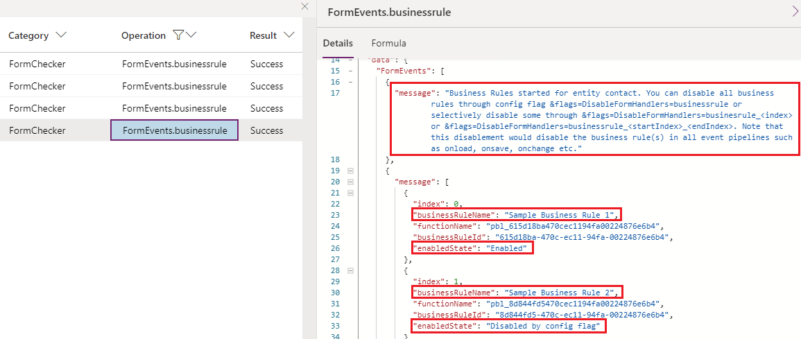
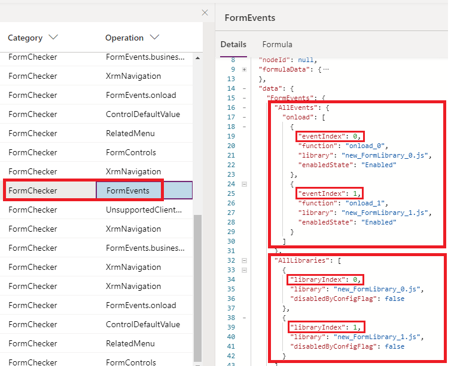

# Troubleshoot form issues in model-driven apps

Troubleshooting issues in Unified Interface is important when you're working with forms and trying to fix issues that occur when loading a form, running a script, working with events, or saving data.

This article helps you fix some common issues that you might encounter while working with model-driven app forms.

> [!IMPORTANT]
> - The troubleshooting tools described in this article are only designed for troubleshooting purposes; they aren't meant to be regularly used in day-to-day production scenarios even though you can use them to troubleshoot issues in production environments. 
> - These troubleshooting tools only affect the current user session unless otherwise noted (for example, when a browser tab accesses the model-driven app). They don't change system customizations or affect any other users or sessions. After the current session is closed, the effect is no longer applied.
> - Most of the troubleshooting tools are available in most production environments. Some of them mentioned in the guide might not have been deployed to your organization yet; new tools are added periodically.
> - Most of the tools listed in this article are written in a scenario-driven way, i.e., they can be used independently to troubleshoot different categories of issues. However the first two sections, [Use URL parameters to disable various form components](#use-url-parameters-to-disable-various-form-components) and [View registered form event handlers and libraries in Monitor](#view-registered-form-event-handlers-and-libraries-in-monitor) are very important and fundamental tools you'll use frequently to troubleshoot many scenarios, and it's strongly recommended to thoroughly read and practice using them no matter what scenario you're facing.

## Use URL parameters to disable various form components

When you're troubleshooting issues with forms, you need to use URL parameters to disable components as you work to isolate specific component that caused the issue. We recommend that you use the flags one at a time to narrow down the cause of the issue. You can use the following URL parameters:

- **DisableFormCommandbar**  
  Disables the command bar on the form. Note that this only disables the command bar on form pages - it does not support list (grid) page, dashboard page, etc.  
  #### Usage:   
  &flags=DisableFormCommandbar=true

- **DisableFormHandlers**  
  Disables the form handlers by specifying the event name, for example, **DisableFormHandlers=OnLoad**. If you use the **DisableFormHandlers=true** flag, it disables the following event handlers: [OnLoad](./clientapi/reference/events/form-onload.md), [OnSave](./clientapi/reference/events/form-onsave.md), business rule, [OnChange](./clientapi/reference/events/attribute-onchange.md), and [TabStateChange](./clientapi/reference/events/tabstatechange.md).  
  Please refer to [View registered form event handlers and libraries in Monitor](#view-registered-form-event-handlers-and-libraries-in-Monitor) to learn how to obtain event or library indices for granular controls.

  #### Usage:
  - **&flags=DisableFormHandlers=*eventName***  
    You can specify any supported event name, such as DisableFormHandlers=onload. If you use DisableFormHandlers=true, it'll be a shortcut to disable these event handlers: onload,     onsave, businessrule, onchange and ontabstatechange.
  - **&flags=DisableFormHandlers=*eventName_index***
    This value disables the event handler at specified index in the event handler list of any given supported event name. For example, DisableFormHandlers=true_0 will disable handler at index 0 of the event names included by "true" value. DisableFormHandlers=onload_2 will disable the [OnLoad](./clientapi/reference/events/form-onload.md) event handler at index 2.
  - **&flags=DisableFormHandlers=*eventName_startIndex_endIndex***
  This value disables all handlers for a given event name within the given range from startIndex to endIndex (both are included). For example, DisableFormHandlers=true_0_2 will disable handlers of index 0, 1 and 2 of the event names included by "true" value. DisableFormHandlers=onload_2_5 will disable [OnLoad](./clientapi/reference/events/form-onload.md)  handlers of index 2, 3, 4 and 5. If you have a large amount of event handlers, you can use this approach to help narrow down problematic handlers quickly.  
  
    > [!NOTE]
    > Business Rules are authored in the Business Rule designer and compiled into client side script, and registered in multiple form events, such as onload, after succcessful save, onchange etc. The way to disable Business Rules are very similar with other form events, however there're a few key differences:  
    > - When you use DisableFormHandlers=true, businessrule, businessrule_*index*, or businessrule_*startIndex_endIndex*, you're disabling the Business Rule(s) in all form events they're registered to.  
    > - If you see below event in Form Checker, follow the instructions to refresh Business Rule(s) in the backend. You only need to do it once in your organization, and you can revert your changes after troubleshooting is done.  
      >  [!div class="mx-imgBorder"]
      > 

      After you perform the above action and refresh the form, you'll see different message with additional information, like below example generated by DisableFormHandlers=businessrule_1 that disables Business Rule at index 1:  
      >  [!div class="mx-imgBorder"]
      > 

  
- **DisableFormLibraries**  
    This flag disables form libraries and actually prevents the libraries from being loaded. Please refer to [View registered form event handlers and libraries in Monitor](#view-registered-form-event-handlers-and-libraries-in-Monitor) to learn how to obtain event or library indices for granular controls.    
    #### Usage:  
    The usage is similar with DisableFormHandlers except it only does not take an event name as the value  
    - **&flags=DisableFormLibraries=true** (this will disable all form libraries)  
    - **&flags=DisableFormLibraries=*index*** (this will disable form libraries at the specified index)  
    - **&flags=DisableFormLibraries=*startIndex_endIndex*** (this will disable form libraries in the range of startIndex and endIndex (both are included))  

- **DisableWebResourceControls**  
    This flag disables all web resource controls on the form.  
    #### Usage:  
    **&flags=DisableWebResourceControls=true**  

    > [!div class="mx-imgBorder"]
    > 
    
- **DisableFormControl**  
    This flag disables a form control given the control name. If you have proven that the issue goes away with **&flags=DisableWebResourceControls=true**, and there are more than one web resource controls on the form, You can use this flag to further identify the control that's causing the issue.   
   #### Usage:  
   **&flags=DisableFormControl=myControlName**  
   
- **DisableBusinessProcessFlow**  
  This flag disables Business Process Flows on the form.  
   #### Usage:  
   **&flags=DisableBusinessProcessFlow=true**

- **navbar** (this isn't a **flag** parameter; instead, use **navbar=off** in the URL)

The following examples show how to use these flags.

```Http
https://myorg.crm.dynamics.crm/main.aspx?appid=00000000-0000-0000-0000-000000000000&pagetype=entityrecord&id=00000000-0000-0000-0000-000000000000**&flags=DisableFormHandlers=true
```

You can also add multiple URL parameters separated with a comma (**,**).

```Http
https://myorg.crm.dynamics.crm/main.aspx?appid=00000000-0000-0000-0000-000000000000&pagetype=entityrecord&id=00000000-0000-0000-0000-000000000000**&flags=DisableFormHandlers=true,DisableWebResourceControls=true,DisableFormCommandbar=true,DisableBusinessProcessFlow=true&navbar=off
```

```Http
https://myorg.crm.dynamics.crm/main.aspx?appid=00000000-0000-0000-0000-000000000000&pagetype=entityrecord&id=00000000-0000-0000-0000-000000000000**&flags=DisableFormCommandbar=true
```

> [!NOTE]
The main difference between **DisableFormHandlers** and **DisableFormLibraries** are:

> - The **DisableFormHandlers** flag disables form handlers regardless of the containing form libraries, whereas the **DisableFormLibraries** flag disables the form libraries (web resources) regardless of the functions (event handlers) included in the libraries. Simply put, **DisableFormLibraries** makes sure the specified javascript web resource files are not even loaded.

> - The **DisableFormHandlers** flag doesn't prevent the containing form library from being loaded, thus it doesn't prevent the JavaScript code that's present in the library&mdash;but not registered as an event handler&mdash;from being executed. For example, if a form library `new_myscript.js` is written in the following way (not recommended practice):  

> - You should start with **DisableFormHandlers** to see if the issue goes away, and if not, you can try **DisableFormLibraries**. Disabling any script always involves some risks of potentially breaking your form scenarios, however the latter tends to have more side effects because of the disablement of the entire javascript files.

  > [!div class="mx-imgBorder"]
  > 

  > Assuming the `myOnloadHandler` is registered as an `OnLoad` event handler, the `DisableFormHandlers=true` flag only prevents the second alert, whereas the `DisableFormLibraries=true` flag prevents both alerts.


## View registered form event handlers and libraries in Monitor

To view registered form event handles and libraries, you can view the `FormEvents` operation in [Monitor](../../maker/model-driven-apps/monitor-form-checker.md).

> [!div class="mx-imgBorder"]
> 

You'll need the `eventIndex` and `libraryIndex` parameter values when using the **DisableFormHandlers** or **DisableFormLibraries** URL flags. After an event or library is disabled, you'll see the event enabled state in both **FormEvents** operation (an overall view of all registered event handlers of all events), and **FormEvents.*eventName*** operation (details logged when a specific event actually happens).

> [!div class="mx-imgBorder"]
> 


## Unexpected behaviors when loading a form
### Problem  
Some common issues that can cause unexpected behavior when a model-driven app form is loaded are:

- Columns or controls don't have the values you expect.

- Controls aren't disabled or aren't enabled.

- Controls aren't shown or aren't hidden.

### How to troubleshoot
There are multiple reasons why unexpected behaviors occur when a form opens. One of the most common is the [OnLoad](./clientapi/reference/events/form-onload.md) scripts that run synchronously or asynchronously to change the column or control behavior. To determine whether your script is causing the issue, you can disable the form handlers by appending **&flags=DisableFormHandlers=true** at the end of your app URL.

If the unexpected behavior stops occuring after you disabled the form handler, it is a strong indication that the specific form handler is causing this behavior.  

### Follow up
If you have identified the problematic script that's causing this behavior, please follow up with the script owner to further troubleshoot this issue.  

## Saving in Progress error message
### Problem
Sometimes when you save a form, you see a **Saving in Progress** error message. 

This error occurs when the form [OnSave](./clientapi/reference/events/form-onsave.md) event is triggered before the previous [OnSave](./clientapi/reference/events/form-onsave.md) event has been completed. This behavior isn't supported, and the error appears by design because calling the `OnSave` event before the previous `OnSave` event is complete will cause recursive save loops with unintended consequences.

A typical cause for this error is the script that calls the `save()` method in the [OnSave](./clientapi/reference/events/form-onsave.md) event handler. Another possible cause might be concurrent `save()` calls in the `setTimeout()` method, which might cause the error to intermittently show up, depending on whether the prior `save()` call was completed before another `save()` call was made.

### How to troubleshoot
In [Monitor](../../maker/model-driven-apps/monitor-form-checker.md) the `FormEvents.onsave` operation provides all the details that are causing the error (the callstack has been modified for demonstration purpose). The callstack tells what exact web resource, function and line and row number is causing this error. The form checker won't be able to detect the error if the issue can't be reproduced.

> [!div class="mx-imgBorder"]
> 

### Follow up
Please follow up with the script owner to further troubleshoot this issue.


## Intermittent form errors
### Problem
The most common cause of intermittent or random form errors is using unsupported [Client API](./clientapi/reference.md) methods. These errors have the following characteristics:

- They occur only for certain records, users, regions, or browsers, or only during periods when the network load or service load is high.

- They rarely occur on support instances.

- They might occur once on a computer, and the same error might occur again after you clear the browser cache.

- [formContext.getControl](./clientapi/reference/controls/getcontrol.md) or [formContext.getControl(arg).getAttribute()](./clientapi/reference/controls/getattribute.md) randomly returns null for a valid control or column.

[!INCLUDE[cc-terminology](../data-platform/includes/cc-terminology.md)]

There are many ways to write unsupported Client API methods, and they all share a common pattern: they cause a race condition in the form load pipeline. Because they introduce a race condition, the issue only occurs when the custom script is executed before the form is fully ready to be accessed via the Client API. This can depend on many factors:

- In the JavaScript web resource, code is put into a global scope that's executed immediately when the web resource file is loaded, without waiting for the form to be accessible. Make sure the code is executed inside a valid form handler, such as an [OnLoad](./clientapi/reference/events/form-onload.md) handler.  

  > [!div class="mx-imgBorder"]
  > 

- In the Power Apps component framework component script file, Client API methods are accessed inside the [init](../component-framework/reference/control/init.md) or [updateView](../component-framework/reference/control/updateview.md) function. The `init()` and `updateView()` functions are executed immediately when the component is loaded, without waiting for the form to be readily accessible. You can't use unsupported Client API methods in Power Apps component framework components.

- In the web resource file, the Client API is accessed inside a `window.setTimeout()` function. The page state is unpredictable when the `setTimeout()` method executes the wrapped function&mdash;due to the nature of the timer function&mdash;so when the execution occurs, the page might be in a transitional state (during page load or save) that's not readily accessible by the Client API.

### How to troubleshoot
Using [Monitor](../../maker/model-driven-apps/monitor-form-checker.md), you can access information that helps you determine when the unsupported client access occurred, and when the access occurred at the wrong time due to a race condition. However, Form Checker will not report such unsupported client access when the unsupported code happens to be executed at the right time that does not cause an issue.

> [!div class="mx-imgBorder"]
> 

> [!NOTE]
> The call stack has been modified for illustration purposes. The call stack shows details like web resource, function, and the line that's causing the error.

### Follow up
Please follow up with the script owner to further troubleshoot this issue.

## The form or record isn't saved when you try to save the form
### Problem
A common cause is an [OnSave](./clientapi/reference/events/form-onsave.md) event handler that calls the `[executionContext.getEventArgs().preventDefault()](./clientapi/reference/save-event-arguments/preventDefault.md)` method to cancel the save operation.

### How to troubleshoot

In [Monitor](../../maker/model-driven-apps/monitor-form-checker.md), the `FormEvents.onsave` Operation provides all the details why the save event was canceled, more details than that are available from the form UI itself.

> [!div class="mx-imgBorder"]
> 

### Follow up
Please follow up with the script owner to further troubleshoot this issue.

## Form freezes, loads slowly, or throws unexplained errors
### Problem
There are many possible reasons for a form to freeze, load slowly, or throw a "Web resource method does not exist" script error or an error that isn't a regular script error. Some of the possible reasons include:

- Bad `OnLoad` scripts.

- Web resource controls.

- Ribbon button scripts and rules.

- Synchronous network requests.

- Custom plug-ins.

- Business process flow errors.

### How to troubleshoot
Determine if the issue reproduces without involving forms. If it does, then there is a broader issue that should be investigated out of the forms context. Actual ownership of the issue depends on the particular details case by case. 

If you believe this issue only occurs on forms, please refer to [Use URL parameters to disable various form components](#use-url-parameters-to-disable-various-form-components) to help narrow down the component that's causing the issue.

### Follow up
- If you have proven the issue is caused by certain form libraries / script files, please follow up with the owner of these customizations to further root cause the issue.
- If you have proven the issue is caused by web resource controls with the DisableWebResourceControls flag, then you can use the DisableFormControl flag to disable each one-by-one until the issue no longer repros. The last disabled control after the issue no longer repros is the one that is causing the issue. please follow up with the owner of the control to further troubleshoot the issue.
- If you have proven the issue is caused by command bar / ribbon with the **DisableFormCommandbar** flag, this means this is not an issue with the form and an issue with the command bar. Please use [Command Checker](https://powerapps.microsoft.com/en-us/blog/introducing-command-checker-for-model-app-ribbons/) to troubleshoot individual commands and identify which one is causing the issue.


## A business rule or custom script isn't working
### Problem
This issue occurs if a business rule or custom script used to work in the legacy web client and stopped working in Unified Interface. One of the main reasons for this error to occur is when a business rule or script in Unified Interface references a control that isn't available in Unified Interface.

### How to troubleshoot
One of the reasons that the business rule or script is not working in Unified Client is that the controls that are part of them - do not exist in Unified Client.
Composite controls exist in web client, but in Unified Client the composite control is broken down into parts and is stored this way. For example, if a field "fullname" is part of the business rule or custom script, the fields "firstname", "middlename" or "lastname" should be used instead.

Once you launch Form Checker, you'll be able to see more details including the composite control that is causing the problem, the fields that can be used in the business rule or custom script instead and a full callstack (the callstack has been modified for demonstration purpose).

You can use [Monitor](../../maker/model-driven-apps/monitor-form-checker.md) to see more details, including the composite control that's causing the problem and the columns that can be used in the business rule or custom script instead.

> [!div class="mx-imgBorder"]
> 

### Follow up
Please follow up with the corresponding owner of the business rule or custom script to make the change to use controls suggested by the Form Checker.


## Related menu/Related tab
### Problem
There are many reasons why a related menu item doesn't appear on the **Related** tab or has an incorrect label.

### How to troubleshoot
In the following example, a related table `role` (security role) doesn't appear in the `team` form because the `role` table isn't available in Unified Interface.

> [!div class="mx-imgBorder"]
> 

In [Monitor](../../maker/model-driven-apps/monitor-form-checker.md), the `RelatedMenu` operation provides all the details that are causing the issue.

There are also a few sources where a record can be included as an option for the **Related** menu tab. The following example includes details that indicate that the label `Activities` in the **Related** menu on an account form comes from the plural display name of the related table.

> [!div class="mx-imgBorder"]
> 

### Follow up
Please follow up with the corresponding owner of the related menu item as the Form Checker suggests.


## Why a control is disabled/enabled or visible/hidden
### Problem
There are many possible reasons why a control might be disabled or hidden when the form is loaded. 

### How to troubleshoot
- You can use [Monitor](../../maker/model-driven-apps/monitor-form-checker.md) to view the `FormControls` Operation that includes all the details about the initial control state.

   > [!div class="mx-imgBorder"]
   > 

- Another way is to check the `ControlStateChange` operation that explains why the control is in a disabled or visible state. This can occur during a form load, or be triggered after the form is loaded, by using an `OnChange` event handler.

   > [!div class="mx-imgBorder"]
   > 

A control can be disabled by using the following list of rules in order. If a rule is met, then the following rules are ignored. If you want to change whether a control is disabled, you must change the input to the rule used for the result or to a rule earlier in the list.

- If the flags `DisableWebResourceControls=true` or `DisableFormControl=<control name>` are passed and the control is affected by these flags, the control will be disabled.
- If the owning table is read-only in Unified Interface in table definitions, the control is disabled.
- If the table isn't available in offline mode, the control is disabled.
- If the current user doesn't have write permissions on the record, the control is disabled.
- If the column definitions has `IsValidforCreate` set to false, the control is disabled.
- If the column definitions has `IsValidforUpdate` set to false, the control is disabled.
- If the current user doesn't have `Assign to` privilege, the owner column is disabled.
- If the user doesn't have write permissions on the column defined by field-level security, the control is disabled.
- If the control is disabled or enabled by the Client API script, the control disabled state will honor that setting.
- If the control is disabled in the form designer, the control is disabled.
- If the user doesn't have `Assign To` privilege for the lookup control's table, or `Assign` privilege on the current record's table, the lookup control is disabled

Finally, if the control passes all the above checks, the record state determines whether the control is disabled. The control is enabled by default on active records and disabled on inactive records.

> [!NOTE]
> The difference between `FormControls` and `ControlStateChange` is that the `FormControls` operation reflects the initial control state when the form is loaded, while the `ControlStateChange`operation reflects the state change at any time on the form. For example, if control is disabled for security reasons, it's very unlikely to be enabled after the form is loaded, so the initial state can be found in `FormControls` and isn't likely to be found in `ControlStateChange`. Even if a Client API function tries to enable the control, it won't be effective. You'll see the `ControlStateChange` Operation of the disabled state change intention by the script without success, and you'll be able to find out why the intention is unsuccessful in `FormControls`.

## Why a control has a certain value on form load
### Problem
A control may/may not have a certain value on form load as user expected. 

### How to troubleshoot
There're many possible reasons why a control can have a value when a form loads. The `ControlDefaultValue` operation in [Monitor](../../maker/model-driven-apps/monitor-form-checker.md) explains the source of the default values. 

> [!div class="mx-imgBorder"]
> 

If there are multiple updates happening to a control's value, there will be an `Update Sequence` to indicate which value is final. For example, here is a control that first has a default value and then got overridden with a value passed with a client API script. There is a call stack provided.

> [!div class="mx-imgBorder"]
> 

There are scenarios where columns are populated based on a relationship column mapping, in which case the event will show that.

> [!div class="mx-imgBorder"]
> 

### Follow up
Verify where the value is coming from and take an action based on the below table:

| Source | How to fix |
|--|--|
| Client API script | Contact the script owner. |
| Default value | Check the control's configuration. |
| Relationship column mapping | Check the relationship configuration and update the column mapping. |
| Value passed by page input data passed via URL | Check the API that opens the specific form with the issue, it is passing the value. |


## Why a tab or section is visible or hidden
### Problem
There are many possible reasons why a tab or section might be hidden or visible.

### How to troubleshoot

The `TabStateChange` or `SectionStateChange` operations in [Monitor](../../maker/model-driven-apps/monitor-form-checker.md) explain the visible state change, as shown in the following image.

> [!div class="mx-imgBorder"]
> 

### Follow up
Please follow up according to the suggestion in the state reason or the owner of the web resource / business rules to change or fix the behavior.


## Unexpected dialogs or navigation
### Problem
There are many possible reasons why a dialog appears or navigation happens unexpectedly. One of the common causes is when you use the [Xrm.Navigation](./clientapi/reference/xrm-navigation.md) API methods to open a record or a form. For example, when you open a form, an alert appears as shown in the following image.

> [!div class="mx-imgBorder"]
> 

### How to troubleshoot

The `XrmNavigation` operation in [Monitor](../../maker/model-driven-apps/monitor-form-checker.md) helps you identify the script that's causing unexpected behavior.

> [!div class="mx-imgBorder"]
> ")

### Follow up
Please follow up with the owner of the web resource to change or fix the behavior.

## Opening another form instead of a quick create form?
### Problem
When opening a quick create form from a lookup or a grid, another form may open (edit or main form) instead of quick create form. There are few reasons why this can happen:

- The main form dialog force flag is being set.
- Quick create form is not available.

### How to troubleshoot

- You can use [Monitor](../../maker/model-driven-apps/monitor-form-checker.md) to view the `FormType` Operation that includes all the reasons why a quick create form was not opened.

> [!div class="mx-imgBorder"]
> 

### Follow up
You may need to follow up accoring to the Form Checker analysis. In the above example, you'll need to follow up with the entity owner who has disabled quick create through entity metadata.


## Table doesn't appear in the quick create menu flyout?
### Problem
When opening the global quick create menu flyout, not all tables are available. There are few reasons why the tables are filtered in this list:

- There is no quick create form available for the table.
- Table is not enabled for quick create form.
- Table is not enabled for the new Unified Interface.
- Table is read-only in Unified Interface.
- Table's mobile client visibility cannot be modified.
- Table is not part of the app module.
- User does not have a create privilege on the table.
- The create privilege is not supported for the table.

### How to troubleshoot

- You can use [Monitor](../../maker/model-driven-apps/monitor-form-checker.md) to view the `QuickCreateMenu` Operation that includes all the tables and reasons why they are filtered from the quick create menu flyout.

See the examples below to understand the reasons for filtering. Based on the explanations, contact the responsible party or make changes accordingly.

> [!div class="mx-imgBorder"]
> 

> [!div class="mx-imgBorder"]
> 

> [!div class="mx-imgBorder"]
> 

### Follow up
Please follow up according to the Form Checker analysis.

## Unexpected unsaved changes message
### Problem
When working on forms, you get the *unsaved changes* message on the form footer, when you navigate from the current form, or when the form is getting saved without any changes. 

### How to troubleshoot

The *unsaved changes* error appears when a change is made on the form and when the changes were not saved. If you haven't made any changes manually, they could be coming from a JavaScript, plug-in, or from a business rule. You can use [Monitor](../../maker/model-driven-apps/monitor-form-checker.md) to view the `UnsavedChanges` Operation that helps to find the source of the changes. You can filter by OperationType `UnsavedChanges`.

The `all attributes modified` section includes a quick summary of the columns that are causing the unsaved changes error along with their values. The `unsaved changes` section shows what happened to the columns in detail. For every column, a list of controls are provided that could be causing a change. The value change is also displayed (previousValue, newValue), as well as a call stack.

The screenshot below shows the root cause of the issue. You can see that the change has come from the `OnLoad` script.

> [!div class="mx-imgBorder"]
> 

> [!NOTE]
> If the user has manually made the changes on the form, a call stack will not be provided.

### Follow up
See where the change is coming from and if it's expected behavior or not. In case of a script making changes, the original web resource can be traced back in the call stack. In most cases it will either be a script - make a call based on the web resource itself.


## Business Required field validation does not behave as expected
### Problem
Business Required fields by default would block form save if the value is missing. However in many by-design scenarios a business required field may not block save even when the value is empty, or block the save when you don't believe it should.

### How to troubleshoot
The 'RequiredFieldValidation' Operation is logged when a save is attempted, regardless whether save is successful or not, this Operation explains why each business required field blocks or does not block save operation.

Below is an example of this Operation. The top of message explains how to read the detailed reports of each required field. Please read it thoroughly before looking into the detailed analysis of each field and its bound controls. In this example, "fax" field is bound to one control, and the control with the same name is read only and will not trigger required field validation.

> [!div class="mx-imgBorder"]
> 

Below is another example that "jobtitle" is a business required field that put on the BPF but not on the form, and the field is not dirty (not modified after form is loaded), thus it does not block save even that it's empty.

> [!div class="mx-imgBorder"]
> 

### Follow up
Most times the behavior is by design, and the `RequiredFieldValidation` Operation explains why this field behaves in a certain way in form save operation. If the required field validation is skipped on a field because the control is disabled or hidden, as the first example ilustrate, please follow the Form Checker suggestions for further analysis that may lead to another troubleshooting scenario such as [Why a control is disabled/enabled or visible/hidden](#why-a-control-is-disabledenabled-or-visiblehidden).


## Some fields are not displayed on the Merge Dialog
### Problem
The Merge Dialog uses the default main form definition for the entity and selectively renders most but not all of the fields in the dialog. This Form Checker Operation explains why some of the fields are not displayed on the Merge Dialog even that they may be displayed on the main form.

### How to troubleshoot
The `MergeDialog.load` Operation below explains the reason why some fields are not displayed.  
In this example, parentcustomerid on contact form is not supported on the merge dialog. businesscard field is not displayed because the containing section is hidden in the main form xml definition. Note that even though it's possible to show the owning section in the main form via client API, the Merge Dialog just simply honor the form xml configuration as event handlers are not supported on the Merge Dialog.

> [!div class="mx-imgBorder"]
> 


### Follow up
Just read the Form Checker report and mostly the behaviors are by design.

[!INCLUDE[footer-include](../../includes/footer-banner.md)]
