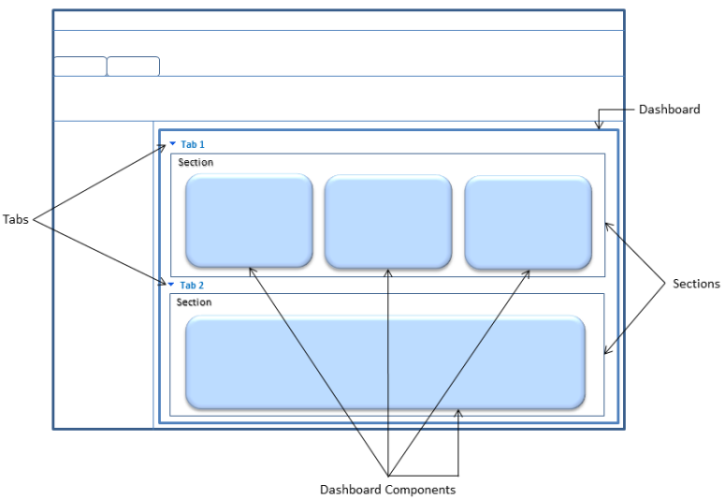

# Understand dashboards: Dashboard components and FormXML

Dashboards are one of the different types of forms in model-driven apps. You can use the `SystemForm.Type` or `UserForm.Type` to determine whether the form is a dashboard. A form of dashboard type has the property value of `0`.  

The definition of the form content and presentation is stored in the FormXML. More information: [Form XML Schema](form-xml-schema.md)  

 For sample FormXML strings for different types of dashboards, see [Sample Dashboards](sample-dashboards.md).  

## Dashboard components

A dashboard can contain charts, grids, IFRAMEs, or web resources. By default, a single dashboard can contain up to six of these components.  

### Charts

An organization-owned dashboard can contain only organization-owned charts. However, a user-owned dashboard can contain user-owned and organization-owned charts. More information [Charts (Visualizations) for model-driven apps](view-data-with-visualizations-charts.md)  

### Grids

Grids fetch data from queries (views) in model-driven apps. An organization-owned dashboard can contain only the grids that fetch data from saved queries. However, a user-owned dashboard can contain grids that fetch data from user and saved queries. More information: [SavedQuery table](../data-platform/reference/entities/savedquery.md)

[!INCLUDE[cc-terminology](../data-platform/includes/cc-terminology.md)]

### IFRAMEs

When you add an IFRAME to an organization-owned dashboard, you can specify whether to restrict or allow cross-frame scripting.
To do so, you have to use the `<Security>` parameter in the IFRAME control in the FormXML. However, for user-owned dashboards, cross-frame scripting for IFRAMEs is restricted, and you can't change it. If you attempt to create a user-owned dashboard that contains an IFRAME with cross-frame scripting enabled, an error message is displayed.  

### Web resources

Only form-enabled web resources can be included in a dashboard. Although this restriction is applicable when you're adding a web resource using the Dashboard designer in the web application, there's no such restriction applied when adding a web resource to a dashboard using the SDK. More information: [Web resources for model-driven apps](web-resources.md)

<a name="DashboardComponentsandFormXML"></a>

## Dashboard components and FormXML elements

The dashboard components are displayed in model-driven apps based on the values specified in the FormXML. The following image shows an example of a dashboard. Each dashboard can include multiple tabs. Tabs are a vertical stack separating the body of the dashboard, and can be expanded or collapsed. A tab can contain multiple sections. Sections enable for grouping and layout of dashboard components.

> [!NOTE]
> Tab and section names are not displayed on a dashboard page.

 

<a name="SupportedFormXMLElements"></a>

## FormXML elements supported for dashboards  

Although dashboards are a type of forms, dashboards don't support all FormXML elements and parameters. The following table provides information about the FormXML elements, child elements, and parameters supported by dashboards.

For sample FormXML for different types of dashboards, see [Sample Dashboards](sample-dashboards.md).  

|Element|Child Elements|Element parameters|
|----|----|----|
|`<form>`|`<tabs>`|none|
|`<tabs>`|`<tab>`|none|
|`<tab>`|-`<labels>`<br />-`<columns>`|-`id`<br />-`name`<br />-`expanded`<br />-`verticallayout`<br />-`showlabel`<br />-`locklevel` |
|`<labels>`|`<label>`|none|
|`<label>`|none|-`description`<br />-`languagecode`|
|`<columns>`|`<column>`|none|
|`<column>`|`<sections>`|`width`|
|`<sections>`|`<section>`|`addedby`|
|`<section>`|-`<labels>`<br />-`<rows>`|-`id`<br />-`name`<br />-`showlabel`<br />-`showbar`<br />-`columns`|
|`<rows>`|`<row>`|`addedby`|
|`<row>`|`<cell>`|`addedby`|
|`<cell>`|-`<labels>`<br />-`<control>`|-`auto`<br />-`addedby`<br />-`id`<br />-`showlabel`<br />-`rowspan`<br />-`colspan`|
|`<control>`|`<parameters>`|-`id`<br />-`classid`|
| `<parameters>` |-`<Url>`<br />-`<PassParameters>`<br />-`<Security>`<br />-`<Scrolling>`<br />-`<Border>`<br />-`<ViewIds>`<br />-`<ViewId>`<br />-`<IsUserView>`<br />-`<IsUserChart>`<br />-`<TargetEntityType>`<br />-`<AutoExpand>`<br />-`<RecordsPerPage>`<br />-`<EnableQuickFind>`<br />-`<EnableJumpBar>`<br />-`<EnableChartPicker>`<br />-`<EnableViewPicker>`<br />-`<ChartGridMode>`<br />-`<VisualizationId>` |none|

<a name="set_controls_limit"></a>

## Set the number of dashboard controls

You can use Windows PowerShell to adjust the number of dashboard controls as described here. The maximum value is 20.  

#### To retrieve and set the dashboard limit  

1. Open a Windows PowerShell command window.  
1. Add the model-driven apps WindowsPowerShell snap-in:  

   ```powershell  
   Add-PSSnapin Microsoft.Crm.PowerShell  
   ```  

1. Retrieve the current setting:  

   ```powershell  
   $setting = Get-CrmSetting -SettingType DashboardSettings  
   ```  

1. Modify the current setting:  

   ```powershell  
   $setting.MaximumControlsLimit = 5  
   ```  

   ```powershell  
   Set-CrmSetting -Setting $setting  
   ```  

### See also

[Dashboards](analyze-data-with-dashboards.md)   
[Actions on dashboards](actions-dashboards.md)   
[Create a dashboard](create-dashboard.md)

[!INCLUDE[footer-include](../../includes/footer-banner.md)]
