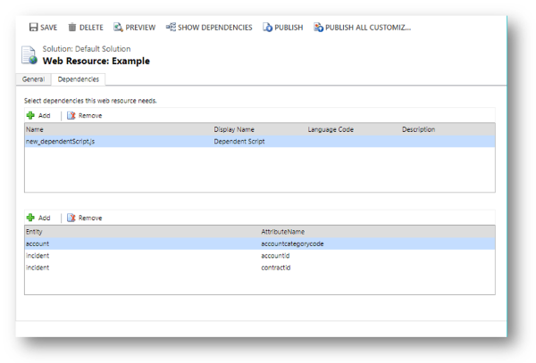

# Web resource dependencies

You can define dependencies between other web resources. The primary purpose of this feature is to allow association of String (RESX) web resources with the JavaScript web resources that will use them. This is also the way that web resources required by HTML web resources for use offline can be configured to also be available offline. 

However there are some other behaviors which developers using JavaScript web resources can take advantage of.

[!INCLUDE[cc-terminology](../data-platform/includes/cc-terminology.md)]

The following image shows the dependencies tab within the web resource form. Dependencies between web resources are set in the top list. Column dependencies are set using the lower list. Column dependencies are only available for JavaScript web resources. More information [Column dependencies](#column-dependencies)

Within a solution you can define dependencies within solution components. Up until Mode-driven Apps the main purpose of these dependencies was to prevent the deletion of a solution component when another solution component depended on it. With Model-driven apps the behavior for JavaScript web resources is enhanced so that any other web resource listed as a dependency to the JavaScript web resource will be loaded along with the JavaScript web resource. 

> [!NOTE]
> The dependency is only established after it is configured and the web resource is published. Dependencies for unpublished web resources will not take effect until the web resource is published.

The most common scenario is to associate string (RESX) web resources with a JavaScript web resource that depends on it. There will be a String (RESX) web resource for each language that is associated with the JavaScript web resource that uses it. When that JavaScript web resource is loaded, the localized values will also automatically be loaded for the user’s preferred language and the organization base language so that they are available for use. Since you should be creating solution dependencies between these resources anyway, you will have the additional benefit of knowing that the dependent RESX resources will be automatically loaded when you need them.

However, web resource dependencies are not limited to just RESX web resources. You can associate a JavaScript web resource to any other type of web resource to create dependencies that will cause the associated web resource to be loaded together with the JavaScript web resource. This will save time because you will not need to explicitly load multiple dependent web resources when you register a script for a [form event](./clientapi/reference/events.md#form-events), [ribbon command](./define-ribbon-commands.md), or ribbon [enable rules](./define-ribbon-enable-rules.md), just register the primary script and let the dependency configuration load the rest. You can even create a chain of dependencies because any JavaScript web resources that are loaded because of the primary JavaScript web resource will include any web resources that are associated to them.

> [!IMPORTANT]
> Web resource dependencies does not provide any control over the order in which the web resources are loaded. All the web resources are loaded asynchronously and in parallel. If you have a JavaScript web resource which depends on another JavaScript web resource to be loaded and initialized before it can be initialized, you will need to manage that dependency in another way.

## Column dependencies

Starting with model-driven apps, if your JavaScript web resource depends on a table column value that you don’t want to display in the form, you can set the column as a dependency for the JavaScript web resource. This means that the column will be available within the client API columns collection so you can get or set the value in your code. When you add a dependency this way, the controls collection of the column will be empty because there will be no control on the form.

Before this feature you would need to manually add the column to the form and then configure the control to be hidden. Now you can establish this dependency more directly and eliminate the possibility that someone will remove the hidden column from the form. 

### See also
[Web resources](web-resources.md) 
[Create accessible web resources](create-accessible-web-resources.md) 
[Webpage (HTML) web resources](webpage-html-web-resources.md) 
[Script (JScript) web resources](script-jscript-web-resources.md) 
[Image (JPG, PNG, GIF, ICO) web resources](image-web-resources.md) 
[Stylesheet (XSL) web resources](stylesheet-xsl-web-resources.md) 
[Data (XML) web resources](data-xml-web-resources.md) 
[CSS web resources](css-web-resources.md) 
[RESX web resources](resx-web-resources.md) 
[Web resource table reference](../data-platform/reference/entities/webresource.md) 
[Sample: Pass multiple values to a  web resource through the data parameter](sample-pass-multiple-values-web-resource-through-data-parameter.md) 
[Sample: Import files as web resources](sample-import-files-web-resources.md) 

[!INCLUDE[footer-include](../../includes/footer-banner.md)]