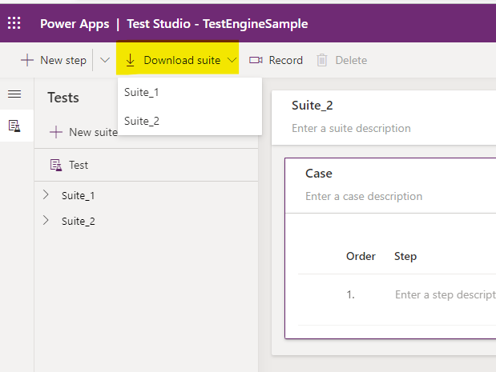
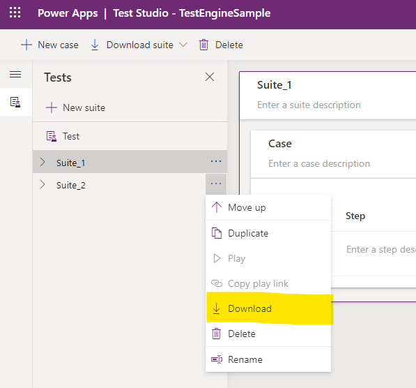

# Power Apps Test Engine overview (preview)

[!INCLUDE [preview-banner](../../../shared/preview-includes/preview-banner.md)]

Power Apps Test Engine is a component within the Power Platform CLI (PAC CLI) used for testing standalone canvas apps in Power Apps. You must [Install Microsoft Power Platform CLI](/power-platform/developer/cli/introduction#install-microsoft-power-platform-cli) to use the Test Engine.

[!INCLUDE [preview-note](../../../shared/preview-includes/preview-note.md)]

## Benefits

Power Apps Test Engine has the following benefits:

- **Power Fx test authoring**: Author tests in YAML format using the familiar Power Fx language.
- **DOM abstraction**: Use references to control names that are defined within Power Apps Studio when you author tests. You don't need to use JavaScript, or be familiar with the browser Document Object Model (DOM) rendered output of the app.
- **Connector mocking**: You can create mocks of network calls the app makes using connectors. You can test the app without modifying it and avoid unwanted side-effects of the external APIs.
- **Screenshot and video recording support**: You can use Test Engine to take screenshots and record videos of the test run. These images and recordings help diagnose failed tests and understand the actual experience of the failed test cases.

## Testing your app

Testing your app with Test Engine requires the following steps:

1. [Create a Test Plan](#create-a-test-plan)
1. [Set up your user](#set-up-your-user)
1. [Run the test](#run-the-test)
1. [View the results](#view-the-results)

### Create a Test Plan

Test plans are defined using [YAML](https://yaml.org/spec/1.2.2/) format. You can [author your own test plan](#author-your-own-test-plan) or [download recorded tests from Test Studio](#download-recorded-tests-from-test-studio).


<!-- TODO: This would be a good place to briefly explain the advantages of either choice -->

#### Author your own test plan

Create a yaml file using the test plan schema explained in [Power Apps Test Engine YAML format (preview)](yaml.md).

#### Download recorded tests from Test Studio

If you have tests that you have recorded in [Test Studio](../../maker/canvas-apps/test-studio.md), you can download them from Test Studio to reuse in Test Engine.

- Use the **Download suite** button in Test Studio to download the test plan. Choose the test suite to download if you have multiple test suites.

    

- Alternatively, use the **Download** button available under each test suite.

    

- Make sure you update the config file and user configurations if you're using a different tenant or environment for this app.

### Set up your user

Test Engine doesn't support multi-factor authentication. Use an account that requires only a username and password to sign in for your tests.

You can't store test credentials in test plan files. Store them in environment variables. The test plan file contains references to which environment variables are used for credentials. For example, the following YAML snippet indicates that the `user1Email` and `user1Password` environment variables are used:

```yaml
environmentVariables:
  users:
    - personaName: User1
      emailKey: user1Email
      passwordKey: user1Password
```

View [Users](yaml.md#users) for more information.

Use the following PowerShell script to store the username and password in your environment variables.

```powershell
$env:user1Email = "someone@example.com"
$env:user1Password = "fake password"
```

### Run the test

Use the PAC CLI [pac tests run](/power-platform/developer/cli/reference/tests#pac-tests-run) command to run your test plan. You must provide:

- Path to your test plan file
- EnvironmentId
- TenantId


### View the results

When the tests complete, you can view the results of your test in the `.trx` file located in the output directory. This folder contains any screenshots or videos captured by your tests when `recordVideo` is set to `true` in the test plan yaml.

## Limitations

The following are known limitations when working with Power Apps Test Engine.

- Multi-factor authentication isn't supported. Use an account that requires only a username and password to run your tests.
- Browser locale will follow your browser's default settings

### Supported Browsers

Test engine currently supports the following browsers.

- Chromium
- Firefox
- WebKit

## Additional considerations

The following are some additional things to consider for your test plans.

### Languages and regions that use period as the decimal separator

The syntax of Power Fx can differ based on your system's language settings. Use the `locale` property in the `testSettings` section of the test plan file to specify the locale in which your Power Fx is written. (See `locale` in [testSettings](yaml.md#testsettings)). This is useful if you're working across regions that use different decimal or thousands separators. For example, `,` instead of `.` for decimals and `;` instead of `,`.

See the following samples that have the `locale` property specified as examples of its usage:

1. `;` instead of `,` for separator - [testPlanForRegionUsePeriodAsDecimalSeparator.fx.yaml](https://github.com/microsoft/PowerApps-TestEngine/blob/main/samples/basicgallery/testPlanForRegionUseSemicolonAsSeparator.fx.yaml)
2. `,` instead of `.` for separator - [testPlanWithCommaForDecimal.fx.yaml.fx.yaml](https://github.com/microsoft/PowerApps-TestEngine/blob/main/samples/calculator/testPlanWithCommaForDecimal.fx.yaml)

### How apps are referenced in test plan files

The way that test plan files refer to the target app depends on whether or not the app is in a solution or not. We recommend using solutions whenever possible because they provide greater portability.

#### Working with apps within solutions

Test plan files for apps that are part of [Solutions overview](../../maker/data-platform/solutions-overview.md) are portable across environments. For solution-based apps, the test plan refers to the target app with a logical name (the app `LogicalName` property) which doesn't change if the app moves to a different environment.

1. Locate the Logical name for the app
   1. In the **Solutions** tab, open the solution that contains the app
   1. Select **Apps**
   1. Note the **Name** column. It's the app logical name (Not the **Display name**)
1. Update your test plan file
   1. Open the test plan YAML file for the app
   1. Fill in the **appLogicalName** value with the new App logical name

#### Working with apps outside of solutions

If you move an app that is _not_ part of a solution to a new environment, you'll need to manually update the test plan file to refer to the app. How to update a test plan file for a non-solution based app:

1. Locate the App ID for the app in its new location
   1. In the **Apps** list, locate the app and open the context menu
   1. Select **Details**
   1. Note the **App ID** GUID on the Details pane
1. Update your test plan file
   1. Open the test plan YAML file for the app
   1. Fill in the **appId** with the new App ID

### See also

[Power Apps Test Engine YAML format (preview)](yaml.md)   
[Power Apps Test Engine Power Fx functions (preview)](powerfx.md)   

[!INCLUDE [footer-banner](../../includes/footer-banner.md)]
