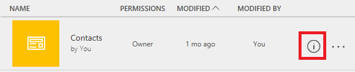

# Edit an app in PowerApps
Edit any app that you built, that you own, or for which you have **Can edit** permissions. You can edit an app in either PowerApps Studio for web or PowerApps Studio for Windows. If you try to edit an app that's open for editing elsewhere, a message tells you whether you already have it open or another user does.

## Verify your permissions
1. Sign in to [PowerApps](https://web.powerapps.com), and then click or tap **Apps** in the **File** menu (on the left edge).
   
    
2. Open the app-category selector, and then click or tap either **Apps I own** or **Apps I contribute to**.
   
    
   
    You can edit any app in the list that appears. You can also search for an app by typing one or more characters in the search box near the upper-right corner.
   
    > [!NOTE]
> If you still don't see the app that you want to edit, verify that you've selected the correct environment near the upper-right corner.
   
    

## Edit an app in PowerApps Studio for web
1. Follow the steps in the previous procedure to find the app that you want to edit.
2. Click or tap the app's info icon near the right edge.
   
    
3. Click or tap the **Edit** icon near the upper-right corner, and then click or tap **Edit on the web**.
   
    

## Edit an app in PowerApps Studio for Windows
1. Open PowerApps Studio for Windows.
2. On the page that appears by default, find the app that you want to edit.
   
    To find an app more easily, click or tap the search icon near the upper-right corner, and then type one or more characters in the name of the app. You can also sort the list by name, date most recently modified, or date most recently opened. If the app you want still doesn't appear, confirm that you're in the right PowerApps environment, as the first procedure describes.
   
    
3. Near the right edge, click or tap the pencil icon for the app that you want to edit.
   
    You can edit any app for which the pencil icon is black, not grey.
   
    

## Collaborate on an app
Anybody who has **Can edit** permission for an app can edit it, but only one person can edit an app at a time. If you try to edit an app that someone else is already editing, this message appears. You can't proceed until the other person closes the app (or that person's session times out).

In addition, this message appears if you open an app for editing and then try to open it on another device or in another browser window. You can override the previous session, but you might lose any changes that you haven't saved.

## Next Steps
Learn more about how to add a [screen](add-screen-context-variables.md), a [control](maker/add-configure-controls.md) or a [data connection](add-data-connection.md).

