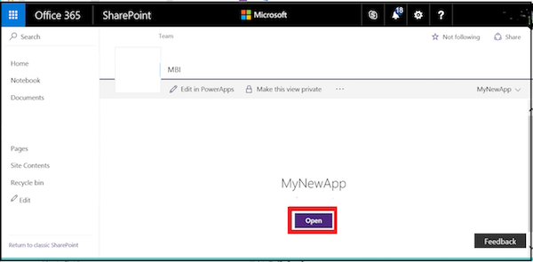
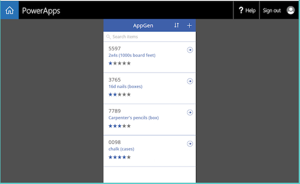

# Generate an app from within SharePoint using PowerApps

In PowerApps, automatically generate an app in which users can manage items in a custom SharePoint Online list. The app will have three screens in which users can:

* browse through all records in the list (**BrowseScreen1**)
* view all fields for a specific record (**DetailsScreen1**)
* create or edit a record (**EditScreen1**)

If you create an app of a custom list from the SharePoint Online command bar, the app appears as a view of that list. You can also run the app on a Windows Phone, iOS, or Android device, in addition to a web browser.

> [!IMPORTANT]
> PowerApps doesn't support all types of SharePoint data. For more information, see [Known issues](connections/connection-sharepoint-online.md#known-issues).

## Generate an app
1. Open a custom list in SharePoint Online, click or tap **PowerApps** on the command bar, and then click or tap **Create an app**.
   
    
2. In the panel that appears, type a name for your app, and then click or tap **Create**.
   
    
   
    A new tab appears in your web browser that shows the app that you automatically generated based on your SharePoint list.
   
      
3. Click or tap the browser tab for your SharePoint list, and then click or tap **Open**.
   
    > [!NOTE]
> You might need to refresh the browser window (for example, by pressing F5) before the app will open.
   
    
   
    The app opens in a separate browser tab.
   
    

## Manage the app

* If you click or tap **Edit in PowerApps**, the app opens in a separate browser tab where you can update the app in PowerApps Studio for the web.
* If you click or tap **Make this view public**, other people in your organization can view it. By default, only you can see views that you create. If you want to allow other people to edit your app, you need to [share it with them](share-app.md), and then grant **Contributor** permissions.
* If you click or tap **Remove this view**, you'll remove the view from SharePoint, but the app will remain in PowerApps unless you [delete it](delete-app.md).

## Next steps
* To add or update items in the list, see the "Manage the list using the app" section in [Open app from a SharePoint Online list](open-app-embedded-in-sharepoint.md).
* To customize the browse screen (which appears by default), see [Customize a layout](customize-layout-sharepoint.md).
* To customize the details or edit screens, see [Customize a form](customize-forms-sharepoint.md).
* If you want to delete the app, remove the view from SharePoint, and then [delete the app](delete-app.md) from PowerApps.

