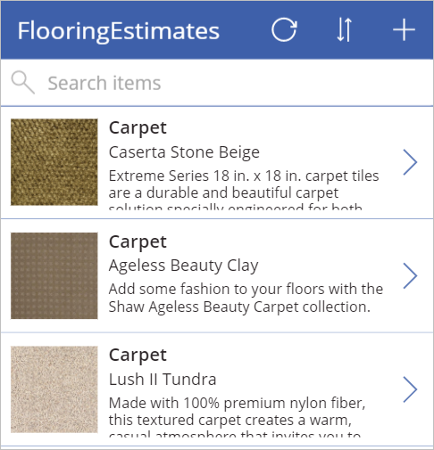

# Quickstart: Create an app using Excel

Using Excel data, create an app automatically within PowerApps. The Excel data can be in a cloud-storage account, such as OneDrive, Google Drive, Box, and so on. In this article, you create a new app, select an existing Excel file, and then see what you created.  

If you're not signed up for PowerApps, [sign up for free](https://web.powerapps.com/signup?redirect=marketing&email=).

## Prerequisites
Download the [flooring estimates Excel file](https://az787822.vo.msecnd.net/documentation/get-started-from-data/FlooringEstimates.xlsx), and save it in your [cloud storage account](connections/cloud-storage-blob-connections.md). This quickstart uses OneDrive for Business.
  
If the data is [formatted as a table](https://support.office.com/article/Create-an-Excel-table-in-a-worksheet-E81AA349-B006-4F8A-9806-5AF9DF0AC664), you can use your own Excel file. 

## Sign in to PowerApps

Open a web browser, and go to [https://web.powerapps.com]([https://web.powerapps.com). Sign in with your account.

## Choose the Excel table
1. In the left menu, select **Apps**, and then select **Create an app**.

2. In **Start with your data**, select **OneDrive for Business**. You may have to **Create** the connection. 

3. Select **FlooringEstimates.xlsx**, select the **FlooringEstimates** table, and then select **Connect**. It may take a few minutes to create your app.

    

## View your app   
In PowerApps Studio, select **See a preview of this app**. Play the app. Select the different flooring options, and use the arrows to navigate within your app. You can also sort the list, and add new items to the list.

## Next steps
