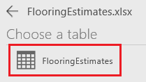
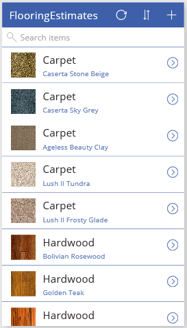
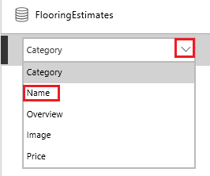
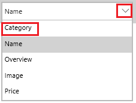
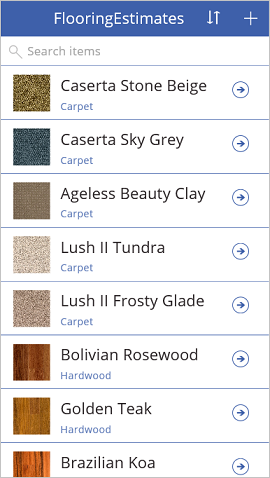
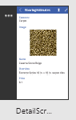
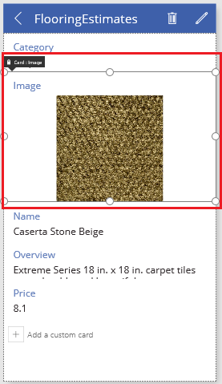
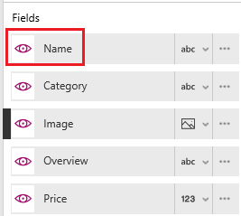
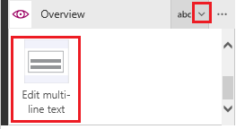
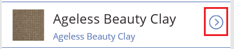

# Generate an app from Excel data
Create an app automatically based on data in an Excel file that you upload to a cloud-storage account, such as OneDrive. After you generate the app, customize it to better suit your needs, and then run it to make sure that it works as you expect.

Generated apps have three screens by default:

* **BrowseScreen1** shows a subset of one or more fields, a search bar, and a sort button that lets users easily find a specific record.
* **DetailsScreen1** shows more or all fields for a specific record.
* **EditScreen1** provides UI elements that let users create or update a record and save the changes.

> [!NOTE]
> You can also generate an app based on a [custom SharePoint list](app-from-sharepoint.md).

## Prerequisites
* [Sign up](signup-for-powerapps.md) for PowerApps, and then follow either of these steps:
  * Install [PowerApps Studio for Windows](http://aka.ms/powerappsinstall) on a computer that's running Windows 8, Windows 8.1, or Windows 10.
  * Open [PowerApps Studio for web](create-app-browser.md) (preview) in a browser.
* Sign in to PowerApps by using the same credentials that you used to sign up.
* To follow this tutorial exactly, download this [Excel file](https://az787822.vo.msecnd.net/documentation/get-started-from-data/FlooringEstimates.xlsx).
  
    > [!IMPORTANT]
> You can use your own Excel file if the data is formatted as a table. For more information, see [Create an Excel table in a worksheet](https://support.office.com/article/Create-an-Excel-table-in-a-worksheet-E81AA349-B006-4F8A-9806-5AF9DF0AC664).
* Upload the Excel file to OneDrive or another [cloud-storage account](connections/cloud-storage-blob-connections.md).

## Create an app
1. In PowerApps Studio, click or tap **New** on the **File** menu (near the left edge).
   
    
2. Follow any of these steps:
   
   * If your cloud-storage account appears under **Start with your data**, click or tap **Phone layout**.
     
     
   * If your cloud-storage account doesn't appear under **Start with your data**, click the arrow at the end of the row of tiles. If your account appears in the list of connections, click or tap that entry.
   * If your cloud-storage storage account doesn't appear under **Start with your data** or in the list of connections, click or tap **New connection**, and then click or tap the entry for your account. Click or tap **Connect**, and follow the prompts to configure the connection.
     
     
3. Under **Choose an Excel file**, browse to **FlooringEstimates.xlsx**, and then click or tap it.
   
      
4. Under **Choose a table**, click or tap **FlooringEstimates**.  
   
    
5. Click or tap **Connect** to generate the app.
6. If you're prompted to take an introductory tour, click or tap **Next** to get familiar with key areas of the PowerApps user interface (or click or tap **Skip**).
   
    
   
    > [!NOTE]
> You can always take the tour later by clicking or tapping the question-mark icon near the upper-right corner and then clicking or tapping **Take the intro tour**.

## Change the gallery layout
When an app is created, it has a default layout based on your data, but you can customize the gallery layout to fit your needs.

1. In the left navigation bar, click or tap an icon in the upper-right corner to switch to the thumbnail view.
   
    
2. Click or tap the top thumbnail to ensure that the browse screen (**BrowseScreen1**) is selected.
3. Click or tap anywhere in the gallery, such as the first image.
   
    
4. In the right-hand pane, open the **Layout** list, and then click or tap the layout that contains an image, a title, and a subtitle.
   
    
   
    The layout of the app changes to reflect your choice.
   
    

## Change the data that appears
1. Under **Search items**, click or tap **Carpet** to select the **Label** control.
   
   The associated list is highlighted in the right-hand pane.
   
   
2. In the right-hand pane, open the highlighted list, and then click or tap **Name**.
   
    
3. Open the bottom list, and then click or tap **Category**.
   
    
   
    **BrowseScreen1** changes to show a name and a category for each record.
   
    
   
    > [!NOTE]
> By default, you can scroll through the list (called a gallery) by using a mouse wheel or by swiping up and down on a touch screen. To use either a trackpad or a mouse without a wheel, select the gallery, click or tap **Show Scrollbar** in the property list, and then replace **false** with **true** in the formula bar.

## Change the order of fields in a form
1. In the left navigation bar, click or tap the middle thumbnail to open the details screen (**DetailsScreen1**).
   
    
2. Click or tap the image to show options that are available to customize the form.
   
    
3. In the right-hand pane, drag the **Name** field to the top of the list.
   
    
   
    The screen updates to reflect the changes you made.
   
    

## Change a control
1. In the left navigation bar, click or tap the bottom thumbnail to open the edit screen (**EditScreen1**).
   
    
2. Click or tap **Overview**.
   
    This step selects the Overview card. Each card contains text that describes the purpose of the card. You can also customize the controls on a card. For more information, see [Card control in PowerApps](controls/control-card.md).
   
    
3. In the right-hand pane, click or tap the down arrow for the card, scroll down, and then click or tap **Edit multi-line text**.
   
    This step shows an overview of each product in a control that's large enough to display the text.
   
    

## Run the app
As you customize an app, you can test your changes by running the app in Preview mode.

1. In the left navigation bar, click or tap the top thumbnail to open the browse screen (**BrowseScreen1**).
2. Open Preview mode by pressing F5 or by clicking or tapping the **Play** button near the upper-right corner.
   
    
3. On **BrowseScreen1**, click or tap the arrow to the right of a record to show the record in the details screen (**DetailsScreen1**).
   
    
4. On **DetailsScreen1**, click or tap the pencil icon in the upper-right corner to show the record in the edit screen (**EditScreen1**).
   
    
5. On **EditScreen1**, change the information in one or more fields, and then click or tap the check mark in the upper-right corner to save your changes.
   
    
6. Close Preview mode by pressing Esc (or by clicking or tapping the close icon below the title bar).
   
    

### Known limitations
For information about how to share Excel data within your organization, [review these limitations](connections/cloud-storage-blob-connections.md#sharing-excel-tables).

## Next steps
* To save the app so that you can run it from other devices, press Ctrl-S.
* Now that you've learned how to generate an app from data, you can [create an app from scratch](get-started-create-from-blank.md).
* [Share the app](share-app.md) so that other people can run it.

