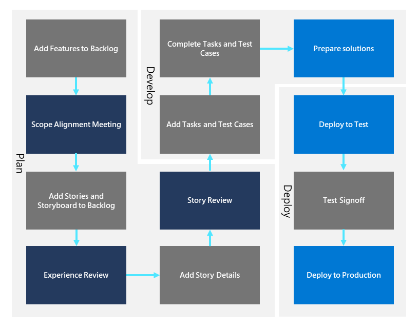

# Co-development governance
Establishing an effective co-development governance framework is an important part of ensuring consistency and repeatability in maker-defined projects and fusion teams. This article describes an approach to defining a governance flowchart. 

## Defining the end-to-end process
You can use the following process as an example and customize it to your organization’s best practices. It isn't necessary to complete every single step, as long as you achieve the required outcome. 

### Add features to backlog
Backlogs enable you to plan your project by adding features that drive the overall experience. The backlog also provides the overall roadmap that the team intends to deliver.

When adding a new feature to the backlog, the goal is to describe the general scope. Each feature then defines the business value, draft story titles, scope, and data model changes that drive the code development efforts. 

In addition, when adding a business-critical feature, you're recommended to identify any critical scenarios to automate your testing. After you've added your feature(s), you can schedule your Scope Alignment Meeting.

### Scope alignment meeting
The focus of this meeting should be limited to reviewing each proposed new feature, then checking for any existing apps, scenarios, or data models that already provide this functionality to avoid duplication of efforts. This meeting also provides the opportunity to discuss the impact on other apps. Finally, you should check if this feature requires an Experience Review.

### Add stories and storyboard to backlog
After the scope alignment meeting, any draft user story titles can be added under the feature. At this point, details aren't required, and the status of the user story is "New". You can view stories either in the backlog or board view.

The following figure shows a sample user story added to a backlog.
 

At this point, it's vital to maintain quality by organizing work by work stream and application. This approach helps keep related work items together and enables experts in each workstream to develop and maintain deep understanding of the functionality and data usage within each app. 

### Experience review
Experience Reviews should focus on the end user experience and ensure that your team follows organizational best practices. This consistency ensures that all your apps provide a dependable and repeatable experience for end users and support teams.

### Add story details
Adding a typical user story may incorporate the following information:
1. **Title**: As a \<persona\>, I can \<do something\> so that \<impact/priority/value\>
1. **Description**: The description includes (although it isn't limited to) certain key details, such as:
    - Brief description of the scenario that summarizes the desired outcome
    - Narrative - describes the actions users will take to navigate and accomplish the scenario
    - Alternative narrative - describes other ways users can accomplish the same outcome
    - Design Notes – records the entity, fields, views, mockup screens, and business rules associated with the user story
    - Security Roles Impacted - lists all the security roles impacted or that are relevant to the user story. 

After adding all these details, you would change the state of the user story to "Ready for Review". In most cases, the feature team and business team (if applicable) review the user stories.

### Story review
Story Reviews typically occur within the fusion team to ensure that all the details are called out in the story and that there's no ambiguity. Following completion of all the reviews, the recommendation is to assign the user story to a team member.
Ensuring that your team stays aligned during the development process is vital to achieving your overall goals. 

### Add tasks and test cases
After reviewing the stories, team members create tasks in [Azure DevOps](https://azure.microsoft.com/services/devops/). The overall process for adding tasks and test cases is as follows:
1. Open a sprint backlog. Alternatively, create a new sprint.
1. Add existing work items to the sprint. If you’ve already added work items that don’t appear in the sprint, then you should check their area and iteration paths. Remember to assign any unparented tasks to the relevant work items.
1. Add tasks to backlog items. If you don’t have backlog items assigned to your sprint, then do that now. Also set the sprint start and end dates.
1. Fill out the task form. As a rule of thumb, tasks should take no longer than a day to complete. Tasks that are larger than this timescale should be broken down. 
1. Track or integrate any unparented tasks. You can track unparented tasks just like other tasks or drag them to an existing backlog item to parent them. 

After adding tasks and test cases, you can then go on to set sprint capacity.

For more information on adding tasks, see [Add tasks to backlog](/azure/devops/boards/sprints/add-tasks) items to support sprint planning.

### Prepare solutions

An important aspect to successful co-development is a structured release management process. Solutions are the mechanism for implementing [application lifecycle management](/power-platform/alm/overview-alm) (ALM); you use solutions to distribute components across environments through export and import activities. A component represents an artifact used in your application and something that you can potentially customize. Anything that can be included in a solution is a component, such as tables, columns, canvas and model-driven apps, Power Automate flows, chatbots, charts, and plug-ins.  

> [!IMPORTANT]
> During release planning, determine the strategy for managing [solutions](/power-platform/alm/solution-concepts-alm) in your project. Use solutions to manage your project and easily find components you've created to then distribute to other environments.  

#### Deployments

Components can take multiple sprints to complete depending on the complexity and team velocity.  Components should be [added](/power-platform/alm/update-solutions-alm) to a solution in a development environment as tasks get completed. Solutions are then imported to a production environment after they are tested. We recommend that you also maintain one test environment to perform end-to-end testing and try out solution deployment before going to production.

#### Power Platform environments

[Environments](/power-platform/alm/basics-alm#types-of-environments-used-in-alm) are a space to store, manage, and share your organization's business data, apps, and business processes. They also serve as containers to separate apps that might have different roles, security requirements, or target audiences. 

If your organization has a multi-team fusion setup where each team is developing their own solutions, it is important to coordinate the duration of sprints and releases. Sprints do not have to be of a consistent length along a project timeline and can vary in duration between teams, according to each group's preferences. However, the release cadence cannot be less than the shortest sprint duration across all teams.   

#### Source control
Consider adopting a source code control system like Azure DevOps. [Azure DevOps](/azure/devops) provides developer services for support teams to plan work, collaborate on code development, and build and deploy applications.

Export a solution from your development environment containing your apps and customizations, unpack your solution, and store the components in your source control system. 

#### Advanced topic: Pull request (PR) reviews

You should only create PRs for stories that are active and have had features reviewed and approved. You should ensure that solution versioning is accurate, following the sprint and dev guidelines set out in [Implement Scrum practices for your team in Azure Boards](/azure/devops/boards/sprints/scrum-overview). Test results from the PR can be screenshots or videos that depict the functionality being built.

Automating the PR governance process helps ensure code quality without requiring a manual review of basic checks such as solution versions. 

> [!NOTE]
> Use the [PR checker tool](community-solutions-tools.md#pull-request-checker) to automate the pull request checking process.

## Templates and standardization

Templates and standardization deliver efficiency by helping to promote consistency within the team. All aspects of the team’s operations&#8212;whether that is onboarding tasks, story review presentations, or [work item templates](/azure/devops/boards/backlogs/work-item-template?tabs=browser) that help save time and provide guidance to teams when defining user stories, features, bugs, or tasks&#8212;benefit from standardization and simplification. 

## Implementing an effective support model
An effective support model is essential for the long-term success of an application after its deployment, as highlighted in the earlier section about generating a support matrix. Bugs and outages are inevitable, so it is vital that the team has a structured approach for dealing with these occurrences, and the support matrix provides the necessary framework. 

### Creating the service level agreement
A key factor in any support model is the definition of the Service Level Agreement (SLA). The SLA should be a formal document that the team draws up that contains sections that cover the following items:
- **Outages** – what level of service outage is acceptable, whom to inform, what actions to take, confirmation of service resumption, and actions to prevent a repeat. Any automated testing procedures that the team uses need to align with the expected outage tolerance and the applicable SLA.
- **Bugs** – who can notify, assignment of severity levels, classification, actions on detection, who is responsible for resolving and signing off.
- **Escalations** – escalation levels, assignment of staff to levels, responsibilities at each level, distribution lists for each level, and so on.

The SLA should be stored in the team’s documentation portal and updated as required. 

### Delivering application support
The best approach for delivering the application support specified in the SLA is for the team that created the solution also to be responsible for supporting it. The advantages of this system are:
1. It encourages better quality development, because those who created the app know that they're going to have to support it.
1. The creators will be able to find and fix bugs quicker than a third-party team, simply because they know the app better. 
1. Delegating the fixing of potentially mission-critical software to another group can be demoralizing and time-consuming for that group.
As with other phases of application creation, development, and deployment, the fusion team should partner with IT for assistance when required.

## Monitoring application satisfaction and usability
The final part of the support effort is monitoring and assessing the satisfaction and usability of the deployed app. Metrics are useful here, along with more traditional methods, such as polling and questionnaires. For more information about monitoring app usage, see [Admin Analytics for Power Apps](/azure/devops/boards/backlogs/work-item-template?tabs=browser). 

Ultimately, if customers aren’t using a published app, then that app isn’t fulfilling its purpose. Regular review meetings can check on these satisfaction and usability metrics to create a positive feedback loop that can alter or add stories to the backlog to generate and then deploy an updated version of the app. 

## Summary
The development of no-code and low-code tools such as Power Apps has expanded options for business technologists or makers to create, develop, and deploy apps. This development works best within a fusion team environment, comprising a product owner, a domain expert, a pro dev, and an administrator, with this team bringing in other resources as required. 

Integrating agile and scrum development approaches within fusion teams results in more rapid app development and a higher probability of successful deployment with a feature set that makes a significant difference to the business. By applying these best practices, guidelines, and recommendations, your fusion team will be able to use Power Apps to address your organization’s digital transformation challenges.  

> [!div class="nextstepaction"]
> [Next step: Try community solutions and tools](community-solutions-tools.md)
