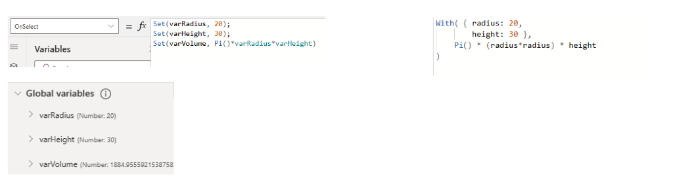
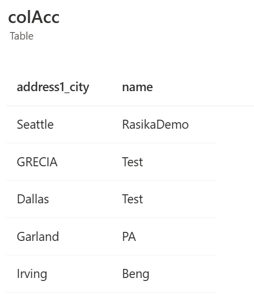
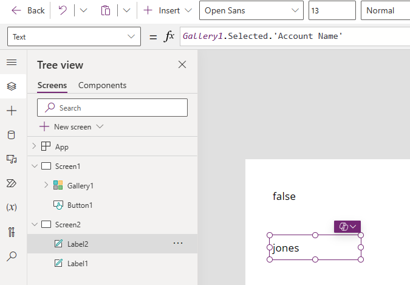

# Code optimization

As canvas apps evolve to meet diverse business requirements, the challenge of maintaining optimal performance becomes a critical consideration. The intricacies of data handling, user interface design, and functionality within canvas apps necessitate a nuanced approach to code optimization.

As canvas apps become more intricate, developers encounter challenges related to data retrieval, formula complexity, and rendering speeds. The need to strike a balance between robust functionality and responsive user interfaces underscores the importance of adopting a systematic approach to code optimization.

## Power Fx formulas optimization

### With function

The `With` function evaluates a formula for a single record. The formula can calculate a value and/or perform actions, such as modifying data or working with a connection. Use With to improve the readability of complex formulas by dividing it into smaller named sub-formulas. These named values act like simple local variables confined to the scope of the With. Using With is preferred over context or global variables as it is self contained, easy to understand, and can be used in any declarative formula context. [Learn more](/power-platform/power-fx/reference/function-with) about the `With` function.



### Concurrent function

The `Concurrent` function allows multiple formulas specified within the same property to be evaluated at the same time if they have connector or Dataverse calls. Normally, multiple formulas are evaluated by chaining them together with the `;` (semi-colon) operator, which evaluates each formula sequentially. With the `Concurrent` function, the app will evaluate all formulas within a property concurrently even after using the `;` operator. This concurrency helps users wait less for the same result. When data calls don't start until the previous calls finish, the app must wait for the sum of all request times. If data calls start at the same time, the app needs to wait only for the longest request time. [Learn more](/power-platform/power-fx/reference/function-concurrent) about the `Concurrent` function.

```powerappsfl
Concurrent(
    ClearCollect(colAccounts1, Accounts),
    ClearCollect(colUsers1, Users),
    ClearCollect(colEnvDef1, 'Environment Variable Definitions'),
    ClearCollect(colEnvVal1, 'Environment Variable Values')
);
```

### Coalesce Function

The `Coalesce` function evaluates its arguments in order and returns the first value that isn't blank or an empty string. Use this function to replace a blank value or empty string with a different value but leave nonblank and nonempty string values unchanged. If all the arguments are blank or empty strings, then the function returns blank, making Coalesce a good way to convert empty strings to blank values.

For example:

```powerappsfl
If(Not IsBlank(value1), value1, Not IsBlank(value2), value2)
```

Requires value 1 and value 2 to be evaluated twice. This function can be reduced to:

```powerappsfl
Coalesce(value1, value2)
```

### IsMatch function

The `IsMatch` function tests whether a text string matches a pattern that can comprise ordinary characters, predefined patterns, or a regular expression. [Learn more](/power-platform/power-fx/reference/function-ismatch) about the `IsMatch` function.

For example, this formula matches a United States Social Security Number:

```powerappsfl
IsMatch(TextInput1.Text, "\d{3}-\d{2}-\d{4}")
```

Explanation of the regular expression:

`\\d` Matches any digit (0-9).

`{3}` Specifies that the preceding digit pattern (\\d) should occur exactly three times.

`-` Matches the hyphen character.

`{2}` Specifies that the preceding digit pattern (\\d) should occur exactly two times.

`{4}` Specifies that the preceding digit pattern (\\d) should occur exactly four times.

More examples of `IsMatch`:

```powerappsfl
IsMatch(TextInput1.Text, "Hello World")
IsMatch(TextInput1\_2.Text, "(?!^\[0-9\]\\\*$)(?!^\[a-zA-Z\]\\\*$)(\[a-zA-Z0-9\]{8,10})")
```

## Optimize app OnStart

The `OnStart` property for cavas apps plays a crucial role in defining actions that occur when the app is launched. This property allows app developers to execute global initialization tasks, set up variables, and perform actions that should happen only once during the app's startup process. understanding and effectively utilizing the `OnStart` property is essential for creating responsive and efficient canvas apps.

A recommended approach is to streamline the `App.OnStart` function by migrating variable setups to named formulas. Named formulas, especially those configured early in the app lifecycle, prove to be advantageous. These formulas handle the initialization of variables based on data calls, providing a cleaner and more organized structure for your code. More details [Build large and complex canvas apps - Power Apps | Microsoft Learn](/power-apps/maker/canvas-apps/working-with-large-apps#split-up-long-formulas).

> [!NOTE]
> The `OnStart` property is **Imperative.** It's an ordered list of work that needs to be done before the first screen is shown. Because it's so specific about not only *what* needs to be done, but also *when* that work must be done based on order, it limits the reordering and deferring optimizations that could otherwise be done.

### Start screen

If `App.OnStart` contains a `Navigate` function call, even if it is in an `If` function and rarely called, we must complete execution of the App.`OnStart` before we show the first screen of the app. `App.StartScreen` is the new declarative way to indicate which screen should be shown first, that doesn't block optimizations.

Setting the `StartScreen` property shows the first screen before `App.OnStart` is complete. `App.StartScreen declares` which screen object to show first without requiring any preprocessing.

Instead of writing code like:

```powerappsfl
App.OnStart = Collect(OrdersCache, Orders);
If(Param("AdminMode") = "1", Navigate(AdminScreen), Navigate(HomeScreen))
```

Change the code to:

```powerappsfl
App.OnStart = Collect(OrdersCache, Orders);
App.StartScreen = If(Param("AdminMode") = "1", AdminScreen, HomeScreen)
```

Refer to <https://Power Apps.microsoft.com/en-us/blog/app-startscreen-a-new-declarative-alternative-to-navigate-in-app-onstart/> for more details.

> [!WARNING]
> Avoid dependencies between `StartScreen` and `OnStart`. Referencing a named formulat that in turn references a global variable may cause a race condition in which `StartScreen` is not applied correctly. 
**Note**: we should not have dependencies between StartScreen and OnStart. We block referencing global variables in StartScreen, but we can reference a named formula, that in turn references a global variable, and that may cause a race condition in which the StartScreen is not applied correctly.

### Named formulas

Named formulas are static or constants that can be defined on App.Formulas section. Once declared in App.Formulas, they can be used anywhere in the app and their value always remain up to date. Named Formulas in Power Apps enable the definition of values or sets of values that are automatically managed and updated by the platform. This functionality transfers the responsibility of value calculation and upkeep from the developer to Power Apps, streamlining the development process. Named Formulas in Power Apps are a powerful functionality that can significantly enhance app performance and maintainability.

Named formulas can also address is declaring app themes. In many cases where enterprise apps are build, we want the app to have common themes to give consistent look and user experience. To create a theme, there are 10s and 100s of variables that need to be declared on App OnStart. This increased code length and initialization time of the app.

Modern controls can also help significantly with theming and help reduce customer written logic to handle theming. Modern controls are currently in preview.

For example, the following code on `App.OnStart` can be moved to `App.Formulas`, thus reducing the startup time on global variable declarations.

```powerappsfl
Set(BoardDark, RGBA(181,136,99, 1));
Set(BoardSelect, RGBA(34,177,76,1));
Set(BoardRowWidth, 10);                      // expected 8 plus two guard characters for regular expressions.
Set(BoardMetadata, 8 \* BoardRowWidth + 1);   // which player is next, have pieces moved for castling rules, etc.
Set(BoardBlank, "----------------------------------------------------------------\_00000000000000");
Set(BoardClassic, "RNBQKBNR\_\_PPPPPPPP------------------------\_--------\_\_pppppppp\_\_rnbqkbnr\_\_0000000000");
```

The code can be moved to App.Formulas as follows:

```powerappsfl
BoardSize = 70;
BoardLight = RGBA(240,217,181, 1);
BoardDark = RGBA(181,136,99, 1);
BoardSelect = RGBA(34,177,76,1);
BoardRowWidth = 10;                      // expected 8 plus two guard characters for regular expressions
BoardMetadata = 8 \* BoardRowWidth + 1;   // which player is next, have pieces moved for castling rules, etc.
BoardBlank = "----------------------------------------------------------------\_00000000000000";
BoardClassic = "RNBQKBNR\_\_PPPPPPPP------------------------\_--------\_\_pppppppp\_\_rnbqkbnr\_\_0000000000";
```

Another example is inn setting `Lookups`. Here, a change is required in a Lookup formula to get the user information from Office 365, instead of Dataverse. There's only one place the change is required without changing the code everywhere.

```powerappsfl
UserEmail = User().Email;
UserInfo = LookUp(Users, 'Primary Email' = User().Email);
UserTitle = UserInfo.Title;
UserPhone = Switch(UserInfo.'Preferred Phone', 'Preferred Phone (Users)'.'Mobile Phone', UserInfo.'Mobile Phone',
UserInfo.'Main Phone');
```

These formulas embody the essence of calculation. They articulate the process for determining `UserEmail`, `UserInfo`, `UserTitle`, and `UserPhone` based on other values. This logic is encapsulated, enabling widespread utilization throughout the app, and can be modified in a singular location. The adaptability extends to switching from the Dataverse Users table to the Office 365 connector without necessitating alterations to formulas scattered across the app.

Another approach is to optimize `countRows`.

```powerappsfl
varListItems = CountRows(SampleList)
```

With `Set` Function, variable `varListItems` will have to be initialized with the initial count of rows in sample list and set again after the list items were added or removed. With Named formulas, as the data changes, the varListitems variables get updated automatically.

Named Formulas in the `App.Formulas` property provide a more flexible and declarative approach for managing values and calculations throughout the app, offering advantages in terms of timing independence, automatic updates, maintainability, and immutable definitions compared to relying solely on `App.OnStart`.

| Aspect                | Named Formulas (App.Formulas)                                     | App.OnStart                                                              |
|-----------------------|-------------------------------------------------------------------|--------------------------------------------------------------------------|
| Timing Independence   | Formulas are available instantly, can be calculated in any order. | Variables may introduce timing dependencies, impacting availability.     |
| Automatic Updates     | Formulas automatically update when dependencies change.           | Variables are set once during startup; manual updates may be needed.     |
| Maintainability       | Centralized formulas in one location improve maintainability.     | Scattered variables may require finding and updating in multiple places. |
| Immutable Definitions | Formula definitions in App.Formulas are immutable.                | Variable values may be susceptible to accidental changes.                |

### User defined functions

User Defined Functions is an experimental functionality in Power Apps Authoring Studio that enables users to create their own custom function.

To use this feature, under experimental settings, select New analysis engine and User-defined function (UDFs)

Define a formula under `App.Formulas` as follows:

`FunctionName(Parameter1:DataType1, Parameter2:DataType2):OutputDataType = Formula`

The code works as so:

- `FunctionName` is used to invoke the function

- `Parameter` is the name of the input. One or more inputs are allowed

- `DataType` is an argument passed into the function must match this data type. Available data types include Boolean, Color, Date, Datetime, GUID, Hyperlink, Text, Time, Untyped Object

- `OutputDataType` is the data type the output of the function will be in

- `Formula` is the output of the function

```powerappsfl
// Function to calculate the area of a circle based on the radius
calcAreaOfCircle(radius: Number): Number = 
    IfError(Pi() * radius * radius, 0);
```

Use `IfError` to implement error handling within the defined function.

Call the defined function from text/label control.

`calcAreaOfCircle(Int(*TextInput1*.Text))`

> [!NOTE]
> This is an experimental feature and subject to change. Some data types, such as records and filters, aren't yet supported.

## Optimize variables

Variables are used to define and set local and global values to be used everywhere in the apps. While they're convenient too many of them can cause the app to be less optimized.

The following example demonstrates setting a variable for each attribute of an object, which requires using `Set` for every property.

```powerappsfl
Set(varEmpName, Office365Users.MyProfile().DisplayName);
Set(varEmpCity, Office365Users.MyProfile().City);
Set(varEmpPhone, Office365Users.MyProfile().BusinessPhones);
Set(varEmpUPN, Office365Users.MyProfile().UserPrincipalName);
Set(varEmpMgrName, Office365Users.ManagerV2(varEmpUPN).DisplayName);
```

A more optimized approach is to use the property when you need it:

```powerappsfl
Set(varEmployee, Office365Users.MyProfile())
"Welcome " & varEmployee.DisplayName
```

Use context variables and global variables wisely. If a variable's scope expands beyond a single screen, then consider using global variables instead of context variables.

Too many unused variables contribute to increased memory usage and slightly slower app initialization. This is because resources are allocated for these variables even though they aren't actively used. Too many unused variables can also lead to overall complexity of the app's logic. While the impact of unused variables might not be severe, it's a good practice to maintain a clean and well-organized Power App to ensure optimal performance and ease of development.

## Optimize collections

Collections are temporary data storage structures that can be used to store and manipulate data within a Power Apps app. However, there's a fine line on when collections can lead to performance overhead. Therefore, limit your use of collections. Try to use them only when they're necessary.

```powerappsfl
// Use this pattern
ClearCollect(colErrors, {Text: gblErrorText, Code: gblErrorCode});

// Do not use this pattern
Clear(colErrors);
Collect(colErrors, {Text: gblErrorText, Code: gblErrorCode});
```

To count the records in a local collection, use `CountIf` instead of `Count(Filter())`.

Consider this guidance when working with collections:

**Limit the size and number of collections**. Since collections are local to the app, they're stored in the mobile device memory. The more data the collections hold or more the number of collections, the poorer the performance. Use `ShowColumns` function to get only the specific columns. Add `Filter` function to get only the relevant data.

The following example function returns the entire dataset.

```powerappsfl
ClearCollect(colDemoAccount, Accounts);
```

Compare to the below code that is going to return only specific records and columns:

```powerappsfl
ClearCollect(colAcc,
              ShowColumns(
                Filter(Accounts, !IsBlank('Address 1: City')),
                "name","address1_city"))
```

The example code returns this dataset:



**Set a data source refresh frequency**. If you're adding new records to the collection, you need to refresh it or collect to it to get the new or changed records into the collection. If your data source is updated by multiple users, you need to refresh the collection to get the new or changed records. More refresh calls mean more interaction with the server.

### Cache data in collections and variables

A collection, essentially a table variable, is distinct in that it stores rows and columns of data rather than a single data item. Their utility lies in two main purposes: firstly, for aggregating data before transmitting it to the data source, and secondly, for caching information, eliminating the need for frequent queries to the data source. As collections align with the tabular structure of both the data source and Power Apps, they offer an efficient means of interacting with data, even in offline scenarios.

```powerappsfl
// Clear the contents of EmployeeCollection, it already contains data
ClearCollect(
    colEmployee,
    {
        Id: "1",
        Name: "John",
        Department: "IT"
    },
    {
        Id: "2",
        Name: "Nestor",
        Department: "IT"
    }
)
```

### Remove unused variables and media

While unused media and variables may not create a drastic impact on app performance, it's important to clean up your app from any unused media or variables.

- Unused media files contribute to overall increase in app size. This can lead to slower app load times.

- Unused variables contribute to increased memory usage and slightly slower app initialization. This is because resources are allocated for these variables even though they aren't actively used. Additionally too many unused variables can make lead to overall complexity of the app's logic.

- Use App Checker to review unused media and variables.

## Optimize screens and controls

### Avoid cross referencing controls

Controls that reference controls on other screens can slow down app loading and navigation. Doing this may force the app to load the other screens immediately, rather than waiting until the user navigates to that screen. To address this issue, use variables, collections, and navigation context to share state across screens instead.

Power Apps App checker within authoring studio, shows controls that are cross referenced. Review App checker regularly to address this issue.

Here's an example of Cross-referenced controls. In the image below Gallery 1 controls is cross referenced in Screen 2, Label 2 control.



If you reference a control from the first screen in the app in the second screen, there will be no performance hit as the first screen has already been loaded and this may actually be a good thing as the app declarative instead of using variables.

If you reference controls that have yet to be loaded, such as the first screen referencing a control named `Label 3` from screen 3, will require the screen to be loaded in memory.

### Enable DelayOutput for text controls

Delay output setting When set to true, user input is registered after half a second delay. Useful for delaying expensive operations until user completes inputting text, like filtering when input is used in other formulas.

For example, for a Gallery whose Items are Filtered depending on what is inputted into the TextInput control:

- With DelayOutput set to false, which is default, the Gallery is filtered as soon as any text is typed. If you have a gallery with lots of items, reloading the Gallery with changes right away slows down performance; it would be more advantageous to wait a little. This is practical when you're using the TextInput for a search string (See [Search](https://PowerApps.microsoft.com/en-us/tutorials/function-filter-lookup/) or the new StartsWith functions).

- With DelayOutput set to true, there's a second delay before the changes are detected. This is done to give you time to finish typing what you want. The delay works well when used to aid the TextInput.OnChange property. If you have actions tied to changes, you don't want them triggered until everything you want is typed into the field.

## Delegation and server side processing

### Delegation

Delegation in Power Apps is a concept that refers to the ability of the app to offload certain operations to the underlying data source rather than processing the operations within Power Apps itself. By using delegation in Power Apps, developers can create more efficient and scalable applications that perform well even in scenarios involving large datasets. It's important to be aware of delegation limitations for specific data sources and operations, and to design apps accordingly to achieve optimal performance.

> ![NOTE] Not all functions are delegable. Please refer to [Understanding Delegation](/power-apps/maker/canvas-apps/delegation-overview) to learn more about delegation.

Delegation has several advantages such as Query optimization and adds supports for large datasets. Additionally, if the source data changes frequently, delegation helps keep data up to date.

### Reduce API calls to data source

Sometimes, it may be convenient to just follow coding practices such as creating collections by performing joins within canvas app. Refer to the code below:

In this example, there are two tables, Drivers and Trucks. The developer writes the code to create a collection of drivers and truck details and for each truck, they're calling drivers who own the trucks.

```powerappsfl
// Bad code
ClearCollect(vartruckdata, AddColumns('Truck Details',
    "CITY",LookUp(Drivers, 'Truck Details'\[@'Dummy ID'\] = Drivers\[@'Truck Details'\],City),
        "FIRSTNAME",LookUp(Drivers, 'Truck Details'\[@'Dummy ID'\] = Drivers\[@'Truck Details'\],'Driver First Name'),
    "LASTNAME",LookUp(Drivers, 'Truck Details'\[@'Dummy ID'\] = Drivers\[@'Truck Details'\],'Driver Last Name'),
        "STATE",LookUp(Drivers, 'Truck Details'\[@'Dummy ID'\] = Drivers\[@'Truck Details'\],State)));
```

Performing such join operations from within canvas app can generate numerous calls to data source leading to very slow loading times.

A better approach is:

```powerappsfl
// Good code
Set(
    varTruckData,
    LookUp(
        Drivers,
        'Dummy ID' = ThisRecord.'Dummy ID',
        'Driver First Name'
    ) & LookUp(
        Drivers,
        'Dummy ID' = ThisRecord.'Dummy ID',
        'Driver Last Name'
        )
);

Set(
    varTruckData,
    With(
        {
            vDriver: LookUp(
                Drivers,
                'Dummy ID' = ThisRecord.'Dummy ID'
            )
        },
        vDriver.'Driver First Name' & vDriver.'Driver Last Name'
    )
)
```

In the real time scenario, it's possible to reduce loading times from 5 minutes to under 10 seconds by just correcting the data at the data source level.

### Server side processing

Different data sources such as SQL and Dataverse enable you to delegate data processing such as Filter and Lookups to the data source. In SQL Server, users can create views, which have content defined by a query. Similarly, with Dataverse, users can create low-code plugins to write logic for data processing at the server side and only get the final results in canvas apps.

Delegating data processing to server can improve overall performance, reduce code on the client side and are easy to maintain.

Learn more about [plugins in Dataverse](/power-apps/maker/data-platform/low-code-plug-ins).

## Optimize query data patterns

### Use explicit column selection

The Explicit Column Selection (ECS) feature is enabled by default for all new apps. If it isn't enabled for your app, you should enable it. ECS automatically reduces the number of columns retrieved to only the ones that are used in the application. If ECS isn't enabled, you might be retrieving more data than you need, which can affect performance. Occasionally, when an app pulls data in through collections, the original lineage or source of a column can be lost. We don't know if it's being used and we drop it using ECS. You can usually force ECS to work for a missing column by using the PowerFx expression `ShowColumns` after a collection reference or by using it in a control.

### Avoid calling Power Automate to populate a collection

A common practice is to use Power Automate to fetch and populate collections in Power Apps. While this approach is valid, there are situations where it might not be the most efficient choice. Calling Power Automate comes with an overhead of network latency and adds a 0.6-second performance cost to instantiate the Power Automate flow.

Overuse of Power Automate flows can also lead to execution limits and throttling. Therefore always evaluate the trade-offs between network latency and performance cost.

### Eliminate N+1 problem

The N+1 problem is a common issue in database queries where, instead of fetching all the required data in a single query, multiple extra queries are made to retrieve related data. This can lead to performance issues, as each extra query incurs overhead.

A simple call like this to load a collection can generate N+1 calls to data source.

```powerappsfl
ClearCollect(MyCollection, OrdersList,
    {
        LookUp(CustomersList,CustomerID = OrdersList[@CustomerID])
    }
)
```

In the context of canvas apps and galleries, the N+1 problem may arise when working with data sources and galleries that display related records. The issue typically occurs when more queries are made for each item displayed in the gallery, leading to a performance bottleneck.

Use View objects in SQL Server to avoid N+1 query problem, or change the user interface to avoid triggering the N+1 scenario.

Dataverse automatically fetches the required data of related tables and you can select the columns from related tables.

`ThisItem.Account.'Account Name'`

If `RelatedDataSourc`e` size is small (<500 records), you can cache it in a collection and use the collection to drive the Lookup (N+1) query scenario.

### Limiting the package size

Although Power Apps does a lot to optimize app loading, you can take steps to reduce the footprint of your apps. A reduced footprint is especially important for users of older devices, or users in locales where there's higher latency or reduced bandwidth.

- Evaluate the media that are embedded in your app. If something isn't used, delete it.

- Embedded images might be too large. Instead of PNG files, see whether you can use SVG images. However, be careful about using text in SVG images, because the font that's used will have to be installed on the client. A great workaround when you need to show text is to superimpose a text label over an image.

- Evaluate whether the resolution is appropriate for the form factor. The resolution for a mobile app doesn't need to be as high as the resolution for a desktop app. Experiment to get the right balance of image quality and size.

- If you have unused screens, delete them. Be careful not to delete any hidden screens that only app makers or administrators use.

- Evaluate whether you're trying to fit too many workflows into one app. For example, do you have both admin screens and client screens in the same app? If so, consider breaking them into individual apps. This approach will also make it easier for multiple people to work on the apps at the same time, and it limits the "blast radius" (amount of testing) when app changes require a full test pass.

## Optimize ForAll

The `ForAll` function in Power Apps is used to iterate through a table of records and apply a formula or set of formulas to each record. While the function itself is versatile, improper use of ForAll function can quickly make your app less performant.

ForAll function is singular sequential function instead of concurrent function. Therefore it looks at only one record at a time, gets the result, then continues to the next until it has gone through all records in its scope.

**Avoid Nesting ForAll at all cost.** This can lead to exponential iterations and significantly impact performance.

```powerappsfl
ClearCollect(FollowUpMeetingAttendees.ForAll(ForAll(Distinct(AttendeesList.EmailAddress.Address).Lookup(Attendees))))
```

### Batch updates to Database

ForAll + Patch can be one approach to Batch update the database. However, be careful in using the order of For All and Patch.

Following function:

```powerappsfl
Patch(SampleFoodSalesData, ForAll(colSampleFoodSales,
    {
        demoName:"fromCanvas2"
    })
);
```

Has better performance than:

```powerappsfl
ForAll(colSampleFoodSales, Patch(SampleFoodSalesData,
    {
        demoName:"test"
    })
);
```

## Next step

> [!div class="nextstepaction"]
> [Error handling guidelines](error-handling.md)
