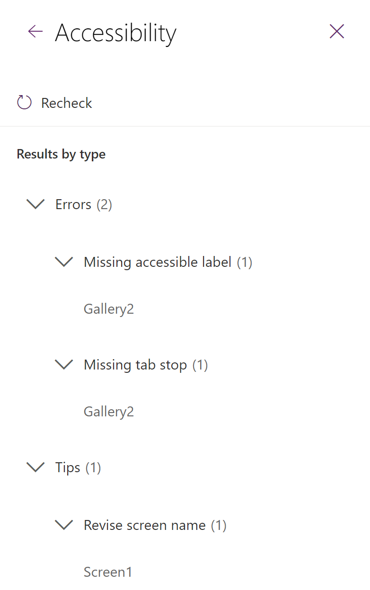

# Monitoring and testing

Power Apps Authoring provides various capabilities to validate the app for any warnings or errors, check monitor log for runtime performance and log app session details and traces to Application Insights for deeper analysis.  
These tools are really powerful and should be utilized to help build a strong, robust and a high performance app.

## Monitor

Power Apps Monitor is a debugging tool that can be used to monitor a stream of events from a users sessions to diagnose and troubleshoot problems specially related to performance.

The tool can be used from Power Apps studio or to monitor published apps during runtime. To access monitor for published app, go to App, select Details, and then select Monitor.


The monitor tool can return some important information, such as:

- Nature of the Operation such as `Select`, `Load Screen`, `Navigate`, `GetRows`, etc.

- Result and Result Info, indicating whether the call is Success, Failure or Warning, Result info includes information such as Number of rows returned, any runtime errors like 404 or 429 etc.

- Duration, which is the amount of time taken to complete a given request

- Data source and control information


On Selecting the event grid you can get some more information like Overview of the event, Formula that's related to the selected event, HTTP request sent and response received.


## App Checker

The introduction of the App checker represents a more streamlined method for identifying formula issues and addressing accessibility concerns within your app. Easily accessible through the App checker button situated in the upper right corner of Power Apps Studio, this tool presents a comprehensive list of formula-related issues and actionable recommendations. Its purpose extends beyond mere error detection, as it also contributes to improving debugging efficiency, optimizing performance, and ensuring alignment with best practices. The ongoing commitment of the Power Apps team involves continuous investment and expansion of the App checker, aiming to simplify the debugging process and empower developers with informed decision-making in app development.


### Accessibility Checker

The Accessibility Checker functions in a manner similar to the formula errors checker, scrutinizing your app for potential accessibility issues and presenting them in a comprehensive list. Presently, the Accessibility Checker offers guidance on enabling keyboard and screen reader support within apps, although it does not currently identify color contrast issues.

Upon select an item from the Accessibility Checker list, it opens the relevant property for addressing the identified issue. Clicking the right chevron reveals detailed information along with a link to additional resources providing insights into creating accessible apps. For more in-depth information on the Accessibility Checker and general principles of accessibility, refer [here](/power-apps/maker/canvas-apps/accessibility-checker).


## Application Insights

Azure Application Insights can be used to log telemetry data from Canvas apps in Power Apps. This integration allows you to monitor and gain insights into the performance and usage of your Canvas apps.

To setup Azure App Insights resource follow the given [steps](/power-apps/maker/canvas-apps/application-insights#create-an-application-insights-resource). App Insights can help you track following details from canvas apps

- Where the app is accessed from
- Which devices are used
- The browsers types used, OS and browser versions details of the users
- Number of users who viewed the app
- Region and location of the users
- Number of sessions by the users for the app
- Number of events logged from the app

To see **usage metrics within App Insights,**


You can use the `Trace` function to review the custom traces and unhandled errors within the App Insights. Trace function can be used to log custom telemetry from Canvas Apps to Azure Application Insights. Consider using this when you want to have feedback around User experience.

Formula details - [Trace function - Power Platform | Microsoft Learn](/power-platform/power-fx/reference/function-trace)

```typescript
Trace("App Feedback", 
    TraceSeverity.Information,
    {
        UserName: User().FullName,
        UserEmail: User().Email,
        Screen: FeedbackComponent.FeedbackScreen.Name,
        FeedbackValue: "-1"
    }
);

Notify("Thanks for you feedback!");
```

Once the traces are logged, you can view them by going to logs and review the traces table. Search with Message keyword to begin with.

```kusto
traces 
    | extend customdims = parse_json(customDimensions) 
    | where message == "App Feedback" 
    | project timestamp, message, 
        AppName = customdims.['ms-appName'], 
        AppId = customdims.['ms-appId'],     
        FeedbackFrom = customdims.UserEmail, 
        Screen = customdims.Screen, 
        FeedbackValue = customdims.FeedbackValue 
    | order by timestamp desc

traces
    | where timestamp > ago(30m)
    | where session_Id == "bc03290d-b9c5-4db4-b482-b11915c5efd4"
```

