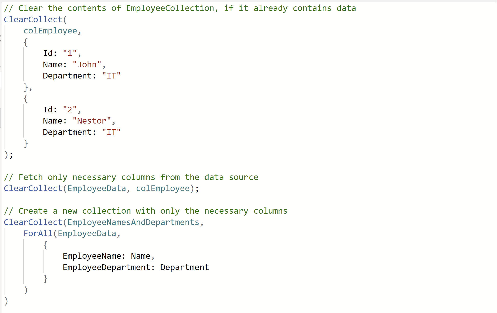

---
title: App design guidelines
description: App design guidelines
ms.date: 04/26/2024
ms.topic: conceptual
ms.service: powerapps
author: robstand
ms.author: rstand
 
---

# App design guidelines

## Modern controls

Modern controls in Canvas Power Apps represent a significant advancement in the development and design of user interfaces within the Microsoft ecosystem. Rooted in Microsoft's Fluent Design System, these controls are designed to deliver a fast, performance-oriented, and accessible user experience, all while ensuring seamless integration with theming capabilities. The introduction of these controls, including tab lists, progress bars, info buttons, spinners, and more, underscores a strategic shift towards creating more intuitive, responsive, and visually appealing applications. By using these modern controls, developers can easily implement sophisticated UI elements that are both aesthetically pleasing and functionally rich, enhancing the overall user engagement and satisfaction.

Furthermore, the inherent design of these controls, keeping theming in mind, allows for a unified and consistent look and feel across applications, significantly reducing the effort required in customizing and branding apps. The ability to automatically update the styles of all controls based on the set theme simplifies the design process and ensures that applications remain visually coherent throughout. This aligns perfectly with the needs of modern businesses seeking to maintain brand consistency while offering high-quality digital experiences. The modern controls also emphasize accessibility and performance, ensuring that applications are usable by a wide range of audiences, including those with disabilities, thereby aligning with inclusive design principles. As such, the modern controls in Canvas Power Apps aren't just a set of UI components but a transformative toolset that empowers developers to build more efficient, maintainable, accessible, and cohesive applications that meet the evolving needs of businesses and users alike.

Disclaimer: Be aware that, as of this writing, while a subset of the modern controls in Canvas Power Apps has been made generally available (GA), the broader feature set remains in preview. Users and developers are encouraged to explore and provide feedback on these preview controls. However, it's important to keep in mind that their features and functionalities may be refined based on user feedback and testing before they reach general availability.

## Forms design and guidelines

**Organize your form:**

- Divide your form into logical sections and group related fields together.

- Aim to keep your form on a single screen. If it's lengthy, consider dividing it into multiple screens, steps, or tabs.

- Use clear and simple language for field labels, avoiding unfamiliar terms or jargon.

- Implement validation rules to ensure data accuracy. For mandatory fields, clearly indicate that they're required. Validate email addresses, phone numbers, and other formats as needed.

**Reuse forms:**

Use a single form for creating new records, editing existing records, and displaying records in view-only mode.

Reusing the same form reduces development and maintenance time while ensuring consistency.

**Form modes**: Set the form mode dynamically based on user actions. For example:

- When creating a new record, set the form to "New" mode.

- When editing an existing record, set the form to "Edit" mode.

- When displaying a record, set the form to "View" mode.

**Control placement:**

Place different controls (such as gallery, display form, and edit form) on separate screens to make them distinguishable.

Combine these controls with formulas to create a cohesive user experience.

## Container vs Grouping Controls

As the Canvas App grows bigger in size to address more business scenarios, the number of controls continues to grow and it's required to organize the controls based on the function that they perform. One easy way to do this is to select the controls together and group them into a group.

However, grouping controls isn't always recommended.

Canvas App Container control can hold a set of controls and has its own properties.

**Container vs Grouping controls**

- When editing an app, you can select controls and group them using Ctrl + G or the context menu. You can modify common properties of controls within the group. Groups are an aid for app making. They don't have properties of their own and don't affect the layout of the app.

In contrast, containers are actual controls with their own properties like **Width** and **BorderColor**. Containers affect app layout and help screen reader users understand the structure of the app.

While you can add any controls in a group, you should only add logically related controls in a container.

- Organizing elements in Power Apps using groups allows users to apply shared properties to multiple elements. However, making individual property changes within a group may necessitate manual adjustments. Furthermore, groups don't have a presence in the logical structure of an app for accessibility reasons, as screen readers are unable to recognize them. Additionally, the inability to nest groups makes it challenging to create more intricate layouts.

In contrast, containers provide a more adaptable and efficient solution. Containers function as empty spaces where users can insert and organize controls in relation to the top-left corner of the container. Makers have the flexibility to nest containers, allowing for the creation of more complex layouts and providing freedom in design.

## Gallery Design and Guidelines

### Avoid Changing Gallery Items from Within

Avoid modifying the Items property of a gallery within child controls' events like OnChange or OnSelect. This can lead to unexpected behavior, especially when dealing with certain controls that trigger events when their values change.

**Be Cautious with OnChange Triggered Controls**

Be cautious when using controls like Combo box, Date picker, Slider, or Toggle in galleries. These controls may trigger the OnChange event unexpectedly, leading to potential issues like infinite loops.

**Performance Impact on Patching**

Be mindful of the performance impact when patching or updating items in a gallery, especially when dealing with a large number of items. Patching can be slow, and the gallery may reload all items, impacting performance.

**Handle Infinite Loops with Care**

If modifying gallery data triggers events that lead to infinite loops, consider using modern controls or controls that don't trigger OnChange when their data changes to break the loop.

**Avoid nested galleries**

Nested galleries can lead to performance issues and complex data binding.

Whenever possible, avoid nesting galleries. Instead, try to design your data structure and use functions in an optimized way.

**Flexible height galleries**

Fixed-height galleries may result in limited content visibility, especially when dealing with dynamic data.

Use flexible height galleries by setting the Height property to Parent.Height or a dynamic value based on your data. This ensures that the gallery adjusts its height to accommodate varying amounts of data.

### Optimize Data Loading

When optimizing data loading in Power Apps, you might want to fetch and display only the necessary columns in a gallery rather than retrieving the entire dataset.

Here's an example of how you can achieve this: Assuming you have a collection EmployeeData with multiple columns, and you want to display only the "Name" and "Department" columns in a gallery.

// Bind the EmployeeNamesAndDepartments collection to the gallery

Gallery1.Items = EmployeeNamesAndDepartments

For more information on Gallery best practices, see [here](/power-apps/maker/canvas-apps/gallery-best-practice).

## Building reusable components

### When to create Custom code components using Power Apps Component Framework (PCF)

Power Platform allows the creation of reusable components through Power Apps Component Framework (PCF). More details [here](/power-apps/developer/component-framework/overview).

Here are scenarios in which you might consider creating PCF components in Power Apps:

#### Complex UI Elements

When you need to create complex user interface elements or controls that aren't readily available in the standard Power Apps controls.

#### Custom Controls for Specific Requirements

When your app has specific requirements that aren't met by the out-of-the-box controls, and you need to create custom controls tailored to your needs.

#### Consistent User Experience Across Apps

When you want to maintain a consistent user experience across multiple Power Apps or environments by encapsulating specific functionalities within a PCF component.

#### Reusability Across Apps

When you anticipate the need to reuse a specific piece of functionality or user interface element in multiple apps, creating a PCF component allows you to build once and reuse.

#### Implementing Advanced Logic

When you need to implement advanced business logic or calculations that are beyond the capabilities of standard formulas or functions in Power Apps.

#### Improved User Experience

When you aim to enhance the overall user experience by creating visually appealing and interactive components that aren't achievable with the default controls.
