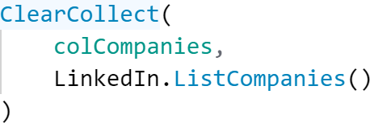
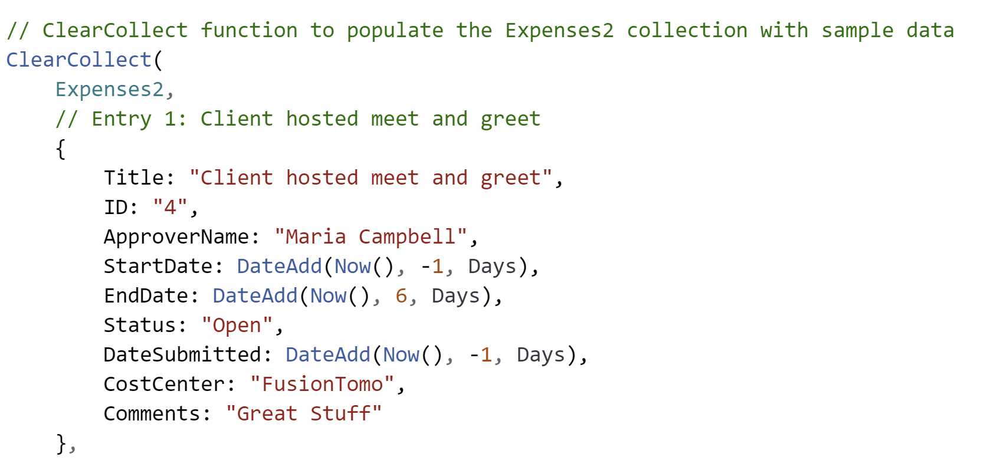

---
title: Code readability
description: Code readability
ms.date: 04-15-2024
ms.topic: conceptual
ms.service: powerapps
author: robstand
ms.author: rstand
manager: 
---

# Code Readability

## Naming Conventions

### General naming conventions

This section describes "camel case" and "Pascal case" naming conventions. If you're already familiar with those terms, you can skip ahead.

#### Camel case

You should use camel case for controls and variables. Camel case begins with a lowercase prefix, removes all spaces from object or variable names, and capitalizes the first letter of each word after the first. For example, a text input control might be named **txtUserEmailAddress**.

#### Pascal case

You should use Pascal case for data sources. Pascal case is sometimes referred to as "upper camel case." Like camel case, it removes all spaces and capitalizes the first letter of words. However, unlike camel case, Pascal case also capitalizes the first word. For example, a common data source in PowerApps is the Microsoft Office 365 Users connector, which is named Office365Users in your code.

### Screen Names

Screen names should reflect the purpose of the screen, so that it's easier to navigate through complex apps in Power Apps Studio.

What's less obvious is that screen names are read aloud by screen readers, which are needed for users who have vision accessibility needs. Therefore, ***it's imperative that you use plain language to name your screens, and that the names include spaces and no abbreviations***. Also, *we recommend that you end the name with the word "Screen," so that the context is understood when the name is announced.*

Here are some good examples:

-   Home\_Screen or Home Screen

-   Search\_Screen or Search Screen

Here are some bad examples:

-   Home

-   LoaderScreen

-   EmpProfDetails

-   Thrive Help

### Controls Names

All control names on the canvas should use camel case. They should begin with a three-character type descriptor, followed by the purpose of control. This approach helps identify the type of control and makes it easier to build formulas and search.

Here's a good example: lblUserName.

The following table shows the abbreviations for common controls. Detailed list of controls and their properties are listed here: [Controls reference document](https://learn.microsoft.com/en-us/power-apps/maker/canvas-apps/reference-properties)

| **Control name**                      | **Abbreviation** |
|---------------------------------------|------------------|
| Badge                                 | bdg              |
| Button                                | btn              |
| Camera control                        | cam              |
| Canvas                                | can              |
| Card                                  | crd              |
| Charts                                | chr              |
| CheckBox                              | chk              |
| Collection                            | col              |
| Combo box                             | Cmb              |
| Component                             | cmp              |
| Container                             | con              |
| Dates                                 | dte              |
| Drop down                             | drp              |
| Form                                  | frm              |
| Gallery                               | gal              |
| Group                                 | grp              |
| Header                                | hdr              |
| Html text                             | htm              |
| Icon                                  | ico              |
| Image                                 | img              |
| Info Button                           | info             |
| Label                                 | lbl              |
| Link                                  | lnk              |
| List box                              | lst              |
| Microphone                            | mic              |
| Microsoft Stream                      | str              |
| Page section shape                    | sec              |
| Pen Input                             | pen              |
| Power BI Tile                         | pbi              |
| Progress Bar                          | pbar             |
| Rating                                | rtg              |
| Rich text editor                      | rte              |
| Shapes (rectangle, circle, and so on) | shp              |
| Slider                                | sld              |
| Tab List                              | tbl              |
| Table                                 | tbl              |
| Text input                            | txt              |
| Timer                                 | tmr              |
| Toggle                                | tgl              |
| Video                                 | vid              |

**Note:** Control names must be unique across an application. If a control is reused on multiple screens, the short screen name should have a suffix – for example, galBottomNavMenuHS, where "HS" stands for "Home Screen." This approach makes it easier to reference the control in formulas across screens.

Here are some bad examples:

-   zipcode

-   Next

As the following image shows, if you consistently name your controls, your app will be much cleaner in the navigation view, and your code will be much cleaner too.

### Data Source Names

When you add a data source to your application, the name can't be changed in the Power Apps app. The name is inherited from the source connector or data entities that are derived from the connection.

Here are some examples:

- **Name inherited from the source connector:** The Office 365 Users connector is namedOffice365Users in your code.

- **Data entities derived from the connection:** A Microsoft SharePoint list that's named **Employees** is returned from the SharePoint connector. Therefore, the name of the data source in your code is Employees. The same Power Apps app can also use ***the same SharePoint connector*** to access a SharePoint list that's named Contractors. In this case, the name of the data source in the code is Contractors.

For more information about connectors and connections, see the [<u>Overview of canvas-app connectors</u>](https://docs.microsoft.com/en-us/powerapps/maker/canvas-apps/connections-list) [<u>for PowerApps</u>](https://docs.microsoft.com/en-us/powerapps/maker/canvas-apps/connections-list) article.

#### Standard action connectors

In Standard action connectors that expose functions, such as LinkedIn, you'll see that the data source name and its operations use Pascal casing (that is, UpperUpperUpper). For example, the LinkedIn data source is named LinkedIn and has an operation named ListCompanies.

#### Custom connectors

Custom connectors can be created by any maker in your environment. They're used to connect to custom application programming interfaces (APIs) such as third-party services or line-of-business APIs that your company has created. Pascal casing is also recommended for the data source name and its operations. Just be aware that the custom connector name and the way that it appears in PowerApps can differ.

For example, here's a custom connector named **MS Auction Item Bid API**.

But when you create a connection from this connector and add it to your PowerApps app as a data source, it appears as **AuctionItemBidAPI**.

To discover the reason, you can look inside the OpenAPI file. There, you'll see a title attribute that contains the text Auction Item Bid API.

Power Apps removes all the spaces from this attribute value and uses it as the name of your data source.

**Note:** We recommend that you change the value of this attribute to a Pascal-cased name such as AuctionItemBidAPI and use it as the name of your custom connection. In that way, there will be no confusion. Change this value before you import the OpenAPI file to create the custom connector.

**Note:** If you use the **Create from a blank** option instead of importing an existing OpenAPI file, PowerApps will prompt you for the custom connector name. This name will be used both as the name of the custom connector and as the value of the title attribute inside the OpenAPI file. Once again, if you just use a Pascal-cased name such as AuctionItemBidAPI, you'll be fine.

#### Excel DataTables

PowerApps uses DataTables in Microsoft Excel to connect to data in Excel worksheets. Keep these points in mind when you create Excel documents as data sources:

-   Give your DataTables descriptive names. You'll see the name in the Power Apps app when you write the code to connect to it.

-   Use one DataTable per worksheet.

-   Give the same name to the DataTable and worksheet.

-   Use descriptive column names in the DataTables.

-   Use Pascal casing. Each word of the DataTable name should begin with a capital letter (for example, EmployeeLeaveRequests).

### Untyped and dynamic objects

### Variables Names

Naming conventions for variables in Canvas apps are important for maintaining readability, consistency, and clarity in your Power Apps projects. While no strict standard is enforced, adopting a consistent naming convention across your Canvas app can make it easier for you and other collaborators to understand, use and manage the variables. Here are some common naming conventions for variables in Canvas apps:

- **Camel Case:**

Use camel case, where the first letter of each word is capitalized except for the first word. Example: myVariableName

- **Meaningful and Descriptive Names:**

Choose names that clearly describe the purpose or content of the variable. Avoid overly generic names like temp or var1. Instead, use descriptive names like userEmail or totalAmount.

- **Prefixes or Suffixes for Variable Types:**

Consider using prefixes or suffixes to indicate the type of variable. For instance:

-   *strUserName* for a text/string variable

-   *numTotalAmount* for a numeric variable

-   *boolIsEnabled* for a boolean variable

-   *locVarName* for local variables/context variables

-   *gblVarLoginUser* for global variables

<!-- -->

- **Consistent Use of Plural or Singular:**

Decide whether your variables should be named in the singular or plural form and stick to that convention. For example, consistently use userCount or users.

- **Avoid Reserved Words:**

Avoid using reserved words or names that might conflict with Power Apps functions or keywords. Check the Power Apps documentation for a list of reserved words.

- **Use Contextual Prefixes:**

Consider using prefixes that provide context about the variable's usage or scope. For example:

-   *frm* for form variables

-   *col* for collections

-   *var* for general-purpose variables

<!-- -->

- **Avoid Special Characters:**

Keep names alphanumeric and avoid special characters or spaces. Stick to letters and numbers.

***Be smart!*** PowerApps lets context variables and global variables share the same names. This can cause confusion because your formulas use context variables by default unless the [<u>disambiguation operator</u>](https://docs.microsoft.com/en-us/powerapps/maker/canvas-apps/functions/operators#disambiguation-operator) is used. Avoid this situation by following these conventions:

-   Prefix context variables with loc.

-   Prefix global variables with gbl.

-   The name after the prefix should indicate the intent/purpose of the variable. Multiple words can be used and don't have to be separated by any special characters (for example, spaces or underscores), provided that the first letter of each word is capitalized.

-   Use Camel casing. Begin your variable names with a prefix in lowercase letters, and then capitalize the first letter of each word in the name (that is, lowerUppperUpper).

Here are some good examples:

- **Global variable:** gblFocusedBorderColor

- **Context variable:** locSuccessMessage

- **Scope variable:** scpRadius

Here are some bad examples:

-   dSub

-   rstFlds

-   hideNxtBtn

-   ttlOppCt

-   cFV

-   cQId

Avoid short and cryptic variable names such as EID. Use EmployeeId instead.

**Note:** When there are many variables in an app, you can just type the prefix in the formula bar to see a list of the available variables. If you follow these guidelines to name your variables, you'll be able to find them very easily in the formula bar as you develop your app. Ultimately, this approach leads to quicker app development.

### Collection Names

-   Be descriptive of the collection's contents. Think about what the collection contains and/or how it's used, and then name it accordingly.

-   Collections should be prefixed with col.

-   The name after the prefix should indicate the intent or purpose of the collection. Multiple words can be used and don't have to be separated by spaces or underscores, provided that the first letter of each word is capitalized.

-   Use Camel casing. Begin your collection names with a lowercase col prefix, and then capitalize the first letter of each word in the name (that is, colUpperUpper).

Here are some good examples:

-   colMenuItems

-   colThriveApps

Here are some bad examples:

-   orderscoll

-   tempCollection

**Note:** When there are many collections in the app, you can just type the prefix in the formula bar to see a list of the available collections. As for variables, if you follow these guidelines to name your collections, you'll be able to find them very easily in the formula bar as you develop your app. Ultimately, this approach leads to quicker app development.

### Named Formula naming standards

## Comments and Documentation

As you write code for your application, emphasize the importance of comprehensive commenting. These comments not only serve as a helpful guide when you revisit the application months later but also extend a gesture of gratitude to the next developer who collaborates on the project.

There are two primary types of comments to enhance code clarity: Power Apps supports two comment styles: line comments, denoted by double forward slashes (//) for single-line remarks, and block comments enclosed within /\* and \*/ for multi-line annotations.

### Line Comments

Adding a double forward slash (//) to any line of code in PowerApps designates the rest of the line (including the //) as a comment.

Utilize line comments to elucidate the functionality of the subsequent code. They can also serve to temporarily disable a line of code, making them beneficial for testing purposes.

### Block Comments

Text enclosed within /\* and \*/ is recognized as a block comment. Unlike line comments that apply to a single line, block comments can span multiple lines.

Block comments prove useful for multiline explanations, such as documenting a code module header. They also facilitate temporarily disabling multiple lines of code during testing or debugging.

For optimal code organization, it is advisable to add comments after utilizing the Format Text feature. This is particularly beneficial if your comments precede a code block.

The Format Text feature follows these rules for existing comments:

1.  If a property begins with a block comment, the next line of code will be appended to it.

2.  If a property begins with a line comment, the next line of code won't be appended to it. Otherwise, the code will be commented out.

3.  Line and block comments elsewhere in the property will be appended to the previous line of code.

Don't worry about adding too many comments or comments that are too long. All comments will be stripped out when PowerApps creates the client app package. Therefore, they won't affect the package size or slow down the app download or loading times.

### Modern App Designer with Comments

In Power Apps, it is considered the best practice for makers to effectively utilize commenting features within both Canvas Studio and Modern App Designer.

For optimal engagement in the Canvas Studio, makers are advised to add comments using the following methods:

1.  right-clicking on the ellipsis ("...") of any item in the Tree View,

2.  right-clicking on a component in the canvas area, or

3.  selecting the "Comments" button located on the command bar in the top right-hand corner of the screen.

When mentioning colleagues in comments, it is recommended to use the "@" symbol followed by their name. This prompts a notification email for the tagged colleague, ensuring swift access to the comment. In cases where a tagged user lacks access to the app, the maker is prompted to share the app with them.

### Indentation and Formatting

In PowerApps, indentation and formatting are crucial for maintaining a clear and organized structure in your app. While PowerApps doesn't provide extensive formatting options like traditional programming language, you can still follow some best practices to improve the readability of your formulas and controls.

Here are some tips:

#### Formula Bar

##### Indentation:

Although PowerApps doesn't enforce strict indentation, you can use spaces to visually separate different sections of your formulas. Press the space bar multiple times to create an indentation effect.

##### Line Breaks:

You can break long formulas into multiple lines to enhance readability. Press Enter to create a line break within the formula bar.

#### Use Format Text

The "Format Text" command in the formula bar is designed to apply indentation, spacing, and line breaks to your Power Apps code. Utilize the "Format Text" command to establish a uniform coding style across your entire canvas app, ensuring a more efficient and error-resistant development process.

