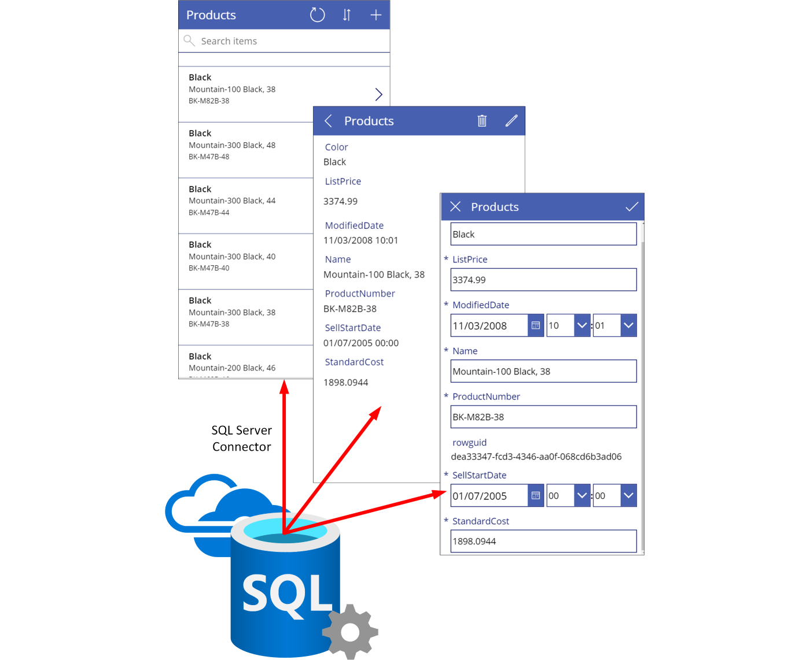
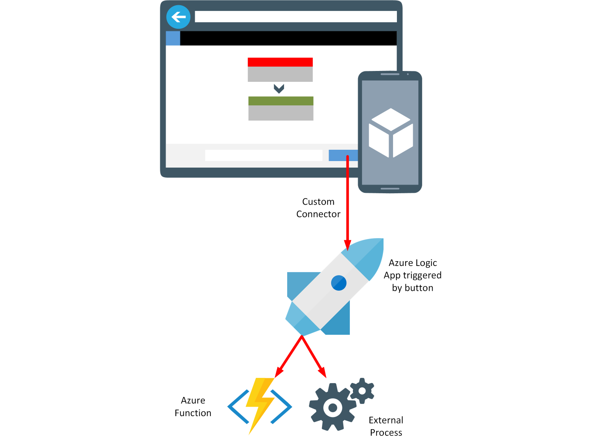
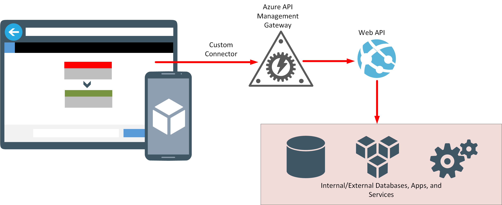
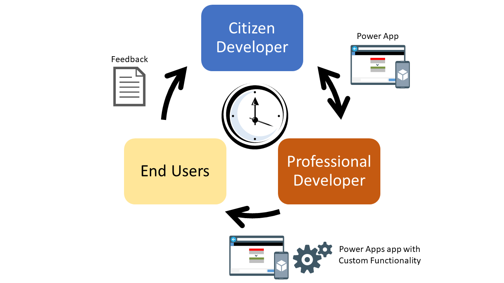

# Chapter 1: What is the fusion development approach? 

Effective application development depends on accurate and efficient communication of business requirements, and ideas for addressing these requirements. Many software engineering strategies promote the concept of the users of applications being highly involved throughout the lifetime of the development process. However, there's frequently a "glass wall" between the users and the software creators. Both parties can see each other and talk through their perspectives of how a new system should work, but the terminology used by one party might not be understood by the other. The need to translate language and ideas into a grammar that all members involved in the development process can agree on is fundamental to success. Additionally, in a rapidly changing business environment, time is of the essence. Failure to be agile enough to exploit a narrow window of opportunity can be costly. By using Power Apps, you can create and deploy working solutions that meet users' needs very quickly.

Power Apps enables a business user to quickly innovate and experiment with ways to improve their business processes. Using Power Apps, "citizen developers" who understand the business requirements can quickly put together the basics of a solution, with a minimum of coding effort. A citizen developer uses the graphical tooling provided by Power Apps Studio to create the business user's interface to a new system and some elemental logic that describes the functionality&mdash;typically involving data entry forms, displays, and reports. It's relatively easy to generate a working app from the data connectors that are supplied with Power Apps. These connectors enable the user interface to connect to many data sources, such as SQL Server, SharePoint, Oracle, Excel, Twitter, Dynamics, and several hundred others.

> [!NOTE]
> For a full list of connectors, go to [Connectors reference](/connectors/connector-reference/).

Many apps built like this can fulfill an immediate business need quickly and cheaply, but there will always be more complex situations that can't be satisfied in this way. For example, your organization might have existing systems and databases with which the app needs to interact, and for which no connector is currently available. There might be additional business logic that needs to be enforced to ensure that data remains consistent. An app might need to implement a complex, dynamic business flow. This is where professional developers come into play. After a citizen developer has produced the front-end prototype for a system, the professional developer can work with them to create any appropriate custom connectors that they might require. A custom connector doesn't just provide a path to a data source; a professional developer can create custom connectors that give access to other services, such as Azure Logic Apps, which in turn can invoke Azure Functions. Connectors such as these enable the citizen developer to incorporate complex business logic into their apps without requiring that they understand how it's implemented.

A common use case for a custom connector is to enable an app to access other systems and services inside and outside of an organization. A professional developer can create a Web API that wraps the operations exposed by these systems and services, host the Web API as a web app, and then make this web app available to a custom connector through Azure API Management.

> [!NOTE]
> Other parts of Microsoft Power Platform can benefit from a similar approach. For example, a citizen developer might implement business logic in a low-code manner through Power Automate and robotic process automation, then use Web APIs to integrate other services into this logic. You can also build chatbots by using Power Virtual Agents that combine AI capabilities with data and services exposed through web APIs.

Fusion development with Power Apps is about combining the worlds of the citizen developer, the professional developer, and the other parties instrumental in building and using applications to further the objectives of the business. A citizen developer can express the business need quickly by building an app, and work with a professional developer to "fill in the gaps." Users can provide feedback on missing functionality and any changes required. The whole process is highly iterative, perhaps more so than many other agile processes, with the velocity of possibly several iterations a day.

> [!NOTE]
> Gartner describes *digital fusion teams* as "distributed and multidisciplinary digital business teams that blend technology and other types of domain expertise. At least 84% of companies and 59% of government entities have fusion teams." (Source: 2019 Gartner Digital Business Teams Survey)

For a detailed introduction to the fusion development process and how it can accelerate development times, go to [Citizen developers use Microsoft Power Apps to build an intelligent launch assistant](https://aka.ms/AAbvfzj).

> [!div class="step-by-step"]
> [Previous](prereqs-setup.md)
> [Next](02-intro-sample-scenario.md)
