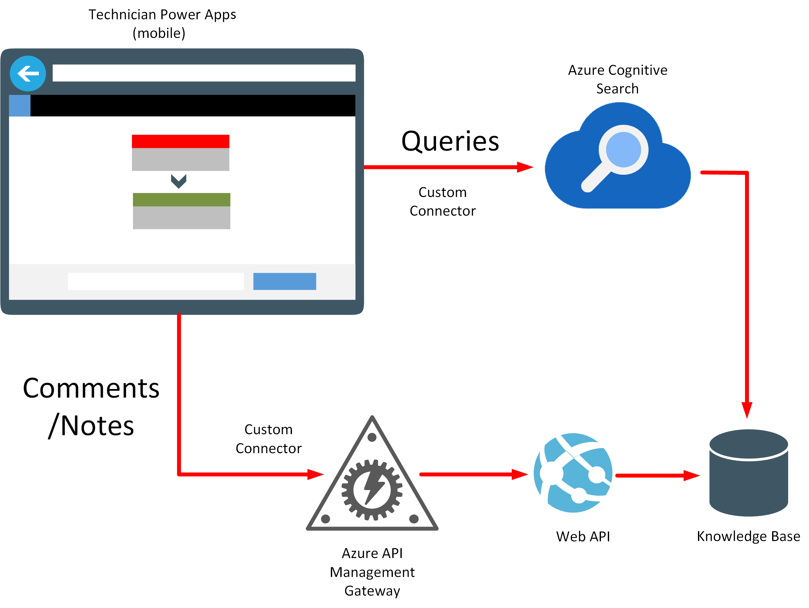

# Chapter 2: Introduction to the sample scenario

VanArsdel Heating and Air Conditioning is the world's leading company in furnace and air conditioning installation and repair. The business sends field technicians to customers' houses to install and repair all brands of heating and air conditioning equipment. The business has grown exponentially over the past year. While still a small company, VanArsdel relied a lot on manual and paper-intensive work processes. However, as the company has grown, it has experienced some friction in scaling the core business applications, as outlined by the use cases described in the following sections.

## Field inventory management

When a technician arrives at a customer's home and finds they don't have a part on the truck needed for the repair, they sometimes travel back to the shop and grab it from the warehouse. They fill out a piece of paper stating the part has been removed. If the part hasn't been stocked, the technician requests it. An office inventory manager then spends part of the day placing orders by using a legacy system, making sure the warehouse is appropriately stocked. This pattern of work results in the following inefficiencies:

-   The technician must make a round trip to grab a needed part. When the part isn't in stock, that results in a wasted trip.

-   The office inventory manager needs to check the workbook that lists parts in stock several times a day to order new supplies.

-   Because mistakes do happen, the office inventory manager must audit the workbook against the inventory.

A solution is to create an app that allows the field technician to check inventory from the field and place an order immediately if that's necessary. The app will interface with a Web API running in Azure, which provides controlled access to the legacy inventory management system. The office inventory manager can connect to the same legacy system through a desktop app running on-premises. The desktop app enables the office inventory manager to see what parts are currently in stock, and when to place orders to replenish areas that are running low.

## Field knowledge base

It's impossible for one single technician to know everything about every model of furnace or air conditioner they might encounter in the field. However, with the knowledge of a great team of technicians, there's always somebody who has solved a problem before. To tap into this wealth of knowledge, an individual technician might have to play "phone tag" with several other colleagues while they track down the one person who has solved the problem they're currently facing. This approach has several issues, including:

- Making several phone calls to find the one person who has solved a problem is a time-intensive process.

- The person with the answer might be busy, causing the first technician to wait.

- Knowledge is a subject that ebbs and flows with technician turnover. Important information can be easily lost or misremembered unless it's recorded.

A solution is to capture information about furnaces and air conditioners&mdash;problems that have occurred, and how they were fixed&mdash;in a knowledge base. A technician can use an app to record comments about a job and the repairs performed while still at the customer's premises. The same app can provide an interface that allows the technician to query the knowledge base about any useful information that other technicians might have learned from similar jobs. The knowledge base itself can be implemented as a database with Azure Cognitive Search providing the lookup facility, based on one or more keywords.

## Field scheduling and notes

Customers contact the VanArsdel office to make appointments. Throughout the day, things change. Customers cancel visits and emergencies take priority over other events. Customers might provide additional information about the job. The office receptionist stores this information in a legacy customer database.

Each morning at the office, technicians receive their schedule for customer visits for the day, in the form of a printout from the legacy system, before heading into the field. This schedule contains information about customers and jobs. If this information changes during the day, the office receptionist must try to manually call the technician in the field to pass on any updates.

While in the field, technicians take notes. They'll manually update the same customer information database when they return to the office at the end of the day.

There are several obvious drawbacks to the current scheduling strategy:

- If a customer cancels a visit and the office is unable to reach the technician, the technician will make an unnecessary stop. The technician might also miss a chance to be rescheduled with a new customer.

- The technician might not go to the most important jobs.

- The technician spends a lot of time at the end of the day updating customer notes, when they would rather go home.

VanArsdel can use an app that acts as a front end to the legacy system. It would enable the office receptionist to record appointments and cancellations, and add any additional notes to customer records. An app that's available to technicians can provide access to their appointment schedule in real time so they can see any changes. The same app should enable technicians to enter notes about a finished job and save this information back to the legacy system.

## Fusion development team members

VanArsdel Heating and Air Conditioning started a fusion development team to design and build solutions that solve the problems and inefficiencies highlighted in the previous sections. The team members are:

- **Kiana Anderson: Professional developer**. Kiana is a full-stack developer and software architect specializing in C\# and .NET. She has written and designed many of VanArsdel's applications, but is getting stretched very thin by all the new requests. Kiana is familiar with Power Apps at a high level but is skeptical of having non-developers create applications.

- **Maria Zelaya: Inventory management**. Maria makes sure VanArsdel runs like a well-oiled machine. She verifies that the warehouse has enough parts and, if it doesn't, orders more by using a legacy system that Kiana wrote. But more than that, Maria audits inventory, checks with vendors for the best prices, and performs other inventory supply management tasks.

- **Caleb Foster: Field technician/engineer**. Caleb is VanArsdel's lead field technician. He's very knowledgeable and is on the phone a lot, mentoring junior technicians. Caleb's time is very valuable, and VanArsdel wants to make sure he visits as many of their most valuable customers as possible on a daily basis.

- **Malik Barden: Office receptionist**. Malik is the heart of the VanArsdel office. He answers all customer inquiries, schedules appointments, and even helps technicians find answers when they need to. In other words, he's overworked and needs to automate some of his repetitive tasks to provide even better customer service.

- **Preeti Rajdan: IT Operations**. Preeti is responsible for making sure the IT systems are up and running. She worries a lot about security and applications that might accidentally leave "back doors" open. She also is stretched thin and needs to be sure any new apps are easy to govern and administer.

> [!div class="step-by-step"]
> [Previous](01-what-is-fusion-dev-approach.md)
> [Next](03-building-low-code-prototype.md)
