# Chapter 3: Building a low-code prototype


> [!NOTE] 
> [Chapter 2](02-intro-sample-scenario.md) referenced the mobile app used by the field technicians and engineers, and desktop Power Apps used by on-premises staff. The following chapters focus on the design, implementation, and rollout of the mobile apps built using Power Apps. The desktop apps are left as an exercise for the reader.

Kiana is skeptical of low-code solutions and Power Apps, but she and Maria decide to build an app together to help the field technicians check inventory (and order parts if necessary), query the knowledge base, and check their next appointment while out of the office, on service calls. Kiana and Maria plan to use this experience to explore how to add controls and use formulas in a Power App.

Although building an initial low-code prototype is primarily a typical citizen developer task, Kiana decides to pay attention to the process to ensure that she understands how the app is constructed. She needs this information to enable her to help Maria integrate the real-world data sources, Web APIs, and other services required into the app.

## Item 1: Field inventory management

Maria's initial aim is to build a canvas app that displays a list of parts and enables the user to view the details of any part. The user should also be able to order a part. However, this initial version of the app will simply be a prototype and won't be hooked up to a back end yet. After she has obtained feedback from Caleb, the lead field technician, Maria will work with Kiana on integrating the canvas app with the inventory system running on-premises.

Maria is very familiar with the existing inventory management system and understands the information that it contains. She starts by creating an Excel spreadsheet that contains tables holding mock data with the details of some sample parts. The fields in the table are **ID**, **Name**, **CategoryID**, **Price**, **Overview**, **NumberInStock**, and **Image** (a URL that references an image of the part). She can use this spreadsheet to build and test the canvas app, to ensure that it displays the required data correctly. She stores this spreadsheet in her OneDrive account with the name **BoilerParts.xlsx**:

> [!NOTE] 
> You can find a copy of this spreadsheet in the [Assets](https://github.com/microsoft/fusion-dev-ebook/tree/main/Assets) folder in the Git repository for this guide.


If you are a relational database designer, you'll notice that the Excel spreadsheet presents a denormalized view of the data. For example, in a relational database, **CategoryID** would most likely be a numeric identifier that references a separate table containing the details of the category, including the name.

The URLs in the **Image** column are currently just placeholders. In the completed Power App, these URLs will be replaced with the addresses of real image files.

Follow these steps to create the app using Power Apps:

1.  Sign in to [Power Apps](https://make.powerapps.com).

2.  On the **Home** page, under **Start from data**, select **Excel Online**:

    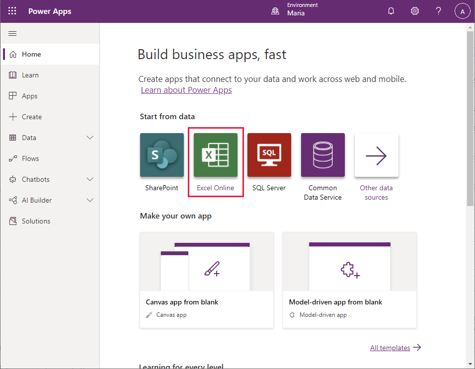

3.  On the **Connections** page, select **OneDrive for Business**, and then select **Create**:

    

4.  On the **OneDrive for Business** page, select the **BoilerParts.xlsx** Excel spreadsheet:

    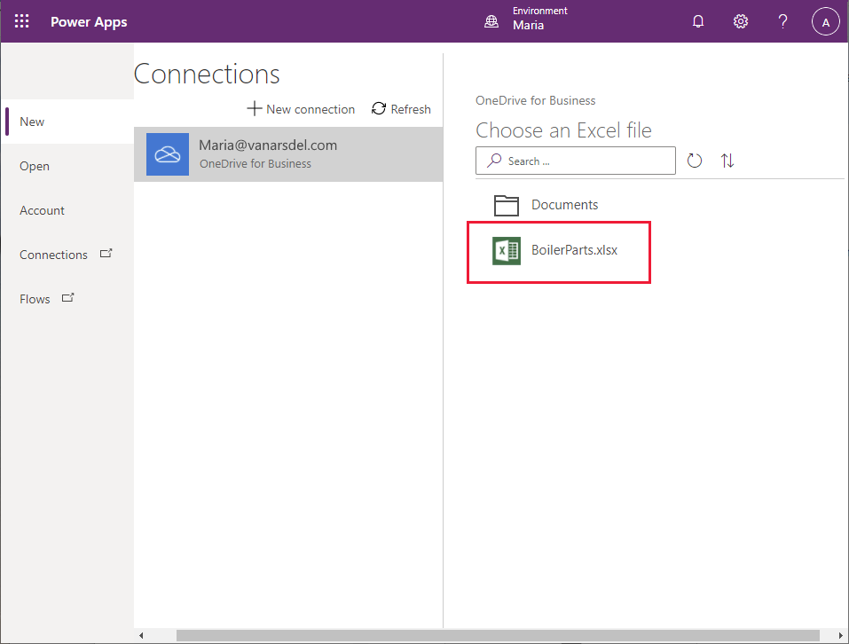

5.  Select the table in the Excel sheet (Maria created the table with the default name, **Table1**), and then select **Connect**:

    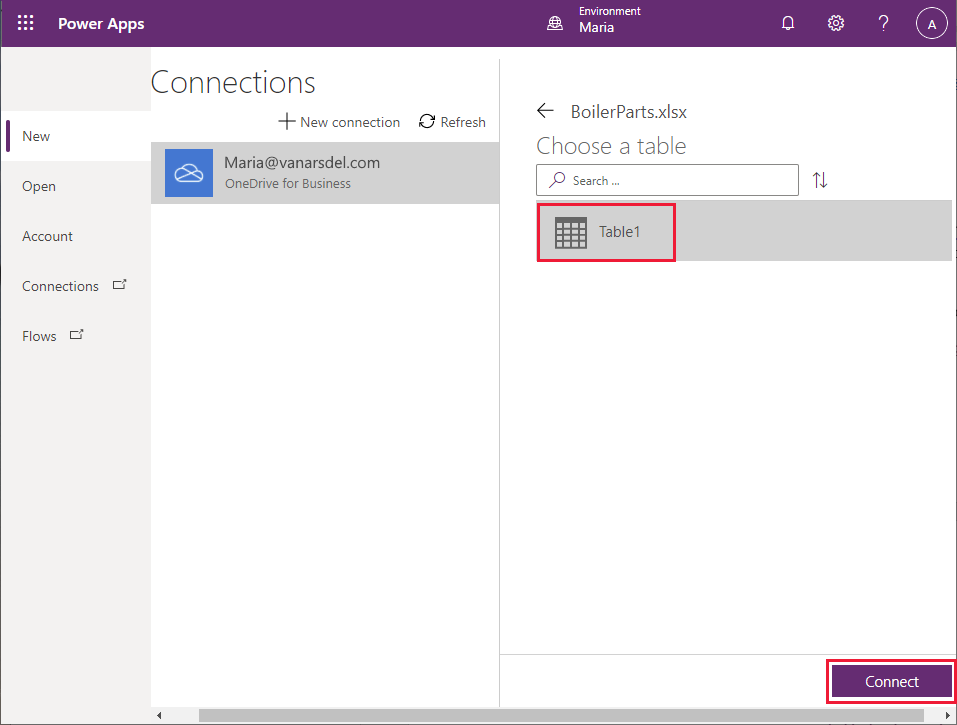

6.  Wait while Power Apps generates the app:

    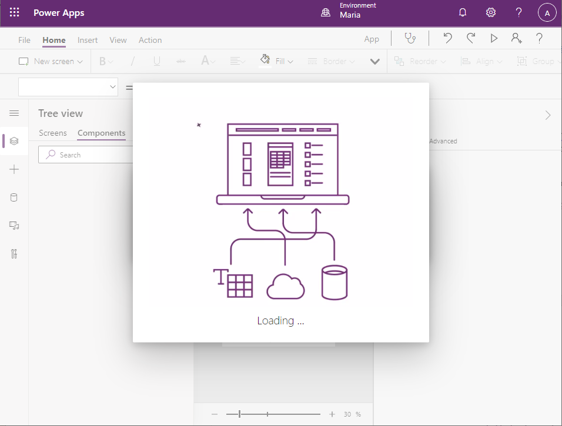

7.  When the app has been generated, you should see the **Browse** screen, displaying the **CategoryID**, **ID**, and **Image** fields from each row of the parts table in the spreadsheet:

    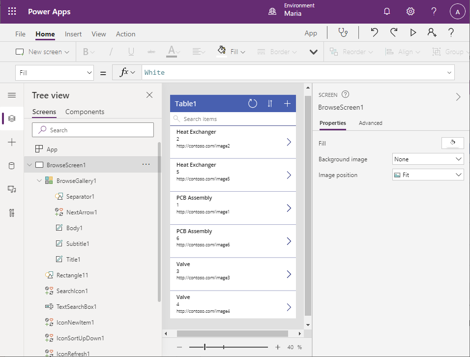

8.  The fields currently displayed are not that useful for helping an engineer to select a specific product. In the pane displaying the **Browse** screen, select the **Heat Exchanger** label in the first row of data. In the formula bar select the **Text** property from the drop-down list. Change the value of this property to **ThisItem.Name**. The text in the first field of each row will switch to display the part name.

    > [!NOTE] 
    > In the image below, the **Heat Exchanger** label originally displayed on the form has changed to the product name, **3.5 W/S Heater**.

    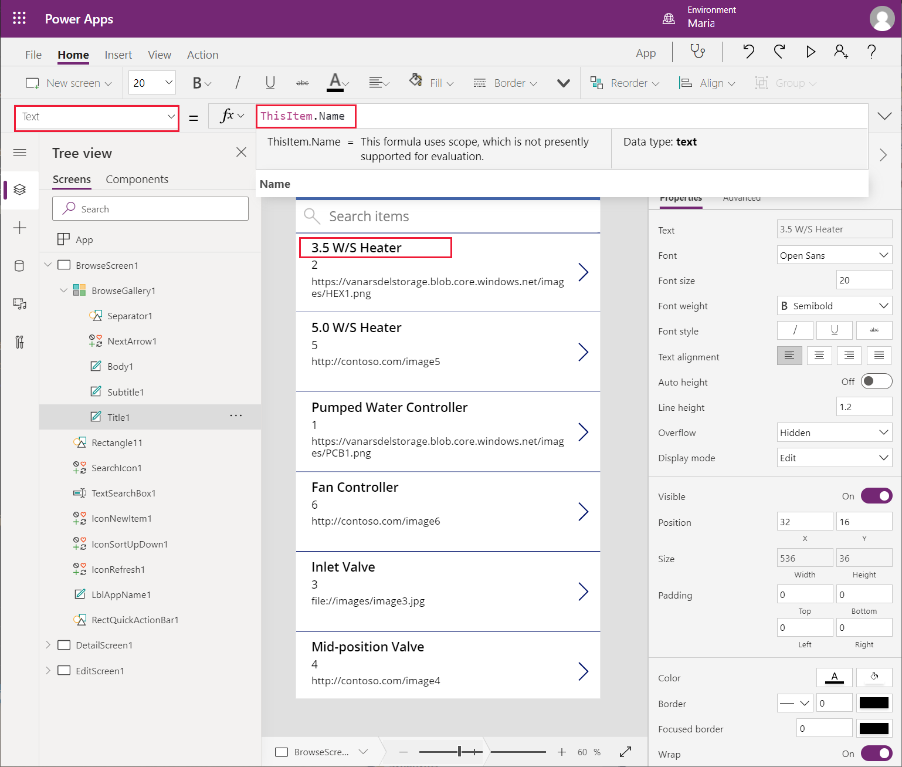

9.  Repeat the previous step for the **ID** and **Image** labels. Change the **Text** property of the **ID** field to **CategoryID**, and the **Text** property of the **Image** field to **Overview**. The **Browse** screen should now look like this. The field engineer should find this information more useful for selecting parts:

    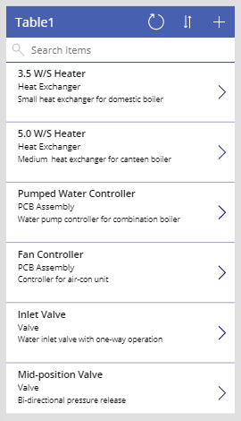

10. The search feature of the **Browse** screen defaults to searching using the fields that were initially selected when the screen was generated---in this case, the **CategoryID**, **ID**, and **Image** fields. The results are sorted by **CategoryID**. It makes sense to switch this to the **Name, CategoryID**, and **Overview** fields, with the results sorted by **Name**. Select the **BrowseGallery1** control in the **Tree view** pane. In the drop-down list by the formula bar select the **Items** property. Drag the lower edge of the formula bar down so the formula is completely visible. The formula contains the expression **SortByColumns(Search([\@Table1], TextSearchBox1.Text, "CategoryID","ID","Image"), "CategoryID", If(SortDescending1, Descending, Ascending))**:

    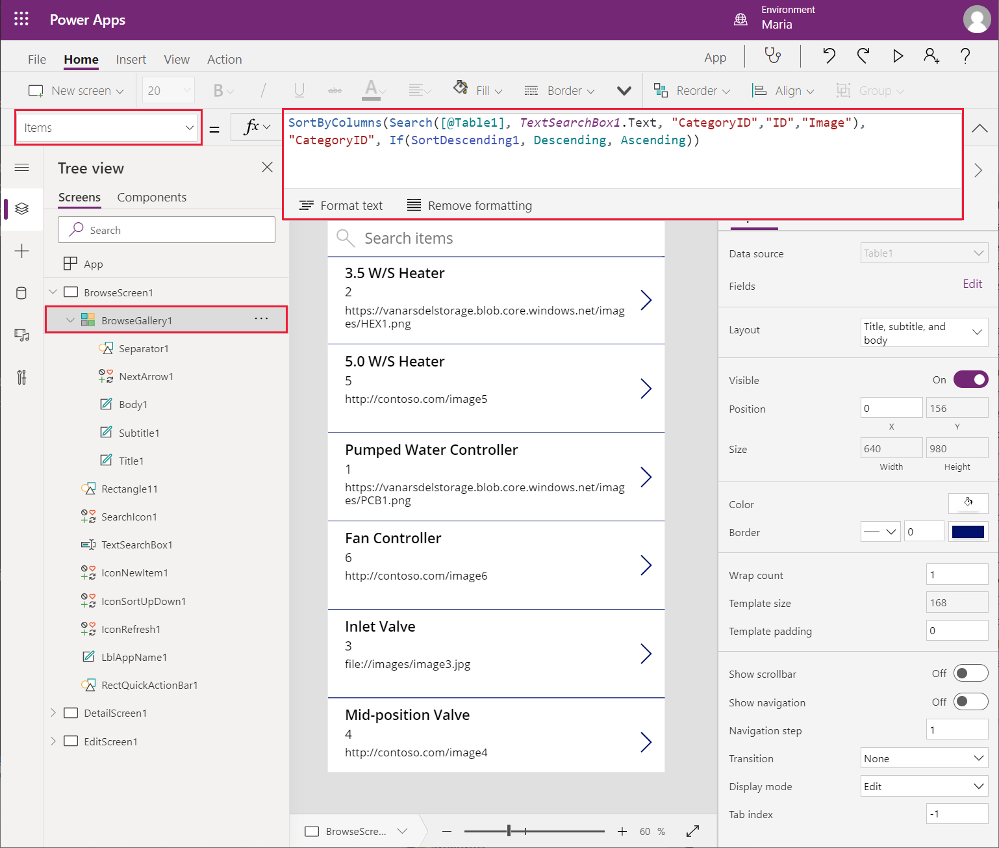

11. Change the **Search** expression to reference the **Name**, **CategoryID**, and **Overview** fields: **SortByColumns(Search([\@Table1], TextSearchBox1.Text, "Name", "CategoryID", "Overview"), "Name", If(SortDescending1, Descending, Ascending))**.

12. The title in the form header isn't helpful, and the default theme doesn't match the corporate look and feel. In the **Browse** screen, select the **Table1** label, and on the **Formula** bar change the **Text** property of the label to **"Browse Parts"** (include the double quotes in the value):

13. In the toolbar, select **Theme** (you might have to click the drop-down arrow displaying more items for the toolbar), and then select the **Forest** theme. The colors and styling for the **Browse** screen should change to match this theme:

    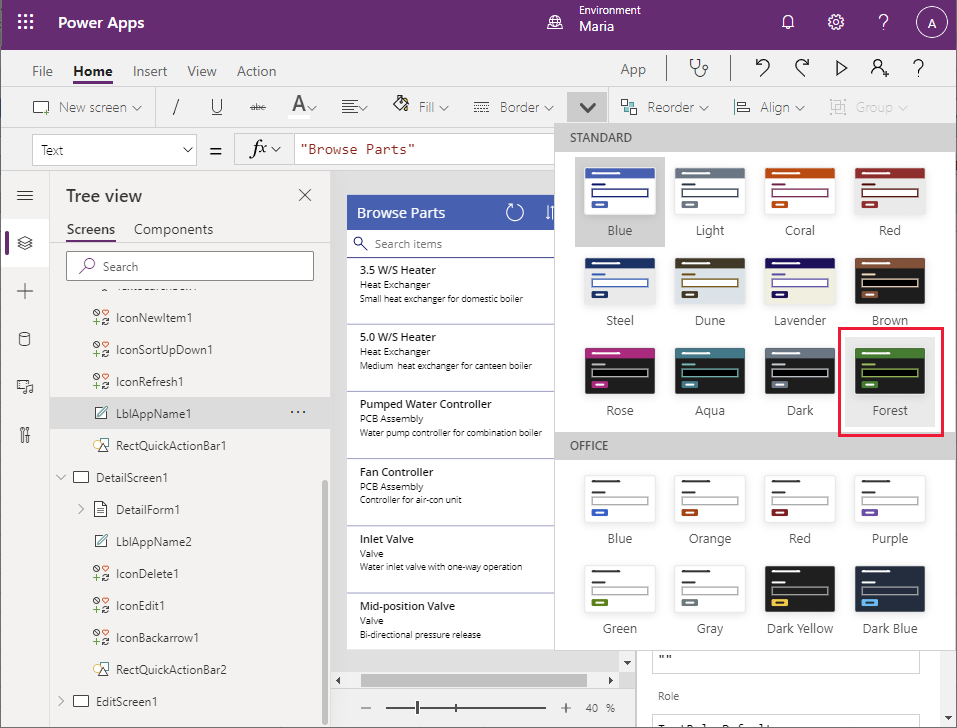

You have created the basic app and modified the **Browse** screen to display the fields that an engineer can use to identify a part. The app also contains a **Details** screen which shows all the information for a selected part. The fields on this screen aren't currently displayed in a logical sequence, so you should rearrange them. You can also delete the Part ID from this screen as this information is irrelevant to an engineer. The following steps describe this process:

1.  In the **Tree view** pane on the left, scroll down and select the **DetailScreen1** screen. This screen appears when the user selects an item in the **Browse** screen. It displays the details of the selected part:

    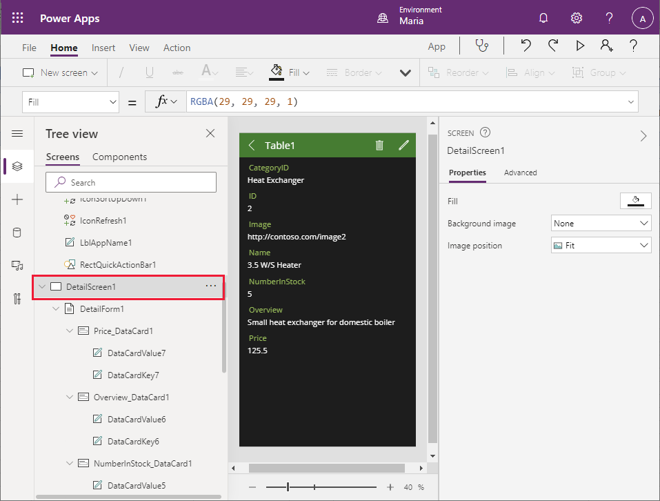

2.  In the header of the **Details** screen in the middle pane, select the **Table1** label. On the **Properties** tab in the right pane, change the **Text** property to **Part Details**.

    > [!NOTE] 
    > In many cases, the **Properties** pane is an alternative to using the formula bar; the results are the same. However, there are some properties which are only available through the **Properties** pane.

    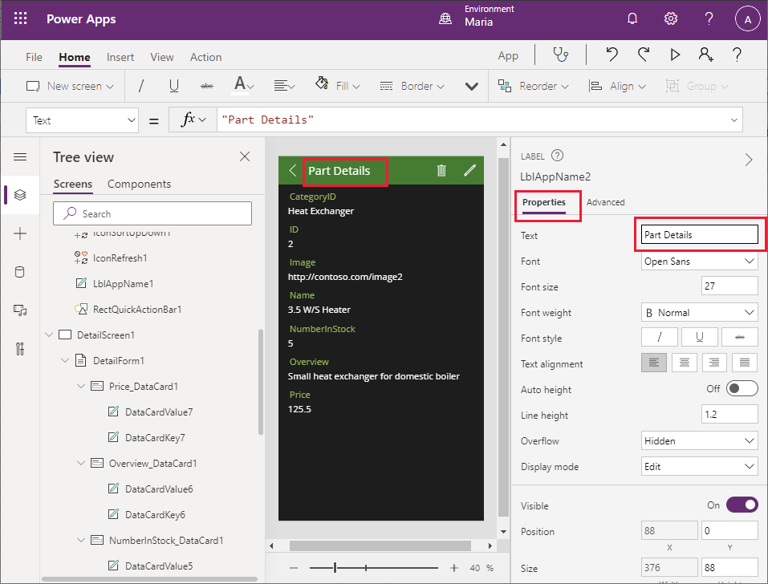

3.  In the **Tree view** pane on the left, scroll down and select the **DetailForm1** form under the **DetailScreen1** screen. In the right pane, on the **Properties** tab, in the **Fields** field, select **Edit fields**. In the middle pane, click and drag each field so that they are displayed in the following order, from top to bottom:

    -   Name
    -   CategoryID
    -   Overview
    -   Price
    -   NumberInStock
    -   Image
    -   ID

    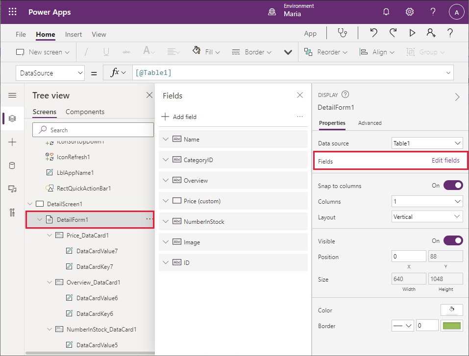

4.  Select the **ID** field, click the ellipsis that appears on the right of the field, and then select **Remove** from the drop-down menu that appears. This action removes the ID field from the form:

    

5.  In the **Tree view** pane on the left, scroll down and select the **CategoryID\_DataCard1** element under the **DetailForm1** form. This element is a **DataCard** control that displays the name of a field (called the **key**) and its value.

    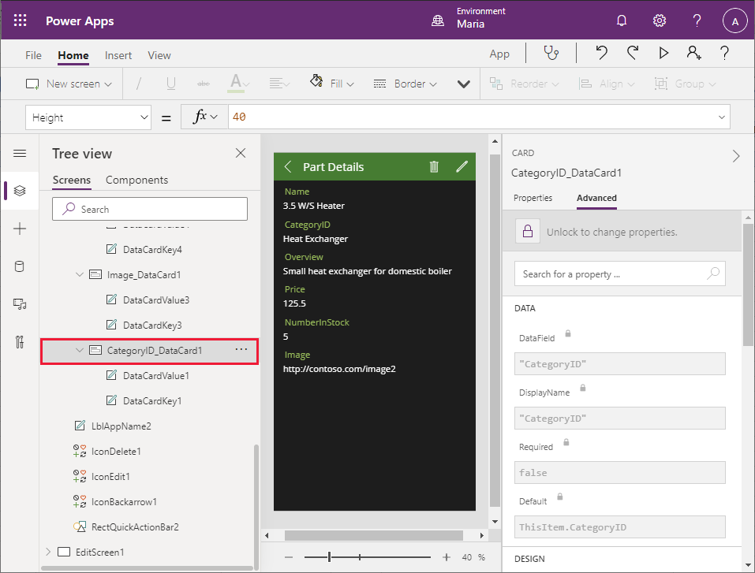

    In the right pane, on the **Advanced** tab, select **Unlock to change properties**. In the **Data** section, change the **DisplayName** field to **"Category"** (including the quotes).

    > [!NOTE] 
    > As with the **Properties** tab, many of the properties on the **Advanced** tab are also accessible through the formula bar. In these situations, you can use the formula bar if you prefer.

    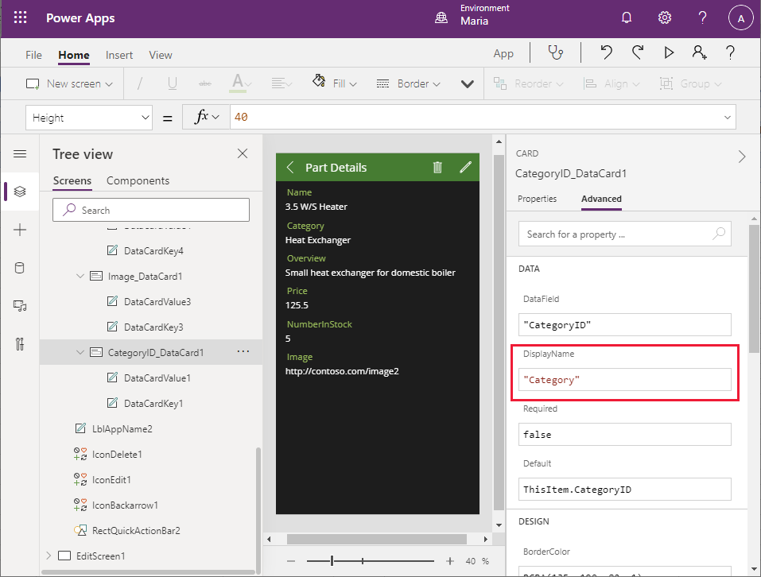

6.  Repeat this process to change the key for the **NumberInStock\_DataCard1** DataCard to **"Number in Stock"**.

7.  The formatting of the **Price** field should be adjusted to display the data as a currency value. In the **Tree view** pane, locate the **Price\_DataCard1** element under the **DetailForm1** form and select the **DataCardValue7** element. This is the field that displays the value of the **Price** field. In the **DataCardValue7** pane on the right, on the **Advanced** tab, change the **Text** property to **Text(Value(Parent.Default), "[\$-en-US]\$ \#\#\#,\#\#0.00")**:

    

    The expression **Parent.Default** refers to the data item to which the parent control (the **DataCard**) is bound; in this case, the **Price** column. The **Text** function reformats this value using the format specified as the second argument; local currency with two decimal places, in this example.

8.  The Image **DataCard** should display an image of the part rather than the URL of the image file. In the **Tree view** pane, locate the **Image\_DataCard1** element under the **DetailForm1** form, select the **DataCardValue3** element, and then press **Delete** to remove this control.

9.  Select the **Image\_DataCard1** element. In the left pane, select **+ Insert**. In the **Insert** pane, expand the **Media** subtree, and select the **Image** control:

    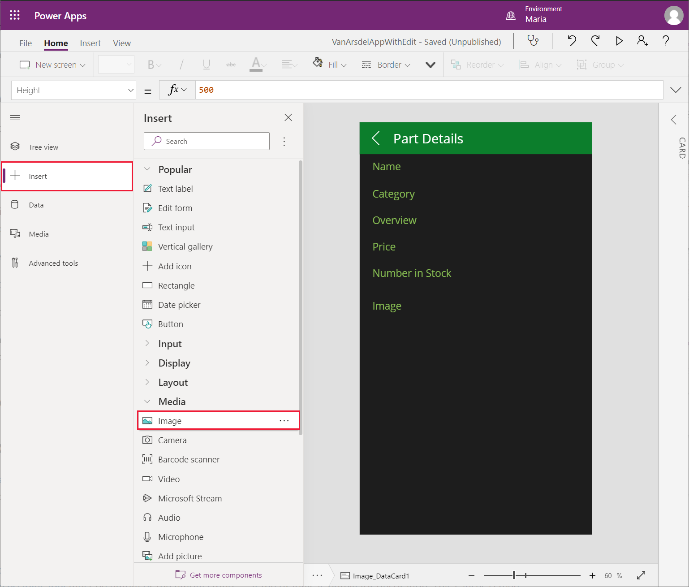

10. Return to the **Tree view** pane, and verify that the HTML text control (**Image1**) has been added to the **Image\_DataCard1** control:

    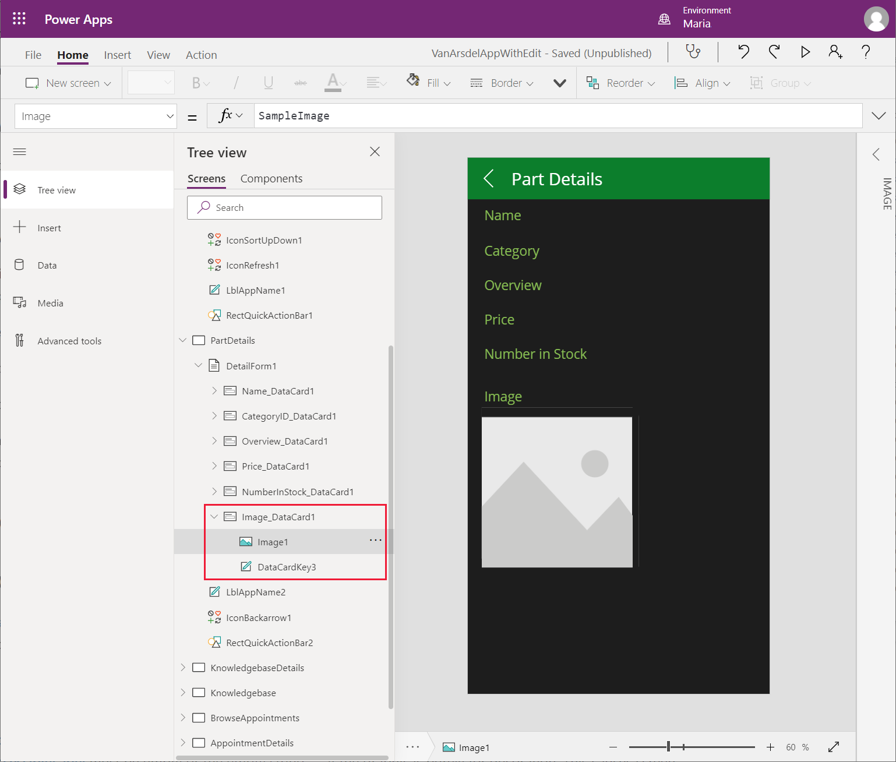

11. In the **Tree view** pane, select the **Image\_DataCard1** control. Change the **Height** property to **500**, to allow sufficient space for an image to be displayed:

    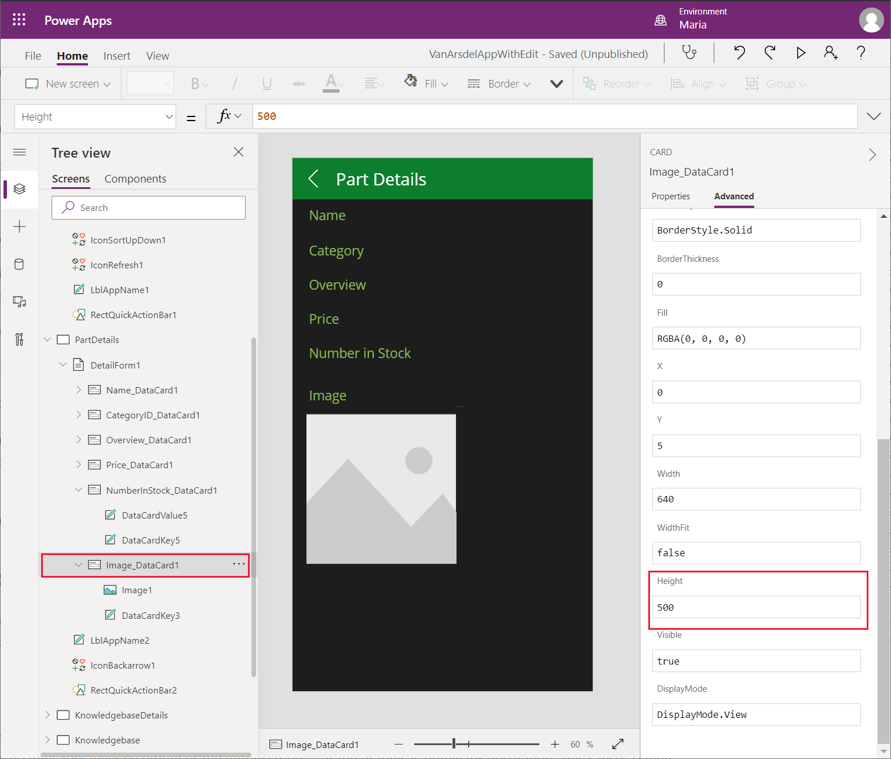

12. In the **Tree view** pane, select the **Image1** control. Set the following properties:

    -   Image: **Parent.Default**
    -   ImagePosition: **ImagePosition.Fit**
    -   Width: **550**
    -   Height: **550**

    > [!NOTE] 
    > The image displayed is currently empty because the URL in the Excel spreadsheet is just a placeholder. You'll address this issue, and fetch a real URL, when you bind the app to a Web API in a later chapter.

The app also contains an **Edit** screen which enables a user to change the information for a part. An engineer shouldn't be able to change the details of a part, create new parts, or delete parts from the catalog. Remove this functionality from the app as follows:

1.  In the **Tree view** pane on the left, scroll down and select the **EditScreen1** screen. Select the ellipsis button, and then select **Delete** to remove this screen:

    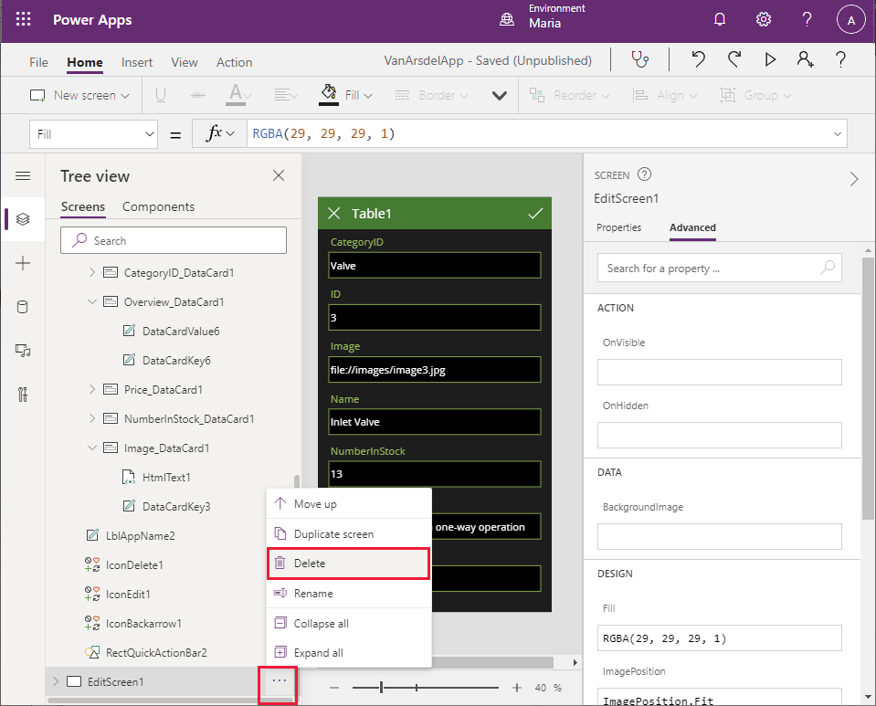

2.  In the **Tree view** pane on the left, scroll down and select the **DetailsScreen1** screen. Notice that Power Apps Studio is displaying an error message for this screen. This error occurs because the **DetailsScreen1** contains expressions that reference the **EditScreen1** screen, which no longer exists:

3.  In the header of the **DetailsScreen1**, select the pencil (**IconEdit1**) icon. The **OnSelect** property for this control contains the expression **EditForm(EditForm1);Navigate(EditScreen1, ScreenTransition.None)**. When the **Edit** icon is selected, this expression runs and attempts to move to the **EditScreen1** screen:

    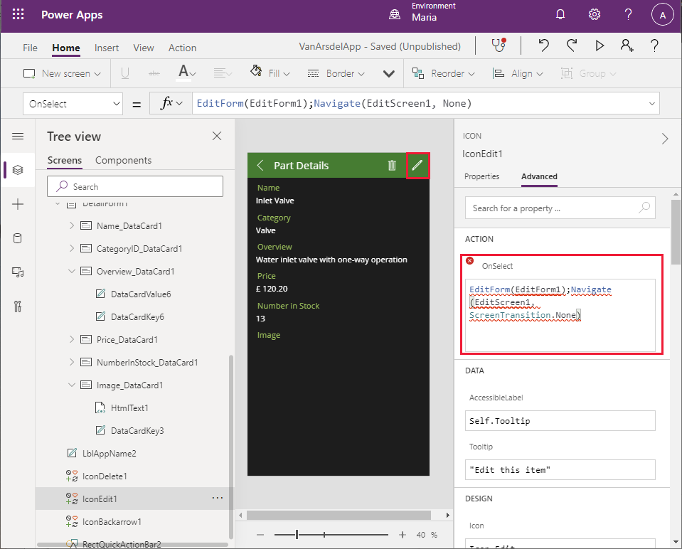

4.  In the **Tree view** pane, select the **IconEdit1** control and press **Delete**. This icon is no longer required.

5.  Select the **IconDelete1** control and press **Delete**. This icon is used to delete the current part, and is also not required:

    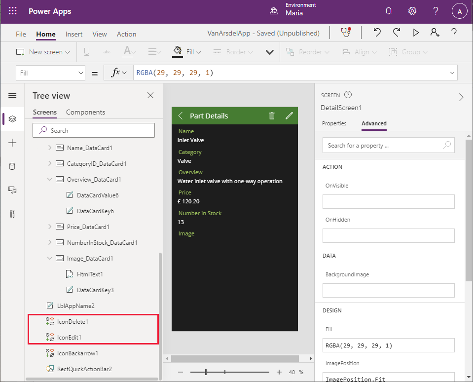

6.  Notice that the **Part Details** text has disappeared from the screen header, and instead Power Apps Studio is displaying an error message. This has happened because the width of the label control displaying the text is calculated. In the **Tree view** pane, select the **LblAppName2** label control. Examine the **Width** property. The value of this property is the result of the expression **Parent.Width - Self.X - IconDelete1.Width - IconEdit1.Width**:

    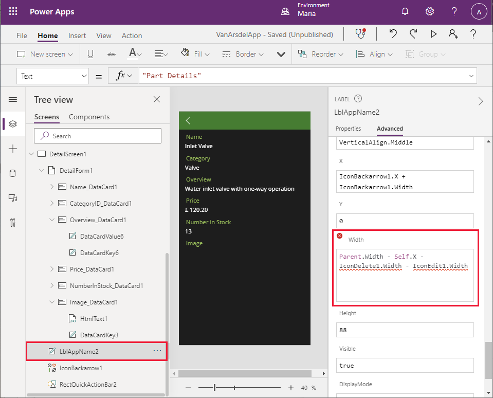

7.  Change the expression for the **Width** property to **Parent.Width - Self.X**. The error should disappear, and the **Part Details** text should reappear in the screen header.

8.  In the **Tree view** pane, scroll up and select the **BrowseScreen1** screen. This screen will also display an error message. The **+** icon in the toolbar (**IconNewItem1**) enables the user to add a new part. The **OnSelect** property for this icon references the **EditScreen1** screen.

    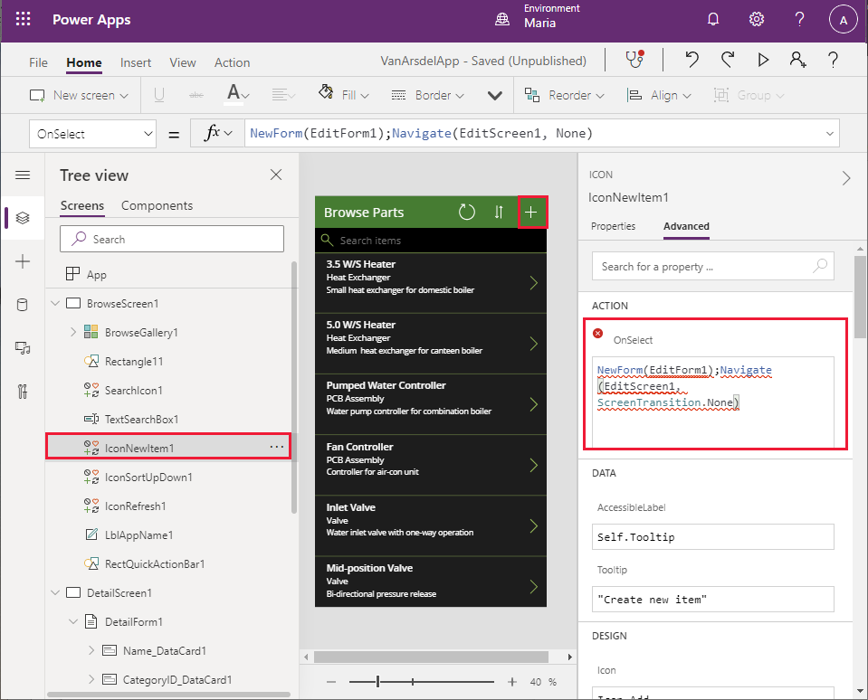

9.  Select the **IconNewItem1** icon, and then press **Delete**. As before, the text in the header for the screen disappears with an error message, and for the same reason.

10. In the **Tree view** pane, select the **LblAppName1** label control under **BrowseScreen1**. Modify the expression for the **Width** property and remove the reference to **IconNewItem1.Width**. The new expression should be **Parent.Width - Self.X - IconSortUpDown1.Width - IconRefresh1.Width**:

    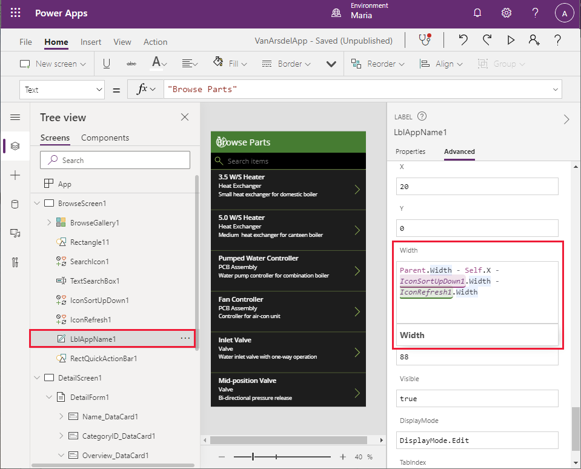

11. There is still a problem with the header. Although the **Browse Parts** text has reappeared, there's an error and the refresh and sort icons are in the wrong place. Select the **IconSortUpDown1** control in the **Tree view** pane. Find the **X** property for this control. This property determines the horizontal position of the icon in the header. It is currently calculated based on the width of the **IconNewItem1** control:

    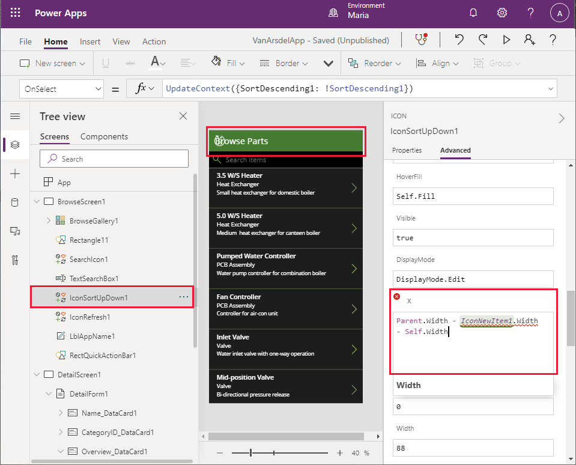

12. Change the value of the expression for the **X** property to **Parent.Width - Self.Width**.

13. In the **Tree view** pane, select the **IconRefresh1** control. Change the **X** property for this control to **Parent.Width - IconSortUpDown1.Width - Self.Width**. The errors should now have all disappeared.

You can save and test the application:

1.  Select the **File** menu in the Power Apps Studio toolbar, and then select **Save as**.

2.  Under **Save as**, select **The cloud** as the destination, name the app **VanArsdelApp**, and then select **Save**.

    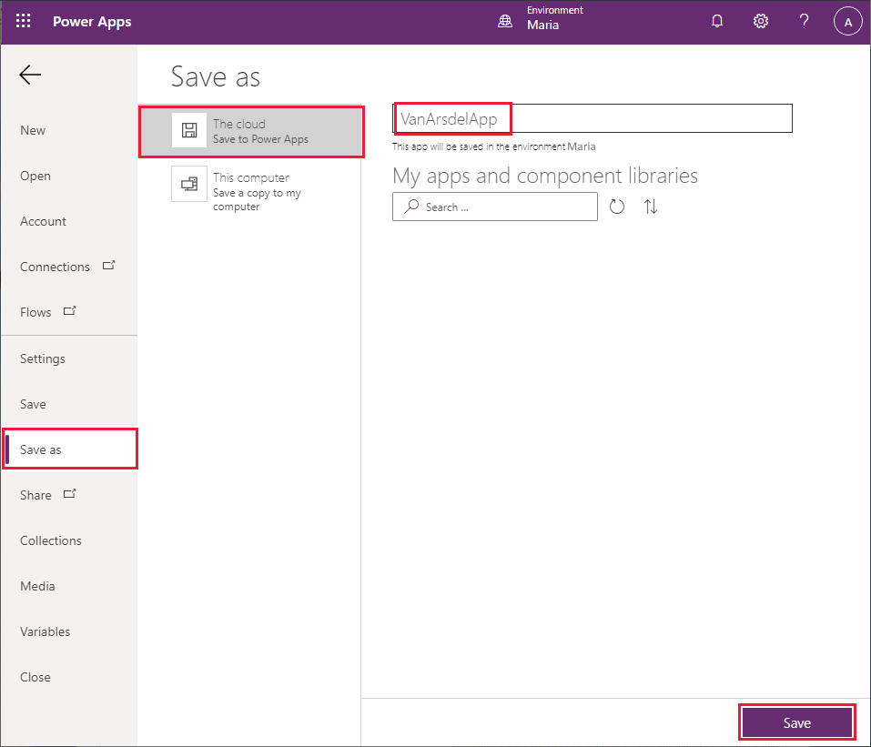

3.  Press the back arrow icon in the Power Apps Studio toolbar to return to the **Home** screen:

    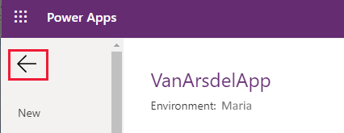

4.  Press **F5** to preview the app. On the **Browse Parts** page, select the **\>** symbol for any part. The **Details** screen for the part should appear:

    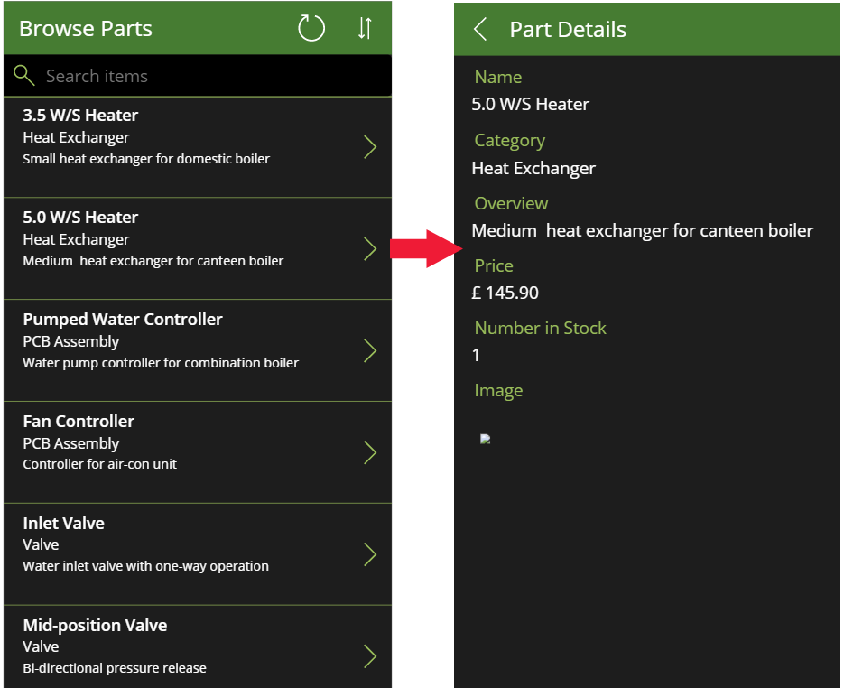

5.  Click the **\<** icon in the header in the **Details** screen to return to the **Browse** screen.

6.  On the **Browse** screen, enter some text in the **Search** box. As you type, the items will be filtered to only those that have matching text in the **Name**, **CategoryID**, or **Overview** fields:

    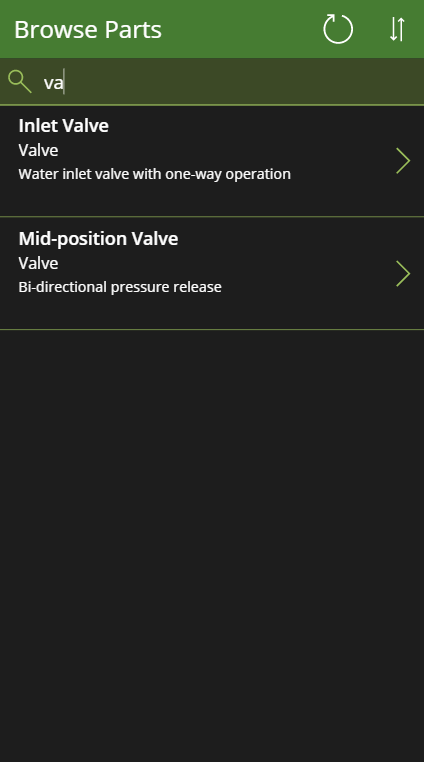

7.  Close the preview window and return to Power Apps Studio.

## Item 2: Field knowledge base

For access to the knowledge base, Maria and Caleb (the technician) envisage a simple interface that enables the user to enter a search term, and for the app to display all knowledge base articles that mention the term. Maria knows that this process is going to involve Azure Cognitive Search, but doesn't need, or want, to understand how it works. Therefore, Maria decides to just provide the basic user interface and will work with Kiana later to add the actual functionality.

Maria decides to create a new screen based on the **List** template available in Power Apps Studio, as follows:

1.  In Power Apps Studio, on the **Home** screen, in the toolbar, select **New Screen**, and then select the **List** template:

    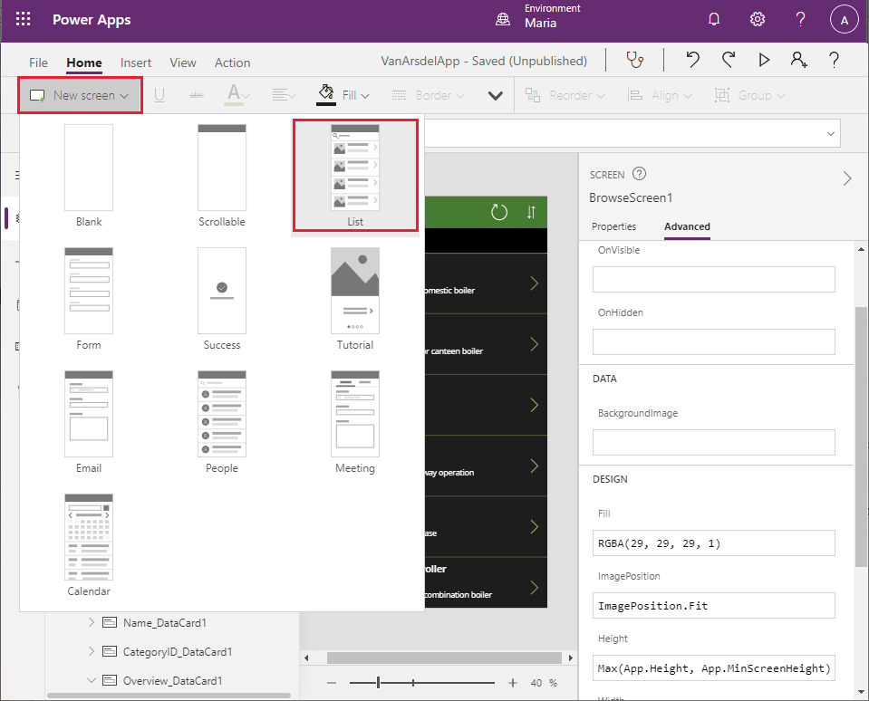

2.  In the screen header, select the label displaying the text [Title]. Change the **Text** property to **"Query"** (including the quotes):

    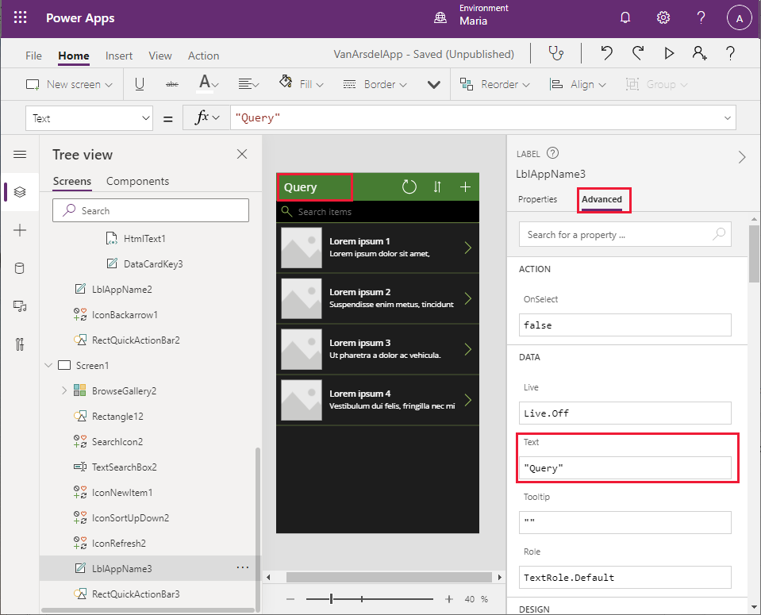

3.  In the screen header, select the **+** icon, and then press **Delete**. The + icon is intended to enable the user to add more items to the list. The knowledge base is query only, so this feature isn't needed.

    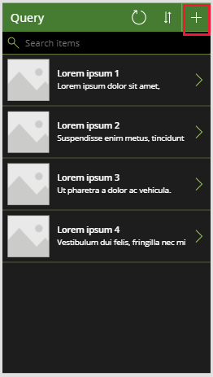

    Notice that removing this icon causes an error in the header due to the way in which the location and widths of the other items are calculated. You saw this earlier with the Inventory Management screen, and the solution is the same, as described in the following steps.

4.  In the **Tree view** pane, scroll down to the **Screen1** screen, and select the **LblAppName3** control. Change the **Width** property to the formula **Parent.Width - LblAppName3.X - IconSortUpDown2.Width - IconRefresh2.Width**.

    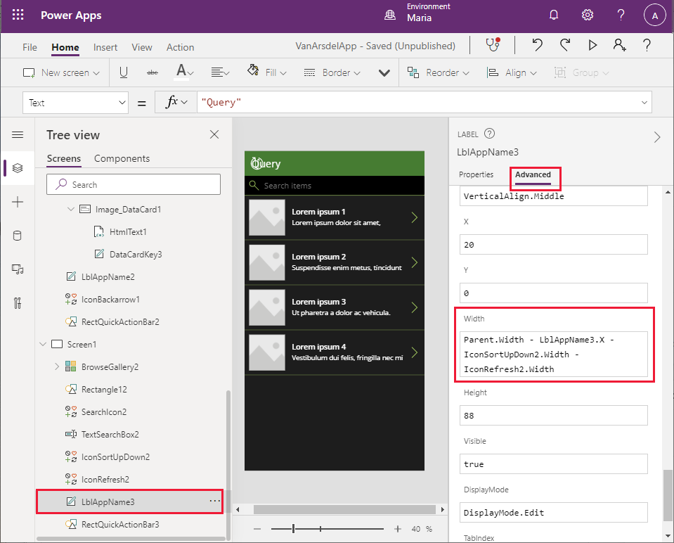

5.  In the **Tree view** pane, select the **IconSortUpDown2** control. Modify the **X** property to the formula **Parent.Width - IconSortUpDown2.Width**.

6.  In the **Tree view** pane, select the **IconRefresh2** control. Modify the **X** property to **Parent.Width - IconSortUpDown2.Width - IconRefresh2.Width**. This should resolve all the errors with the screen.

7.  Select the **File** menu in the Power Apps Studio toolbar, and then select **Save**.

8.  In the **Version note** box, enter the text **Added Knowledgebase UI**, and then select **Save**.

9.  Return to the **Home** screen and press **F5** to preview the new screen. It should look like this:

    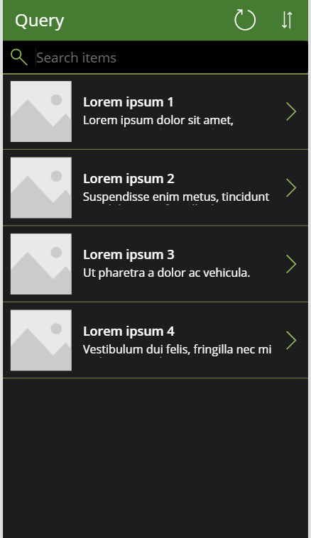

    Note that if you press the **\>** icon by any of the dummy entries, the details functionality doesn't currently work. You'll address this later when you integrate Azure Cognitive Search into the app.

10. Close the preview window and return to Power Apps Studio.

## Item 3: Field scheduling and notes

Maria works with Malik, the office receptionist, to design the interface for the field scheduling and appointments part of the Power App. Malik provides an Excel spreadsheet with some sample data that Maria can use to build the appointments screen. The spreadsheet contains a table with the following columns:

-   ID (the appointment ID)
-   Customer ID (a unique identifier for the customer)
-   Customer Name
-   Customer Address
-   Problem Details (a text description of the problem the customer is experiencing)
-   Contact Number
-   Status
-   Appointment Date
-   Appointment Time
-   Notes (a text description with any notes added by the engineer)
-   Image (a photograph of the appliance, either in working condition after repair, or as a supplementary picture for the engineer's notes)

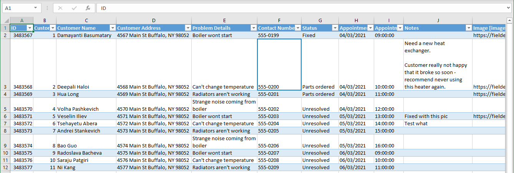

> **NOTE:** 
> As with the Field Inventory Management data, this spreadsheet represents a denormalized view of the data. In the existing appointments system, this data is stored in separate tables holding appointment data and customer data.

Maria stores this spreadsheet in her OneDrive account with the name **Appointments.xlsx**. Having remembered that she previously used the default name for the table in the spreadsheet, and had to change the title in the various screens that were generated, she also names the table in the spreadsheet to **Appointments**.

> [!NOTE] 
> This spreadsheet is available in the [Assets](https://github.com/microsoft/fusion-dev-ebook/tree/main/Assets) folder of the Git repository for this guide.

Maria wants to build the appointments part of the app directly from the Excel spreadsheet. She decides to follow a similar approach to that of the Field Inventory Management functionality, except that this time the engineer will be allowed to create and edit appointments.

Maria decides to build the appointments screens, initially as a separate Power App. This way, she can use Power Apps Studio to generate much of the app automatically. Power Apps Studio doesn't currently let you generate additional screens from a data connection in an existing app. When Maria has created and tested the screens, she will copy them to the Field Inventory and Knowledgebase app.

> [!NOTE] 
> An alternative approach is to add the **Appointments** table in the Excel spreadsheet as a second data source to the existing app and then hand-craft the screens for appointments. Maria opted to generate the new screens from the spreadsheet and copy the screens; she is currently more familiar with the concepts of *copy and paste* than building screens manually, although she will gradually learn how to create screens from scratch as the process of building this app progresses.

You can follow these steps to create the Appointments Power App:

1.  In Power Apps Studio, select the **File** menu in the toolbar.

    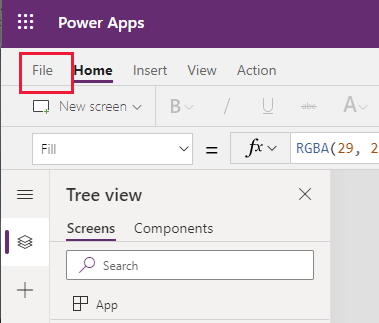

2.  On the **File** page, in the left pane, select **New**. In the main pane, select **Phone layout** in the **OneDrive for Business** box:

    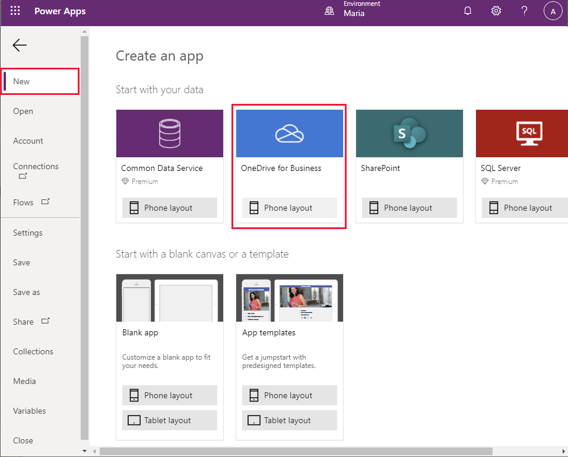

3.  In the **Connections** pane, select the **Appointments.xlsx** spreadsheet:

    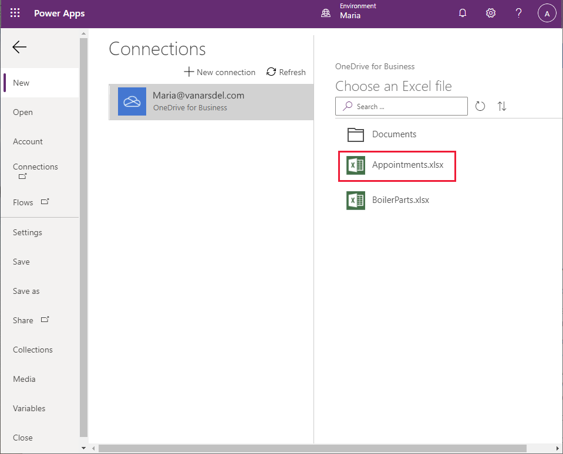

4.  Select the **Appointments** table in the Excel Sheet, and then select **Connect**:

    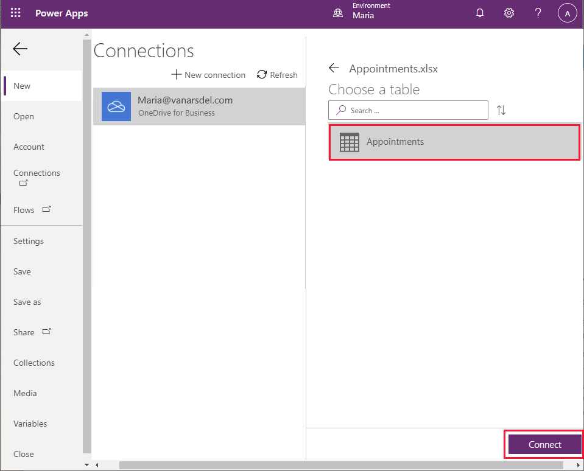

5.  Wait while the app is generated. When the new app appears, it'll contain a **Browse** screen, a **Details** screen, and an **Edit** screen, using the default theme:

    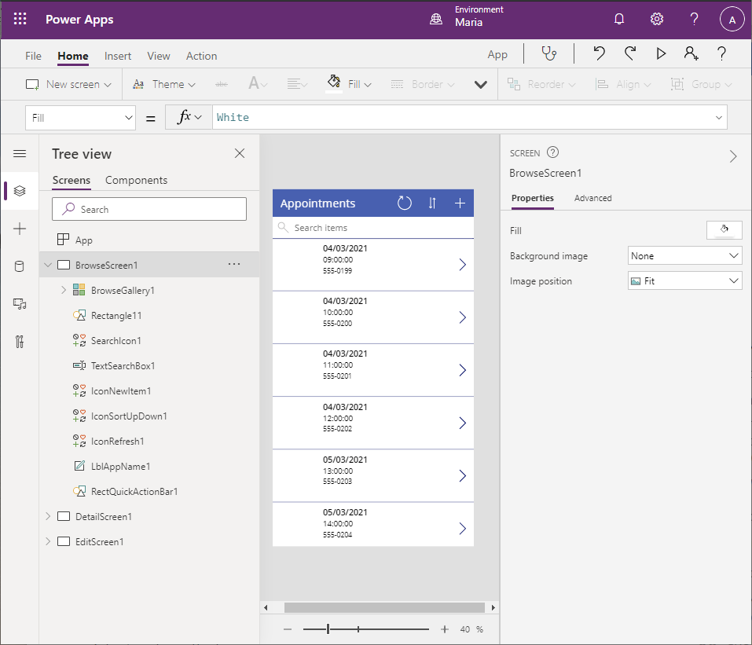

6.  In the **Tree view** pane, under the **BrowseGallery1** control in the **BrowseScreen1** screen, select the **Image1** control and press **Delete**. The **Browse** screen should just list appointments and not any images associated with them:

    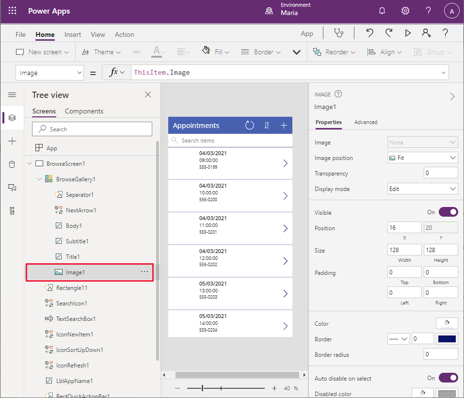

    Notice that removing the **Image1** control causes several errors on the screen because the widths and location of the **Title1** control reference the **Image** control. You'll fix these problems in the next step.

7.  In the **Tree view** pane, select the **Title1** control under **BrowseGallery1**. Change the value in the **X** property to **16**. Change the formula in the **Width** property to **Parent.TemplateWidth - 104**. This should resolve the errors for the screen.

8.  In the **Tree view** pane, select the **Body1** control under **BrowseGallery1**. This control currently displays the contact telephone details for the customer. Change the value in the **Text** property to **ThisItem.'Customer Name'** (including the single quotes).

    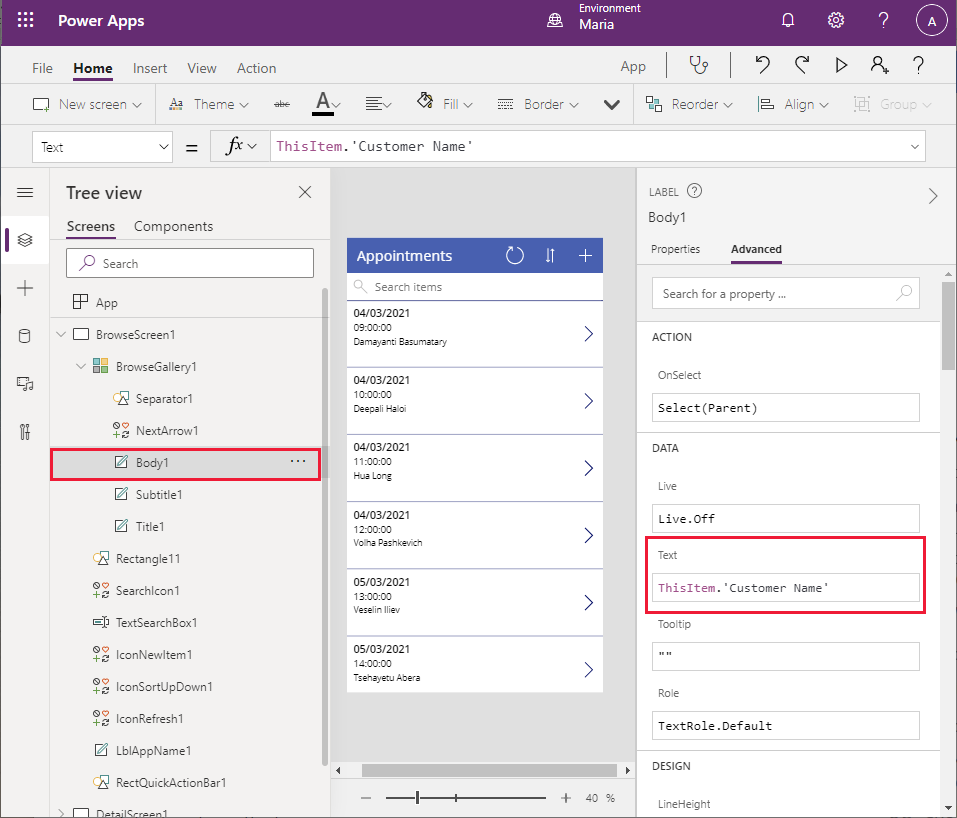

    The details on the **Browse** screen name now display the customer name.

9.  In the **Tree view** pane, select the **BrowseGallery1** control. Using the formula bar examine the expression in the **Items** property. The control searches for appointments using the appointment date, time, and contact number. Change this formula to search the customer name rather than the contact number:

    ```
    SortByColumns(Search([@Appointments], TextSearchBox1.Text, "Appointment_x0020_Date","Appointment_x0020_Time","Customer_x0020_Name"), "Appointment_x0020_Date", If(SortDescending1, Descending, Ascending)).
    ```

Notice that the appointments are ordered by date and then time (the first two fields displayed).

10. In the **Tree view** pane, delete the **IconNewItem1** icon. Only on-premises staff can book new appointments for engineers and technicians. Notice that this action results in errors in the form because the width and position of other controls in the header reference the icon you just removed.

11. In the **Tree view** pane, select the **LblAppName1** control. Change the formula for the **Width** property. to **Parent.Width - Self.X - IconSortUpDown1.Width - IconRefresh1.Width**.

12. In the **Tree view** pane, select the **IconRefresh1** icon. Change the value for the **X** property to **Parent.Width - IconSortUpDown1.Width - Self.Width**.

13. In the **Tree view** pane, select the **iconSortUpDown1** icon. Change the value for the **X** property to **Parent.Width - Self.Width**.

14. In the **Tree view** pane, select the **BrowseScreen** screen, and then select the ellipsis button. On the drop-down menu that appears, select **Rename** and change the name of the screen to **BrowseAppointments**.

    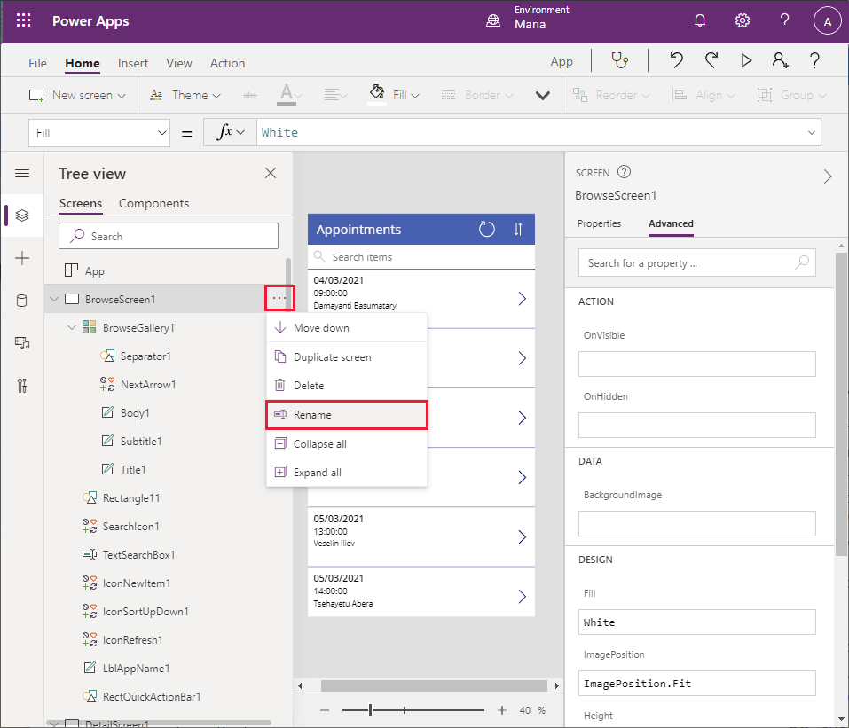

15. Using the same technique, change the name of the **BrowseGallery1** control to **BrowseAppointmentsGallery**.

That completes the **Browse** screen. You can now turn your attention to the **Details** screen.

1.  In the **Tree view** pane, scroll down to the **DetailsScreen1** screen. You can see that the details are presented in alphabetical order of the field names, and not all the useful bits of information, such as the **Notes** field, are displayed:

    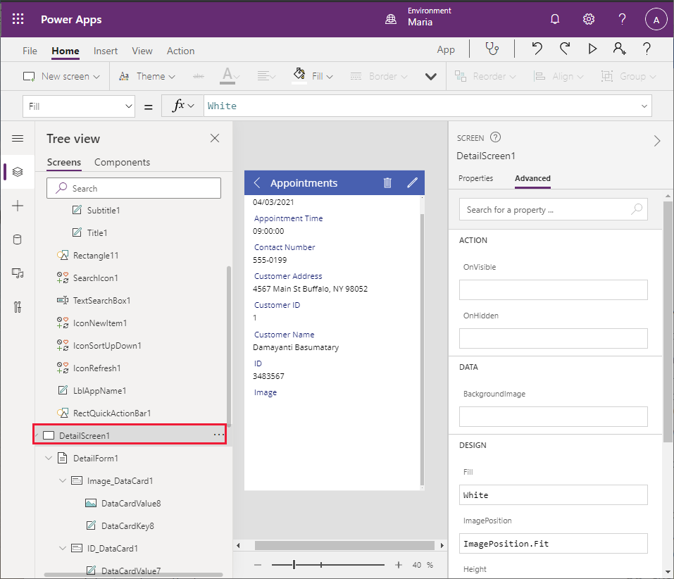

2.  In the **Tree view** pane, select the **DetailForm1** control. In the right pane, on the **Properties** tab, in the **Fields** field, select **Edit fields.** In the middle pane, select each of the following fields, and then press **Delete**:

    -   Appointment Date
    -   Appointment Time
    -   Customer ID
    -   ID

3.  In the middle pane, select **+ Add field**, and add the following fields:

    -   Notes
    -   Problem Details
    -   Status

    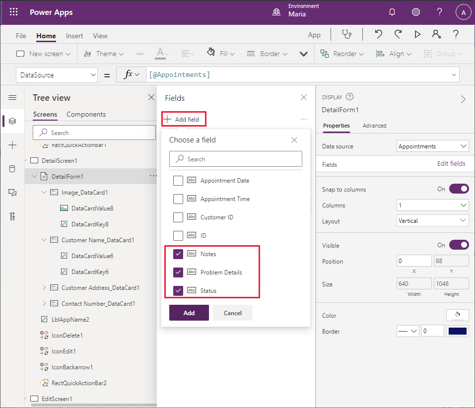

4.  In the middle pane, click and drag each field so that they're displayed in the following order, from top to bottom:

    -   Customer Name
    -   Customer Address
    -   Contact Number
    -   Problem Details
    -   Status
    -   Notes
    -   Image

5.  In the **Tree view** pane, select the **Notes\_DataCard1** control. Change the **Height** property to **320**:

    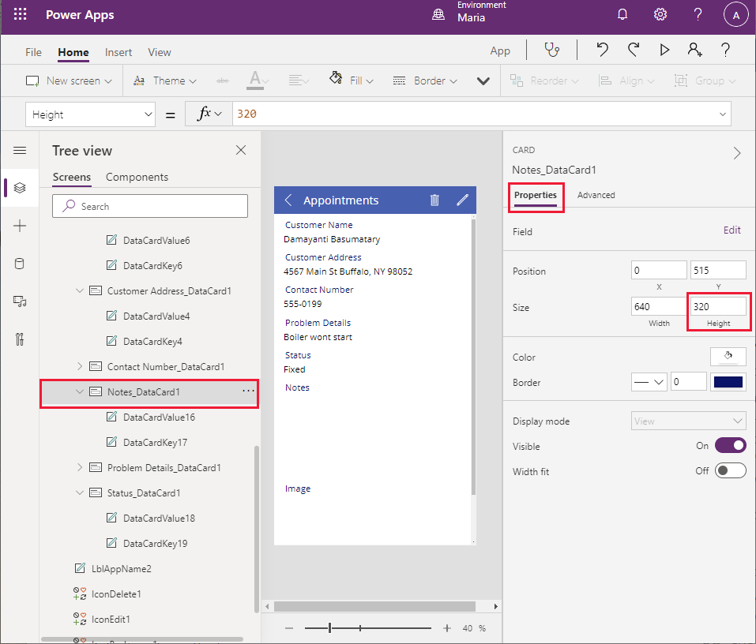

6.  In the **Tree view** pane, delete the **IconDelete1** icon. Engineers shouldn't be able to remove appointments from the system.

7.  Select the **LblAppName2** control. Update the **Width** property of this control to **Parent.Width - Self.X - IconEdit1.Width**.

8.  Using the technique described earlier, change the name of **DetailsScreen1** to **AppointmentDetails**.

The final screen to look at for now is the **Edit** screen.

1.  In the **Tree view** pane, scroll down and select the **EditScreen1** screen.

2.  In the **Tree view** pane, select the **EditForm1** control in the **EditScreen1** screen. In the right pane, on the **Properties** tab, in the **Fields** field, select **Edit fields.**

3.  Remove the following fields from the **EditForm1** control:

    -   Customer Address
    -   ID
    -   Customer ID
    -   Appointment Date
    -   Appointment Time

4.  Add the following fields to the form:

    -   Problem Details
    -   Status
    -   Notes

5.  Reorganize the fields so that they're in the following sequence:

    -   Contact Name
    -   Customer Number
    -   Problem Details
    -   Status
    -   Notes
    -   Image

6.  Select the **Customer Name** field and click the drop-down arrow to view its properties. Change the **Control type** to **View text**. This change makes the control read-only; an engineer shouldn't be able to change the customer's name, although it is useful to see it on the **Edit** screen:

    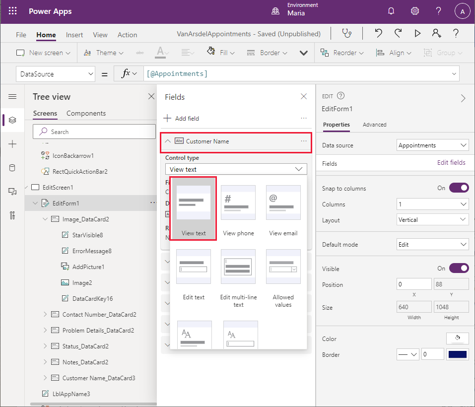

7.  Select the **Contact Number** field and click the drop-down arrow to view its properties. Change the **Control type** to **View text**. This field should also be read only.

8.  Select the **Notes** field, click the drop-down arrow to view its properties, and change the **Control type** to **Edit multi-line text**. This setting enables the engineer to add detailed notes that can span several lines.

9.  Select the **Status** field, click the drop-down arrow to view its properties, and change the **Control type** to **Allowed Values**.

10. In the **Tree view** pane, select the **Status\_DataCard5** control. In the right pane, on the **Properties** tab, select **Unlock to change properties**. Scroll down to the **AllowedValues** property, and change the text to ["Fixed", "Parts Ordered", "Unresolved"] (including the square brackets). The field engineer can only set the **Status** to one of these defined values.

    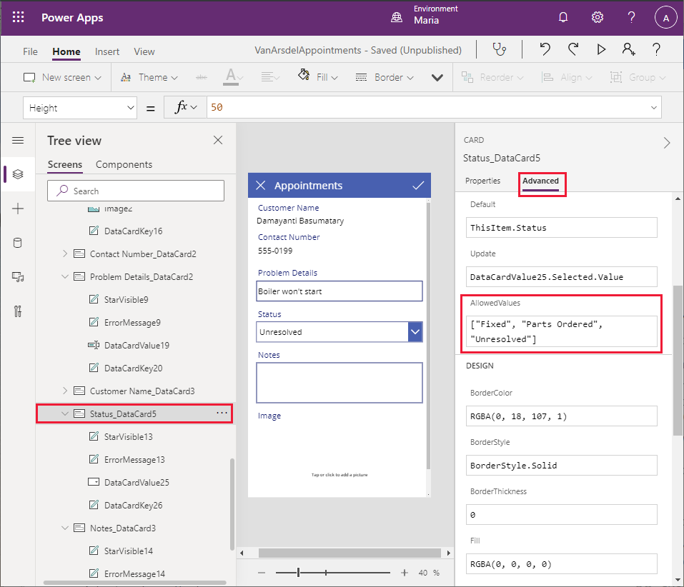

11. In the **Tree view** pane, rename **EditScreen1** as **EditAppointment**.

You can now save and test the app.

1.  Select the **File** menu in the Power Apps Studio toolbar, and then select **Save as**.

2.  Under **Save as**, select **The cloud** as the destination, name the app **VanArsdelAppointments**, and then select **Save**.

3.  Press the back arrow icon in the Power Apps Studio toolbar to return to the **Home** screen.

4.  Press **F5** to preview the app. On the **Appointments** page, select the **\>** symbol for any appointment. The **Details** screen for the appointment should appear. Select the **Edit** button in the header to update the appointment. Verify the following:

    -   The customer name and contact number fields are read-only.
    -   The status field is limited to the values in the drop-down list box.
    -   You can enter notes over several lines.
    -   You can upload an image file to the image field.

    > **NOTE:**
    > An enhancement that you will add later allows you to take a picture with your phone from within the app, and add it to the image field.

    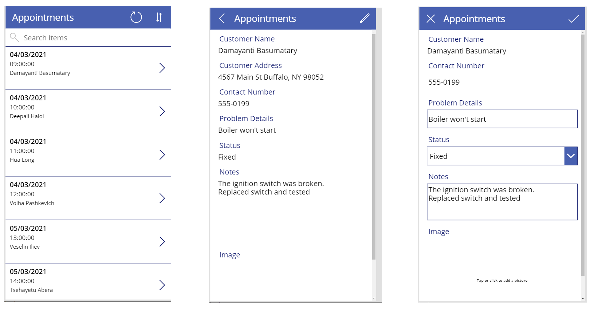

## Combining the screens into a single App

Maria has built two apps, but she wants to combine them into a single app. To do this, she copies the screens for the Appointments app into the Field Inventory Management and Knowledgebase app, as follows:

1.  Open a new browser window and sign in to Power Apps Studio with your account details.

2.  In the left pane, select **Apps**, select the **VanArdselApp** Power App, and then select **Edit.**

    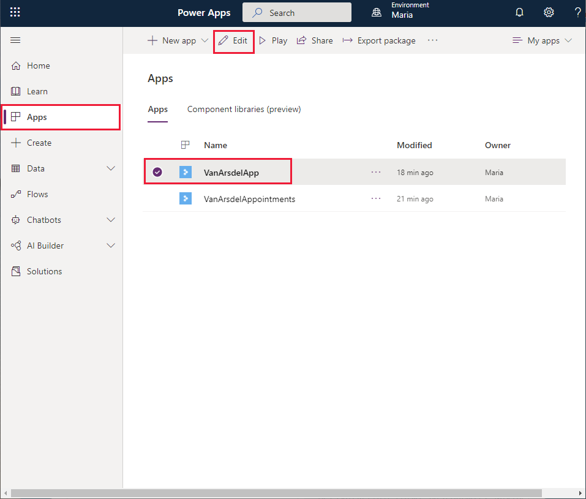

3.  In the toolbar, select **New screen**, and then select **Blank**. This action will add a new screen to the app into which you will copy the controls for the **Browse** screen for the **VanArsdelAppointments** app.

    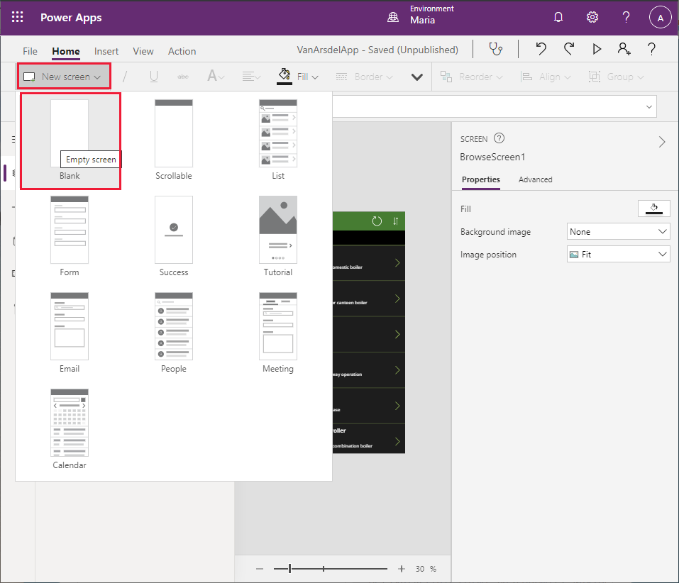

4.  The new screen will be called **Screen2**. In the **Tree view** pane, rename it as **BrowseAppointments**.

5.  Repeat the previous step twice more, to add two more blank screens (**Screen3** and **Screen4**).

6.  Rename **Screen3** as **AppointmentDetails**, and rename **Screen4** as **AppointmentDetails**.

7.  In the left toolbar of Power Apps Studio, select the **Data** icon. In the **Data** pane, select **Add data**. In the **Select a data source** drop-down list box, in the **Search** field, type **OneDrive**, and select **OneDrive for Business**.

    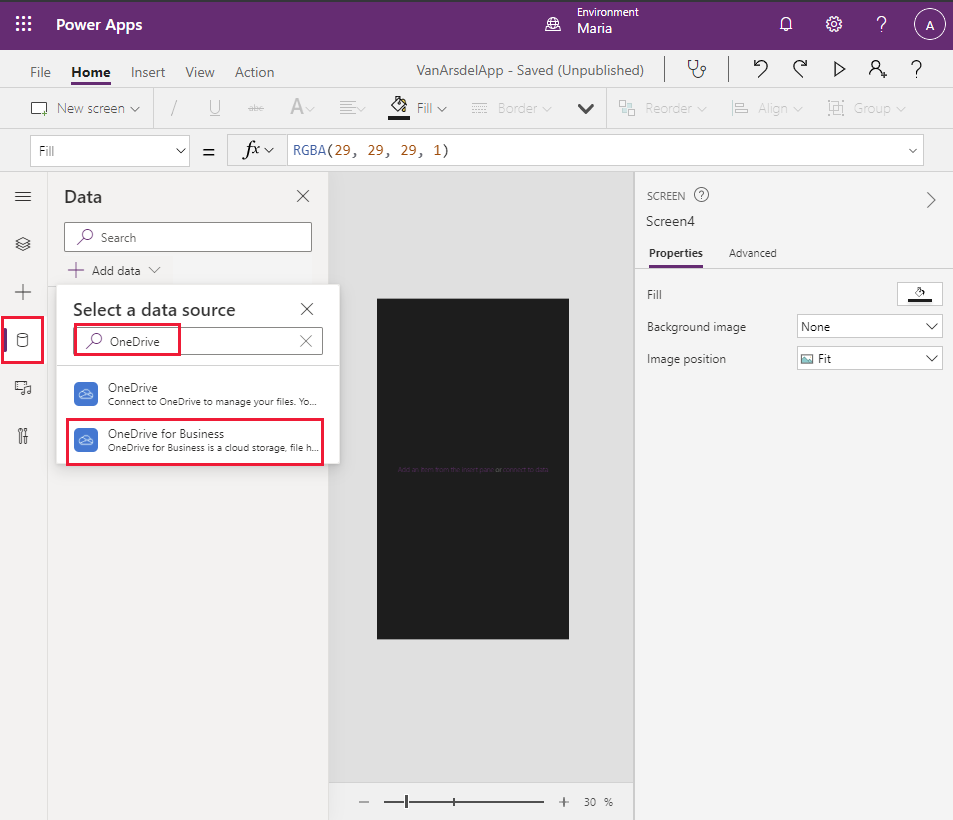

8.  Select the **Appointments.xlsx** Excel spreadsheet, and the **Appointments** table, and then select **Connect**.

9.  Switch to the browser window with the **VanArsdelAppointments** app.

10. In the toolbar, select **Theme** (you might have to click the drop-down arrow displaying more items for the toolbar), and then select the **Forest** theme. This is the same theme used by the **VanArsdel** app.

11. In the left toolbar, select the **Tree view** icon, select the **BrowseAppointments** screen, and then press **CTRL A**. This action selects all the controls in the screen.

12. Press **CTRL C** to copy these controls to the clipboard.

13. Return to the browser window with the **VanArsdelApp** app.

14. In the left toolbar, select the **Tree view** icon, and then select the **BrowseAppointments** screen.

15. Press **CTRL V** to paste the controls into the screen.

    > [!NOTE]
    > Sometimes the screen header appears slightly too low down. To fix this problem, select the **IconSortUpDOwn1\_1**, **IconRefresh1\_1**, **LblAppName1\_1**, and **RectQuickActionBar1\_1** controls in the **Tree view** pane (use **Shift-click** to select more than one control at a time), and then use the mouse or arrow keys to move them up in the design view pane.

16. Switch back to the browser window with the **VanArsdelAppointments** app, then select and copy the controls in the **AppointmentDetails** screen to the clipboard (**CTRL A** followed by **CTRL C**).

17. Return to the browser window with the **VanArsdelApp** app, select the **AppointmentDetails** screen, and paste the controls (**CTRL V**). Adjust the position of the controls in the screen header if necessary.

    > [!NOTE]
    > You will see an error reported in the header of the **AppointmentDetails** screen. This error occurs because the screen references controls in the **EditAppointment** screen which haven't been copied yet. The next steps should resolve this error.

18. Switch back to the browser window with the **VanArsdelAppointments** app, then select and copy the controls in the **EditAppointment** screen to the clipboard.

19. Return to the browser window with the **VanArsdelApp** app, select the **EditAppointment** screen, and paste the controls. Again, move the controls in the screen header if necessary.

20. Select the **AppointmentDetails** screen in the **Tree view** menu. Verify that the error indicated previously has now disappeared.

21. In the **Tree view** menu, select the **BrowseScreen1** screen. Change the name of this screen to **BrowseParts**.

22. Change the name of the **DetailsScreen1** screen to **PartDetails**.

23. Change the name of the **Screen1** screen to **Knowledgebase**.

    > [!NOTE]
    > It is good practice to rename screens to reflect their function rather than using the default names generated by Power Apps Studio. This is especially important if an app contains several screens. It can help to avoid confusion later if the app is modified by another developer.

## Adding a Home screen to the app

The final stage is to add a **Home** screen to the Power App. The **Home** screen will enable the engineer to move between the different parts of the app (inventory management, knowledge base, and appointments).

1.  In the **VanArsdelApp** Power App, in the toolbar, select **New screen**, and then select **Blank**.

2.  In the **Tree view** pane, change the name of the screen (**Screen2**) to **Home**.

3.  In the toolbar, select **Insert**. In the list of controls, expand **Media**, and select the **Image** control. The control will be added to the screen:

    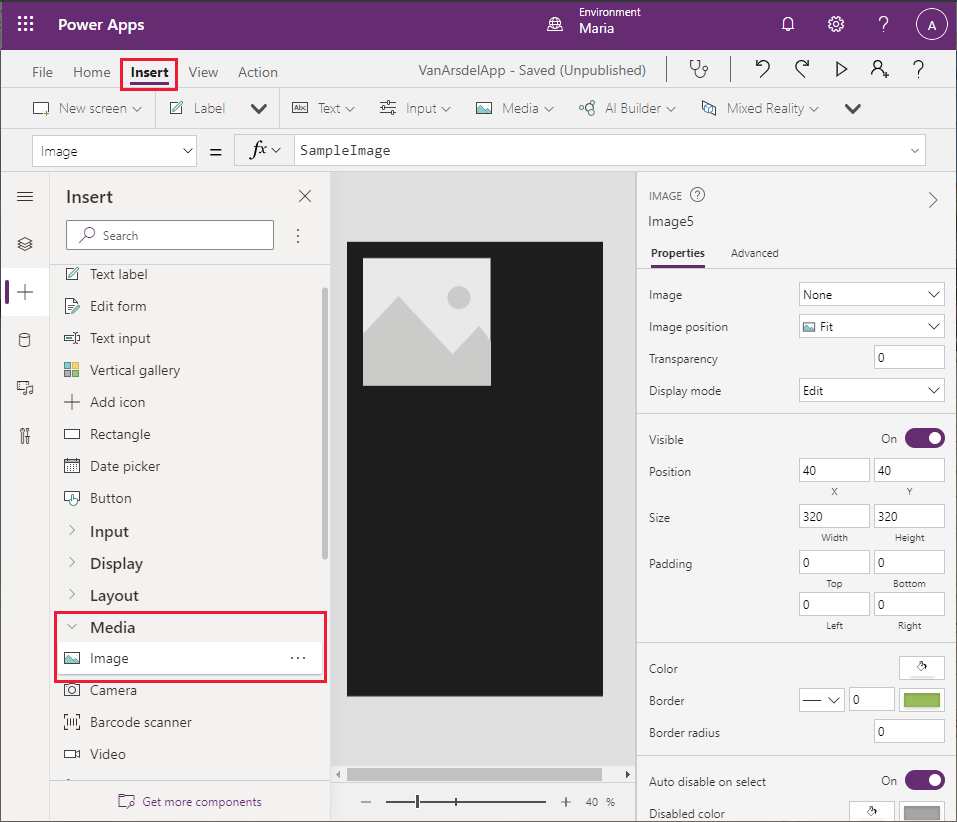

4.  Set the **X** position of the control to **16**, and the **Y** position to **22**. Change the **Width** to **605**, and the **Height** to **127**. Change the **Image position** to **Fill**:

    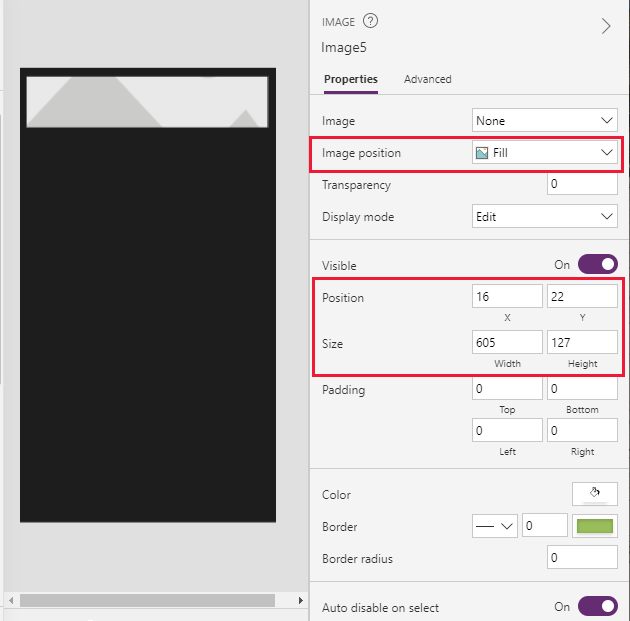

5.  Still on the **Properties** tab, in the **Image** drop-down list box, select **+ Add an image file**, and upload the **VanArsdelLogo.png** image to the control:

    > [!NOTE]
    > The image file is available in the **Assets** folder in the Git repository for this guide.

    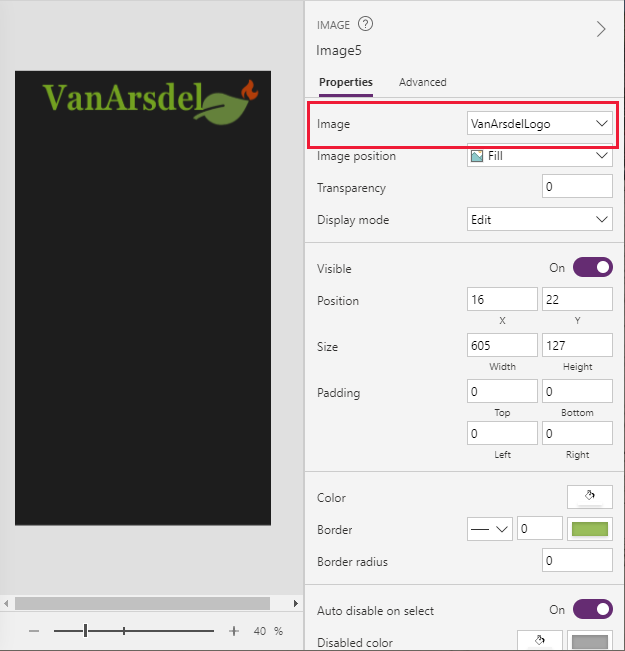

6.  From the list of controls, add four **Text label** controls to the form and position them as shown in the image below:

    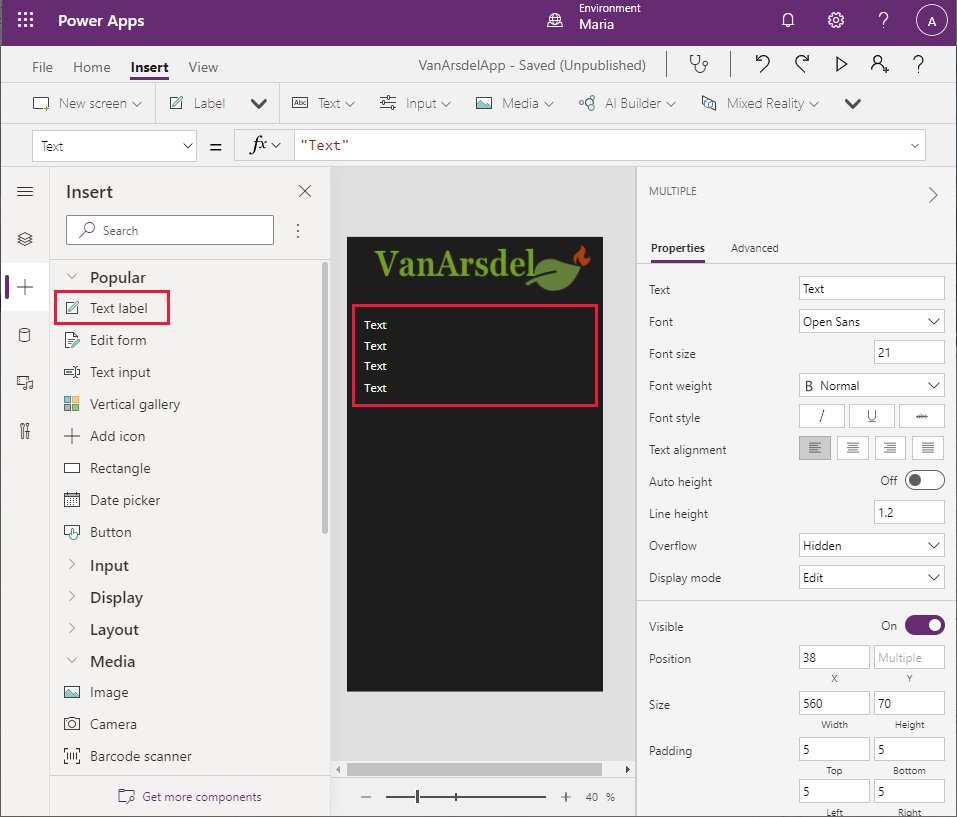

7.  Select the uppermost **Text label** control. In the right pane, on the **Properties** tab, set the **Text** property to **Next Appointment**. Set the **Font Size** to 30, and use the color picker to set the font color to Green (to match the logo):

    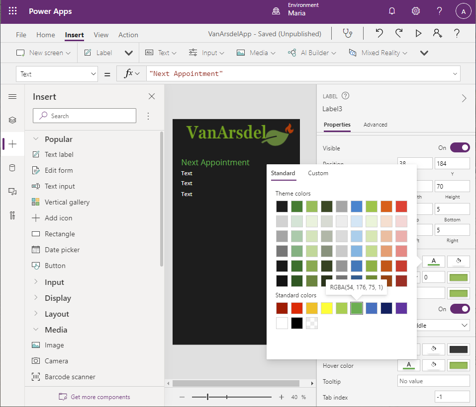

8.  Select the second **Text label** control. Change the value of the **Text** property to **First(Appointments).\'Customer Name\'** (including the quotes). This formula retrieves the customer name from the first row in the appointments table:

    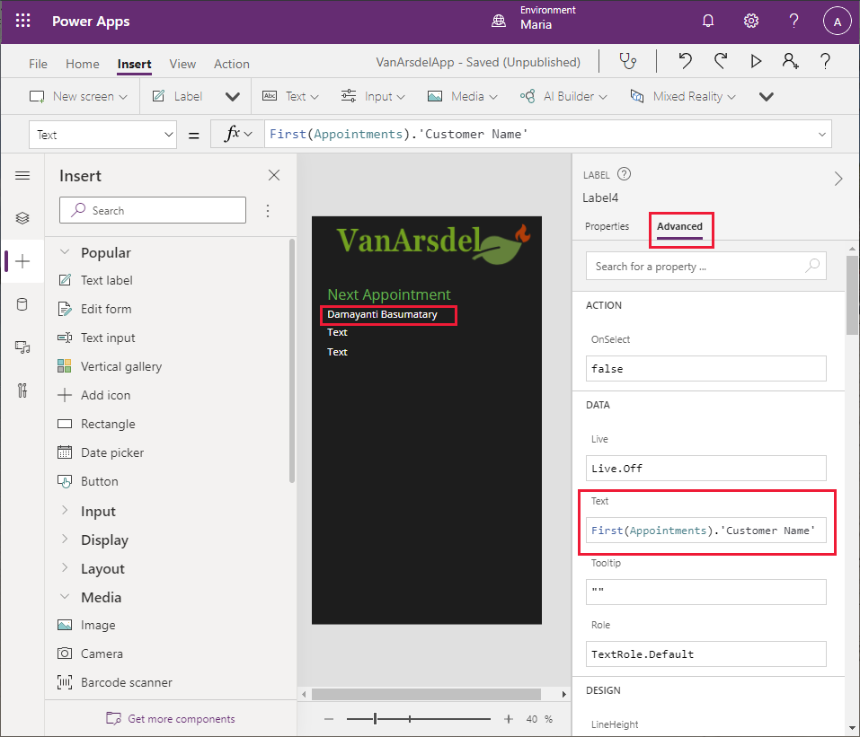

    > [!NOTE]
    > Currently, this formula just acts as a placeholder. You will modify this label later to retrieve the next appointment for the engineer rather than always displaying the first one.

9.  Select the third **Text** **label** control and set the **Text** property to **First(Appointments).\'Appointment Date**.

10. Set the **Text** property of the fourth label control to **First(Appointments).\'Appointment Time**. Set the **Font size** property to 30.

11. From the list of controls, add a **Rectangle** control. Set the following properties for this control:

    -   Display mode: **View**
    -   X: **0**
    -   Y: **632**
    -   Width: **635**
    -   Height: **1**

    This control acts as a visual separator across the middle of the screen.

12. Add three **Button** controls to the screen, arranged vertically and spaced evenly below the separator. Set the **Text** property for the top button to **Appointments**, the **Text** property for the middle button to **Parts**, and the **Text** property for the lower button to **Knowledgebase**.

    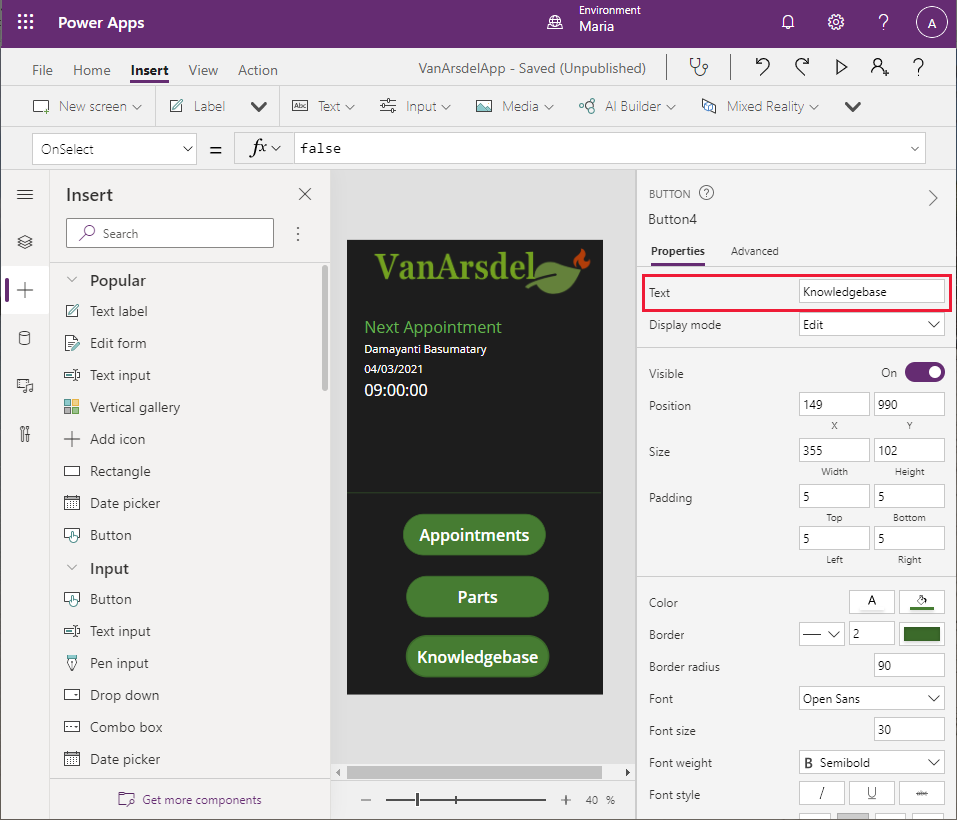

13. Select the **Appointments** button. Change the expression in the **OnSelect** action to the formula **Navigate(BrowseAppointments ,ScreenTransition.Fade)**. This action switches the display to the appointments screen when the user selects the button:

    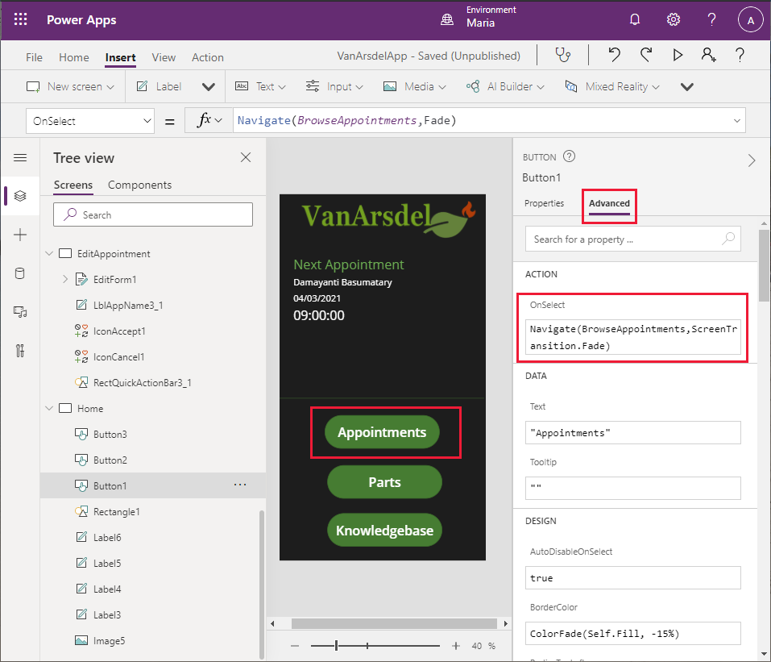

14. Set the **OnSelect** action for the **Parts** button to **Navigate(BrowseParts, ScreenTransition.Fade)**.

15. Set the **OnSelect** action for the **Knowledgebase** button to **Navigate(Knowledgebase, ScreenTransition.Fade)**.

As well as navigating from the **Home** screen to the other screens in the system, the appointments, parts, and knowledge base screens need a way to enable the user to return to the **Home** screen. Maria decides to add *back* buttons to these screens.

1.  In the **Tree view** pane, select the **BrowseParts** screen.

2.  Select the **RectQuickActionBar1** control to give it the focus.

3.  Select the **Insert** menu, and select **Add icon.** Move the icon to the left of the **RectQuickActionBar1** control. Note that the icon will obscure part of the **Browse Parts** label.

    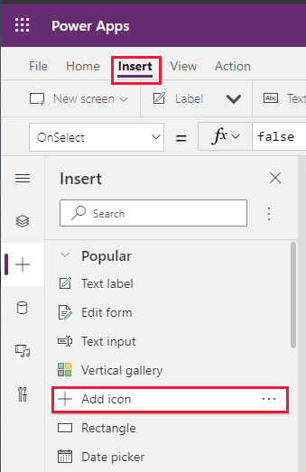

4.  In the **Tree view** menu, change the name of the new icon control to **IconReturn1**.

5.  Change the formula for the **OnSelect** action to the expression **Back(ScreenTransition.Fade)**. The **Back** function navigates the user to the previous screen they visited.

6.  On the **Properties** tab, change the Icon property to **\< Left**.

7.  In the screen header, select the **Browse Parts** label. Change the **X** property to **IconReturn1.Width + 20.** The **Browse parts** label should no longer be partially obscured.

    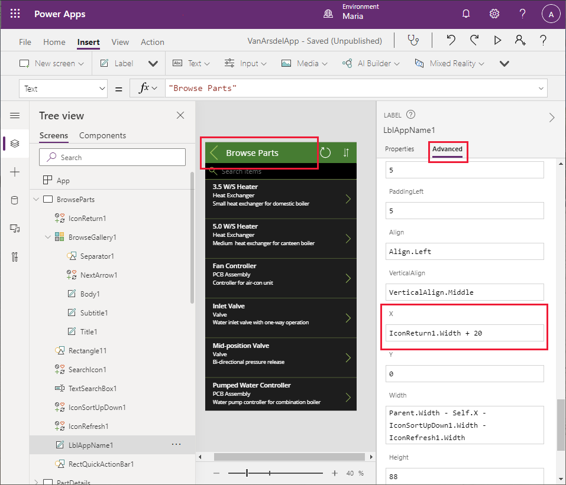

8.  Following the process described in steps 16 to 22, add an icon named **IconReturn2** to the **RectQuickActionBar3** control in the **Knowledgebase** screen.

9.  Similarly, add an icon named **IconReturn3** to the **RectQuickActionBar1\_1** control in the **BrowseAppointments** screen.

10. In the **Tree view** pane, select the **App** object. Change the **OnStart** action property to the expression **Navigate(Home, ScreenTransition.Fade)**. This action ensures that the **Home** screen is displayed whenever the app starts:

    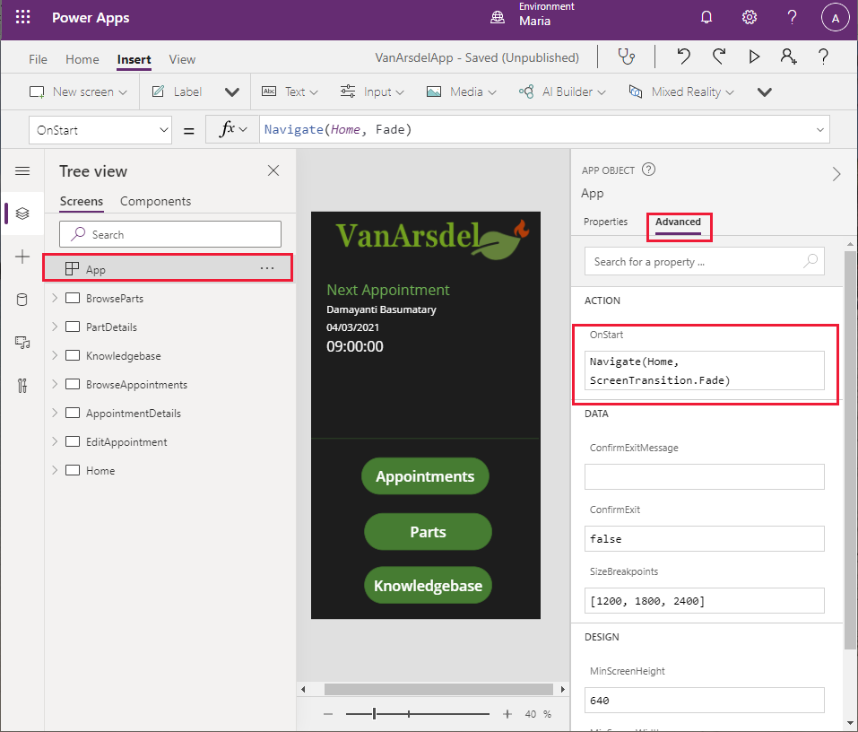

    > [!NOTE]
    > If you don't specify which screen should be displayed when the app starts, the screen that appears at the top of the **Tree view** pane will be used. To move a screen to the start of the list, right-click the screen in the **Tree view** pane and select **Move up** until it is at the top.

Finally, you can test the app.

1.  On the **File** menu, on the **Save** tab, enter the text **Complete version with Home screen** in the **Version note** box, and select **Save**.

2.  Select the back arrow icon to return to the **Home** screen and press **F5** to run the Power App.

3.  Verify that the **Home** screen for the app appears.

4.  Select **Appointments**. The appointments browser screen should appear.

5.  Click the back arrow icon in the screen header to return to the **Home** screen.

6.  Select **Parts**. The parts browser should appear.

7.  Click the back arrow icon in the screen header to return to the **Home** screen.

8.  Select **Knowledgebase**. The knowledge base query screen should appear.

9.  Click the back arrow icon in the screen header to return to the **Home** screen.

10. Close the preview window and return to Power Apps Studio.

The prototype app is now complete.

> [!div class="step-by-step"]
> [Previous](02-intro-sample-scenario.md)
> [Next](04-using-dataverse-as-data-source.md)
