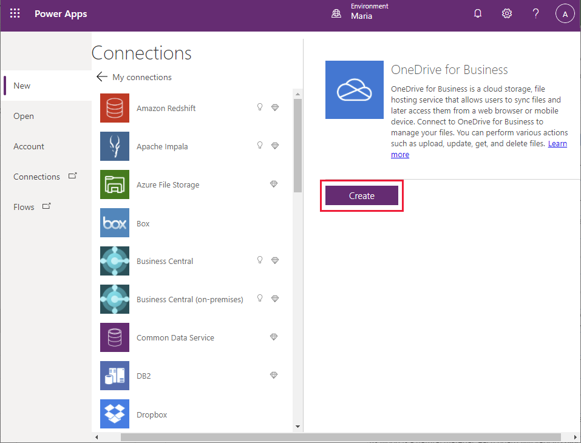
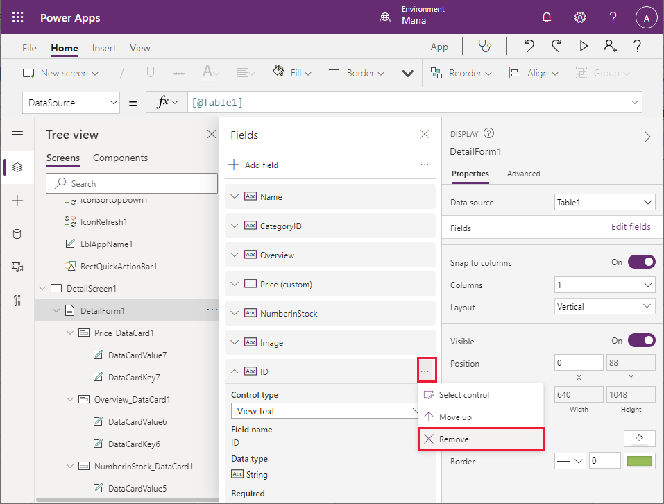
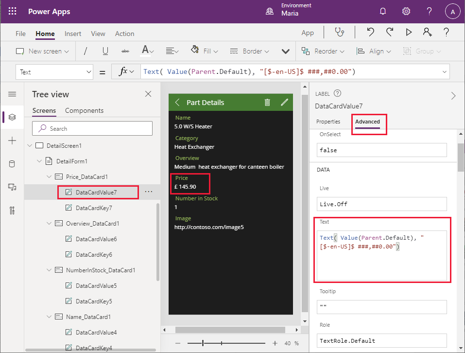

# Chapter 3: Building a low-code prototype

> [!NOTE] 
> [Chapter 2](02-intro-sample-scenario.md) referenced the mobile app used by the field technicians and engineers, and desktop app used by on-premises staff. The following chapters focus on the design, implementation, and rollout of the mobile apps built with Power Apps. The desktop apps are left as an exercise for the reader.

Kiana is skeptical of low-code solutions and Power Apps, but she and Maria decide to build an app together to help the field technicians check inventory (and order parts, if necessary), query the knowledge base, and check their next appointment while they're out of the office on service calls. Kiana and Maria plan to use this experience to explore how to add controls and use formulas in Power Apps.

Although building an initial, low-code prototype is typically a citizen developer task, Kiana decides to pay attention to the process to ensure that she understands how the app is constructed. She needs this information to enable her to help Maria integrate the real-world data sources, Web APIs, and other required services into the app.

## Item 1: Field inventory management

Maria's initial aim is to build a canvas app that displays a list of parts and enables the user to view the details of any part. Eventually, the user should also be able to order a part; however, this initial version of the app will simply be a prototype and won't be hooked up to a back end yet. After she has obtained feedback from Caleb, the lead field technician, Maria will work with Kiana on integrating the canvas app with the inventory system running on-premises.

Maria is very familiar with the existing inventory management system and understands the information that it contains. She starts by creating an Excel workbook that contains tables holding mock data with details for some sample parts. The fields in the table are **ID**, **Name**, **CategoryID**, **Price**, **Overview**, **NumberInStock**, and **Image** (a URL that references an image of the part). She can use this workbook to build and test the canvas app, to ensure that it displays the required data correctly. She stores this workbook in her OneDrive account with the name **BoilerParts.xlsx**.

> [!NOTE] 
> You can find a copy of this workbook in the [Assets](https://github.com/microsoft/fusion-dev-ebook/tree/main/Assets) folder in the Git repository for this guide.


If you're a relational database designer, you'll notice that the Excel workbook presents a denormalized view of the data. For example, in a relational database, **CategoryID** would most likely be a numeric identifier that references a separate table containing the details of the category, including the name.

> [!NOTE]
> The URLs in the **Image** column are currently just placeholders. In the completed app, these URLs will be replaced with the addresses of real image files.

Follow these steps to create the app with Power Apps.

1. Sign in to [Power Apps](https://make.powerapps.com).

2. On the **Home** page, under **Start from data**, select **Excel Online**.

    

3. On the **Connections** page, select **OneDrive for Business**, and then select **Create**.

    

4. On the **OneDrive for Business** page, select the **BoilerParts.xlsx** file.

    

5. Select the table in the Excel file (Maria created the table by using the default name, **Table1**), and then select **Connect**.

    

6. Wait while Power Apps generates the app.

    

7. When the app has been generated, you'll see the **Browse** screen, displaying **CategoryID**, **ID**, and **Image** fields from each row of the parts table in the workbook.

    

8. The fields that are currently displayed aren't very useful for helping an engineer select a product. On the pane displaying the **Browse** screen, select the **Heat Exchanger** label in the first row of data. In the formula bar, select the **Text** property from the dropdown list. Change the value of this property to **ThisItem.Name**. The text in the first field of each row will switch to display the part name.

    > [!NOTE] 
    > In the following image, the **Heat Exchanger** label originally displayed on the form has changed to the product name, **3.5 W/S Heater**.

    

9. Repeat the previous step for the **ID** and **Image** labels. Change the **Text** property of the **ID** field to **CategoryID**, and the **Text** property of the **Image** field to **Overview**. The **Browse** screen should now look like the following image, which a field engineer is more likely to find useful for selecting parts.

    

10. The search feature of the **Browse** screen defaults to using the fields that were initially selected when the screen was generated&mdash;in this case, **CategoryID**, **ID**, and **Image**. The results are sorted by **CategoryID**. It makes sense to switch this to the **Name**, **CategoryID**, and **Overview** fields, with results sorted by **Name**. Select the **BrowseGallery1** control on the **Tree view** pane. In the dropdown list on the left side of the formula bar, select the **Items** property. Drag the lower edge of the formula bar down so the formula is completely visible. The formula contains the following expression:

    ```
    **SortByColumns(Search([\@Table1], TextSearchBox1.Text, "CategoryID","ID","Image"), "CategoryID", If(SortDescending1, Descending, Ascending))
    ```

    

11. Change the **Search** expression to reference the **Name**, **CategoryID**, and **Overview** fields by using the following formula:

    ```
    SortByColumns(Search([\@Table1], TextSearchBox1.Text, "Name", "CategoryID", "Overview"), "Name", If(SortDescending1, Descending, Ascending))
    ```

12. The title in the form header isn't helpful, and the default theme doesn't match VanArsdel's corporate look and feel. In the **Browse** screen, select the **Table1** label, and on the **Formula** bar, change the **Text** property of the label to **"Browse Parts"** (include the double quotation marks in the value).

13. On the toolbar, select **Theme** (you might have to expand the toolbar to display more items), and then select the **Forest** theme. The colors and styling for the **Browse** screen will change to match the theme.

    

#### Make the Details screen more useful

You've created the basic app and modified the **Browse** screen to display fields that an engineer can use to identify a part. The app also contains a **Details** screen, which shows all the information for a selected part. The fields on this screen aren't currently displayed in a logical sequence, so you should rearrange them. You can also delete the **ID** field from this screen, because this information is irrelevant to an engineer.

1. On the **Tree view** pane, scroll down and select **DetailScreen1**. This screen displays details about the part that a user selects on the **Browse** screen.

    

2. In the header of the **Details** screen on the middle pane, select the **Table1** label. On the right pane, on the **Properties** tab, change the **Text** property to **Part Details**.

    > [!NOTE] 
    > In many cases, you can accomplish the same results by using the formula bar as the **Properties** pane. However, some properties that are only available through the **Properties** pane.

    

3. On the **Tree view** pane, under **DetailScreen1**, select **DetailForm1**. On the right pane, on the **Properties** tab, select **Edit fields** next to **Fields**. On the middle pane, select and drag the fields so that they're displayed in the following order, from top to bottom:

   - Name
   - CategoryID
   - Overview
   - Price
   - NumberInStock
   - Image
   - ID

    

4. Select the **ID** field, select the ellipsis that appears on the right side of the field, and then select **Remove** from the dropdown menu that appears. This action removes the **ID** field from the form.

    

5. On the **Tree view** pane, under **DetailForm1**, select **CategoryID\_DataCard1**. This element is a **DataCard** control that displays the name of a field (called the **key**) and its value.

    

    On the right pane, on the **Advanced** tab, select **Unlock to change properties**. In the **Data** section, change the **DisplayName** field to **"Category"** (include the quotation marks).

    > [!NOTE] 
    > As with the **Properties** tab, many of the properties on the **Advanced** tab are also accessible through the formula bar. To set these properties, you can use the formula bar if you prefer.

    

6. Repeat the previous step to change the key for **NumberInStock\_DataCard1** to **"Number in Stock"** (include the quotation marks).

7. You need to adjust the formatting of the **Price** field to display the data as a currency value. On the **Tree view** pane, under **DetailForm1**, under **Price\_DataCard1**, select **DataCardValue7**. This is the field that displays the value of the **Price** field. On the **DataCardValue7** pane on the right, on the **Advanced** tab, change the **Text** property to **Text(Value(Parent.Default), "[\$-en-US]\$ \#\#\#,\#\#0.00")**

    

    The expression **Parent.Default** refers to the data item to which the parent control (the **DataCard**) is bound&mdash;in this case, the **Price** column. The **Text** function reformats this value by using the format specified as the second argument; in this example, this is the local currency with two decimal places.

8. The image data card should display an image of the part rather than the URL of the image file. On the **Tree view** pane, under **DetailForm1**, under **Image\_DataCard1**, select **DataCardValue3**, and then select **Delete** to remove this control.

9. Select **Image\_DataCard1**. On the left pane, select **+ Insert**. On the **Insert** pane, expand **Media**, and then select **Image**.

    

10. Return to the **Tree view** pane, and verify that the **Image1** text control has been added to the **Image\_DataCard1** control.

    

11. On the **Tree view** pane, select **Image\_DataCard1**. On the right pane, on the **Advanced** tab, change **Height** to **500**, to allow sufficient space for an image to be displayed.

    

12. On the **Tree view** pane, select **Image1**. Set the following properties:

    - Image: **Parent.Default**
    - ImagePosition: **ImagePosition.Fit**
    - Width: **550**
    - Height: **550**

    > [!NOTE]
    > The image displayed is currently empty because the URL in the Excel workbook is just a placeholder. You'll address this issue, and fetch a real URL, when you bind the app to a Web API in a later chapter.

The app also contains an **Edit** screen, which enables a user to change the information for a part. An engineer shouldn't be able to change the details of a part, create new parts, or delete parts from the catalog.

1. On the **Tree view** pane, select **EditScreen1**. Select the ellipsis button, and then select **Delete** to remove this screen.

    

2. On the **Tree view** pane, select **DetailsScreen1**. Notice that Power Apps Studio displays an error message for this screen. This error occurs because the **DetailsScreen1** contains expressions that reference the **EditScreen1** screen, which no longer exists.

3. In the header of the **DetailsScreen1**, select the pencil (**IconEdit1**) icon. The **OnSelect** property for this control contains the expression **EditForm(EditForm1);Navigate(EditScreen1, ScreenTransition.None)**. When the **Edit** icon is selected, this expression runs and attempts to move to the **EditScreen1** screen.

    

4. On the **Tree view** pane, select **IconEdit1**, and then select **Delete**. This icon is no longer required.

5. Select **IconDelete1**, and then select **Delete**. This icon is used to delete the current part, and is also not required.

    

6. Notice that the **Part Details** text has disappeared from the screen header, and instead Power Apps Studio displays an error message. This has happened because the width of the label control that displays the text is calculated. On the **Tree view** pane, select **LblAppName2**. Examine the **Width** property. The value of this property is the result of the expression **Parent.Width - Self.X - IconDelete1.Width - IconEdit1.Width**.

    

7. Change the expression for the **Width** property to **Parent.Width - Self.X**. The error should disappear, and the **Part Details** text should reappear in the screen header.

8. On the **Tree view** pane, select **BrowseScreen1**. This screen will also display an error message. The **+** icon in the toolbar (**IconNewItem1**) enables the user to add a new part. The **OnSelect** property for this icon references the **EditScreen1** screen.

    

9. Select **IconNewItem1**, and then select **Delete**. As before, the text in the header for the screen disappears and an error message is displayed, and for the same reason.

10. On the **Tree view** pane, under **BrowseScreen1**, select **LblAppName1**. Modify the expression for the **Width** property by removing the reference to **IconNewItem1.Width**. The new expression should be **Parent.Width - Self.X - IconSortUpDown1.Width - IconRefresh1.Width**.

    

11. There's still a problem with the header. Although the **Browse Parts** text has reappeared, an error is being displayed, and the refresh and sort icons are in the wrong place. On the **Tree view** pane, select  **IconSortUpDown1**. Find the **X** property for this control. This property determines the horizontal position of the icon in the header. It's currently calculated based on the width of the **IconNewItem1** control.

    

12. Change the expression for the **X** property to **Parent.Width - Self.Width**.

13. On the **Tree view** pane, select **IconRefresh1**. Change the expression for the **X** property to **Parent.Width - IconSortUpDown1.Width - Self.Width**. The errors should all disappear.

#### Save and test the app

Now you can save and test the app.

1. Select **File** > **Save as**.

2. Under **Save as**, select **The cloud**, enter the name **VanArsdelApp**, and then select **Save**.

    

3. Select the back arrow to return to the **Home** screen.

    

4. Select **F5** to preview the app. On the **Browse Parts** page, select the right angle bracket (**\>**) to the right of any part. The **Details** screen for the part appears.

    

5. Select the left angle bracket (**\<**) in the **Details** screen header to return to the **Browse** screen.

6. On the **Browse Parts** screen, enter text in the **Search** box. As you type, the items will be filtered to only show those that have matching text in the **Name**, **CategoryID**, or **Overview** fields.

    

7. Close the preview window and return to Power Apps Studio.

## Item 2: Field knowledge base

For access to the knowledge base, Maria and Caleb (the technician) envisage a simple interface where the user enters a search term and the app displays all knowledge base articles that mention the term. Maria knows that this process is going to involve Azure Cognitive Search, but doesn't need&mdash;or even want&mdash;to understand how it works. Therefore, Maria decides to just provide the basic user interface. She'll work with Kiana later to add the actual functionality.

Maria decides to create a new screen based on the **List** template available in Power Apps Studio.

1.  On the Power Apps Studio **Home** screen toolbar, select **New Screen**, and then select **List**.

    

2.  In the screen header, select the label that displays the text **\[Title]**. Change the **Text** property to **"Query"** (include the quotation marks).

    

3.  In the screen header, select the plus sign (**+**), and then select **Delete**. The **+** icon is intended to enable the user to add more items to the list. The knowledge base is query-only, so this feature isn't needed.

    

    Notice that removing this icon causes an error in the header due to the way in which the location and widths of the other items are calculated. You saw this earlier with the inventory management screen, and the solution is the same, as described in the following steps.

4.  On the **Tree view** pane, scroll down to the **Screen1** section, and select **LblAppName3**. Change the **Width** property to the formula **Parent.Width - LblAppName3.X - IconSortUpDown2.Width - IconRefresh2.Width**.

    

5.  On the **Tree view** pane, select **IconSortUpDown2**. Modify the **X** property to the formula **Parent.Width - IconSortUpDown2.Width**.

6.  On the **Tree view** pane, select **IconRefresh2**. Modify the **X** property to **Parent.Width - IconSortUpDown2.Width - IconRefresh2.Width**. This should resolve all the errors with the screen.

7.  Select **File** > **Save**.

8.  In the **Version note** box, enter the text **Added Knowledgebase UI**, and then select **Save**.

9.  Return to the **Home** screen and select **F5** to preview the new screen. It should look like the following image.

    

    Note that if you select the **\>** icon next to any of the dummy entries, the details functionality doesn't currently work. You'll address this later when you integrate Azure Cognitive Search into the app.

10. Close the preview window and return to Power Apps Studio.

## Item 3: Field scheduling and notes

Maria works with Malik, the office receptionist, to design the interface for the field scheduling and appointments part of the app. Malik provides an Excel workbook with some sample data that Maria can use to build the appointments screen. The workbook contains a table with the following columns:

-   ID (the appointment ID)
-   Customer ID (a unique identifier for the customer)
-   Customer Name
-   Customer Address
-   Problem Details (a text description of the problem the customer is experiencing)
-   Contact Number
-   Status
-   Appointment Date
-   Appointment Time
-   Notes (a text description with any notes added by the engineer)
-   Image (a photograph of the appliance, either in working condition after repair or as a supplementary picture for the engineer's notes)


> [!NOTE] 
> As with the field inventory management data, this workbook presents a denormalized view of the data. In the existing appointments system, this data is stored in separate tables that hold appointment data and customer data.

Maria stores this file in her OneDrive account with the name **Appointments.xlsx**. Remembering that she previously used the default name for the table in the workbook and had to change the title in the various screens that were generated, she renames the table in the workbook to **Appointments**.

> [!NOTE] 
> This workbook is available in the [Assets](https://github.com/microsoft/fusion-dev-ebook/tree/main/Assets) folder of the Git repository for this guide.

Maria wants to build the appointments section of the app directly from the Excel file. She decides to follow a similar approach to that of the field inventory management functionality, except that this time the engineer will be allowed to create and edit appointments.

Maria decides to build the appointments screens initially as a separate app. This way, she can use Power Apps Studio to generate much of the app automatically. Power Apps Studio doesn't currently let you generate additional screens from a data connection in an existing app. When Maria has created and tested the screens, she'll copy them to the field inventory and knowledge base app.

> [!NOTE] 
> An alternative approach is to add the **Appointments** table in the Excel file as a second data source to the existing app, and then hand-craft the screens for appointments. Maria opted to generate the new screens from the workbook and copy the screens; she's currently more familiar with the concepts of copy and paste than building screens manually, although she'll gradually learn how to create screens from scratch as the process of building this app progresses.

**To create the appointments app**

1.  In the Power Apps Studio menu bar, select **File**.

    

2.  On the left pane, select **New**. On the main pane, select the **OneDrive for Business - Phone layout** box.

    

3.  On the **Connections** pane, select **Appointments.xlsx**.

    

4.  In the Excel file, select the **Appointments** table, and then select **Connect**.

    

5.  Wait while the app is generated. When the new app appears, it will contain a **Browse** screen, a **Details** screen, and an **Edit** screen, using the default theme.

    

6.  On the **Tree view** pane, in the **BrowseScreen1** section under **BrowseGallery1**, select **Image1**, and then select **Delete**. The **Browse** screen should just list appointments, not any images associated with them.

    

    Notice that removing the **Image1** control causes several errors on the screen because the widths and location of the **Title1** control both reference the **Image** control. You'll fix these problems in the following step.

7.  On the **Tree view** pane under **BrowseGallery1**, select **Title1**. Change the value in the **X** property to **16**. Change the formula in the **Width** property to **Parent.TemplateWidth - 104**. This should resolve the errors for the screen.

8.  On the **Tree view** pane under **BrowseGallery1**, select **Body1**. This control currently displays the contact telephone details for the customer. Change the value in the **Text** property to **ThisItem.'Customer Name'** (include the single quotation marks).

    

    The details on the **Browse** screen name now display the customer name.

9.  On the **Tree view** pane, select **BrowseGallery1**. Using the formula bar, examine the expression in the **Items** property. The control searches for appointments by using the appointment date, time, and contact number. Change this formula to search the customer name rather than the contact number:

    ```
    SortByColumns(Search([@Appointments], TextSearchBox1.Text, "Appointment_x0020_Date","Appointment_x0020_Time","Customer_x0020_Name"), "Appointment_x0020_Date", If(SortDescending1, Descending, Ascending)).
    ```
    Notice that the appointments are ordered by date and then time (the first two fields displayed).

10. On the **Tree view** pane, delete **IconNewItem1**. Only on-premises staff can book new appointments for engineers and technicians. Notice that this action results in errors in the form because the width and position of other controls in the header reference the icon you just removed.

11. On the **Tree view** pane, select **LblAppName1**. Change the formula for the **Width** property. to **Parent.Width - Self.X - IconSortUpDown1.Width - IconRefresh1.Width**.

12. On the **Tree view** pane, select **IconRefresh1**. Change the value for the **X** property to **Parent.Width - IconSortUpDown1.Width - Self.Width**.

13. On the **Tree view** pane, select **iconSortUpDown1**. Change the value for the **X** property to **Parent.Width - Self.Width**.

14. On the **Tree view** pane, select **BrowseScreen1**, and then select the ellipsis button (**...**). On the dropdown menu that appears, select **Rename** and change the name of the screen to **BrowseAppointments**.

    

15. Using the same technique, change the name of the **BrowseGallery1** control to **BrowseAppointmentsGallery**.

That completes the **Browse** screen. 

**To create the details screen**

You can now turn your attention to the **Details** screen.

1.  On the **Tree view** pane, scroll down to the **DetailsScreen1** section. You can see that the details are presented in alphabetical order by field names, and some useful bits of information&mdash;such as the **Notes** field&mdash;aren't displayed at all.

    

2.  On the **Tree view** pane, select **DetailForm1**. On the right pane on the **Properties** tab, select **Edit fields** next to **Fields**. On the middle pane, select each of the following fields, and then select **Delete**:

    -   Appointment Date
    -   Appointment Time
    -   Customer ID
    -   ID

3.  Select **+ Add field**, and add the following fields:

    -   Notes
    -   Problem Details
    -   Status

    

4.  Drag each field so that they're displayed in the following order, from top to bottom:

    -   Customer Name
    -   Customer Address
    -   Contact Number
    -   Problem Details
    -   Status
    -   Notes
    -   Image

5.  On the **Tree view** pane, select **Notes\_DataCard1**. Change the **Height** property to **320**.

    

6.  On the **Tree view** pane, delete **IconDelete1**. Engineers shouldn't be able to remove appointments from the system.

7.  Select **LblAppName2**, and change the **Width** property to **Parent.Width - Self.X - IconEdit1.Width**.

8.  Using the technique described earlier, change the name of **DetailsScreen1** to **AppointmentDetails**.

**To edt the Edit screen**

The final screen to look at, for now, is the **Edit** screen.

1.  On the **Tree view** pane, select **EditScreen1**.

2.  On the **Tree view** pane, in the **EditScreen1** section, select **EditForm1**. On the right pane, on the **Properties** tab, select **Edit fields** next to **Fields**.

3.  Remove the following fields:

    -   Customer Address
    -   ID
    -   Customer ID
    -   Appointment Date
    -   Appointment Time

4.  Add the following fields:

    -   Problem Details
    -   Status
    -   Notes

5.  Drag each field so that they're displayed in the following order, from top to bottom:

    -   Contact Name
    -   Customer Number
    -   Problem Details
    -   Status
    -   Notes
    -   Image

6.  Select the **Customer Name** field and expand it to view its properties. Change the **Control type** to **View text**. This change makes the control read-only; it's useful to see the customer's name on the **Edit** screen, but an engineer shouldn't be able to change it.

    

7.  Select the **Contact Number** field and expand it to view its properties. Change the **Control type** to **View text**. This field should also be read-only.

8.  Select the **Notes** field, expand it, and change the **Control type** to **Edit multi-line text**. This setting enables the engineer to add detailed notes that can span several lines.

9.  Select the **Status** field, expand it, and change the **Control type** to **Allowed Values**.

10. On the **Tree view** pane, select **Status\_DataCard5**. On the right pane, on the **Properties** tab, select **Unlock to change properties**. Scroll down to the **AllowedValues** property, and change the text to **["Fixed", "Parts Ordered", "Unresolved"]** (include the square brackets). The field engineer can only set the **Status** to one of these defined values.

    

11. On the **Tree view** pane, rename **EditScreen1** as **EditAppointment**.

You can now save and test the app.

1.  Select **File** > **Save as**.

2.  Under **Save as**, select **The cloud**, enter the name **VanArsdelAppointments**, and then select **Save**.

3.  Select the back arrow in the Power Apps Studio toolbar to return to the **Home** screen.

4.  Select **F5** to preview the app. On the **Appointments** page, select the **\>** icon next to any appointment. The **Details** screen for the appointment should appear. In the header, select **Edit** to update the appointment. Verify the following:

    -   The customer name and contact number fields are read-only.
    -   The status field is limited to the values in the dropdown list.
    -   You can enter notes that span several lines.
    -   You can upload an image file to the image field.

    > [!NOTE]
    > An enhancement that you'll add later will allow you to take a picture with your phone from within the app, and add it to the image field.

    

## Combining the screens into a single app

Maria has built two apps, but she wants to combine them into a single app. To do this, she copies the screens for the appointments app into the field inventory management and knowledge base app, as follows:

1.  Open a new browser window and sign in to Power Apps Studio with your account details.

2.  On the left pane, select **Apps**, select **VanArdselApp**, and then select **Edit.**

    

3.  In the toolbar, select **New screen**, and then select **Blank**. This action will add a new screen to the app into which you'll copy the controls for the **Browse** screen for the **VanArsdelAppointments** app.

    

4.  The new screen will be named **Screen2**. On the **Tree view** pane, rename it as **BrowseAppointments**.

5.  Repeat the previous step twice more, to add two more blank screens (**Screen3** and **Screen4**).

6.  Rename **Screen3** as **AppointmentDetails**, and rename **Screen4** as **EditAppointment**.

7.  On the left toolbar of Power Apps Studio, select the **Data** icon. On the **Data** pane, select **Add data**. In the **Select a data source** dropdown list, in the **Search** field, enter **OneDrive**, and then select **OneDrive for Business**.

    

8.  Select the **Appointments.xlsx** Excel file, select the **Appointments** table, and then select **Connect**.

9.  Switch to the browser window that shows the **VanArsdelAppointments** app.

10. On the toolbar, select **Theme** (you might have to expand the toolbar to display more items), and then select the **Forest** theme. This is the same theme used by the **VanArsdel** app.

11. On the left toolbar, select the **Tree view** icon, select the **BrowseAppointments** screen, and then select **Ctrl+A**. This action selects all the controls in the screen.

12. Select **Ctrl+C** to copy these controls to the clipboard.

13. Return to the browser window that shows the **VanArsdelApp** app.

14. On the left toolbar, select the **Tree view** icon, and then select the **BrowseAppointments** screen.

15. Select **Ctrl+V** to paste the controls onto the screen.

    > [!NOTE]
    > Sometimes the screen header appears slightly too low down. To fix this problem, select the **IconSortUpDOwn1\_1**, **IconRefresh1\_1**, **LblAppName1\_1**, and **RectQuickActionBar1\_1** controls On the **Tree view** pane (hold down **Shift** while clicking to select more than one control at a time), and then use the mouse or arrow keys to move them up in the design view pane.

16. Switch back to the browser window that shows the **VanArsdelAppointments** app, and then select and copy the controls in the **AppointmentDetails** screen to the clipboard (**Ctrl+A** followed by **Ctrl+C**).

17. Return to the browser window that shows the **VanArsdelApp** app, select the **AppointmentDetails** screen, and then paste the controls (**Ctrl+V**). Adjust the position of the controls in the screen header, if necessary.

    > [!NOTE]
    > You'll see an error reported in the header of the **AppointmentDetails** screen. This error occurs because the screen references controls in the **EditAppointment** screen, which haven't been copied yet. The next steps should resolve this error.

18. Switch back to the browser window that shows the **VanArsdelAppointments** app, and then select and copy the controls on the **EditAppointment** screen to the clipboard.

19. Return to the browser window that shows the **VanArsdelApp** app, select the **EditAppointment** screen, and then paste the controls. Again, move the controls in the screen header if necessary.

20. On the **Tree view** pane, select the **AppointmentDetails** screen and verify that the error indicated previously has now disappeared.

21. On the **Tree view** pane, select the **BrowseScreen1** screen. Rename this screen as **BrowseParts**.

22. Rename the **DetailsScreen1** screen as **PartDetails**.

23. Rename the **Screen1** screen as **Knowledgebase**.

    > [!NOTE]
    > It's a good practice to rename screens to reflect their function rather than use the default names generated by Power Apps Studio, especially if an app contains several screens. This can help to avoid confusion later if the app is modified by another developer.

## Adding a Home screen to the app

The final stage is to add a **Home** screen to the app. The **Home** screen will enable the engineer to move between the different parts of the app (inventory management, knowledge base, and appointments).

1.  In the **VanArsdelApp** app on the toolbar, select **New screen**, and then select **Blank**.

2.  On the **Tree view** pane, rename **Screen2** to **Home**.

3.  On the toolbar, select **Insert**. In the list of controls, expand **Media**, and then select **Image**. The control will be added to the screen.

    

4.  Set the **X** position of the control to **16**, and the **Y** position to **22**. Change the **Width** to **605**, and the **Height** to **127**. Change the **Image position** to **Fill**.

    

5.  While still on the **Properties** tab, in the **Image** dropdown list, select **+ Add an image file**, and then upload the **VanArsdelLogo.png** image to the control.

    > [!NOTE]
    > The image file is available in the **Assets** folder in the Git repository for this guide.

    

6.  From the list of controls, add four **Text label** controls to the form and position them so they're stacked under the VanArsdel logo.

    

7.  Select the uppermost **Text label** control. On the right pane, on the **Properties** tab, set the **Text** property to **Next Appointment**. Set the **Font Size** to **30**, and use the color picker to set the font color to green (to match the logo).

    

8.  Select the second **Text label** control. Change the value of the **Text** property to **First(Appointments).\'Customer Name\'** (include the quotation marks). This formula retrieves the customer name from the first row in the appointments table.

    

    > [!NOTE]
    > Currently, this formula just acts as a placeholder. You'll modify the label later to retrieve the next appointment for the engineer, rather than always display the first one.

9.  Select the third **Text label** control, and set the **Text** property to **First(Appointments).\'Appointment Date**.

10. Set the **Text** property of the fourth label control to **First(Appointments).\'Appointment Time**. Set the **Font size** property to 30.

11. From the list of controls, add a **Rectangle** control. Set the following properties for this control:

    -   Display mode: **View**
    -   X: **0**
    -   Y: **632**
    -   Width: **635**
    -   Height: **1**

    This control acts as a visual separator across the middle of the screen.

12. Add three **Button** controls to the screen, arranged vertically and spaced evenly below the separator. Set the **Text** property for the top button to **Appointments**, the **Text** property for the middle button to **Parts**, and the **Text** property for the lower button to **Knowledgebase**.

    

13. Select the **Appointments** button. Change the expression in the **OnSelect** action to the formula **Navigate(BrowseAppointments, ScreenTransition.Fade)**. This action switches the display to the appointments screen when the user selects the button.

    

14. Set the **OnSelect** action for the **Parts** button to **Navigate(BrowseParts, ScreenTransition.Fade)**.

15. Set the **OnSelect** action for the **Knowledgebase** button to **Navigate(Knowledgebase, ScreenTransition.Fade)**.

In addition to navigating from the **Home** screen to the other screens in the system, the **Appointments**, **Parts**, and **Knowledgebase** screens need a way to enable the user to return to the **Home** screen. Maria decides to add back buttons to these screens.

1.  On the **Tree view** pane, select the **BrowseParts** screen.

2.  Select the **RectQuickActionBar1** control to give it the focus.

3.  Select the **Insert** menu, and select **Add icon.** Move the icon to the left of the **RectQuickActionBar1** control. Note that the icon will obscure part of the **Browse Parts** label.

    

4.  On the **Tree view** menu, change the name of the new icon control to **IconReturn1**.

5.  Change the formula for the **OnSelect** action to the expression **Back(ScreenTransition.Fade)**. The **Back** function navigates the user to the previous screen they visited.

6.  On the **Properties** tab, change the Icon property to **\< Left**.

7.  In the screen header, select the **Browse Parts** label. Change the **X** property to **IconReturn1.Width + 20.** The **Browse parts** label should no longer be partially obscured.

    

8.  Following the process described in steps 16 to 22, add an icon named **IconReturn2** to the **RectQuickActionBar3** control in the **Knowledgebase** screen.

9.  Similarly, add an icon named **IconReturn3** to the **RectQuickActionBar1\_1** control in the **BrowseAppointments** screen.

10. On the **Tree view** pane, select the **App** object. Change the **OnStart** action property to the expression **Navigate(Home, ScreenTransition.Fade)**. This action ensures that the **Home** screen is displayed whenever the app starts:

    

    > [!NOTE]
    > If you don't specify which screen to display when the app starts, the screen that appears at the top of the **Tree view** pane will be used. To move a screen to the start of the list, right-click the screen on the **Tree view** pane and select **Move up** until it's at the top.

Finally, you can test the app.

1.  Select **File** > **Save**. In the **Version notes** box, enter **Complete version with Home screen**, and then select **Save**.

2.  Select the back arrow to return to the **Home** screen, and then select **F5** to run the app.

3.  Verify that the **Home** screen for the app appears.

4.  Select **Appointments**. The appointments screen should appear.

5.  Select the back arrow to return to the **Home** screen.

6.  Select **Parts**. The parts browser should appear.

7.  Select the back arrow to return to the **Home** screen.

8.  Select **Knowledgebase**. The knowledge base query screen should appear.

9.  Select the back arrow to return to the **Home** screen.

10. Close the preview window and return to Power Apps Studio.

The prototype app is now complete.

> [!div class="step-by-step"]
> [Previous](02-intro-sample-scenario.md)
> [Next](04-using-dataverse-as-data-source.md)
