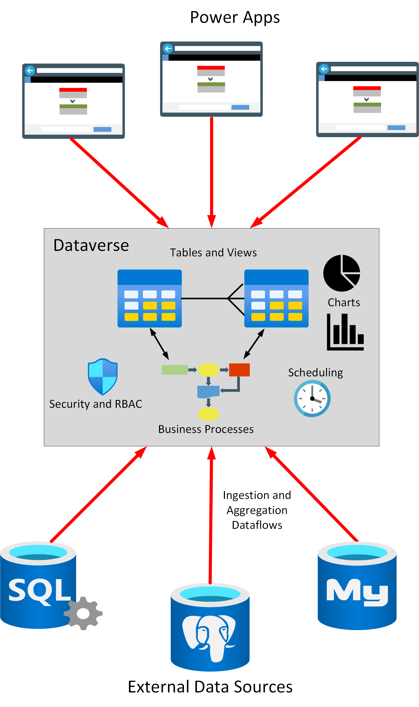
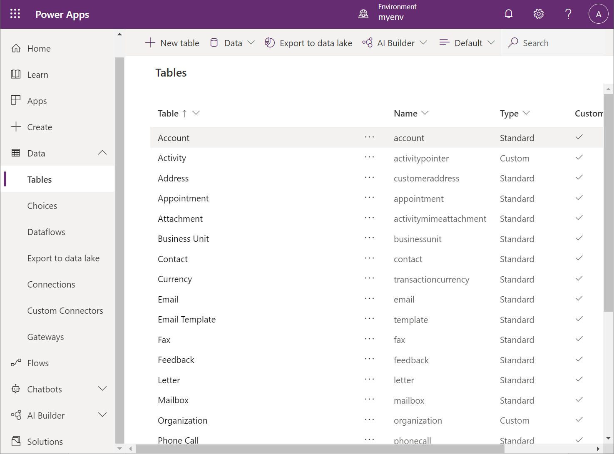
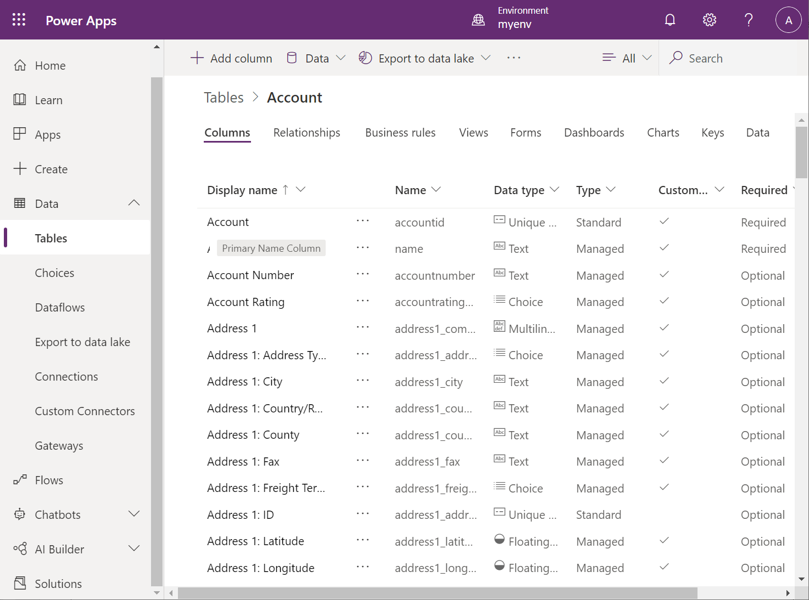
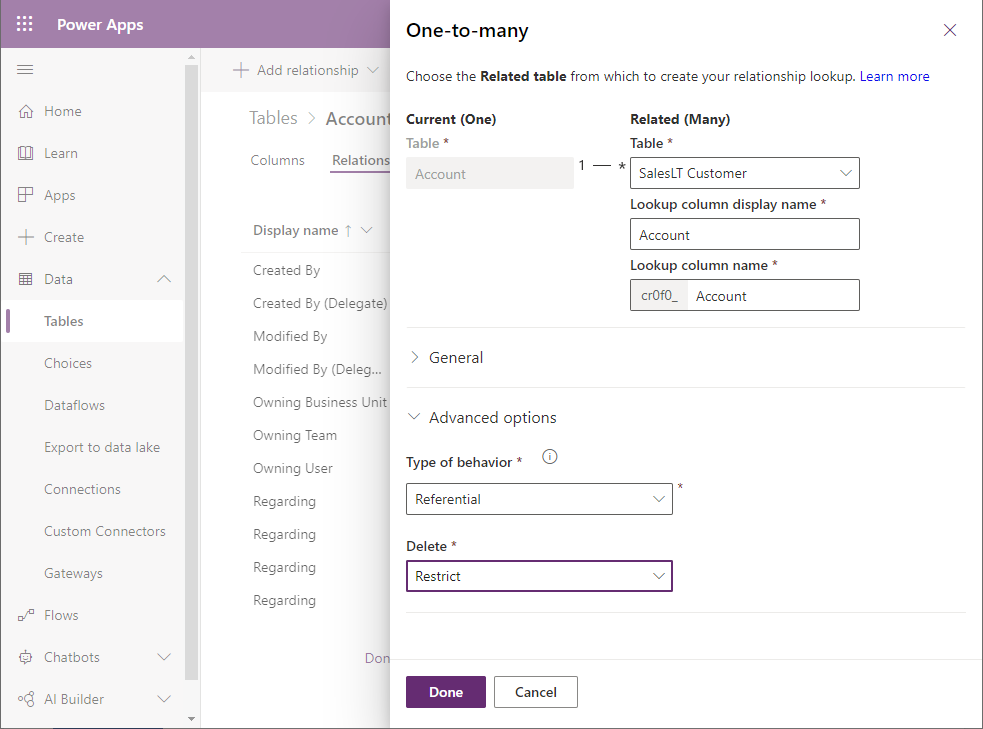
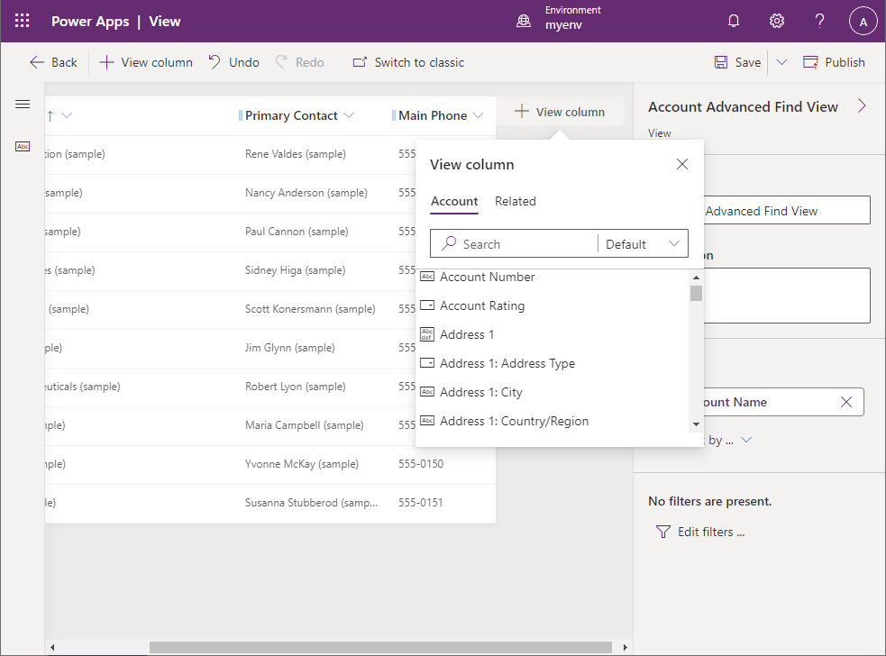
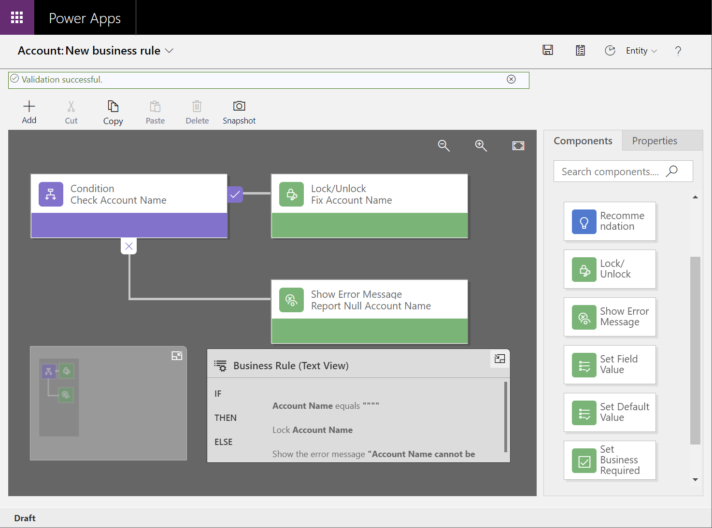
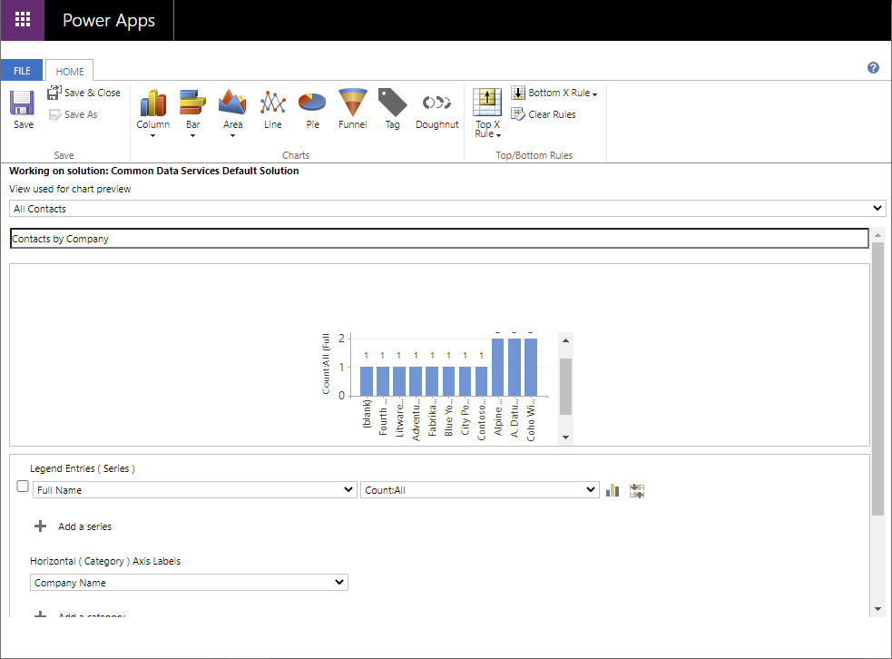

# Chapter 4: Using Microsoft Dataverse as the data source

Maria has built a prototype app by using test data held in Excel workbooks. She can now consider how to connect the app to data sources that will provide real-world data. She has heard about Microsoft Dataverse as an option for doing this, and wants to know more about it.

## What is Dataverse?

Dataverse is a data store with a set of standard tables. You can use it to store business information, manage business rules, and define business dataflows. In many ways it acts like a database, except that it holds more than just data. You can use it to record elements of business logic for your solutions, and share this logic across apps. Dataverse includes scheduling capabilities that enable you to automate processing and workflows. Additionally, you can add charts and associate them with your data; Power Apps can reference these charts directly from Dataverse. More information: [What is Dataverse?](/powerapps/maker/data-platform/data-platform-intro) in Power Apps docs

Dataverse follows the "low-code" approach of Power Apps, enabling a business user to create business entities and workflows. Additionally, Dataverse is a scalable, reliable, and secure system, implemented in Azure. Role-based access control limits the type of access to different users in your organization; users can only see or manipulate the entities to which they've been granted access.

> [!NOTE]
> The definitions of applications and users in Power Apps are also stored in Dataverse. Power Apps uses this information for creating, editing, and publishing apps.

Dataverse enables you to unify data held in disparate databases into a single repository. You can create dataflows that periodically ingest data held in one or more databases into the tables in Dataverse to create aggregated datasets. More information: [Why choose Dataverse?](../../maker/data-platform/why-dataverse-overview.md)

## Defining entities and relationships in Dataverse

Dataverse contains a collection of open-sourced, standardized, extensible data entities and relationships that Microsoft and its partners have published in the industry-wide Open Data Initiative. The data for these entities is stored in a set of tables. Dataverse defines entities for many common business objects, such as Account, Address, Contact, Organization, Team, and User. You can view the tables in Dataverse on the **Tables** tab under **Data** in [Power Apps](https://make.powerapps.com). You can add your own custom tables to Dataverse if necessary, but it's a good practice to use existing tables wherever possible. This will help to ensure the portability of your apps. Tables that are part of the default Dataverse have a Type designated as Standard, but the Type of your own tables will be marked as Custom.

In Dataverse, each entity is tabular, with a default set of columns that are also defined by the Open Data Initiative. You can view the definition of a table by using the **Edit** command for that entity in the list of tables. You can extend a table by using your own columns, but&mdash;as noted earlier&mdash;it's a good practice to use existing columns wherever possible. The following example shows the default definition of the Account table.

> [!NOTE]
> You can modify the display name of tables and columns without changing their names. Power Apps uses the display names as the default labels that appear on forms.

Dataverse supports a rich set of data types for columns, ranging from simple text and numeric values to abstractions that have specified formatting constraints, such as **Email**, **URL**, **Phone**, and **Ticker Symbol**. You can use other types, such as **Choice** and **Lookup**, to restrict the values entered in a column to a fixed domain or data retrieved from a column in a related table. Use the **File** and **Image** types to store unstructured data and images in a table. Images have a maximum size of 30 MB, but files can be as large as 128 MB.

> [!NOTE]
> You can define your own custom choices for use by **Choice** columns in Power Apps.

You can also define relationships among tables. These relationships can be *many-to-one*, *one-to-many*, or *many-to-many*. In addition, you specify the behavior of the related entities as part of the relationship. The behavior can be:

- **Referential**, with or without restricted delete. Restricted delete prevents a row in a related table from being removed if it's referenced by another row in the same, or a different, table.
- **Parental**, in which any action performed on a row is also applied to any rows that it references.
- **Custom**, which enables you to specify how referenced rows are affected by an action performed on the referencing row.

The following example shows how to add a one-to-many relationship from the Account table to a custom table named SalesLT Customer. The behavior prevents a customer from being deleted if it's referenced by a row in the Account table.

## Adding views and business rules

A view provides access to specified columns and rows in one or more related tables. You can think of a view as being a query, but with a name that allows you to treat it as a table. A view contains selected columns from a table but can include columns from related tables. Additionally, a view can filter rows to only show rows that match specified criteria. You can also stipulate the default sort order for the rows presented by a view. Note that a view provides a dynamic window onto the underlying data; if the data changes in the tables behind a view, so does the information represented by the view. You can display data through views in model-driven apps. The following image shows the view designer. The user is adding a new column to a view based on the Account table.

You use business rules to define validations and automate the flow of control when data is added, modified, or deleted in an entity. A business rule comprises a condition that can test for certain conditions in the affected entity, such as whether the data in a column matches or breaks a given rule. The business rules designer in Power Apps Studio provides a graphical user interface for defining business rules, as shown in the the following image.

The business rules designer supports the following actions:

- Set column values.
- Clear column values.
- Set column requirement levels.
- Show or hide columns (for model-driven apps only).
- Enable or disable columns (for model-driven apps only).
- Validate data and show error messages.
- Create business recommendations based on business intelligence (for model-driven apps only).

> [!NOTE]
> [Business rules](/powerapps/maker/data-platform/data-platform-create-business-rule) are best suited to model-driven apps. Not all business rule actions are supported by canvas apps.

## Defining business activities

There are two fundamental types of table in Dataverse: *Standard* tables (including custom tables), which contain data, and *Activity* tables, which represent business actions and workflows that can be scheduled to run by Dataverse. An activity table contains references to the data entities involved in the activity (such as customers or salespeople), a series of states through which the activity can progress, its current state, and other information used by Dataverse to schedule operations when appropriate.

Dataverse contains built-in activities for managing meetings, scheduling business processes, marketing, managing the sales process, creating recurring appointments, and handling customer service incidents. More information: [Activity tables](../../developer/data-platform/activity-entities.md)

You implement the actual business logic by using custom actions, or your own code if you require additional control that's not directly available in Power Apps. The details of this process are beyond the scope of this guide, but for more information, go to [Create a custom action](../../maker/data-platform/create-actions.md).

## Adding graphical display elements

In addition to storing the data structure and logic associated with a business entity, Dataverse can also store layouts for forms, charts, and dashboards associated with an entity. When you create a model-driven app, you can use these forms for data entry and display, while the charts and dashboards enable a user to visualize the data more easily than by looking at basic data values.

## Maria's decision to use Dataverse

Dataverse is an excellent choice of repository for many situations. You should seriously consider it for Power Apps development based on new systems and services and adding new functionality to existing applications, especially if you're creating model-driven apps.

However, in the application that Maria is building, the data already exists in a legacy database. A web API exists that connects to that database to retrieve and modify data and it's deployed in Azure App Service. Those legacy solutions are proven to work and Kiana and her high-code development team are very comfortable supporting those solutions going forward.

An advantage of fusion development teams and Dataverse is fusion development teams allow members to be their most productive in tools that they already know and are most comfortable with. A team does not need to migrate their existing data to Dataverse immediately to build an app using Power Apps. Likewise, when a team is building an application that requires new data, Dataverse makes a ton of sense as an option. It is not uncommon to see an app built using Power Apps to use a combination of legacy data sources and data in Dataverse.

When Maria starts to add new functionality to her app, for example having the field technicians add customer visit notes, she expects to use Dataverse to store that data.

So, for the time being Maria will connect the web API Kiana's team has already developed to her app to obtain the data needed. The following chapters will walk through that process.

> [!div class="step-by-step"]
> [Previous](03-building-low-code-prototype.md)
> [Next](05-creating-publishing-web-api-in-azure.md)
