# Chapter 5: Creating and publishing a Web API in Azure

Having established that the data for the technicians' app should be sourced from existing systems through a Web API, Maria and Kiana work together to determine exactly which information is needed, and in what format. Kiana will then create a web app that exposes the appropriate Web API and arrange for it to be hosted in Azure. The app can connect to Azure from anywhere there's a wireless connection.

## Defining the Web API operations: Field inventory management

The **Browse** screen of the Field Inventory Management section of the app displays a list of parts for boilers and air conditioning systems (referred to simply as *boiler parts*). The **Details** screen enables the technician to view more information about a selected part.

In the existing inventory database (named **InventoryDB**), information about parts is held in a single table named **BoilerParts**. Kiana determines that the Web API should support the following requests:

-   Get all boiler parts.
-   Get the details of a part, given the part ID.

## Defining the Web API operations: Field Knowledgebase

In the existing system, the knowledge base database (named **KnowledgeDB)** contains three tables that record and manage the relationships among tips, engineers, and parts:

-   **Tips**, which contains the details of a tip. Each tip comprises a single line summary identifying a particular problem (the *subject*), and a more detailed explanation describing how to solve the problem (the *body*). Each tip also references a part and the engineer who recorded the tip.
-   **BoilerParts**, which contains a list of the parts referenced by tips. The details of the parts themselves are stored in the **BoilerParts** table in the **InventoryDB** database.
-   **Engineers**, which lists the technicians who have authored each tip.

The knowledge base part of the app currently just contains a placeholder **Browser** screen. Maria wants to implement the following functionality:

-   The technician specifies a search term on the **Browse** screen to find all matching tips. The match could be in the name of the part to which the tip refers, text in the subject or body of the tip, or the name of a technician who's an expert with a specific piece of equipment.
-   When all matching tips have been found, the technician can select a tip to view its details.
-   A technician can also add new tips to the knowledge base, as well as add notes and comments to existing tips.

    The knowledge base is large and growing, and querying across multiple tables and columns can involve complex logic that requires significant compute power. To reduce the load on the Web API, Kiana decides to use Azure Cognitive Search to provide the search functionality, as described earlier. To support the app, Kiana decides that the following operations are required from the Web API:

-   Find the details of a specified knowledge base tip from the **Tips** table.
-   Update an existing knowledge base tip in the **Tips** table.
-   Add a new knowledge base tip to the **Tips** table, which might also involve adding rows to the **BoilerParts** and **Engineers** tables if the specified part or engineer currently have no tips recorded against them. The routine that actually performs the logic behind adding a new tip will be implemented as a logic app called from Power Apps.

## Defining the Web API operations: Field scheduling

Scheduling technician appointments requires not only querying, adding, and removing appointments, but also recording information about customers. The existing appointments system records this data in three tables in the **SchedulesDB** database:

-   **Appointments**, which contains the details of each appointment, including the date, time, problem, notes, and technician assigned to the task.
-   **Customers**, which holds the details of each customer, including their name, address, and contact details.
-   **Engineers**, which lists each technician attending appointments.

> [!NOTE]
> The database actually contains a fourth table named **AppointmentsStatus**. This table contains a list of valid values for the status of an appointment and is simply a lookup used by other parts of the existing appointments system.

Kiana decides that the following operations would be useful for the Field Scheduling part of the app:

-   Find all appointments for a specified technician.
-   Find all appointments for the current day for a specified technician.
-   Find the next scheduled appointment for a specified technician.
-   Update the details of an appointment, such as adding notes or a photograph.
-   Find details about a customer.

## Building the Web API: Field inventory management

The existing systems store data by using Azure SQL Database. Kiana decides to build the Web API by using the Entity Framework Core, because this approach can generate a lot of the code that queries, inserts, and updates data automatically. The Web API template provided by Microsoft can also create the Swagger descriptions that describe each operation in the API. These descriptions are useful for testing the API operations. Many tools can use this information to integrate the API with other services, such as Azure API Management.

Kiana started with the Field Inventory functionality because this is the most straightforward part. The Field Inventory operations in the Web API query a single table, **BoilerParts**, in the **InventoryDB** database. This table contains the columns shown in the following image.

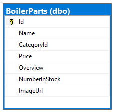

Kiana took the "code-first" approach to building the Web API. With this strategy, she did the following:

1.  Defined her own C\# **model** class that mirrored the structure of the **BoilerParts** table in the **InventoryDB** database.

2.  Created an Entity Framework **context** class that the Web API uses to connect to the database, to perform queries.

3.  Configured the context class to connect to the **InventoryDB** database in Azure.

4.  Used the Entity Framework command-line tools to generate a Web API **controller** class that implements HTTP REST requests for each of the operations that can be performed against the **BoilerParts** table.

5.  Used the Swagger API to test the Web API.

The following image shows the high-level structure of the Web API.

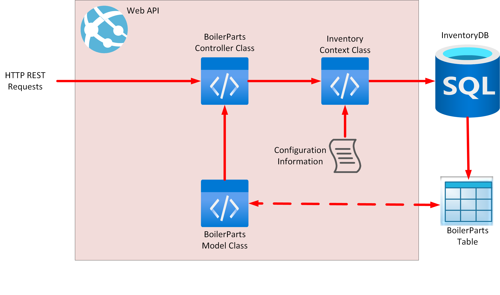

Kiana used the following procedure to create the Web API using .NET 5.0 command-line tools and Visual Studio Code:

1.  Open a terminal window in Visual Studio Code.

    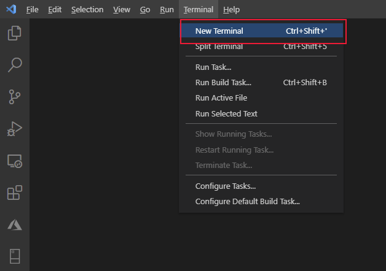

2.  Run the following command to create a new Web API project named **FieldEngineerApi**.

    ```shell
    dotnet new webapi -o FieldEngineerApi
    ```

3.  Open the **FieldEngineerApi** folder.

    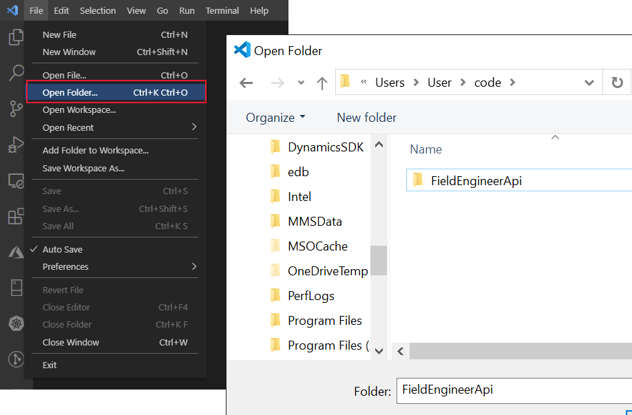

4.  Remove the example **WeatherForecastController.cs** controller and **WeatherForecast.cs** class file that was created by the Web API template.

    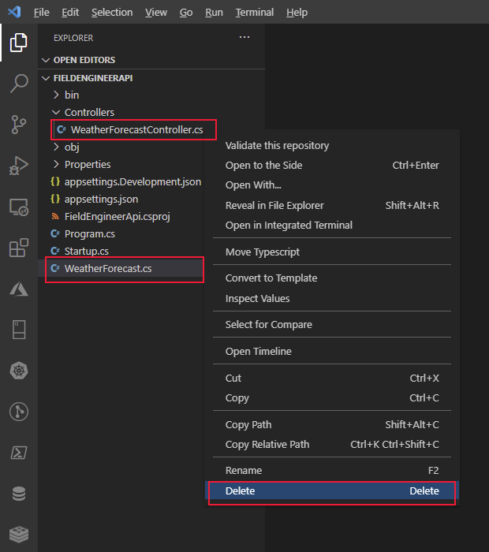

5.  In the **Terminal** window, add the following Entity Framework packages and tools, together with support for using SQL Server, to the project.

    ```shell
    dotnet add package Microsoft.EntityFrameworkCore.SqlServer

    dotnet add package Microsoft.VisualStudio.Web.CodeGeneration.Design

    dotnet add package Microsoft.EntityFrameworkCore.Design

    dotnet add package Microsoft.AspNetCore.Mvc.NewtonsoftJson

    dotnet tool install --global dotnet-ef

    dotnet tool install --global dotnet-aspnet-codegenerator
    ```

6.  In the **FieldEngineerApi** folder, create a new folder named **Models**.

    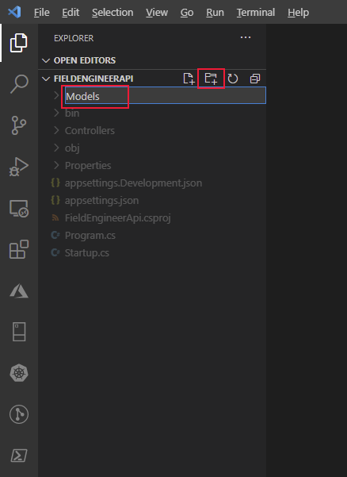

7.  In the **Models** folder, create a C\# code file named **BoilerPart.cs**.

    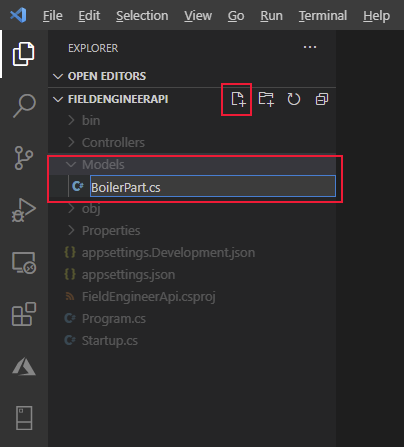

8.  In this file, add the following properties and fields. These properties and fields mirror the structure of the **BoilerParts** table in the **InventoryDB** database.

    ```csharp
    using System.Collections.Generic;
    using System.ComponentModel.DataAnnotations;
    using System.ComponentModel.DataAnnotations.Schema;

    namespace FieldEngineerApi.Models
    {

        public class BoilerPart
        {
            [Key]
            public long Id { get; set; }

            public string Name { get; set; }

            public string CategoryId { get; set; }

            [Column(TypeName = "money")]
            public decimal Price { get; set; }

            public string Overview { get; set; }

            public int NumberInStock { get; set; }

            public string ImageUrl { get; set; }
        }
    }
    ```

9.  In the **Models** folder, create another C\# code file named **InventoryContext.cs**. Add the following code to this class. The class provides the connection between the controller (to be created next), and the database.

    ```csharp
    using Microsoft.EntityFrameworkCore;

    namespace FieldEngineerApi.Models
    {
        public class InventoryContext : DbContext
        {
            public InventoryContext(DbContextOptions<InventoryContext> options)
                : base(options)
            {

            }

            public DbSet\<BoilerPart\> BoilerParts { get; set; }
        }
    }
    ```

10. Edit the **appsettings.Development.json** file for the project, and add a **ConnectionStrings** section with the following **InventoryDB** connection string. Replace *\<server name\>* with the name of the SQL Database server you created to hold the **InventoryDB** database.

    ```xml
    {
        "ConnectionStrings": {
            "InventoryDB": "Server=tcp*:<server name>*.database.windows.net,1433;Initial Catalog=InventoryDB;Persist Security Info=False;User ID=sqladmin;Password=Pa55w.rd;MultipleActiveResultSets=False;Encrypt=True;TrustServerCertificate=False;Connection Timeout=30;"
        },
        "Logging": {
            "LogLevel": {
                "Default": "Information",
                "Microsoft": "Warning",
                "Microsoft.Hosting.Lifetime": "Information"
            }
        }
    }
    ```

    > [!IMPORTANT]
    > For the purposes of this guide only, the connection string contains the user ID and password for the database. In a production system, you should never store these items in clear text in a configuration file.

11. Edit the **Startup.cs** file and add the following **using** directives to the list at the start of the file.

    ```csharp
    using FieldEngineerApi.Models;
    using Microsoft.EntityFrameworkCore;
    ```

12. In the **Startup** class, find the **ConfigureServices** method. Add the following statement to this method.

    ```csharp
    public void ConfigureServices(IServiceCollection services)
    {

        services.AddDbContext<InventoryContext>(options =>
            options.UseSqlServer(Configuration.GetConnectionString("InventoryDB")));

        services.AddControllers();
        ...
    }
    ```

13. Modify the **Configure** method, and enable the Swagger UI even when the app is running in production mode, as shown (this change involves relocating the two **app.UseSwagger** method calls outside of the **if** statement).

    ```csharp
    public void Configure(IApplicationBuilder app, IWebHostEnvironment env)
    {
        if (env.IsDevelopment())
        {
            app.UseDeveloperExceptionPage();
        }
        app.UseSwagger();
        app.UseSwaggerUI(c => c.SwaggerEndpoint("/swagger/v1/swagger.json", "FieldEngineerApi v1"));

        ...
    }
    ```

    > [!IMPORTANT]
    > This change enables the Swagger endpoint to be exposed for API Management integration. After API Management has been configured, you should move this code back inside the **if** statement and redeploy the Web API. *Never leave the Swagger endpoint open in a production system.*

14. In the **Terminal** window, run the following command to generate the **BoilerParts** controller from the **BoilerPart** model class and the **InventoryContext** context class.

    ```shell
    dotnet aspnet-codegenerator controller ^
        -name BoilerPartsController -async -api ^
         -m BoilerPart -dc InventoryContext -outDir Controllers
    ```

    The **BoilerParts** controller should be created in the **Controllers** folder.

    >  [!NOTE]
    > The line terminator character, **\^**, is only recognized by Windows. If you're running Visual Studio Code on a Linux system, use the **\\** character instead.

15. Open the **BoilerParts.cs** file in the **Controllers** folder and review its contents. The **BoilerPartsController** class exposes the following REST methods:

    -   **GetBoilerParts()**, which returns a list of all the **BoilerPart** objects from the database.
    -   **GetBoilerPart(long id)**, which retrieves the details of the specified boiler part.
    -   **PutBoilerPart(long id, BoilerPart boilerPart)**, which updates a boiler part in the database with the details in the **BoilerPart** object specified as a parameter.
    -   **PostBoilerPart(BoilerPart boilerPart)**, which creates a new boiler part.
    -   **DeleteBoilerPart(long id)**, which removes the specified boiler part from the database.

    > [!NOTE]
    > The technician's app only requires the two **Get** methods, but the others are useful for the desktop inventory management app (not covered in this guide).

16. Compile and build the Web API.

    ```shell
    dotnet build
    ```

The Web API should build without reporting any errors or warnings.

## Deploying the Web API to Azure: Field inventory management

Kiana deployed and tested the Web API, by performing the following tasks:

1.  Using the Azure Account extension in Visual Studio Code, sign in to your Azure subscription.

2.  From the Terminal window in Visual Studio Code, create a new resource group named **webapi\_rg** in your Azure subscription. In the following command, replace *\<location\>* with your nearest Azure region.

    ```shell
    az group create ^
        --name webapi_rg ^
        --location <location>
    ```

3.  Create an Azure App Service plan to provide the resources for hosting the Web API.

    ```shell
    az appservice plan create ^
        --name webapi_plan ^
        --resource-group webapi_rg ^
        --sku F1
    ```

    > [!NOTE]
    > **F1** is the free SKU for App Service plans. It provides limited throughput and capacity, and is only suitable for development purposes.

4.  Create an Azure web app by using the App Service plan. Replace *\<webapp name\>* with a unique name for the web app.

    ```shell
    az webapp create ^
        --name <webapp name> ^
        --resource-group webapi_rg ^
        --plan webapi_plan
    ```

5.  In Visual Studio Code, edit the **appSettings.json** file, and add the same connection string that you previously wrote to the **appSettings.Development.json** file. Remember to replace *\<server name\>* with the name of the SQL Database server you created to hold the **InventoryDB** database.

    ```xml
    {
        "ConnectionStrings": {
            "InventoryDB": "Server=tcp:<server name>.database.windows.net,1433;Initial Catalog=InventoryDB;Persist Security Info=False;User ID=sqladmin;Password=Pa55w.rd;MultipleActiveResultSets=False;Encrypt=True;TrustServerCertificate=False;Connection Timeout=30;"**
        },
        "Logging": {
            "LogLevel": {
                "Default\: "Information",
                "Microsoft": "Warning",
                "Microsoft.Hosting.Lifetime": "Information"
            }
        },
        "AllowedHosts": "*"
    }
    ```

6.  In the Terminal window, package the Web API ready for deployment to Azure.

    ```shell
    dotnet publish -c Release -o ./publish
    ```

    This command saves the packaged files to a folder named **publish**.

7.  In Visual Studio Code, right-click the **publish** folder, and then select **Deploy to Web App**.

    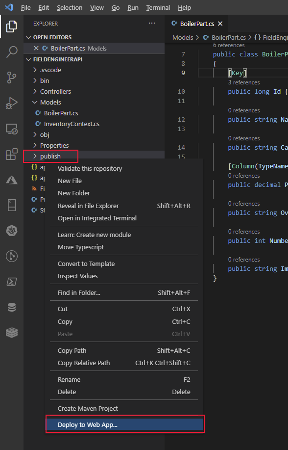

8.  Select the name of the web app you created earlier in step 4 (*\<webapp name\>*). In the following example, the web app is named **my-fieldengineer-webapp**.

    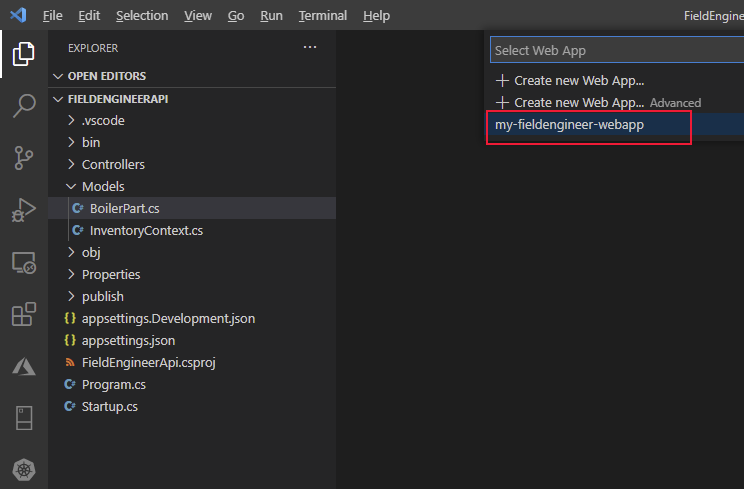

9.  At the prompt in the Visual Studio Code dialog, select **Deploy** to accept the warning and deploy the web app.

    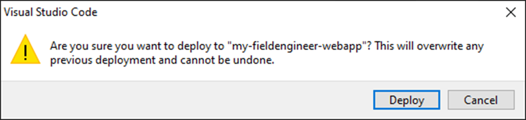

10. Verify that the web app is deployed successfully, and then browse to the website.

    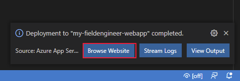

11. The website will open in a new browser window, but will display an HTTP 404 error (not found). This is because the Web API operations are available through the **api** endpoint rather than the root of the website. Change the URL to **https://*\<webapp name\>*.azurewebsites.net/api/BoilerParts**. This URI invokes the **GetBoilerParts** method in the **BoilerParts** controller. The Web API should respond with a JSON document that lists all the boiler parts in the **InventoryDB** database.

    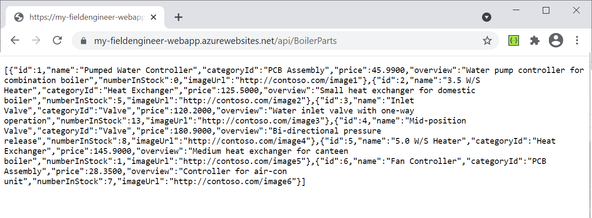

12. Change the URL in the browser to **https://*\<webapp name\>*.azurewebsites.net/swagger**. The Swagger API should appear. This is a graphical user interface that enables a developer to verify and test each of the operations in a Web API. It also acts as a useful documentation tool.

    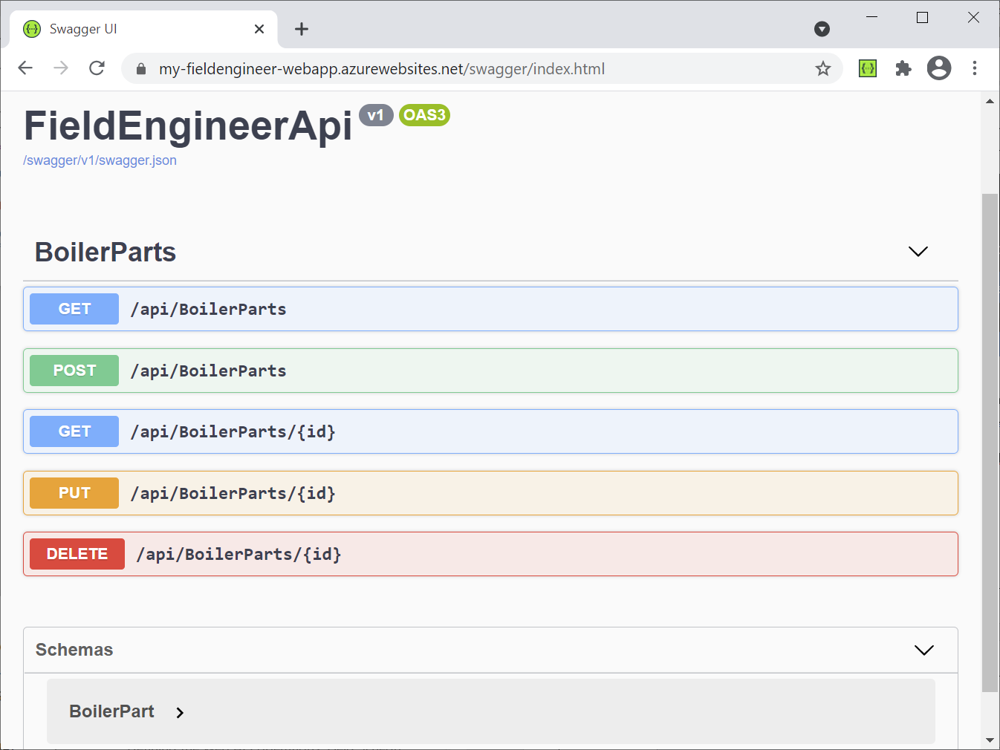

13. Select **GET** adjacent to the **/api/BoilerParts/{id}** endpoint, and then select **Try it out**.

    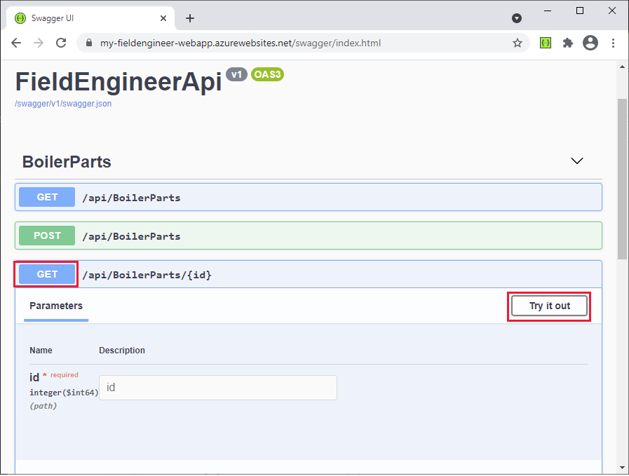

14. In the **id** field, enter the ID of a part, and then select **Execute**. This action calls the **GetBoilerPart(long id)** method in the **BoilerParts** controller. It will return a JSON document with the details of the part or an HTTP 404 error if no matching part is found in the database.

    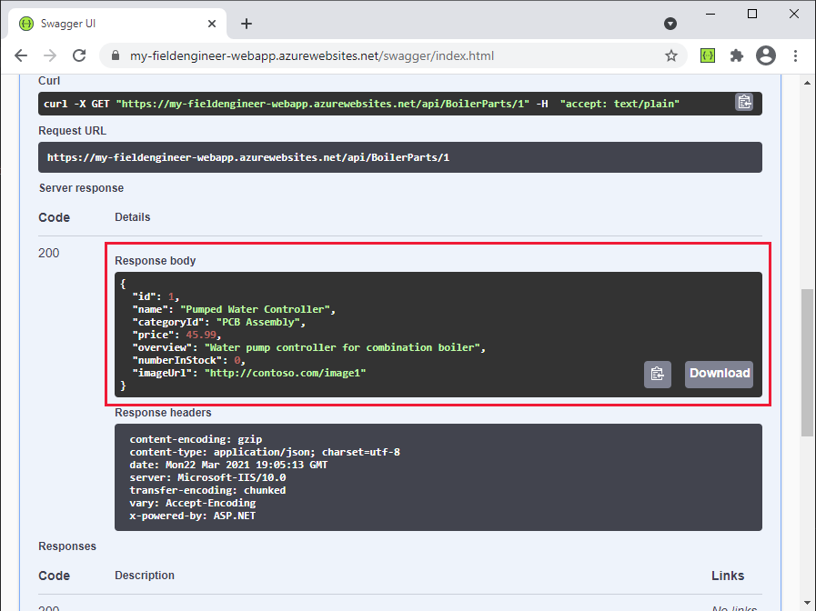

15. Close the web browser and return to Visual Studio Code.

## Building and deploying the Web API: Field Knowledgebase

The Field Knowledgebase operations in the Web API work on three tables in the **KnowledgeDB** database: **Tips**, **BoilerParts**, and **Engineers**. The following image shows the relationships among these tables and the columns they contain.

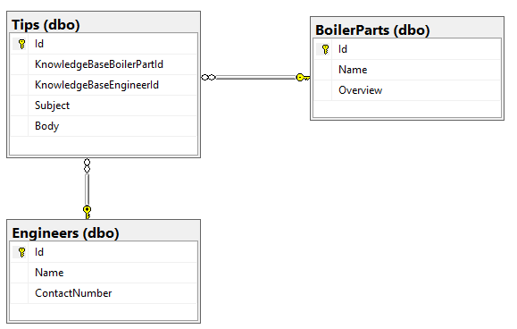

Kiana adopted a similar approach for the Field Knowledgebase database that she used for the Field Inventory Management database. She performed the following tasks:

1.  Create C\# model classes that mirror the structure of the **Tips**, **BoilerParts**, and **Engineers** table in the **KnowledgeDB** database. The code for each of these classes is shown in the following.

    > [!NOTE]
    > The **BoilerParts** table in the **KnowledgeDB** database is distinct from the **BoilerParts** table in the **InventoryDB** database. To avoid a name clash, the model classes for tables in the **KnowledgeDB** database have the **KnowledgeBase** prefix.

    ```csharp
    // KnowledgeBaseTips.cs

    using System.ComponentModel.DataAnnotations;

    namespace FieldEngineerApi.Models
    {
        public class KnowledgeBaseTip 
        {
            [Key]
            public long Id { get; set; }

            public long KnowledgeBaseBoilerPartId { get; set; }

            public virtual KnowledgeBaseBoilerPart KnowledgeBaseBoilerPart { get; set; }

            public string KnowledgeBaseEngineerId { get; set; }

            public virtual KnowledgeBaseEngineer KnowledgeBaseEngineer { get; set; }

            public string Subject { get; set; }

            public string Body { get; set; }
        }
    }
    ```

    > [!NOTE]
    > The engineer **Id** is a string, not a number. This is because the existing systems use GUIDs to identity technicians and other users.

    ```csharp
    // KnowledgeBaseBoilerPart.cs

    using System.Collections.Generic;
    using System.ComponentModel.DataAnnotations;

    namespace FieldEngineerApi.Models
    {
        public class KnowledgeBaseBoilerPart
        {
            [Key]
            public long Id { get; set; }

            public string Name { get; set; }

            public string Overview { get; set; }

            public virtual ICollection<KnowledgeBaseTip> KnowledgeBaseTips { get; set; }
        }
    }
    ```

    ```csharp
    // KnowledgeBaseEngineer.cs

    using System.Collections.Generic;
    using System.ComponentModel.DataAnnotations;

    namespace FieldEngineerApi.Models
    {
        public class KnowledgeBaseEngineer
        {
            [Key]
            public string Id { get; set; }

            [Required]
            public string Name { get; set; }

            public string ContactNumber { get; set; }
            
            public virtual ICollection<KnowledgeBaseTip> KnowledgeBaseTips { get; set; }
        }
    }
    ```

2.  Create another Entity Framework **context** class that the Web API uses to connect to the **KnowledgeDB** database.

    ```csharp
    // KnowledgeBaseContext.cs

    using Microsoft.EntityFrameworkCore;

    namespace FieldEngineerApi.Models
    {
        public class KnowledgeBaseContext : DbContext
        {
            public KnowledgeBaseContext(DbContextOptions<KnowledgeBaseContext> options)
                : base(options)
            {

            }   

            public DbSet<KnowledgeBaseBoilerPart> BoilerParts { get; set; }

            public DbSet<KnowledgeBaseEngineer> Engineers { get; set; }

            public DbSet<KnowledgeBaseTip> Tips { get; set; }
        }
    }
    ```

3.  Edit the **appsettings.Development.json** file for the project, and add the following **KnowledgDB** connection string to the **ConnectionStrings** section. Replace *\<server name\>* with the name of the SQL Database server you created to hold the **KnowledgeDB** database.

    ```xml
    {
        "ConnectionStrings": {
            "InventoryDB": "Server=tcp:...",
            "KnowledgeDB": "Server=tcp:<server name>.database.windows.net,1433;Initial Catalog=KnowledgeDB;Persist Security Info=False;User ID=sqladmin;Password=Pa55w.rd;MultipleActiveResultSets=False;Encrypt=True;TrustServerCertificate=False;Connection Timeout=30;"
        },
        "Logging": {
            ...
            }
        }
    }
    ```

    > [!IMPORTANT]
    > For the purposes of this guide only, the connection string contains the user ID and password for the database. In a production system, you should never store these items in clear text in a configuration file.

4.  Edit the **Startup.cs** file and, in the **ConfigureServices** method, add the following statements.

    ```csharp
    public void ConfigureServices(IServiceCollection services)
    {
        services.AddDbContext<InventoryContext>...;

        services.AddDbContext<KnowledgeBaseContext>(options =>  
            options.UseSqlServer(Configuration.GetConnectionString("KnowledgeD")));

        services.AddControllers().AddNewtonsoftJson(
            options => options.SerializerSettings.ReferenceLoopHandling = Newtonsoft.Json.ReferenceLoopHandling.Ignore**
        );

        services.AddControllers();
        ...
    }
    ```

    The second statement controls the way in which data is serialized when it's retrieved. Some of the model classes have references to other model classes, which in turn can reference further model classes. Some of these references can result in recursive loops (Entity A references Entity B, which references back to Entity A, which references Entity B again, and so on). The **ReferenceLoopHandling** option causes the serializer to ignore such loops in the data, and only return an entity and the objects that it immediately references, but no more.

5.  In the **Terminal** window, run the following command to generate controllers from the **KnowledgeBaseBoilerTip**, **KnowledgeBaseBoilerPart**, and **KnowledgeBaseEngineer** model classes and the **KnowledgeBaseContext** context class.

    ```shell
    dotnet aspnet-codegenerator controller ^
        -name KnowledgeBaseTipController -async -api ^
        -m KnowledgeBaseTip ^
        -dc KnowledgeBaseContext -outDir Controllers

    dotnet aspnet-codegenerator controller ^
        -name KnowledgeBaseBoilerPartController -async -api ^
        -m KnowledgeBaseBoilerPart ^
        -dc KnowledgeBaseContext -outDir Controllers

    dotnet aspnet-codegenerator controller ^
        -name KnowledgeBaseEngineerController -async -api ^
        -m KnowledgeBaseEngineer ^
        -dc KnowledgeBaseContext -outDir Controllers
    ```

    All three controllers should be created in the **Controllers** folder.

6.  Edit the **KnowledgeBaseBoilerPartController.cs** file. This file contains the code for the **KnowledgeBaseBoilerPart** controller. It should follow the same pattern as the **BoilerPartsController** class created earlier, exposing REST methods that enable a client to list, query, insert, update, and delete entities. Add the following **GetTipsForPart** method to the controller.

    ```csharp
    [Route("api/[controller]")]
    [ApiController]

    public class KnowledgeBaseBoilerPartController : ControllerBase
    {
        private readonly KnowledgeBaseContext _context;

        public KnowledgeBaseBoilerPartController(KnowledgeBaseContext context)
        {
            _context = context;
        }

        // GET: api/KnowledgeBaseBoilerPart/5/Tips
        [HttpGet("{id}/Tips")]
        public async Task<ActionResult<IEnumerable<KnowledgeBaseTip>>>GetTipsForPart(long id)
        {
            return await _context.Tips.Where(
                t => t.KnowledgeBaseBoilerPartId == id).ToListAsync();
        }
        ...
    }
    ```

    This method returns all the knowledge base tips that reference a specified part. It queries the **Tips** table in the database through the **KnowledgeBaseContext** object to find this information.

7.  Edit the **KnowledgeBaseEngineerController.cs** file and add the following method to the **KnowledgeBaseEngineerController** class.

    ```csharp
    [Route("api/[controller]")]
    [ApiController]
    public class KnowledgeBaseEngineerController : ControllerBase
    {
        private readonly KnowledgeBaseContext _context;

        public KnowledgeBaseEngineerController(KnowledgeBaseContext context)
        {
            _context = context;
        }

        // GET: api/KnowledgeBaseEngineer/5/Tips
        [HttpGet("{id}/Tips")]
        public async Task\<ActionResult<IEnumerable<KnowledgeBaseTip>>> GetTipsForEngineer(string id)
        {
            return await _context.Tips.Where(t => 
                t.KnowledgeBaseEngineerId == id).ToListAsync();
        }

        ...
    }
    ```

    The **GetTipsForEngineer** method finds all knowledge base tips posted by the specified engineer.

8.  In the **Terminal** window, compile and build the Web API.

    ```shell
    dotnet build
    ```

    The Web API should build without reporting any errors or warnings.

9.  Edit the **appSettings.json** file and add the connection string for the **KnowledgeDB** database. This string should be the same that you previously wrote to the **appSettings.Development.json** file.

    ```xml
    {
        "ConnectionStrings": {
            "InventoryDB": ...,
            "KnowledgeDB": "Server=tcp:<server name>.database.windows.net,1433;Initial Catalog=KnowledgeDB;Persist Security Info=False;User ID=sqladmin;Password=Pa55w.rd;MultipleActiveResultSets=False;Encrypt=True;TrustServerCertificate=False;Connection Timeout=30;"
        },
        "Logging": {
            ...
        },
        "AllowedHosts": "*"
    }
    ```

10. In the **Terminal** window, package the Web API ready for deployment to Azure.

    ```shell
    dotnet publish -c Release -o ./publish
    ```

11. In Visual Studio Code, right-click the **publish** folder, and then select **Deploy to Web App**. Deploy to the same Azure web app that you created previously. Allow the wizard to overwrite the existing web app with the new code.

12. When deployment is complete, browse to the website but change the URL in the browser to **https://*\<webapp name\>*.azurewebsites.net/swagger**. The operations for the **KnowledgeBaseBoilerPart**, **KnowledgeBaseEngineer**, and **KnowldgeBaseTip** controllers should be listed in addition to the existing **BoilerParts** operations. Verify that the **KnowledgeBaseBoilerPart** operations include a **GET** operation for the URI **/api/KnowledgeBaseBoilerPart/{id}/Tips**, and the **KnowledgeBaseEngineer** operations include a **GET** operation for the URI **/api/KnowledgeBaseEngineer/{id}/Tips**.

    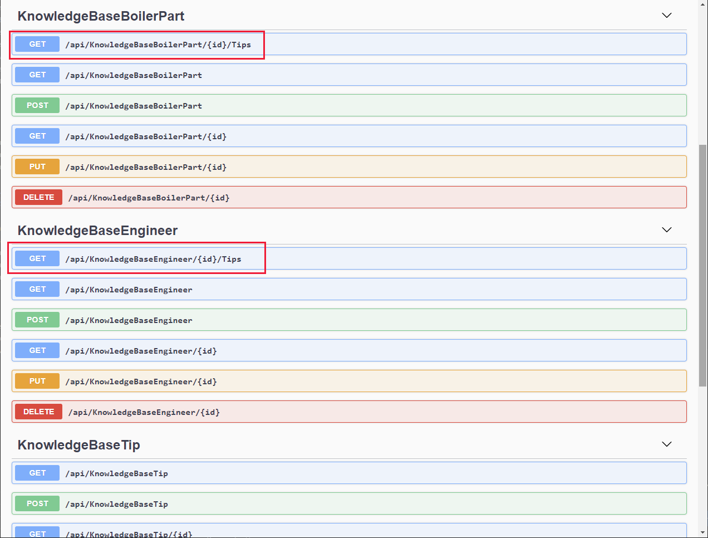

## Building and Deploying the Web API: Field Scheduling

The Field Scheduling operations use the tables **Appointments**, **AppointmentStatuses** (this is a simple lookup table that lists the valid appointment status values), **Customers**, and **Engineers**, shown in the following image. These tables are stored in the **SchedulesDB** database.

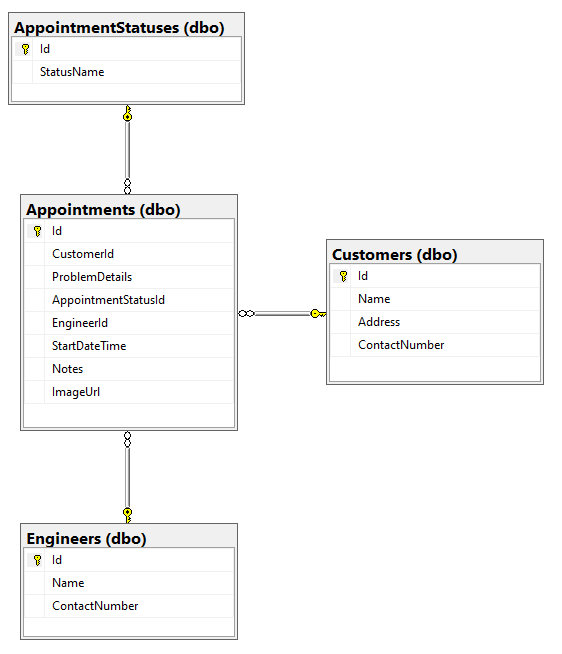

To create the Web API operations for the Field Scheduling part of the system, Kiana performed the following tasks:

1.  Create C\# model classes that mirror the structure of the **AppointmentStatus**, **Appointments**, **Customers**, and **Engineers** table in the **SchedulesDB** database. The following code shows each of these classes.

    > [!NOTE]
    > The model class for the **Engineers** table is named **ScheduleEngineer** to distinguish it from the model for the **Engineers** table in the **InventoryDB** database.

    ```csharp
    // AppointmentStatus.cs

    using Newtonsoft.Json;
    using System.Collections.Generic;
    using System.ComponentModel.DataAnnotations;

    namespace FieldEngineerApi.Models
    {
        public class AppointmentStatus {
            [Key]
            public long Id { get; set; }

            public string StatusName { get; set; }
            [JsonIgnore]
            public virtual ICollection<Appointment> Appointments { get; set; }
        }
    }
    ```

    ```csharp
    // Appointment.cs

    using System;
    using System.ComponentModel.DataAnnotations;

    namespace FieldEngineerApi.Models
    {
        public class Appointment
        {
            [Key]
            public long Id { get; set; }

            [Required]
            public long CustomerId { get; set; }

            public virtual Customer Customer { get; set; }

            public string ProblemDetails { get; set; }

            [Required]
            public long AppointmentStatusId { get; set; }

            public virtual AppointmentStatus AppointmentStatus { get; set; }

            public string EngineerId { get; set; }

            public virtual ScheduleEngineer Engineer { get ; set; }

            [Display(Name = "StartTime")]
            [DataType(DataType.DateTime)]
            [DisplayFormat(DataFormatString = "{0:MM/dd/yyyy H:mm:ss}")]
            public DateTime StartDateTime { get; set; }

            public string Notes { get; set; }

            public string ImageUrl { get; set; }
        }
    }
    ```

    ```csharp
    // Customer.cs

    using System.Collections.Generic;
    using System.ComponentModel.DataAnnotations;

    namespace FieldEngineerApi.Models
    {
        public class Customer
        {
            [Key]
            public long Id { get; set; }

            [Required]
            public string Name { get; set; }

            public string Address { get; set; }

            public string ContactNumber { get; set; }

            public virtual ICollection<Appointment> Appointments { get; set; }
        }
    }
    ```

    ```csharp
    // ScheduleEngineer.cs
    using Newtonsoft.Json;
    using System.ComponentModel.DataAnnotations;
    using System.Collections.Generic;

    namespace FieldEngineerApi.Models
    {
        public class ScheduleEngineer
        {
            [Key]
            public string Id { get; set; }

            [Required]
            public string Name { get; set; }

            public string ContactNumber { get; set; }

            [JsonIgnore]
            public virtual ICollection<Appointment> Appointments { get; set; }
        }
    }
    ```

2.  Create an Entity Framework **context** class that the Web API uses to connect to the **SchedulesDB** database.

    ```csharp
    // ScheduleContext.cs

    using System;
    using Microsoft.EntityFrameworkCore;

    namespace FieldEngineerApi.Models
    {
        public class ScheduleContext : DbContext
        {
            public ScheduleContext(DbContextOptions<ScheduleContext> options)
                : base(options)
            {

            }

            public DbSet<Appointment> Appointments { get; set; }

            public DbSet<AppointmentStatus> AppointmentStatuses { get; set; }

            public DbSet<Customer> Customers { get; set; }

            public DbSet<ScheduleEngineer> Engineers { get; set; }
        }
    }
    ```

3.  Edit the **appsettings.Development.json** file for the project, and add the following **SchedulesDB** connection string to the **ConnectionStrings** section. Replace *\<server name\>* with the name of the SQL Database server you created to hold the **KnowledgeDB** database.

    ```xml
    {
        "ConnectionStrings": {
            "InventoryDB": "Server=tcp*: ...",
            "KnowledgeDB": "Server=tcp; ... ",
            "SchedulesDB": "Server=tcp:<server name>.database.windows.net,1433;Initial Catalog=SchedulesDB;Persist Security Info=False;User ID=sqladmin;Password=Pa55w.rd;MultipleActiveResultSets=False;Encrypt=True;TrustServerCertificate=False;Connection Timeout=30;"
        },
        "Logging": {
            ...
            }
        }
    }
    ```

4.  Edit the **Startup.cs** file and in the **ConfigureServices** method, add the following statement.

    ```csharp
    public void ConfigureServices(IServiceCollection services)
    {
        services.AddDbContext<InventoryContext>...;

        services.AddDbContex\<KnowledgeBaseContext>...;

        services.AddDbContext<ScheduleContext>(options =>
            options.UseSqlServer(Configuration.GetConnectionString("SchedulesDB")));

        services.AddControllers().AddNewtonsoftJson(...);

        ...
    }
    ```

5.  In the **Terminal** window, run the following command to generate controllers from the **Appointment**, **Customer** and **ScheduleEngineer** model classes, and the **ScheduleContext** context class.

    > [!NOTE]
    > Don't create a separate controller for the **AppointmentStatus** model.

    ```shell
    dotnet aspnet-codegenerator controller ^
        -name AppointmentsController -async -api ^
        -m Appointment ^
        -dc ScheduleContext -outDir Controllers

    dotnet aspnet-codegenerator controller ^
        -name CustomerController -async -api ^
        -m Customer ^
        -dc ScheduleContext -outDir Controllers

    dotnet aspnet-codegenerator controller ^
        -name ScheduleEngineerController -async -api ^
        -m ScheduleEngineer ^
        -dc ScheduleContext -outDir Controllers
    ```

6.  Edit the **AppointmentsController.cs** file. In the **AppointmentsController** class, find the **GetAppointments** method. Modify the **return** statement, as shown. This change ensures that the **Customer**, **Engineer**, and **AppointmentStatus** information is retrieved as part of the **GET** operation; these fields reference other entities that would otherwise be left null due to the lazy loading mechanism of the Entity Framework.

    ```csharp
    public class AppointmentsController : ControllerBase
    {
        private readonly ScheduleContext _context;
        
        public AppointmentsController(ScheduleContext context)
        {
            _context = context;
        }

        // GET: api/Appointments

        [HttpGet]
        public async Task<ActionResult<IEnumerable<Appointment>>> GetAppointments()
        {
            return await _context.Appointments
                .Include(c => c.Customer)
                .Include(e => e.Engineer)
                .Include(s => s.AppointmentStatus)
                .ToListAsync();
        }

        ...
    }
    ```

7.  In the same file, modify the **GetAppointment(long id)** method, as shown.

    ```csharp
    // GET: api/Appointments/5
    [HttpGet("{id}")]
    public async Task<ActionResult<Appointment>> GetAppointment(long id)
    {
        var appointment = _context.Appointments
            .Where(a => a.Id == id)
            .Include(c => c.Customer)
            .Include(e => e.Engineer)
            .Include(s => s.AppointmentStatus);

        var appData = await appointment.FirstOrDefaultAsync();
        if (appData == null)
        {
            return NotFound();
        }

        return appData;
    }
    ```

    This version of the method populates the **Customer**, **Engineer**, and **AppointmentStatus** fields of an appointment when it's retrieved (lazy loading would leave these fields empty otherwise).

8.  Find the **PutAppointment** method, and replace it with the following code. This version of the **PutAppointment** method takes the fields in an appointment that a user can modify in the app rather than a complete **Appointment** object.

    ```csharp
    [HttpPut("{id}")]
    public async Task<IActionResult> PutAppointment(long id,
        string problemDetails, string statusName,
        string notes, string imageUrl)
    {

        var statusId = _context.AppointmentStatuses.First(s => 
            s.StatusName == statusName).Id;

        var appointment = _context.Appointments.First(e => 
            e.Id == id);

        if (appointment == null)
        {
            return BadRequest();
        }

        appointment.ProblemDetails = problemDetails;
        appointment.AppointmentStatusId = statusId;
        appointment.Notes = notes;
        appointment.ImageUrl = imageUrl;
        _context.Entry(appointment).State = EntityState.Modified;

        try
        {
            await _context.SaveChangesAsync();
        }
        catch (DbUpdateConcurrencyException)
        {
            if (!AppointmentExists(id))
            {
                return NotFound();
            }
            else
            {
                throw;
            }
        }
    
        return NoContent();
    }
    ```

    > [!NOTE]
    > As a general rule, PUT operations should only modify data that a user should be allowed to update, not necessarily every field in an entity.

9.  Open the **ScheduleEngineerController.cs** file and add the following **GetScheduleEngineerAppointments** method to the **ScheduleEngineerController** class.

    ```csharp
    [Route("api/[controller]")]
    [ApiController]
    public class ScheduleEngineerController : ControllerBase
    {
        private readonly ScheduleContext _context;

        public ScheduleEngineerController(ScheduleContext context)
        {
            _context = context;
        }

        // GET: api/ScheduleEngineer/5/Appointments
        [HttpGet("{id}/Appointments")]

        public async Task<ActionResult<IEnumerable<Appointment>>> GetScheduleEngineerAppointments(string id)
        {
            return await _context.Appointments
                .Where(a => a.EngineerId == id)
                .OrderByDescending(a => a.StartDateTime)
                .Include(c => c.Customer)
                .Include(e => e.Engineer)
                .Include(s => s.AppointmentStatus)
                .ToListAsync();
        }

        ...
    }

    These methods retrieve the appointments for the specified technician.

10. Edit the **CustomerController.cs** file and add the **GetAppointments** and **GetNotes** methods, as shown, to the **CustomerController** class.

    ```csharp
    [Route("api/[controller]")]
    [ApiController]
    public class CustomerController : ControllerBase
    {
        private readonly ScheduleContext _context;

        public CustomerController(ScheduleContext context)
        {
            _context = context;
        }

        //GET: api/Customers/5/Appointments
        [HttpGet("{id}/Appointments")]
        public async Task<ActionResult<IEnumerable<Appointment>>> GetAppointments(long id)
        {
            return await _context.Appointments
                .Where(a => a.CustomerId == id)
                .OrderByDescending(a => a.StartDateTime)
                .ToListAsync();
        }

        //GET: api/Customers/5/Notes
        [HttpGet("{id}/Notes")]
        public async Task<ActionResult<IEnumerable<object>>> GetNotes(long id)
        {
            return await _context.Appointments
                .Where(a => a.CustomerId == id)
                .OrderByDescending(a => a.StartDateTime)
                .Select(a => 
                    new {a.StartDateTime, a.ProblemDetails, a.Notes})
                .ToListAsync();
        }

        ...
    }
    ```

    The **GetAppointments** method finds all appointments for the specified customer. The **GetNotes** method retrieves all the notes the technician made on previous visits to the customer.

11. Edit the **appSettings.json** file and add the connection string for the **KnowledgeDB** database. This string should be the same that you previously wrote to the **appSettings.Development.json** file.

    ```xml
    {
        "ConnectionStrings": {
            "InventoryDB": ...,
            "KnowledgeDB": ...,
            "SchedulesDB": "Server=tcp:<server name>.database.windows.net,1433;Initial Catalog=SchedulesDB;Persist Security Info=False;User ID=sqladmin;Password=Pa55w.rd;MultipleActiveResultSets=False;Encrypt=True;TrustServerCertificate=False;Connection Timeout=30;"
        },
        "Logging": {
            ...
        },
        "AllowedHosts": "*"
    }
    ```

12. In the **Terminal** window, compile and build the Web API.

    ```shell
    dotnet build
    ```

    The Web API should build without reporting any errors or warnings.

13. In the **Terminal** window, package the Web API ready for deployment to Azure.

    ```shell
    dotnet publish -c Release -o ./publish
    ```

14. In Visual Studio Code, right-click the **publish** folder, and then select **Deploy to Web App**. Deploy to the same Azure web app that you created previously. Allow the wizard to overwrite the existing web app with the new code.

13. When deployment is complete, browse to the website but change the URL in the browser to **https://*\<webapp name\>*.azurewebsites.net/swagger**. Verify that the operations for the **Appointments**, **Customer**, and **ScheduleEngineer** controllers are now available.

The Web API is now ready to be incorporated into the app.

> [!div class="step-by-step"]
> [Previous](04-using-dataverse-as-data-source.md)
> [Next](06-using-web-api-in-app.md)
