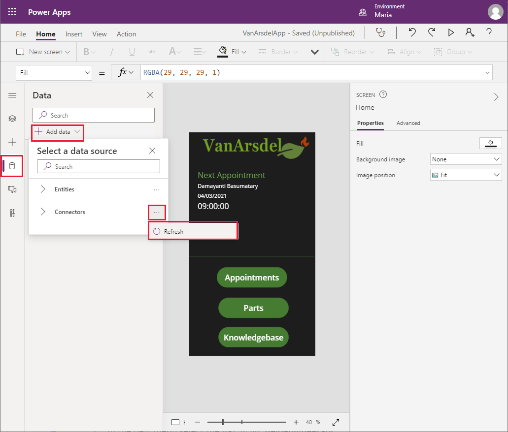
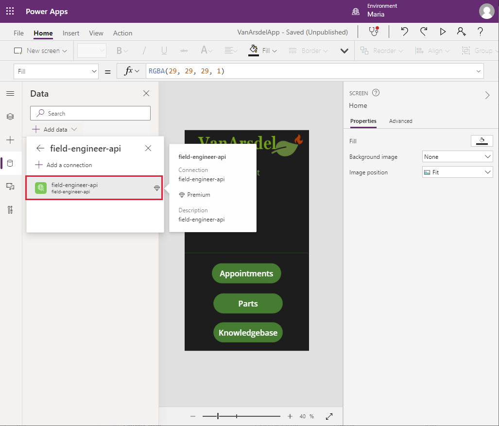
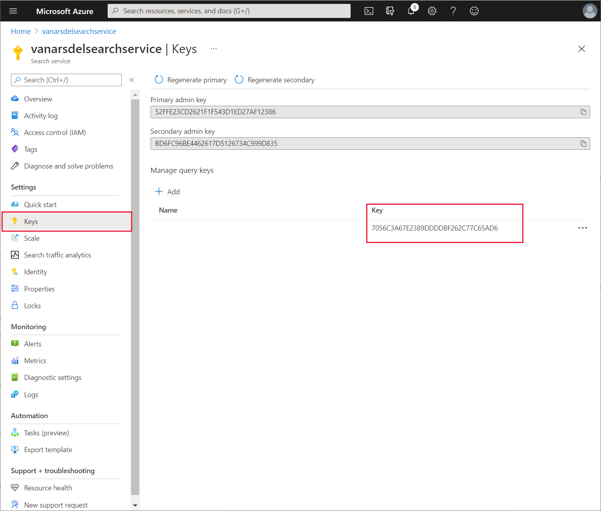

# Chapter 6: Using the Web API in the app

Maria and Kiana are ready to combine the app with the Web API. However, before proceeding, they decide to consult with Preeti, the IT Operations Manager.

## Understanding the IT operations management requirements for the Web API

Preeti is concerned that the app and the Web API must be secure because they provide access to sensitive data stored in the various databases. She wants assurances that she will be able to include authentication and authorization, to prevent unwarranted access to information. Preeti is also aware that the company is rapidly expanding, and the volume of data involved in managing customers, appointments, parts, and the knowledge base is likely to increase exponentially in the near term. Consequently, she wants the solution to be scalable.

Kiana explains to Preeti that the Web API is currently implemented with Azure App Service. This service supports a number of authentication providers, which Preeti can configure using the Azure portal. Preeti is especially interested in Azure Active Directory because VanArsdel are looking to roll out this form of authentication to many of their other corporate systems in the near future.


App Service also provides horizontal and vertical scalability. If needed, Preeti can scale up the resources available to the Web API by upgrading the App Service plan for the web app:


She can also arrange for the system to scale out by configuring autoscaling. App Service enables an operations manager to define autoscale rules that determine the conditions under which the system should scale out across more instances when the load increases, or back in again as demand drops. She can also configure pre-emptive autoscaling to occur according to a schedule:


A key part of the role of an IT Operations Manager is to have an eye for how systems might evolve, and to ensure that the underlying support structures will handle future expansion and changes. Preeti knows that the Web API developed by Kiana might be extended, and reused by other VanArsdel systems in the future. She needs to be able to manage and control the way in which developers request use of the Web API, protect it as a valuable resource, and monitor its use. Therefore Preeti decides to protect the Web API behind the Azure API Management service.

API Management provides an extra layer of security to a Web API, as well as enabling detailed monitoring and control over which clients can access which operations. Using API Management, Preeti can manage resource utilization, and throttle the performance of low priority clients to ensure that critical higher priority apps are serviced more quickly.

For information about the services that API Management provides, go to [About API Management](/azure/api-management/api-management-key-concepts).

## Creating an API Management service

Preeti created the API Management service through the Azure portal, using the following steps:

1.  Sign in to the [Azure portal](https://portal.azure.com) and, on the **Home** page, select **Create a resource**.

    

2.  In the **Search the MarketPlace** text box, enter **API Management**, and then select **Enter**.

3.  On the **API Management** page, select **Create**.

    

4.  On the **Create API Management** page, enter the following values, and then select **Review + create**:

    -   Subscription: Select your subscription
    -   Resource group: **webapi\_rg** (this is the same resource group that you created for the App Service)
    -   Region: Select your nearest region
    -   Resource name: Enter a unique name for the service
    -   Organization name: **VanArsdel**
    -   Administrator email: **itadmin\@vanarsdel.com**
    -   Pricing tier: **Developer (no SLA)**

    > [!NOTE]
    > Don't use the **Developer** pricing tier for a production system.

    

5.  On the validation page, select **Create**, and wait while the API Management service is created.

    > [!NOTE]
    > It can take 30 minutes or more for the API Management service to be provisioned; be patient.

## Publishing the Web API through API Management

After the API Management service was created, Preeti published the Web API to make it accessible to other services and applications. She used the following steps:

1.  In the Azure portal, go to the API Management service.

2.  On the **API Management service** page, on the left pane under **APIs**, select **APIs**:

    

3.  In the **Add a new API** pane, select **OpenAPI**:

    

4.  In the **Create from OpenAPI specification** dialog, enter the following values, and then select **Create**:

    -   OpenAPI specification: **https://*\<webapp name\>*.azurewebsites.net/swagger/v1/swagger.json**, where *\<webapp name\>* is the name of the App Service hosting your Web API
    -   Display name: **Field Engineer API**
    -   Name: **field-engineer-api**
    -   API URL suffix: Leave empty
    -   Base URL: Use the default URL

    

5.  When the Field Engineer API has been created, select the **Settings** tab for the API, set the **Web Service URL** to **https://*\<webapp name\>*.azurewebsites.net**, and then select **Save**:

    

6.  On the **Test** tab, select the **GET api/Appointments URI**, and then select **Send**:

    

7.  Verify that the request is successful (the HTTP return code is **200 OK**), and that it returns a result containing a list of appointments in the response body:

    

## Connecting to API Management from the app

Kiana and Maria can now work together to connect the app built using Power Apps to the Web API through the API Management service.

The first task is to create a custom connector that's used by the app to communicate with API Management. This involves exporting the API to the Power Apps environment used to create the app, which Kiana does as follows:

1.  In the Azure portal, go to the page for the API Management service that Preeti created.

2.  On the left pane under **APIs**, select **APIs**.

3.  Select the ellipsis button for the **Field Engineer Ap**i, and then select **Export**.

    

4.  On the **Export API** pane, select **Power Apps and Power Automate**:

    

5.  On the **Export API to PowerApps** pane, select the Power Apps environment in which you created the prototype app (**Maria** in the following image), and then select **Export**.

    

6.  After the API has been exported, select the **Field Engineer API**. On the **Settings** page, scroll down to the **Subscriptions** section, clear **Subscription required**, and then select **Save**.

    

The prototype app used Excel workbooks for the data sources. Now that the custom connector for the Web API is available, Maria performs the following steps to add the connector to the app:

1.  Sign in to [Power Apps](http://make.powerapps.com).

2.  On the left pane, expand **Data**, and select **Custom Connectors**. The **field-engineer-api** custom connector should be listed. Select **Create connection**.

    

3.  In the **field-engineer-api** dialog, select **Create**.

    

4.  When the connection has been created, verify that it appears in the list of available connections.

    

5.  On the left pane, select **Apps**, select **VanArsdelApp**, and then select **Edit**.

    

6.  On the left pane, select the **Data** tab. Select **Add data**, select the ellipsis button for **Connectors**, and then select **Refresh**.

    

7.  In the list of connectors, select the **field-engineer-api** connector.

    

8.  In the **field-engineer-api** dialog, select the **field-engineer-api** connector.

    

9.  On the **Data** pane, verify that the **FieldEngineerApi** connector is listed.

    

## Updating the app to use the connector: Field inventory management

Now that the connection has been added to the app, Maria can modify the screens to use it to replace the Excel workbooks. This involves working through each screen methodically and changing the data source. No other changes should be necessary. She starts with the **BrowseParts** and **PartDetails** screens, as follows:

1.  On the **Home** screen of the app, select the **Parts** button. Set the **OnSelect** action property to the following formula.

    ```
    ClearCollect(partsCollection, FieldEngineerAPI.getapiboilerparts());
    
    Navigate(BrowseParts, ScreenTransition.Fade)
    ```

    The **ClearCollect** function creates a new collection named **partsCollection**, and populates it with the data that results from calling the **getboilerparts** operation in the **FieldEngineerAPI** connection.

    

    > [!NOTE]
    > It's good practice to retrieve the data into a collection and reference that collection from any screens that need the information. This approach can save different screens from repeatedly running the same query and fetching the same data.

2.  Select **F5** to preview the app.

3.  On the **Home** screen, select **Parts**. This action will create the **partsCollection** collection. Close the preview window and return to Power Apps Studio.

    > [!NOTE]
    > The purpose of this step is to enable you to see the data while you edit the **BrowseParts** screen in the following steps.

4.  Select the **BrowseGallery1** control in the **BrowseParts** screen. In the formula for the **Items** property, replace the reference to the [\@Table1] data source to **partsCollection**.

    This change will result in some errors. This is because the field names in the original Excel workbook used capitalization (**Name**, **CategoryID**, and **Overview**), whereas the properties returned in the body of the Web API response are named in lowercase. Change these references to use lowercase. The formula should look like the following.

    ```
    SortByColumns(Search(FieldEngineerApi.getapiboilerparts(), TextSearchBox1.Text, "name", "categoryId", "overview"), "name", If(SortDescending1, Descending, Ascending))
    ```

    

5.  On the **Tree view** pane, select the **IconRefresh1** control. Change the **OnSelect** action to the formula **ClearCollect(partsCollection, FieldEngineerAPI.getapiboilerparts())**.

    > [!NOTE]
    > The original formula for this action calls the **Refresh** function to repopulate the data by using the connection to the original data source. You can't use **Refresh** with a connection that runs a function to retrieve the data, so it won't work with **FieldEngineerApi.getapiboilerparts()**. The solution in this step repopulates the **partsCollection** collection with the latest data.

6.  On the **Tree view** pane, expand the **BrowseGallery1** control, and select the **Body1** control. Change the **Text** property to **ThisItem.overview**.

7.  On the **Tree view** pane, select the **Subtitle1** control. Change the **Text** property to **ThisItem.categoryId**.

8.  On the **Tree view** pane, select the **Title** control. Change the **Text** property to **ThisItem.name**.

9.  On the **Tree view** pane, select the **DetailForm1** control in the **PartDetails** screen. Change the **DataSource** property from [\@Table1] to **partsCollection**.

10. On the **Tree view** pane, select the **Name\_DataCard1** control under **DetailForm1**. Change the **Default** property to **ThisItem.name**.

    

11. Change the **Default** property of the **CategoryID\_DataCard1** control to **ThisItem.categoryId**.

12. Change the **Default** property of the **Overview\_DataCard1** control to **ThisItem.overview**.

13. Change the **Default** property of the **Price\_DataCard1** control to **ThisItem.price**.

14. Change the **Default** property of the **NumberInStock\_DataCard1** control to **ThisItem.numberInStock**.

15. Change the **Default** property of the **Image\_DataCard1** control to **ThisItem.imageUrl**.

16. On the left pane on the **Data** tab, right-click the **Table1** data connection, and then select **Remove** to delete it from the app. This connection is no longer required.

    

17. Save the app.

    > [!NOTE]
    > You can quickly save the app without using the **File** menu by selecting **Ctrl+S**.

18. Select **F5** to preview the app. The **Browse Parts** and **Part Details** screens should operate exactly as before, except this time they're retrieving data from the **InventoryDB** Azure SQL database through the Web API, rather than from a local Excel file.

19. Close the preview window and return to Power Apps Studio.

## Updating the App to use the Connector: Field Scheduling and Notes

Maria continues with the **BrowseAppointments**, **AppointmentDetails**, and **EditAppointment** screens. The data presented by these screens currently originates from the **Appointments** table in another Excel workbook.

1.  On the **Home** screen of the app, set the **OnVisible** action to the following formula.

    ```
    ClearCollect(appointmentsCollection, Sort(Filter(FieldEngineerAPI.getapiappointments(), DateDiff(Today(), startDateTime) >= 0), startDateTime))
    ```

    This formula retrieves appointments data into the **appointmentsCollection** collection. The appointments are filtered to retrieve visits scheduled on or after the current date.

2.  Select the label control that displays the time of the next appointment. Set the **Text** property to **Text(First(appointmentsCollection).startDateTime, ShortTime24)**.

3.  Select the label control that displays the date for the next appointment. Set the **Text** property to **Text(First(appointmentsCollection).startDateTime, LongDate)**.

4.  Select the label control that displays the date for the next appointment. Set the **Text** property to **First(appointmentsCollection).customer.name**.

5.  Select **F5** to preview the app. On the **Home** screen, select **Appointments**. This action will create the **appointmentsCollection** collection. Close the preview window and return to Power Apps Studio.

6.  On the **Tree view** pane, select the **BrowseAppointmentsGallery** control in the **BrowseAppointments** screen. Change the formula in the **Items** property to the following formula.

    ```
    Sort(Filter(appointmentsCollection, StartsWith(customer.name, TextSearchBox1\_1.Text)), startDateTime)
    ```

    This formula filters the data displayed on the screen by customer name, enabling the user to enter the name of a customer. The appointments are displayed in date and time order.

7.  On the **Tree view** pane, expand the **BrowseAppointmentsGallery** control, and select the **Title1\_1** control. Change the **Text** property to the following.

    ```
    Text(ThisItem.startDateTime, LongDate)
    ```

    This formula displays the date part of the **startDateTime** field for the appointment.

8.  On the **Tree view** pane, expand the **BrowseAppointmentsGallery** control, and select the **Subtitle1\_1** control. Change the **Text** property to the following.

    ```
    Text(ThisItem.startDateTime, ShortTime24)
    ```

This formula displays the time element of the **startDateTime** field.

9.  On the **Tree view** pane, expand the **BrowseAppointmentsGallery** control, and select the **Body1\_1** control. Change the **Text** property to the following.

    ```
    ThisItem.customer.name
    ```

10. On the **Tree view** pane, select the **IconRefresh1\_1** control on the **BrowseAppointments** screen. Set the **OnSelect** action to the following formula.

    ```
    ClearCollect(appointmentsCollection, Sort(Filter(FieldEngineerAPI.getapiappointments(), DateDiff(Today(), startDateTime) >= 0), startDateTime));
    ```

11. On the **Tree view** pane, expand the **AppointmentDetails** screen, and select the **DetailForm1\_1** control. Set the **DataSource** property to **appointmentsCollection**.

12. On the **Tree view** pane, select the **IconEdit1** control. Modify the formula in the **DisplayMode** property to test the **appoinmentsCollection** collection.

    ```
    If(DataSourceInfo(**appointmentsCollection**, DataSourceInfo.EditPermission), DisplayMode.Edit, DisplayMode.Disabled)
    ```

13. On the **Tree view** pane, expand the **DetailForm1\_1** screen, and select the **Customer Name\_DataCard1** control. Change the **Default** property to **ThisItem.customer.name**.

14. Change the **Default** properties of the remaining data cards as follows:

    -   Customer Address\_DataCard1: **ThisItem.customer.address**
    -   Contact Number\_DataCard1: **ThisItem.customer.contactNumber**
    -   Problem Details\_DataCard1: **ThisItem.problemDetails**
    -   Status\_DataCard1: **ThisItem.appointmentStatus.statusName**
    -   Notes\_DataCard1: **ThisItem.notes**
    -   Image\_DataCard1\_1: **ThisItem.imageUrl**

15. On the **Tree view** pane, expand the **EditAppointment** screen, and select the **EditForm1** control. Set the **DataSource** property to **appointmentsCollection**.

16. On the **Tree view** pane, expand the **EditForm1** control, and select the **Customer Name\_DataCard3** control. Change the **Default** property to **ThisItem.customer.name**.

17. Change the **Default** properties of the remaining data cards as follows:

-   Contact Number\_DataCard2: **ThisItem.customer.contactNumber**; additionally, change the **MaxLength** property to **20**
-   Problem Details\_DataCard2: **ThisItem.problemDetails**
-   Status\_DataCard5: **ThisItem.appointmentStatus.statusName**
-   Notes\_DataCard3: **ThisItem.notes**
-   Image\_DataCard2: **ThisItem.imageUrl**

18. On the **Tree view** pane, expand the **Problem Details\_Card2** control. Rename the **DataCardValue*X*** (*X* will be a number) field under this control to **ProblemDetailsValue**. Repeat this process for the **DataCardValue*X*** controls in the following data cards:

    -   Status\_DataCard5: **StatusValue**
    -   Notes\_DataCard3: **NotesValue**

    > [!NOTE]
    > The Image control will be addressed in the next chapter.

19. Select the **ProblemDetailsValue**, and set the **MaxLength** property to **100**.

20. On the **Tree view** pane, select the **IconAccept1** control on the **EditAppointment** screen. Set the **OnSelect** action property to the following formula.

    ```
    FieldEngineerAPI.putapiappointmentsid(BrowseAppointmentsGallery.Selected.id, {problemDetails:ProblemDetailsValue.Text, statusName:StatusValue.Selected.Value, notes:NotesValue.Text, imageUrl:""});

    Remove(appointmentsCollection, First(Filter(appointmentsCollection, id=BrowseAppointmentsGallery.Selected.id)));

    Set(appointmentRec, FieldEngineerAPI.getapiappointmentsid(BrowseAppointmentsGallery.Selected.id));

    Collect(appointmentsCollection, appointmentRec);

    Navigate(AppointmentDetails, ScreenTransition.None);
    ```

    This formula calls the **PUT** operation for the Appointments controller in the Web API. It passes the appointment ID for the current appointment as the first parameter, followed by the details that the user might have modified on the screen. The details are passed as a JSON object. The Remove, Set, and Collect statements update the **appointmentsCollection** collection with the data saved to the database.

    > [!NOTE]
    > Don't use the **ClearCollect** function to delete and refresh the entire collection in situations such as this, because it would be wasteful if&mdash;for example&mdash;only one record has changed.

21. On the **Tree view** pane, select the **IconAccept1** control on the **EditAppointment** screen. Set the **OnSelect** action property to the following.

    ```
    ResetForm(EditForm1);

    Navigate(AppointmentDetails, ScreenTransition.None);
    ```

22. On the left pane on the **Data** tab, right-click the **Appointments** data connection, and then select **Remove** to delete it from the app.

23. Save the app.

24. Select **F5** to preview the app. From the **Home** screen, go to the **Appointments** screen, select and edit an appointment, and then save the changes. Verify that the appointment has been updated.

25. Close the preview window and return to Power Apps Studio.

## Creating the Azure Cognitive Search service for the Field Knowledgebase

The Knowledgebase screen in the app isn't currently attached to any data source. The Web API includes operations for querying and updating the **Tips**, **BoilerParts**, and **Engineers** tables in the **KnowledgeDB** database. However, the purpose of the **Query** screen in the app is to support searches through all of these tables. The volume of data in these tables is likely to increase quickly, so Maria, Kiana, and Preeti decide to deploy Azure Cognitive Search to support this feature. An app can submit queries and receive results from Azure Cognitive Search through a custom connector.

Azure Cognitive Search works best if the data to be searched is contained in a single database entity. Kiana creates a view in the **KnowledgeDB** database that presents a unified view of the **Tips**, **BoilerParts**, and **Engineers** tables, as follows:

1.  In the Azure portal, go to the **KnowledgeDB SQL Database** page.

2.  On the left pane, select **Query Editor** and sign in to the database as **sqladmin**, using the password **Pa55w.rd**.

    

3.  In the query window, enter the following statement, and then select **Run**.

    ```sql
    CREATE OR ALTER VIEW [dbo].[Knowledge] AS
    SELECT T.Id, T.Subject, T.Body, B.Name, B.Overview
    FROM [dbo].[Tips] T INNER JOIN [dbo].[BoilerParts] B
    ON B.Id=T.KnowledgeBaseBoilerPartId
    ```

    

    Verify that the view, **Knowledge**, has been created successfully.

4.  On the left pane, select **Connection strings**. Make a note of the **ADO.NET** connection string; you'll need it when you configure **Azure Cognitive Search**.

    

Working with Kiana, Preeti configures a new instance of the Azure Cognitive Search service to perform searches on rows in the **Knowledge** view, as follows:

1.  On the **Home** page, in the Azure portal, select **+ Create a resource**, enter **Azure Cognitive Search**, select **Enter**, and then select **Create**.

    

2.  On the **New Search Service** page, enter the following settings, and then select **Review + create**:

    -   Subscription: Select your Azure subscription
    -   Resource group: **webapi\_rg**
    -   Service name: Enter a unique name for the service
    -   Location name: Select your nearest region
    -   Pricing tier: **Free**

3.  On the validation page, select **Create**, and wait while the service is provisioned.

4.  Go to the page for the new search service, select **Overview**, make a note of the **Url** (you'll need this later when you create the custom connector for Power Apps), and then select **Import Data**.

    

5.  On the **Import data** page, in the **Data Source** dropdown list box, select **Azure SQL Database**.

    

6.  On the **Connect to your data** page, specify the following settings:

    -   Data Source: **Azure SQL Database**
    -   Data source name: **knowledgebase**
    -   Connection string: Enter the Azure SQL Database connection string for the **KnowledgDB** database that you recorded earlier; in this string, make sure to set the password to **Pa55w.rd**
    -   Leave the **User Id** and **Password** fields at their default values; these items are retrieved from the connection string

7.  Select **Test connection**. Ensure that the test is successful, select **[Knowledge]** in the **Table/View** dropdown list box, and then select **Next: Add cognitive skills (Optional)**.

    

8.  On the **Add cognitive skills (Optional)** page, select **Skip to: Customize target index**.

9.  On the **Customize target index** page, select **Retrievable** for all columns, and **Searchable** for **Subject**, **Body**, **Name**, and **Overview**. Select **Next: Create an indexer**.

    

10. On the **Create an indexer** page, change the indexer **Name** to **knowledgebase-indexer**. For the **Schedule**, select **Hourly**, set the **High watermark column** to **Id**, and then select **Submit**:

    

11. To test the indexer, on the **Overview** page for the search service, select **Search Explorer**:

    

12. In the **Query** **string** field, enter a word to search for in the knowledge base, and then select **Search**. The search service should generate a list of documents with a match in the **Subject**, **Body**, **Name**, or **Overview** fields, and display them in the **Results** pane. Make a note of the **Request URL** and the sample **Results**; you'll need these items later as an example request and response when you set up the Power Apps custom connector.

    

## Creating the custom connector for the Azure Cognitive Search service

Kiana can now create a custom connector that Power Apps uses to send search requests to the search service. She does this using Power Apps Studio, as follows:

1.  Sign in to [Power Apps](http://make.powerapps.com).

2.  On the left pane, expand **Data**, and select **Custom Connectors**. On the right pane, select **+ New custom connector**, and then select **Create from blank**:

    

3.  In the **Create from blank** dialog, set the new connector name to **VanArsdelKBConnector**, and then select **Continue**:

    

4.  On the **General information** page, enter a description and set the **Scheme** to **HTTPS**. In the **Hosts** box, enter the URL for your search service (you noted this URL earlier), but without the **https://** prefix, and then select **Security**.

    

5.  On the **Security** page, in the **Authentication** dropdown list box, select **API Key**. In the **Parameter label** field, enter **api-key**. In the **Parameter name** field, enter **api-key**. Select **Definition**.

    

6.  On the **Definition** page, select **New action**. In the **Summary** field, enter **Query**. In the **Description** field, enter **Query the knowledgebase**. In the **Operation ID** field, enter **Query**. Under **Request**, select **+ Import from sample**.

    

7.  In the **Import from sample** dialog, enter the following values, and then select **Import**:

    -   Verb: **GET**
    -   URL: Provide the example request URL that you noted when you tested the search service in the search explorer earlier
    -   Headers: **Content-type**

    

8.  Back on the **Definition** page, scroll down to the **Query** section, select the ellipsis button next to **search**, and then select **Edit**.

    

9.  On the edit screen, in the **Parameters** section, in the **Default value** field, enter an asterisk (**\***). Leave the other fields at their default values, and then select **Back**.

    

10. On the **Definition** page, in the **Query** section, select the ellipsis button next to **api-version**, and then select **Edit**.

    

11. On the edit screen, in the **Parameters** section, in the **Default value** field, enter **2020-06-30-Preview** (this is the version associated with the current version of Azure Cognitive Search; you can see the version in the request URL that you noted earlier). Set **Is required** to **Yes**, and set **Visibility** to **internal**. Leave the other fields at their default values, and then select **Back**.

    

12. On the **Definition** page, scroll down to the **Response** section, and select **+ Add default response**.

    ]

13. In the **Import from sample** dialog, in the **Headers** field, enter the text **Content-type**. In the **Body** field, enter the example results that you recorded when testing the search service, and then select **Import**.

    

14. On the **Definition** page, select the **default** response.

    

15. In the **Description** field of the **Content-type** response, enter **application/json**, and then select **Back**.

    

    > [!NOTE]
    > The **Body** section on this page should display the fields of the response, such as **Body**, **Id**, **Name**, **Overview**, and **Subject** if it has been parsed successfully.

16. Select **Create connector**.

    

The connector should be created without reporting any errors or warnings.

## Updating the app to use Azure Cognitive Search: Field Knowledgebase

Maria can now use the custom connector in the app. But first, she requires a key that grants her the privileges required to connect to the Azure Cognitive Search service. Preeti obtains the key from the **Keys** page for the service in the Azure portal, and gives it to Maria.



Maria edits the app in Power Apps Studio and performs the following tasks:

1.  Open the **VanArsdelApp** app for editing.

2.  On the **View** menu, select **Data sources**, and then select **Add data**.

    

3.  In the **Search** box, under **Select a data source**, enter **Van**. The **VanArdelKBConnector** connector should be listed.

    

4.  Select the **VanArdelKBConnector** connector. In the **VanArdelKBConnector** pane, enter the key that Preeti provided for the search service, and then select **Connect**.

    

5.  On the **File** menu, save and close the app, and then open it again. You might be prompted to authorize use of the custom connector when the app reopens.

    > [!NOTE]
    > This step is necessary to enable the custom connector.

6.  On the **Tree view** pane, expand the **Knowledgebase** screen, and select the **TextSearchBox2** control. Enter the following formula for the **OnChange** action.

    ```
    If(!IsBlank(TextSearchBox2.Text), ClearCollect(azResult, VanArsdelKBConnector.Query({search: TextSearchBox2.Text}).value))
    ```

    This formula calls the **Query** operation of the custom connector searching for items that match the term the user types into the search box. The results are stored in a collection named **azResult**.

7.  On the **Tree view** pane, under the **Knowledgebase** screen, select the **BrowseGallery2** control. Set the **Items** property to **azResult**.

8.  Expand the **BrowseGallery2** control and remove the **Image4** control.

9.  Select the **Title2** control. Set the following properties:

    -   Text: **ThisItem.Subject**
    -   X: **24**
    -   Width: **Parent.TemplateWidth - 104**

10. Select the **Subtitle2** control. Set the **Text** property to **ThisItem.Body**.

11. Select **F5** to preview the app. On the **Knowledgebase** screen, enter a search term, and then select **Enter**. Matching articles from the knowledge base should be displayed.

    

    > [!NOTE]
    > The details screen hasn't been created yet, so selecting the **\>** icon next to an article doesn't work.

12. Close the preview window and return to Power Apps Studio.

13. On the **Tree view** pane, right-click the **PartDetails** screen, and select **Duplicate screen**. This action will add another screen to the app, named **PartDetails\_1**.

    

14. On the **Tree view** pane, rename the **PartDetails\_1** screen as **KnowledgebaseDetails**.

    Select the **LblAppName*X*** control on the screen; set the **Text** property to **"Article Details"** (including the quotes).

15. On the **Tree view** pane, select the **DetailFormX** control on the screen. Set the following properties:

    -   DataSource: **azResult**
    -   Item: **BrowseGallery2.Selected **


    > [!NOTE]
    > **BrowseGallery2** is the browse gallery on the **Knowledgebase** screen. In your application, this gallery might have a different name.

16. On the **Tree view** pane, expand the **DetailForm*X*** form, then change the names of the following data card controls:

    -   Name\_DataCard1\_1: **Name\_DataCard**
    -   CategoryID\_DataCard1\_1: **Subject\_DataCard**
    -   Overview\_DataCard1\_1: **Overview\_DataCard**
    -   Price\_DataCard1\_1: **Body\_DataCard**

17. Delete the **NumberInStock\_DataCard1\_1** and **Image\_DataCard1\_1** controls.

18. Select the **Name\_DataCard** control. Set the **Default** property to **ThisItem.Name**.

19. Select the **Subject\_DataCard** control. Set the following properties:

    -   DataField: **"Subject"**
    -   DisplayName: **"Subject"**
    -   Default: **ThisItem.Subject**

20. Select the **Overview\_DataCard** control. Set the **Default** property to **ThisItem.Overview**.

21. Select the **Body\_DataCard** control. Set the following properties:

    -   DataField: **"Body"**
    -   DisplayName: **"Body"**
    -   Default: **ThisItem.Body**

22. Select the **DataCardValue*X*** control in the **Body\_DataCard** control. Set the **Text** property to **Parent.Default**.

23. Resize each of the data card controls to spread them out down the screen.

    

24. Select the back arrow in the screen header. Change the **OnSelect** action property to **Navigate(Knowledgebase, ScreenTransition.None)**.

25. On the **Tree view** pane, select the **Knowledgebase** screen, and then select the **BrowseGalleryX** control. Change the **OnSelect** action property to **Navigate(KnowledgebaseDetails, ScreenTransition.None)**. This action displays the details screen for the knowledge base article when the user selects the **\>** icon for an entry in the browse screen.

26. Save the app.

27. Select **F5** to preview the app. On the **Knowledgebase** screen, enter a search term, and then select **Enter**. Select an article and verify that its details are displayed. Verify that the **Back** icon returns the user to the browse screen.

28. Close the preview window and return to Power Apps Studio.

Maria, Kiana, and Preeti have successfully incorporated the Web API and Azure Cognitive Search into the app.

> [!div class="step-by-step"]
> [Previous](05-creating-publishing-web-api-in-azure.md)
> [Next](07-adding-functionality-to-app.md)
