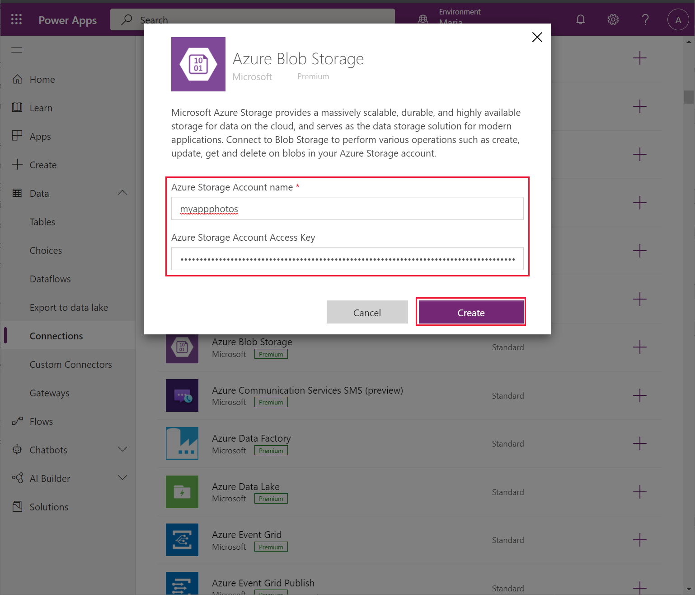
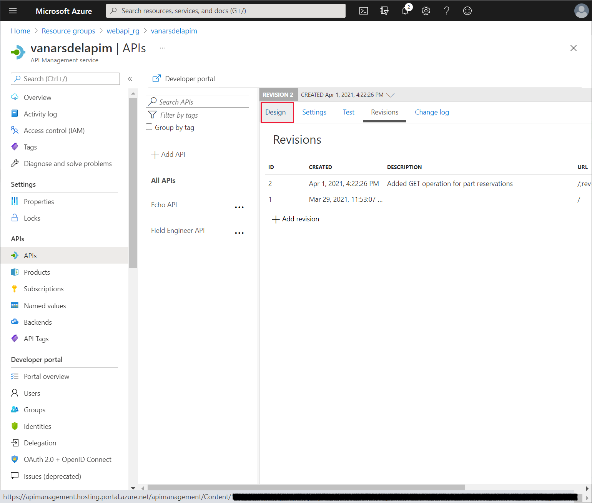
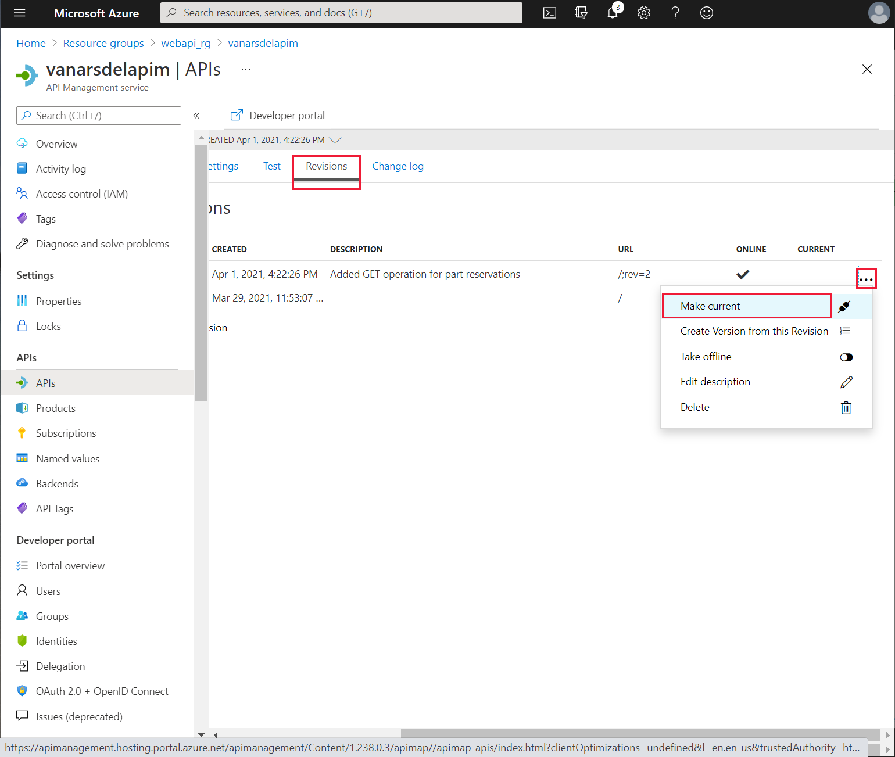
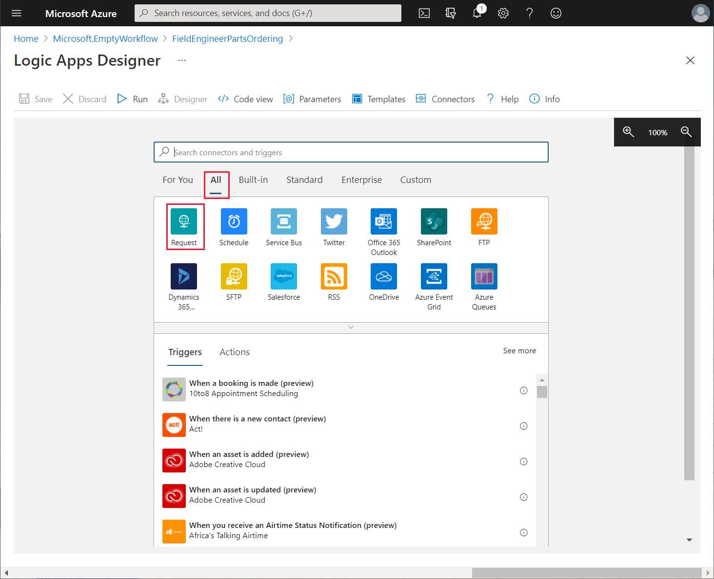
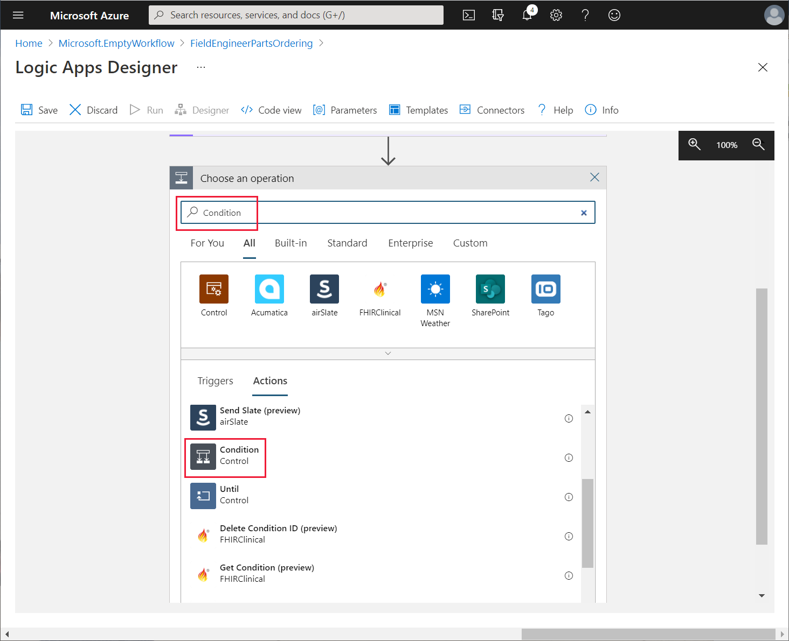
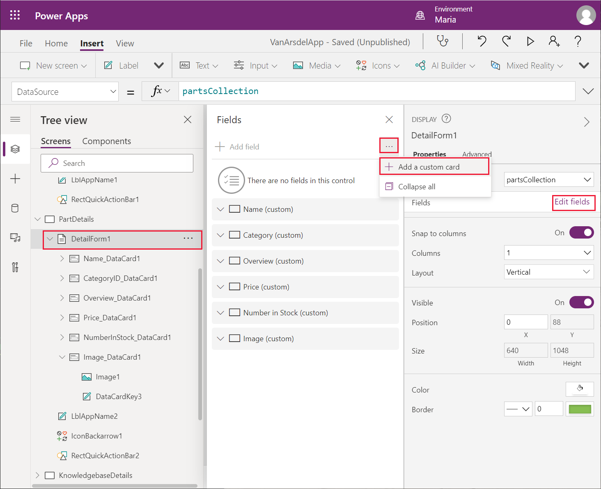

# Chapter 7: Adding functionality to the app

Kiana and Maria are excited to show the inventory management app to Caleb, the field technician. He likes it, but suggests adding some extra user interface functionality to make it easier to use. Specifically, Caleb would like to be able to:

-   Add a photograph of the work done on a boiler or air conditioning unit, and add it to the appointment details on the **Edit Appointment** screen. This image could prove useful as documentary evidence of repairs performed. The **Edit Appointment** screen currently enables the user to add an image to the appointment, but the image isn't saved as this feature hasn't been fully implemented yet. The reason for this omission is that Kiana and Preeti need to determine the best place to store image data. Caleb would like this functionality added as soon as possible.

-   View a complete appointment history for a customer, to track repairs that were requested and monitor any ongoing issues that might require technicians to be repeatedly called out.

-   Order parts from the **Part Details** screen.

Additionally, the image control on the **Part Details** screen displays the images stored at a specified URL. Currently the URLs in the data are simply placeholders. Like the photographs for the appointment screen, Kiana and Preeti need to determine the best place to store images so they're available to the app.

## Adding a photograph to an appointment

Photographs need to be stored somewhere accessible by the app. For performance and security reasons, Preeti doesn't want photographs to be saved in OneDrive or in Azure SQL Database. Instead, she and Kiana decide to use Azure Blob Storage. Blob Storage is optimized for holding large binary objects, and is robust, with built-in security. Power Apps has a connector that allows access to Blob Storage. Maria suggests adding a new picture-taking screen, improving the user experience for Caleb.

More information: [Azure Blob Storage](https://azure.microsoft.com/services/storage/blobs/)

Preeti creates the Blob Storage account from the Azure portal by following these steps:

1.  In the [Azure portal](https://portal.azure.com), on the **Home** page, select **+ Create a resource**. In the **Search the Marketplace** box, enter **Storage account**, and then select **Enter**.

    

2.  On the **Storage account** page, select **Create**.

3.  On the **Create storage account** page, enter the following details, and then select **Review + create**:

    -   Subscription: Select your subscription
    -   Resource group: **webapi\_rg**
    -   Storage account name: Provide a globally unique name and make a note of it for later
    -   Location: Select your nearest location
    -   Performance: **Standard**
    -   Account kind: **BlobStorage**
    -   Replication: **RA-GRS**

    

4.  On the validation page, select **Create** and wait for the storage account to be provisioned.

5.  Go to the page for the new storage account.

6.  On the **Overview** page, select **Containers**.

    

7.  On the **Containers** page, select **+ Container**. Create a new container named **photos**, and then select **Create**. Change **Public access level** to **Blob**.

    

8.  Back on the **Overview** page for the storage account, under settings, select **Access keys**. On the **Access keys** page, select **Show keys.** Make a note of the value of the key for **key1**.

    

Preeti gives the storage account name and key to Kiana, who uses this information to create a custom connector for the app by following these steps:

1.  Sign in to [Power Apps](http://make.powerapps.com).

2.  On the left pane, expand **Data**, and select **Connections**. The existing connections used by the app should be listed. Select **+ New connection**.

    

3.  On the **New connection** page, scroll down, select **Connections**, select **Azure Blob Storage**, and then select **Create**.

    

4.  In the **Azure Blob Storage** dialog, enter the storage account name and access key that Preeti provided, and then select **Create**.

    

5.  Wait while the new connection is created. It should appear on the list of connections.

Maria can use this connection to Blob Storage in the app to save and retrieve photographic images. Her first task is to add the connection to the app by following these steps:

1.  Open the **VanArsdelApp** app for editing in Power Apps Studio.

2.  On the **Data** pane, select **Add data**, search for the **Azure Blob Storage** connector, and then select the connector.

    

3.  In the **Azure Blob Storage** dialog, select the **Azure Blob Storage** connector to add it to your app.

    

Maria's next task is to add a screen that enables a technician or engineer to save a photograph. Maria decides to add a new screen with a Picture control. When the app is run on a mobile device, this control can integrate with the camera to enable the technician to take a photograph. On other devices, this control prompts the user to upload an image file instead. She adds a link to this new screen from the **EditAppointment** screen by following these steps:

1.  On the **Insert** menu, select **New screen**, and then select the **Scrollable** template.

    

2.  On the **Tree view** pane, select the new screen and rename it as **TakePhoto**.

3.  Change the **Text** property of the **LblAppName*X*** control on this screen to **Take a photograph**.

4.  Delete the **Canvas*X*** control from the screen.

5.  In the **Insert** menu, from the **Media** dropdown list, select **Add picture** to create a new picture control.

    

    > [!NOTE]
    > The picture control is actually a composite custom component that enables the user to add a picture to the screen and display the results.

6.  Resize and reposition the picture control to occupy the body of the screen.

7.  On the **Tree view** pane, select the **IconBackarrow*X*** control on the **AppointmentDetails** screen, and then select **Copy**.

    

8.  On the **Tree view** menu, right-click the **TakePhoto** screen, and then select **Paste**. The **IconBackArrow*X*** control will be added to the screen.

    

9.  Move the **IconBackArrow*X*** control to the upper left of the header bar.

10. On the **Tree view** pane, select the **IconBackArrow*X*** control on the **TakePhoto** screen. On the right pane, on the **Advanced** tab, modify the **OnSelect** action property to **Navigate(EditAppointment, ScreenTransition.None)**.

11. Add a new **Save** icon control to the upper right of the header bar. Set the **Visible** property of this control to **If(IsBlank(AddMediaButton1.Media), false, true)**.

    This setting makes the **Save** icon invisible if the user hasn't selected an image.

    

12. Change the formula in the **OnSelect** action property of the **Save** icon control to the following.

    ```
    Set(ImageID, GUID() & ".jpg");

    AzureBlobStorage.CreateFile("photos", ImageID, AddMediaButton1.Media);

    Patch(appointmentsCollection, LookUp(appointmentsCollection,id=BrowseAppointmentsGallery.Selected.id), {imageUrl:"https://myappphotos.blob.core.windows.net/photos/" & ImageID});

    Navigate(EditAppointment,ScreenTransition.Cover);
    ```

    Replace **\<storage account name\>** with the name of the Azure storage account that Preeti created.

    This code uploads the image to the **photos** container in Blob Storage. Each image is given a unique filename. The **Patch** function updates the **imageUrl** property in the appointments record with the URL of the image in Blob Storage.

13. On the **Tree view** pane, expand the **AddMediaWithImageX** control. Modify the **Image** property of the **UploadedImage*X*** control, and set it to **AppointmentImage**.

    AppointmentImage is a variable that will be populated with an image either uploaded by the user, or as the result of taking a photograph. You'll initialize this variable in the **EditAppointment** screen later.

14. On the **Tree view** pane, select the **AddMediaButton*X*** control. Set the **UseMobileCamera** property of this control to **true**. Set the **OnChange** action property of the control to the following.

    ```
    Set(AppointmentImage, AddMediaButton1.Media)
    ```

    This formula changes the **AppointmentImage** variable to reference the new image. The **UploadedImage*X*** control will display this image.

15. On the **Tree view** pane, select the **EditAppointment** screen.

16. Expand the **EditForm*X*** control. Under the **Image\_DataCardX** control, remove the **AddPictureX** control.

    

17. Select the **Image*X*** control. Change the following properties:

    -   Image: **Parent.Default**
    -   X: **30**
    -   Y: **DataCardKey*X*.Y + DataCardKey*X*.Height + 150** (where **DataCardKey*X*** is the data card containing the **Image*X*** control)
    -   Width: **Parent.Width - 60**
    -   Height: **400**

    > [!NOTE]
    > The image control will drop down below the bottom of the screen, but a scroll bar will be added automatically to enable the image to be viewed.

18. Add a **Camera** icon to the data card then position it between the **Image** label and the **ImageX** control. Change the name of the control to **CameraIcon**.

    > [!NOTE]
    > Make sure you select the Camera Icon control, *not* the Camera Media control.

    

19. Set the **OnSelect** action property of the **CameraIcon** control to the following.

    ```
    Set(AppointmentImage, SampleImage);

    Navigate(TakePhoto, ScreenTransition.None);
    ```

    When the user selects this icon, they'll go to the **TakePhoto** screen, where they can take a photo or upload an image. The initial image displayed will be the default sample image.

To test the app, do the following:

1.  On the **Tree view** pane, select the **Home** screen.

2.  Select **F5** to preview the app.

3.  On the **Home** screen, select **Appointments**.

4.  In the browse screen, select any appointment.

5.  On the details screen for the appointment, select the edit icon in the screen header.

6.  On the edit screen, select the **Camera** icon for the image.

7.  Verify that the **Take a photograph** screen appears.

8.  Select **Change Picture** and upload a picture of your choice (or take a photograph, if you're running the app on a mobile device).

9.  Select **Save**. Verify that the image appears on the details page, and then select the tick icon to save the changes back to the database.

10. Close the preview window and return to Power Apps Studio.

## Displaying images of parts

Having determined that Blob Storage is an ideal location for saving pictures associated with appointments, Preeti and Kiana decide that they should use the same approach for storing the images of parts. A key advantage of this approach is that it doesn't require any modifications to the app. The app reuses the same storage account and the same connection. As a separate migration exercise, they can do the following:

1.  Create a new Blob Storage container.

2.  Upload the part images to this container.

3.  Change the **ImageUrl** references in the **Parts** table in the **InventoryDB** database to the URL of each image.

The app will pick up the new URL for each part image automatically, and the **Image** control on the **PartDetails** screen will display the image.

## Tracking appointment history for a customer

Maria thinks that being able to quickly view all the history from a customer's previous technician's visits could be added to the app by creating a custom component. Working with Caleb on what information they want to see, Maria sketches out a simple design comprising the notes and the date of each visit.


Looking at the data, Maria believes that a gallery control is the best way to display the table data on a screen.

Maria creates the custom component as follows:

1.  Using Power Apps Studio, on the **Tree view** pane, select **Components**, and then select **+ New component**.

    

    A new blank component named **Component1** is created. Rename the component as **DateHistoryComponent**.

    

2.  On the **Insert** menu, select **Gallery**, and then choose the **Blank flexible height** gallery template.

    

3.  Move the gallery control and resize it to fill the custom component.

4.  Select the **Add an item from the insert pane**, then select **Text label**.

    

5.  On the **Tree view** pane, rename the label control as **NotesLabel**. Set the **Overflow** property to **Overflow.Scroll**. This setting enables the control to display several lines of text and allow the user to scroll through it. Set the following properties so you can position and size the control:

    -   LineHeight: **2**
    -   X: **28**
    -   Y: **18**
    -   Width: **574**
    -   Height: **140**

6.  Add a second text label to the control. Rename this control as **DateLabel**, and set the following properties:

    -   LineHeight: **2**
    -   X: **28**
    -   Y: **174**
    -   Width: **574**
    -   Height: **70**

7.  To see how the control will look when inserted into the app and displayed with its theme, on the **Tree view** pane, select **DateHistoryComponent**. On the right pane, on the **Advanced** tab, select the **Fill** field and change the color to **RGBA(0, 0, 0, 1)**.

    

8.  On the **Insert** pane, expand **Shapes**, and add a **Rectangle** control to the custom component. Set the following properties for this control:

    -   X: **0**
    -   Y: **273**
    -   Width: **Parent.Width**
    -   Height: **2**

    This control acts as a separator between the records displayed in the gallery.

    

Maria is familiar with adding controls to screens and building apps with Power Apps. However, reusable components don't work in quite the same way. Kiana described to Maria that to be able to use data in a custom component, she must add some additional custom input properties. Kiana also explained that Maria needs to provide example data for these properties, to allow her to reference the data fields in the controls in her component, as follows:

1.  On the **Tree view** pane, select **DateHistoryComponent**. On the right pane, on the **Properties** tab, select **New custom property**.

    

2.  In the **New custom property** dialog, specify the following values, and then select **Create**:

    -   Display name: **Data**
    -   Name: **Data**
    -   Description: **The table of appointments for a customer, showing the notes and dates**
    -   Property type: **Input**
    -   Data type: **Table**
    -   Raise OnReset when value changes: Leave blank

    

3.  To change the sample data displayed by the control, select the new **Data** custom property. In the formula field, enter **Table({Notes: "Example notes field text.", \'Appointment Date\': Text(Today())})**.

    

4.  On the **Tree view** pane, select the **Gallery*X*** control in **DateHistoryComponent**, and rename it as **AppointmentHistory**.

5.  On the right pane, on the **Advanced** tab, set the **Items** property of the **AppointmentHistory** gallery control to **Parents.Data**.

    

6.  Select the **NotesLabel** control. On the right pane on the **Advanced** tab, change the **Text** property to **ThisItem.Notes,** and change the **Size** property to **20**.

    > [!NOTE]
    > The **Size** property specifies the font size for the text displayed by the control.

7.  Select the **DateLabel** control to change the **Text** property to **ThisItem.\'Appointment Date\'** and change the **Size** property to **20**. The fields in the custom component should display the sample data.

    

The custom component is complete. Maria creates a new screen to display the appointments history for a customer by using this component, as follows:

1.  On the **Tree view** pane, select the **Screens** tab.

2.  Expand the **BrowseAppointments** screen, expand the **BrowseAppointmentsGallery** control, and select the **Body1\_1** control. On the **Insert** menu, select **Icons**, and then select the **Detail list** icon.

    

3.  Change the name of the icon control to **ViewAppointments**.

4.  On the **Tree view** menu, select the **BrowseAppointmentsGallery** control. On the right pane, on the **Advanced** tab, change the **TemplateSize** property to **220**. Increasing this property expands the space available in the gallery.

5.  Move the **ViewAppointments** icon into the empty space below the customer name.

    

6.  Select the **ViewAppointments** icon control. Set the **OnSelect** action property to the following formula.

    ```
    ClearCollect(customerAppointmentsCollection, FieldEngineerAPI.getapicustomeridappointments(ThisItem.customerId));

    Navigate(AppointmentsHistoryScreen, ScreenTransition.Fade)
    ```

    This formula populates a collection named **customerAppointmentsCollection** with the appointments for the selected customer, and then moves to the **AppointmentHistoryScreen** to display them. You'll create this screen in the following steps.

7.  On the **Insert** menu, select **New screen**, and then select the **Scrollable** template.

    

8.  Change the name of the new screen to **AppointmentHistoryScreen**.

9.  Delete the **Canvas*X*** control that was added to this screen.

    

10. Select the **LblAppName*X*** control on this screen. On the right pane, on the **Advanced** tab, change the **Text** property to the following.

    ```
    "Appointments History for " &  BrowseAppointmentsGallery.Selected.customer.name
    ```

11. Set the following properties for the **LblAppName*X*** control to adjust the position and size:

    -   X: **90**
    -   Y: **0**
    -   Width: **550**
    -   Height: **140**

12. Select the **RectQuickActionBar*X*** control, and set the **Height** property to **140**.

13. Add a **Left icon** control to the screen header, to the left of the title. Set the **OnSelect** action property for this control to **Navigate(BrowseAppointments, Transition.None)**.

    

14. On the **Insert** menu, select **Custom**, and then select the **DateHistoryComponent**.

    

15. Move and resize the component so that it occupies the body of the screen, below the heading.

    

16. Set the following properties for this component:

    -   Data: **customerAppointmentsCollection**
    -   Appointment Date: **startDateTime**
    -   Notes: **notes**

17. Save the app.

To test the app, do the following:

1.  On the **Tree view** pane, select the **Home** screen.

2.  Select **F5** to preview app.

3.  On the **Home** screen, select **Appointments**.

4.  In the browse screen, select the **Detail list** icon for any appointment.

5.  Verify that the **Appointments History** screen for the selected customer appears.

6.  Close the preview window and return to Power Apps Studio.

## Ordering parts

A key requirement of the system is to enable a technician to order any parts required while visiting a customer. If the parts are in stock, it should be possible to schedule another visit to complete the repair at the next convenient date for the customer. If the parts are currently out of stock and have to be ordered, the technician can tell the customer. Malik can then arrange an appointment with the customer when Maria receives notice that the parts have arrived in the warehouse.

The reservations part of the app uses the tables in the **InventoryDB** database shown in the following image. The **Orders** table holds information about orders placed for parts. The **Reservations** table lists the reservation requests that technicians and engineers have made for parts. The **Engineers** table provides the name and contact number for the engineer who made the reservation, which makes it easy for Maria the inventory manager to query if necessary.


To support this feature, Kiana has to update the Web API with a method that fetches the number of reserved items for a specified part, as follows:

1.  Open the **FieldEngineerApi** Web API project in Visual Studio Code.

2.  Add a file named **Order.cs** to the **Models** folder. Add the following code to this file. The **Orders** class tracks the details of orders placed for parts.

    ```csharp
    using System;
    using System.ComponentModel.DataAnnotations;
    using System.ComponentModel.DataAnnotations.Schema;

    namespace FieldEngineerApi.Models
    {
        public class Order 
        {
            [Key]
            public long Id { get; set; }

            public long BoilerPartId { get; set; }

            public BoilerPart BoilerPart { get; set; }

            public long Quantity { get; set; }

            [Column(TypeName = "money")]
            public decimal TotalPrice { get; set; }

            [Display(Name = "OrderedDate")]
            [DataType(DataType.DateTime)]
            [DisplayFormat(DataFormatString = "{0:MM/dd/yyyy}")]
            public DateTime OrderedDateTime { get; set; }

            public bool Delivered { get; set; }

            [Display(Name = "DeliveredDate")]
            [DataType(DataType.DateTime)]
            [DisplayFormat(DataFormatString = "{0:MM/dd/yyyy}")]
            public DateTime? DeliveredDateTime { get; set; }
        }
    }
    ```

3.  Add another new file named **Reservation.cs** to the **Models** folder and add the following code to this file. The **Reservation** class contains information about the number of items for a given part that are currently reserved for other customers.

    ```csharp
    using System;
    using System.ComponentModel.DataAnnotations;

    namespace FieldEngineerApi.Models
    {
        public class Reservation
        {
            [Key]
            public long Id { get; set; }

            public long BoilerPartId { get; set; }

            public BoilerPart BoilerPart { get; set; }

            public int NumberToReserve { get; set; }

            public string EngineerId { get; set; }

            public InventoryEngineer Engineer { get; set; }
        }
    }
    ```

4.  Add one more file, named **InventoryEngineer.cs,** to the **Models** folder, with the following code. The **InventoryEngineer** class records which engineers have made which reservations.

    ```csharp
    using System.ComponentModel.DataAnnotations;
    using System.Collections.Generic;

    namespace FieldEngineerApi.Models
    {
        public class InventoryEngineer
        {
            [Key]
            public string Id { get; set; }

            [Required]
            public string Name { get; set; }

            public string ContactNumber { get; set; }

            public List<Reservation> Reservations { get; set; }
        }
    }
    ```

5.  Open the **InventoryContext.cs** file in the **Models** folder, and add the following statements to the **InventoryContext** class.

    ```csharp
    public class InventoryContext : DbContext
    {
        public InventoryContext(DbContextOptions\<InventoryContext\> options)
            : base(options)
        {

        }

        public DbSet<BoilerPart> BoilerParts { get; set; }
        public DbSet<InventoryEngineer> Engineers { get; set; }
        public DbSet<Order> Orders { get; set; }
        public DbSet<Reservation> Reservations { get; set; }
    }
    ```

6.  In the Terminal window in Visual Studio Code, run the following commands to build controllers for handling orders and reservations.

    ```shell
    dotnet aspnet-codegenerator controller ^
        -name OrdersController -async -api ^
        -m Order ^
        -dc InventoryContext -outDir Controllers

    dotnet aspnet-codegenerator controller ^
        -name ReservationsController -async -api ^
        -m Reservation ^
        -dc InventoryContext -outDir Controllers
    ```

7.  Open the **BoilerPartController.cs** file in the **Controllers** folder, and add the following **GetTotalReservations** method to the **BoilerPartsController** class.

    ```csharp
    public class BoilerPartsController : ControllerBase
    {
        private readonly InventoryContext _context;

        public BoilerPartsController(InventoryContext context)
        {
            _context = context;
        }

        ...
        
        // GET: api/BoilerParts/5/Reserved 
        [HttpGet("{id}/Reserved")]
        public async Task<ActionResult<object>> GetTotalReservations(long id)
        { 
            var reservations = await _context
                .Reservations
                .Where(r => r.BoilerPartId == id) 
                .ToListAsync();

            int totalReservations = 0; 

            foreach(Reservation reservation in reservations) 
            { 
                totalReservations += reservation.NumberToReserve; 
            } 

            return new {id, totalReservations}; 
        }
        ...
    }
    ```

8.  Edit the **OrdersController.cs** file, and modify the **PostOrder** method in the **OrdersController** class as shown by the following.

    ```csharp
    [HttpPost]
    public async Task<ActionResult<Order>> PostOrder(long boilerPartId, int quantity)
    {
        var part = await _context.BoilerParts.FindAsync(boilerPartId);

        Order order = new Order 
        {
            BoilerPartId = boilerPartId,
            Quantity = quantity,
            OrderedDateTime = DateTime.Now,
            TotalPrice = quantity * part.Price
        };

        _context.Orders.Add(order);
        await _context.SaveChangesAsync();

        return CreatedAtAction("GetOrder", new { id = order.Id }, order);
    }
    ```

9.  Edit the **ReservationsController.cs** file. Modify the **PostReservation** method in the **ReservationsController** class, as follows.

    ```csharp
    [HttpPost]
    public async Task<ActionResult<Reservation>> PostReservation(long boilerPartId, string engineerId, int quantityToReserve)
    {
        Reservation reservation = new Reservation 
        {
            BoilerPartId = boilerPartId,
            EngineerId = engineerId,
            NumberToReserve = quantityToReserve
        };

        _context.Reservations.Add(reservation);
        await _context.SaveChangesAsync();

        return CreatedAtAction("GetReservation", new { id = reservation.Id }, reservation);
    }
    ```

10. In the Terminal window, run the following commands to build and publish the Web API ready for deployment.

    ```
    dotnet build
    dotnet publish -c Release -o ./publish
    ```

11. In Visual Studio Code, right-click the **publish** folder, and then select **Deploy to Web App**.

Preeti can now update the API Management service used by the VanArsdel app to reflect the updated Web API. This is a non-breaking change; existing operations will continue to work, the difference being the new controllers and operations to make reservations and place orders. Preeti performs the following tasks:

> [!NOTE]
> Preeti could have chosen to delete the existing Field Engineer API and replace it with a new version, but that approach risks breaking any existing applications that might be currently using the API. It's better practice to leave the existing API in place and add the modifications as a revision.

1.  In the Azure portal, go to the API Management service.

2.  On the **API Management service** page, on the left pane under **APIs**, select **APIs**.

3.  Select the **Field Engineer API**, select the ellipsis menu, and then select **Add revision**.

    

4.  In the **Create a new revision of the Field Engineer API** dialog, enter the description **Added GET operation and POST operations for part reservations and orders**, and then select **Create**.

    

5.  On the **REVISION 2** page, select **Design**.

    

6.  On the **Design** page, select **Add operation**. On the **FrontEnd** pane, set the following properties, and then select **Save**. This operation is used for retrieving the number of items reserved for a given boiler part:

    -   Display name: **api/BoilerParts/{id}/Reserved**
    -   Name: **api-boilerparts-id-reserved**
    -   URL: **GET** **api/BoilerParts/{id}/Reserved**

    

7.  On the **Test** tab for the new operation, set the **id** parameter to a valid part number (the example in the image uses part 1), and then select **Send**.

    

8.  Verify that the test is successful. The operation should complete with an HTTP 200 response, and a body that shows the number of reservations for the product.

    

9.  On the **Design** page, select **Add operation**. On the **FrontEnd** pane, set the following properties (this operation defines POST requests for creating new orders):

    -   Display name: **api/Orders - POST**
    -   Name: **api-orders-post**
    -   URL: **POST** **api/Orders**

10. On the **Query** tab, select **+ Add parameter**, add the following parameters, and then select **Save**:

    -   Name: **boilerPartId**, Description**: Boiler Part ID**, Type: **long**
    -   Name: **quantity**, Description**: Quantity**, Type: **integer**

    

11. Select **Add operation** again on the **FrontEnd** pane, and set the following properties (this operation defines POST requests for creating new reservations):

    -   Display name: **api/Reservations - POST**
    -   Name: **api-reservations-post**
    -   URL: **POST** **api/Reservations**

12. On the **Query** tab, add the following parameters, and then select **Save**:

    -   Name: **boilerPartId**, Description: **Boiler Part ID**, Type: **long**
    -   Name: **engineerId**, Description: **Engineer ID**, Type: **string**
    -   Name: **quantityToReserve**, Description: **Quantity to reserve**, Type: **integer**

13. On the **Revisions** tab, select the new version. On the ellipsis menu for this version, select **Make current**.

    

14. In the **Make revision current** dialog, select **Save**.

15. Open another page in your web browser and go to the URL **https://*\<APIM name\>*.azure-api.net/api/boilerparts/1/reserved** where **\<APIM name\>** is the name of your API service. Verify that you get a response similar to the following.

    ```js
    {"id":1,"totalReservations":5}
    ```

The updated Web API is now available. In theory, Kiana could create a new custom connector for the updated Web API and add it to the app. The app could then implement its own logic to determine how many items of the specified product are currently in stock, how many are reserved, compare the results to the number of items required, place an order for more stock if necessary, or reserve items from the existing stock. However, this kind of logic is better implemented in an Azure logic app. Power Apps can call the logic app through a custom connector when a technician wishes to reserve or order a part.

To create the logic app, Kiana uses the following steps:

> [!NOTE]
> To keep things simple, the logic app created in this example is non-transactional. It's possible that between checking the availability of a part and making a reservation, a concurrent user might make a conflicting reservation. You could implement transactional semantics by replacing some of the logic in this logic app with a stored procedure in the **InventoryDB** database.

1.  In the [Azure portal](https://portal.azure.com), on the **Home** page, select **+ Create a resource**.

2.  In the **Search the marketplace** box, enter **Logic App**, and then select **Enter**.

3.  On the **Logic App** page, select **Create**.

    

4.  On the **Create a logic app** page, enter the following values, and then select **Review + create**:

    -   Subscription: Select your Azure subscription
    -   Resource group: **webapi\_rg**
    -   Logic App name: **FieldEngineerPartsOrdering**
    -   Region: Select the same location you used for the Web API
    -   Associate with integration service environment: Leave blank
    -   Enable log analytics: Leave blank

5.  On the verification page, select **Create**, and wait while the logic app is deployed.

6.  When the deployment is complete, select **Go to resource**.

7.  On the **Logic Apps Designer** page, scroll down to the **Templates** section, and then select **Blank Logic App**.

    

8.  On the **All** tab, in the **Search connectors and triggers** text box, select **Request**.

     

9.  On the **Triggers** tab, select **When a HTTP request is received**.

    

10. In the **Request Body JSON Schema** box, enter the following schema, and then select **+ New step**.

    ```js
    {
        "type": "object",
        "properties": {
            "boilerPartId": {
                "type": "integer"
            },
            "numberToReserve": {
                "type": "integer"
            },
            "engineerId": {
                "type": "string"
            }
        }
    }
    ```

    

    This schema defines the content of the HTTP request that the logic app is expecting. The request body comprises the ID of a boiler part, the number of items to reserve, and the ID of the engineer making the request. The app will send this request when an engineer wants to reserve a part.

11. In the **Choose an operation** box, select **All**, and then select **HTTP**.

    

    The logic app will call the **BoilerParts{id}** operation of the Web API to retrieve information about the boiler part provided by the request from the app.

12. On the **Actions** pane, select the **HTTP** action.

    

13. In the **HTTP** action box, on the ellipsis menu, select **Rename**, and change the name of the action to **CheckBoilerPart**.

    

14. Set the properties of the HTTP action as follows, and then select **+ New Step**:

    -   Method: **GET**
    -   URI: **https://*\<APIM name\>*.azure-api.net/api/boilerparts/**, where ***\<APIM name\>*** is the name of your API Management service. In the **Dynamic content** box for this URI, on the **Dynamic content** tab, select **boilerPartId**

    

15. In the **Choose an operation** box, in the **Search connectors and actions** box, enter **Parse JSON**, and then select the **Parse JSON** action.

    

16. Using the ellipsis menu for the **Parse JSON** action, rename the action as **ParseBoilerPart**.

17. In the **Content** box for the **ParseBoilerPart** action, in the **Dynamic Content** box, select **Body**. In the **Schema** box, enter the following JSON schema, and then select **+ New step**.

    ```js
    {
        "type": "object",
        "properties": {
            "id": {
                "type": "integer"
            },
            "name": {
                "type": "string"
            },
            "categoryId": {
                "type": "string"
            },
            "price": {
                "type": "number"
            },
            "overview": {
                "type": "string"
            },
            "numberInStock": {
                "type": "integer"
            },
            "imageUrl": {
                "type": "string"
            },
        }
    }
    ```

    

    This action parses the response message returned by the **getBoilerParts/{id}** request. The response contains the details of the boiler part, including the number currently in stock.

18. In the **Choose an operation** box for the new step, select the **HTTP** connector.

19. On the **Actions** tab, select the **HTTP** action.

20. Using the ellipsis menu for the operation, rename the operation as **CheckReservations**.

21. Set the following properties for this operation, and then select **+ New step**:

    -   Method: **GET**
    -   URI: **https://*\<APIM name\>*.azure-api.net/api/boilerparts/**. As before, in the **Dynamic content** box for this URI, on the **Dynamic content** tab, select **boilerPartId**. In the **URI** field, append the text **/reserved** after the **boilerPartId** placeholder

    

22. In the **Choose an operation** box for the new action, in the **Search connectors and actions** box, enter **Parse JSON**, and then select the **Parse JSON** action.

23. Rename the operation as **ParseReservations**.

24. Set the **Content** property to **Body**.

25. Enter the following schema, and then select **+ New step**.

    ```js
    {
        "type": "object",
        "properties": {
            "id": {
                    "type": "integer"
            },
            "totalReservations": {
                    "type": "integer"
            }
        }
    }
    ```

    

26. In the **Choose an operation** box for the new action, in the **Search connectors and actions** box, enter **Condition**, and then select the **Condition Control** action.

    

27. Rename the operation as **CompareStock**.

28. Select the **Choose a value** box. In the **Add dynamic content** box, on the **Expression** tab, enter the following expression, and then select **OK**.

    ```
    add(body('ParseReservations')?['totalReservations'], triggerBody()?['numberToReserve'])
    ```

    This expression calculates the sum of the number of items of the specified boiler part that are currently reserved, and the number requested by the engineer.

    

29. In the condition dropdown list box, select **is greater than**.

30. In the remaining **Choose a value** box, in the **Dynamic content** box, on the **Dynamic content** tab, under **ParseBoilerPart**, select **numberInStock**.

    

31. If the number of items required plus the number reserved is greater than the number in stock, the app needs to place an order to replenish the inventory. In the **True** branch of the **CompareStock** action, select **Add an action**.

32. On the **All** tab for the new operation, select **HTTP**, and then select the **HTTP** action.

33. Rename the operation as **PostOrder**.

34. Set the following properties for the **PostOrder** operation:

    -   Method: **POST**
    -   URI: **https://*\<APIM name\>*.azure-api.net/api/orders**
    -   In the **Queries** table, in the first row, enter the key **boilerPartId**. For the value in the **Add dynamic content** box, on the **Dynamic content** tab, select **boilerPartId **
    -   In the second row of the **Queries** table, enter the key **quantity**. In the value field, enter **50**.

    

    The logic app will automatically order 50 items of the specified part when stock is running low.

    > [!NOTE]
    > The logic app assumes that the engineer won't actually attempt to reserve more than 50 items of a specified part in a single request!

35. Leave the **False** branch of the **CompareStock** action empty.

36. Below the **CompareStock** action, select **+ New step**.

37. On the **All** tab for the new operation, select **HTTP**, and then select the **HTTP** action.

38. Rename the operation as **PostReservation**.

39. Set the following properties for the **PostReservation** operation:

    -   Method: **POST**
    -   URI: **https://*\<APIM name\>*.azure-api.net/api/reservations**
    -   In the **Queries** table, in the first row, enter the key **boilerPartId**. For the value in the **Add dynamic content** box, on the **Dynamic content** tab, select **boilerPartId**.
    -   In the second row, enter the key **engineerId**. For the value in the **Add dynamic content** box, on the **Dynamic content** tab, select **engineerId**
    -   In the third row, enter the key **quantityToReserve**. For the value in the **Add dynamic content** box, on the **Dynamic content** tab, select **numberToReserve**

40. Select **+ New Step**. In the **Choose an operation** box, search for and select the **Response** action.

41. Set the following properties for the **Response** action:

    -   Status Code: **200**
    -   Headers: Key - **content-type**, Value - **application/json**
    -   Body: In the **Dynamic content** box, select the **Body** element from the **PostReservation** request. This is the body returned when the reservation is made.

    

42. In the upper left of the **Logic Apps Designer** page, select **Save**. Verify that the logic app can be saved without any errors.

To create the custom connector that Power Apps can use to trigger the logic app, Kiana performs the following steps while still in the Azure portal:

1.  On the **Overview** page for the logic app, select **Export**.

    

2.  In the **Export to Power Apps** pane, name the connector **PartsOrderingConnector**, select your Power Apps environment, and then select **OK**.

    

3.  Sign in to [Power Apps](https://make.powerapps.com).

4.  In your environment, under **Data**, select **Custom Connectors** and verify that the **PartsOrderingConnector** is listed.

    

Maria can now modify the VanArsdel app to enable a technician to order parts while attending a customer site. She adds an **Order** button to the **PartDetails** screen, as follows:

1.  Sign in to [Power Apps](https://make.powerapps.com) (if not already signed in).

2.  Under **Apps**, select the **VanArsdelApp** app. On the ellipsis menu for the app, select **Edit**.

3.  On the **Data** pane, select **Add data**, search for the **PartsOrderingConnector** connector, and add a new connection using that connector.

    

4.  On the **Tree view** pane, expand the **PartDetails** screen, and then expand the **DetailForm1** form.

5.  On the **Properties** pane on the right, select **Edit fields**. On the **Fields** pane, on the ellipsis menu, select **Add a custom card**.

    

6.  On the **Tree view** pane, rename the new card from **DataCard1** to **ReserveCard**. In the **Design view** window, resize the card so that it occupies the lower part of the screen, below the **Image\_DataCard1** control.

    

7.  On the **Insert** menu, from the **Input** sub menu, add a **Text Input** control, a **Button** control, and a **Label** control to the **ReserveCard** control.

8.  Resize and position the controls so that they're adjacent, with the **Button** control to the right of the **Text Input** control, and the **Label** underneath the **Button** control.

9.  On the **Properties** pane for the **Text Input** control, clear the **Default** property.

10. On the **Properties** pane for the **Button** control, set the **Text** property to **Reserve**.

    

11. Rename the **Text Input** control as **NumberToReserve**, rename the **Button** control as **Reserve**, and rename the **Label** control as **Message**.

12. On the **Properties** pane for the **Message** control, set the **Text** property to **Parts Reserved**, and set the **Visible** property to **MessageIsVisible**.

    > [!NOTE]
    > **MessageIsVisible** is a variable that you'll initialize to **false** when the screen is displayed, but it will be changed to **true** if the user selects the **Reserve** button.

13. Set the **OnSelect** property for the **Reserve** button control to the following formula.

    ```
    FieldEngineerPartsOrdering.manualinvoke({boilerPartId:ThisItem.id, engineerId:"ab9f4790-05f2-4cc3-9f01-8dfa7d848179", numberToReserve:NumberToReserve.Text});

    Set(MessageIsVisible, true);
    ```

    > [!NOTE]
    > This formula uses a hard-coded engineer ID to represent the technician currently running the app. Chapter 8 describes how to retrieve the ID for the signed-on user.
    >
    > Additionally, the app performs no error checking; it assumes that the request to reserve parts always succeeds. For more information about error handling, go to [Errors function in Power Apps](/powerapps/maker/canvas-apps/functions/function-errors).

14. Set the **OnVisible** property for the **PartDetails** screen to **Set(MessageIsVisible, false)**.

To test the app, do the following:

1.  On the **Tree view** pane, select the **Home** screen.

2.  Select **F5** to preview the app.

3.  On the **Home** screen, select **Parts**.

4.  In the browse screen, select any part.

5.  On the **Part Details** screen, scroll down to the reservations section, enter a positive integer value, and then select **Reserve**. Verify that the **Parts reserved** message appears.

    

6.  Close the preview window and return to Power Apps Studio.

7.  In the Azure portal, go to the page for the **InventoryDB** SQL Database.

8.  Select the **Query editor**, and sign in as **sqladmin** with your password.

9.  In the **Query 1** pane, enter the following query, and then select **Run**. Verify that the reservation you made in the VanArsdel app appears.

    ```sql
    SELECT * FROM [dbo].[Reservations]
    ```

    

> [!div class="step-by-step"]
> [Previous](06-using-web-api-in-app.md)
> [Next](08-protecting-deploying-app.md)
