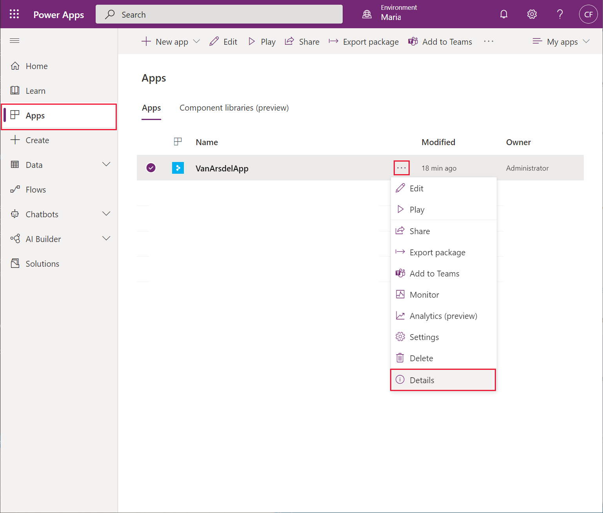

# Chapter 8: Protecting and deploying the app

The app is now functionally complete, but Preeti and Kiana want to ensure that the solution is safe to deploy, and that they have a mechanism for maintaining it as requirements change in the future.

## Protecting the app and resources

When you first sign in to [Power Apps](https://make.powerapps.com), you're required to authenticate yourself, typically by providing your email address and password. Office 365 utilizes its own Azure AD domain; each organization has its own domain. Your credentials are checked against your organization's domain for Office 365. An app built using Power Apps can only access the Office 365 resources to which you've been granted the appropriate authority. Authorization is managed by your Office 365 administrator (Preeti in the VanArsdel scenario). For more information, see [Securing the app and data](../planning/security.md) in Planning a Power Apps project guide.

The Azure resources that an app accesses are also subject to authorization. Services such as Azure Storage require an application to provide an access key. Additionally, many services can be protected through role-based access control (RBAC), which describes the operations that individual users and groups can perform. The IT Operations Manager (Preeti, again) can set the authorization policy that defines which accounts and machines can connect to services such as Azure SQL Database, Azure Blob Storage, Azure API Management, and Azure App Services. Some services also enable you to restrict the endpoints from which authenticated users can request access. For example, you can configure a firewall for Azure SQL Database to deny access to requests emanating from unexpected IP addresses.

Azure helps to protect data in-flight by using transport layer security to encrypt it. This feature is vital for ensuring the integrity and privacy for any distributed system that transmits data over a network such as the public internet. In the case of VanArsdel, technicians will be running the app on mobile devices, utilizing roaming network connections that are outside the organization's control. Preeti is keen to ensure that unauthorized users cannot view or compromise sensitive data.

Data at rest, in storage accounts, databases, and other services in Azure, can also be encrypted. This provides an additional layer of privacy should the datacenter housing this information be breached. For a full list of the security features provided by Azure, see [Introduction to Azure security](/azure/security/fundamentals/overview).

## Personalizing the app

When someone runs an app, it can retrieve information about the user from the Office365 environment. This information can be used to personalize the app. For example, currently the app that Maria and Kiana have developed doesn't distinguish between the different users; they all have access to the same data. Ideally, the app should be personalized to display the information most relevant to the engineer who uses it. Power Apps provides a function named **User** that enables the app to retrieve the email and full name of the current user. This app also requires the user ID (a unique Guid assigned to each user). The rationale behind this requirement is that usernames can be changed, but the ID cannot. The user ID is accessible using the features provided by the **Office365** connector. The steps below illustrate how to add this connector to the app:

1.  Using Power Apps Studio, in the **Tree view** pane, select the **Home** screen.

2.  On the **Insert** menu, from the **Text** drop-down list, add a **Label** control to the screen.

3.  Rename the **Label** control as **UserName**.

4.  Move the control so that it appears below the details showing the next appointment:

    

5.  In the **Data** pane, select **Add data**. In the search box, enter **Office 365 Users**. Add the **Office 365 Users** connection to the app:

    

6.  In the **Tree view** pane, select the **UserName** label, and set the **Text** property to the following formula:

    ```
    Office365Users.MyProfileV2().displayName
    ```

    This formula uses the **Office365Users** connection to retrieve identity information about the current user. The **displayName** property of the **MyProfileV2** function contains the user's logged-on name.

    


> [!NOTE]
> Feel free to style the **UserName** control to make it stand out more.

Office365 runs in an Azure AD domain, but you can also extend this security domain with your own Azure AD installation. If your organization authenticates users through your own Azure AD domain, you can obtain user information by using the **Azure AD** connector instead of **Office365Users**:


In this case, set the **Text** property of the **UserName** label to:

```
AzureAD.GetUser(User().Email).displayName
```

To personalize the appointments list requires calling a different Web API function in the **FieldEngineerAPI** connector. Currently, the **OnVisible** property of the **Home** screen contains the following formula:

```
ClearCollect(appointmentsCollection, Sort(Filter(FieldEngineerAPI.getapiappointments(), DateDiff(Today(), startDateTime) >= 0), startDateTime));
```

The Web API provides an alternative function that retrieves the appointments for a specified technician; you provide the ID of the technician as a parameter. You can use the Office365 user ID for this purpose. Update the **OnVisible** property as shown below:

```
Set(id, Office365Users.MyProfileV2().id);

ClearCollect(appointmentsCollection, Sort(Filter(FieldEngineerAPI.getapischeduleengineeridappointments(id), DateDiff(Today(), startDateTime) >= 0), startDateTime);
```

If you're authenticating with Azure AD, use this formula instead:

```
Set(id, AzureAD.GetUser(User().Email).id);

ClearCollect(appointmentsCollection, Filter(FieldEngineerAPI.getapischeduleengineeridappointments(id), DateDiff(Today(), startDateTime) >= 0), startDateTime);
```

> [!NOTE]
> This modification requires that the **EngineerId** column in the **Appointments** table is populated with the user's ID. This ID is a GUID, but is stored as a string in the database. The image below shows a few rows of sample data:


The **Engineers** table must also contain an Engineer with the corresponding ID:


The app is now ready to deploy and roll out.

## Deploying the app

The simplest way to deploy an app is to publish it to your Office 365 domain. All users who have the **Can use** permission can run the app, either from Power Apps Studio, or by using the Microsoft **Power Apps** app, available in the Windows Store at <https://aka.ms/AAbvtko>. Power Apps can be run on mobile devices like tablets and phones as soon as they're published; users only need find the app in their devices' app store.

To publish an app:

1.  In Power Apps Studio, on the **File** menu, select **Save**. Save the app if you've made any changes. When you save the app, the **Publish** button appears.

2.  Select **Publish**. In the **Publish** dialog box, the **Edit details** option enables you to select settings, such as the name of the app, an icon for the app, and a description. You can also change the screen size and orientation used by the app. Select **Publish this version** to make the app available to other Power Apps users in your organization.

    

You can track the deployment history and app usage from the **Apps** tab on the **Administrators** page in Power Apps Studio, at <https://make.powerapps.com>. Select the app then, on the ellipses menu, select **Details**:



On the **Details** pane, the **Versions** tab shows the version history for the app. The options on the ellipses menu for an app enable you to restore a previous version if you need to roll back a recent publication.


## Maintaining the app

The Power Platform admin center allows you to manage the environments in which Power Apps apps reside. The suggested approach is to create and publish your apps through Dataverse environments. You use separate environments for development and production.

Dataverse provides four types of environments: 

-  **Sandbox**: Ideal for your development.  

-  **Production**: Where the app should be deployed for use. 

-  **Developer**: Assets created in here can\'t be shared. As a single user environment, you could use it for learning and exploring the capabilities of Power Apps apps.  

-  **Default**: An environment that's automatically created for each tenant. Microsoft doesn\'t recommend you use this for apps because everyone in your tenant could then access those apps.  

You create environments using the [Power Platform admin center](https://admin.powerplatform.microsoft.com/). On the **Environments** tab, select the **New** option in the menu bar. Specify the type of environment:


A good approach to application lifecycle management (ALM) is to start in a new sandbox environment, allowing you to safely develop and test your app in isolation from the production environment. Share and test your app as it\'s being developed. When your app is ready for real use, deploy it to a production environment and publish it from there. You can automate much of this process by using the [Microsoft Power Platform Build Tools](/power-platform/alm/devops-build-tools).

For detailed information about ALM with Power Apps as it applies to VanArsdel, see [Scenario 1: Citizen Development](/power-platform/alm/citizen-dev-alm) in the Power Platform ALM guide.

> [!div class="step-by-step"]
> [Previous](07-adding-functionality-to-app.md)
> [Next](conclusion.md)
