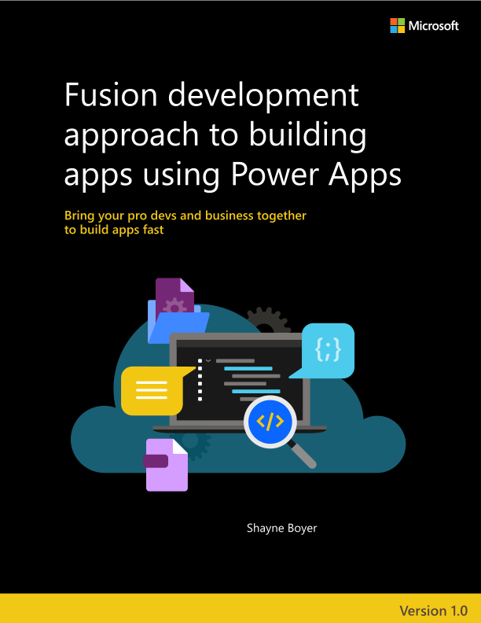

# Ebook: Fusion development approach to building apps using Power Apps

**EDITION v1.0**

PUBLISHED BY

Microsoft Developer Relations and Power Apps product teams

A division of Microsoft Corporation

One Microsoft Way

Redmond, Washington 98052-6399

Copyright © 2021 by Microsoft Corporation

All rights reserved. No part of the contents of this book may be reproduced or transmitted in any form or by any means without the written permission of the publisher.

This book is provided "as-is" and expresses the author\'s views and opinions. The views, opinions and information expressed in this book, including URL and other Internet website references, may change without notice.

Some examples depicted herein are provided for illustration only and are fictitious. No real association or connection is intended or should be inferred.

Microsoft and the trademarks listed at <https://www.microsoft.com> on the "Trademarks" webpage are trademarks of the Microsoft group of companies.

All other marks and logos are property of their respective owners.

#### Authors:

> **Shayne Boyer** - Principal Developer Advocate - Microsoft

> **John Sharp** - Principal Technologist - Content Master

> **Alistair Matthews** - Principal Technologist - Content Master

> **Phil Stollery** - Principal Technologist - Content Master

#### Editors and reviewers:

> **Greg Hurlman** - Sr. Software Engineer - Microsoft

> **Matt Soucoup** - Sr. Developer Advocate - Microsoft

> **April Dunnam** - Sr. Developer Advocate - Microsoft

> [!div class="step-by-step"]
> [Next](foreword.md)

