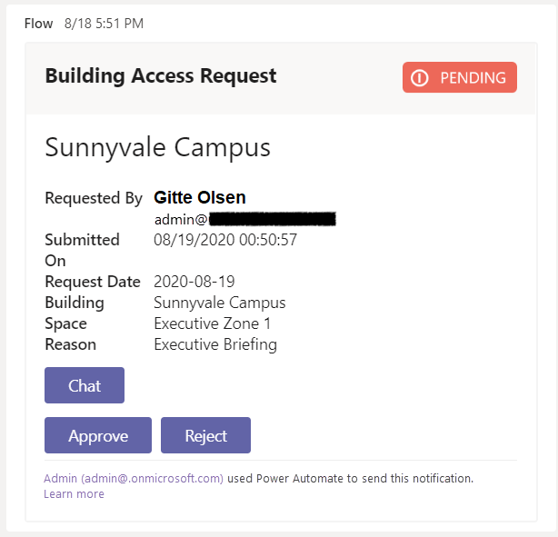
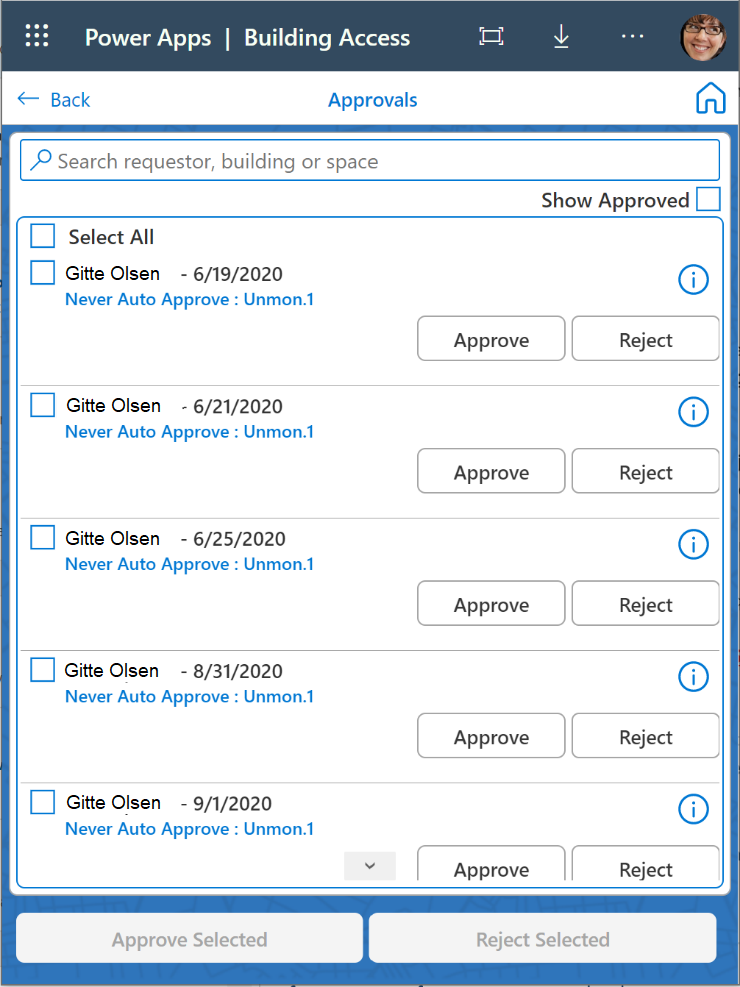

# Pattern: Approval

Power Apps makers use the approval pattern to ensure that that data, decisions
and documents are reviewed by a stakeholder or multiple stakeholders, either at
once or in a sequence. The approval pattern can be valuable on its own but is
frequently combined with other patterns, especially the [inspection or audit
pattern](/inspection-pattern).
Approvals can be easily implemented with Power Automate [Modern
Approvals](https://docs.microsoft.com/power-automate/modern-approvals) but
can also be implemented with capability you build into your app.

## How to recognize the Approval pattern

In a typical approval scenario:

1. Data is collected from user input, external systems or other sources. The
    data could be a document, multiple documents, a single value or the results
    from another system. The user initiates a request for approval, or the
    system may automatically initiate an approval based upon criteria (for
    example, purchases over \$1000 require approval) or scenario (for example,
    international travel requires executive approval).

2. An approver or multiple approvers evaluate the information and take an
    action that either:

    - Advances it to another approver

    - Approves the request

    - Reassigns the approval to another person

    - Rejects the request

3. The system takes action based upon the response of the approver(s).

## How customers are using the Approval pattern

### Toyota uses Power Automate for Travel Approvals

[Read the whole story.](https://preview.flow.microsoft.com/blog/toyota-uses-power-automate-and-microsoft-forms-for-travel-approval/)

Toyota Motor North America sends its Team Members all around the world to visit
Toyota business locations, dealers and suppliers. With only a general
understanding of Power Automate, one engineer within Toyota Motor North
America’s Quality Division created and deployed a solution to the division in
only two weeks.

When the form is submitted, Power Automate uses the Office 365 Users connector
to step through the reporting structure to find the requestor’s appropriate
approver within the management hierarchy. In certain conditions, for example
international travel, the logic will identify the secondary approver necessary
for final approval.

Approvers and managers get an email with highlights of the request and an
attached PDF detailing the request from Microsoft Forms. Josh used the built-in
Word and One Drive actions to populate a Word document and convert it to PDF.
The requester and approvers get a summary email with the PDF attached in
addition to the approval notification over email and in the Microsoft Flow
mobile app. Executive approvers have quickly taken to the ability to approve
requests on their mobile devices.

### T-Mobile ORBIT App for Customer Initiative Approvals

[Read the whole story.](https://powerapps.microsoft.com/blog/tmobile/)

For T-Mobile to be competitive and a leader in the telecommunications industry,
there are a myriad of customer initiatives that are constantly being run, such
as device promotions, service offers, technical initiatives, etc. The complex
customer initiatives process, from initial input to final approval takes months
to complete and involves anywhere from 5 to 15 employees at every stage.

When a project member needs to create a new initiative, such as a promotion for
a new device, they go into the app, input the details, and attach all relevant
documentation for their team leader to review. The app is also used by T-Mobile
executives to review and approve initiatives.

This app uses a customizable view of Power Automate approvals within a Canvas
app. [Find out
how](https://powerapps.microsoft.com/blog/building-an-approval-experience-in-canvas-apps/)
to deploy this capability in your own apps.

### Virgin Atlantic Employee Credit Card Approvals

[Read the whole
story.](https://powerapps.microsoft.com/en-us/blog/virgin-atlantic-drives-agile-wins-for-mobile-workforce-with-the-power-platform/)

Virgin Atlantic created an app for employees to request a corporate credit card.
Once this request has been submitted by the employee, it goes to the relevant
manager to approve. This process was previously managed using paper forms, which
were printed out and handed to the Procurement team. It is now being digitized
using Power Apps.

## Template: Microsoft Building Access App

This Building Access app is used by organizations to bring employees back into
the office facilities safely, as organizations plan gradual reopening of their
office facilities. Facilities teams globally are working to restructure building
layouts, and seating arrangements to maintain social distancing norms and
control building occupancy thresholds. This app allows employees to reserve an
office space to work. If the office space is near capacity, an approval is sent
to their manager before the visit is permitted. Managers approve visits using a
Canvas app custom approval screen or an Adaptive Card in Microsoft Teams. 

[Learn how to deploy this solution within your own
Power Platform environment.](https://aka.ms/BuildingAccessApp)

:::row:::
   :::column span="":::
      
   :::column-end:::
   :::column span="":::
      
   :::column-end:::
:::row-end:::

### Additional Examples

- [Hexion uses Power Platform to automate IT Request
Approvals](https://customers.microsoft.com/en-us/story/810656-hexion-manufacturing-power-platform)

- [Microsoft Transforms payroll processes with Microsoft Power
Automate](https://www.microsoft.com/en-us/itshowcase/transforming-payroll-processes-with-microsoft-power-automate)

- [How Microsoft used Power Automate to create its new centralized banking
portal](https://www.microsoft.com/itshowcase/blog/how-microsoft-used-power-automate-to-create-its-new-centralized-banking-portal/)

- [Streamlining Microsoft’s payment processes with Microsoft Power
Automate](https://www.microsoft.com/itshowcase/blog/streamlining-microsofts-payment-processes-with-microsoft-power-automate/)
