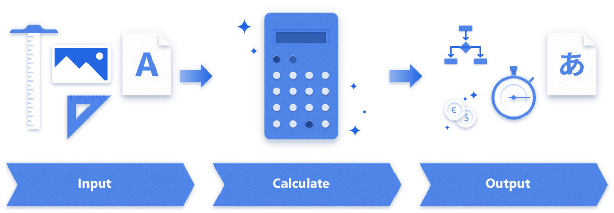
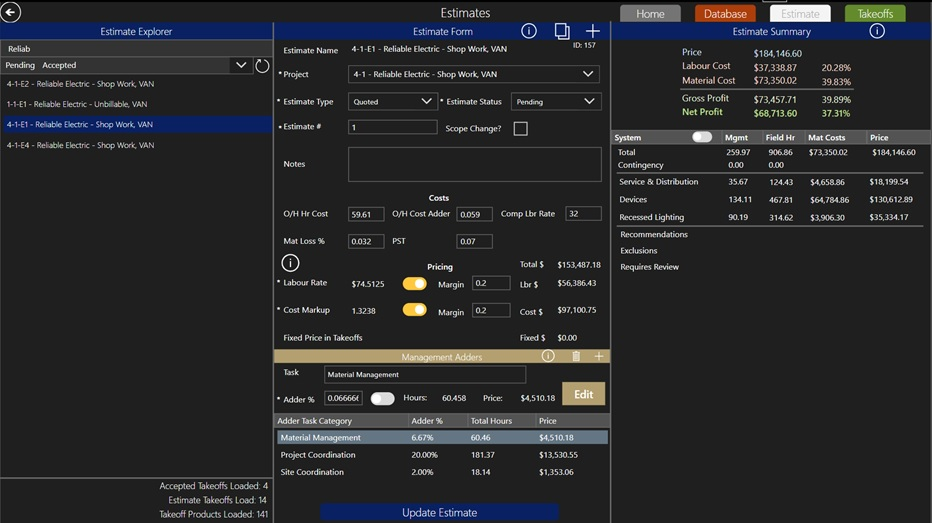
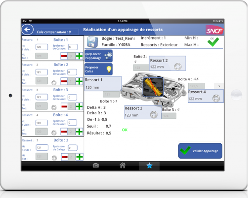
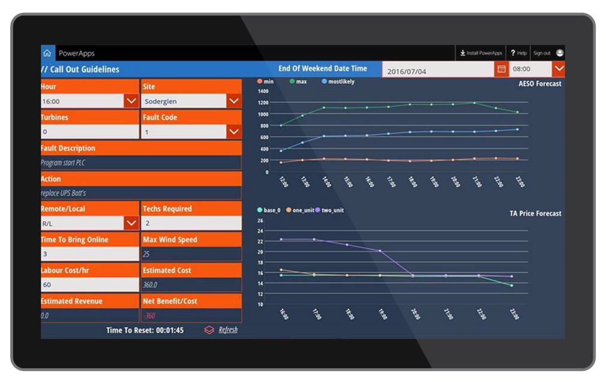

# Pattern: Calculation

<!---->

Power Apps makers use the calculation/transformation pattern to teach, to learn,
and to make their work easier and more accurate. These apps might replace
spreadsheets; apps are much easier to use and can provide outputs as charts or
even audio.

These apps take user input and perform calculations that can, for example, help
someone select the right part, adjust equipment, or provide a price estimate.
They can also rely on external data for reference or calculation, or on a
service, as in the case of a translation app that uses Azure Cognitive
Services.

## How to recognize the calculation pattern

In a typical calculation scenario:

1. A user inputs data into the app.

1. The app returns a calculated result.

    - The calculation might use a Power Apps formula or call out to an external
        function (for example, a text translation service).

    - Calculations aren't always numeric. For instance, the result might be
        translated text or the transformation of a photo to a text description.

1. The results are used in real time by the user.

    - In the most straightforward case, the user gets the result and does
        something with it. But this pattern also can be used to make games and
        other interactive effects, with the app logic making the next decision
        based on the calculated result.

    - A calculator pattern can be used to create a wizard that takes the user
        through a decision tree to troubleshoot an issue.

The calculation pattern can be paired with other patterns. For example, a
calculation can be used in the inspection/audit pattern and store the results of
the calculation in the inspection report.

## How customers are using the calculation pattern

### Reliable Electric project cost estimation

[Read the whole story.](https://powerapps.microsoft.com/blog/reliable-electric-power-platform-customer-story/)

Reliable Electric creates complex bids for integrated electrical projects in
high-end homes. These bids were created by using a legacy system that was limited
to one user at a time and used a manual process based on Excel.  Gone are the days of copying and pasting outputs into spreadsheets. The company has replaced
this process with a single app built in Power Apps that manages the entire
estimation process, a change that also reduces estimating-related manual workloads by half and dramatically lowers the potential for errors.

This app has been tailored for Reliable Electric's business
process by defining groups of materials and labor that can be used to calculate estimates more
quickly. By moving to this app, they've reduced their time
for data entry by half and can create bids more easily now that the data is
instantly available. With its related improvements to labor, accuracy, and purchasing incorporated,  the app built in Power Apps has saved Reliable Electric between CAD80,000 and CAD100,000 annually, compared to the top purpose-built electrical estimating solutions on the market.

### SNCF Manufacturing Configuration

[Read the whole story.](https://powerapps.microsoft.com/blog/sncf-power-platform-customer-success-story/)

[Watch a video.](https://youtu.be/WHtb7D1cVAI)

Workers on the factory floor use an app to evaluate the parts for repairing a
train. The app identifies the most suitable parts and configures the
installation. The app then validates the result and provides
calculations to estimate the end result of installing the selected parts.

### SNCF Translation Assistant

[Read the whole story.](https://powerapps.microsoft.com/blog/sncf-power-platform-customer-success-story/)

In the calculation/transformation pattern, the calculations don't have to be
done by the app itself, and they don't have to be numeric. The SNCF Translation
Assistant app helps employees across Europe interact more effectively by using
the Microsoft Translator service, the device's microphone, and the Power Apps audio
control to provide translations to common phrases, targeted by job role and
task. This example illustrates the use of an external algorithm, Microsoft
Translator, while the app itself still provides real-time results to the user.
In this case, the calculation is a transformation of one language into another.

### TransAlta Economic Callouts

[Read the whole story.](https://customers.microsoft.com/story/multi-national-energy-company-uses-powerapps-to-create-a-decision-validation-tool)

[Watch a video.](https://youtu.be/e_dCMN3NDsg?t=2439)

TransAlta is a multinational power generation and energy trading company.
Using Power Apps, TransAlta built a decision-making tool called Economic
Callouts to calculate the economic viability of sending an immediate response to
wind turbine service calls outside of their core operating hours.

When users open the Economic Callouts app, they're prompted to fill out
fields such as the time of day, site location, number of turbines, and fault
code. The app then generates prescribed actions from TransAlta's real-time data
feed indicating how the problem should be resolved, how long it will take, and
the number of technicians required to safely bring the equipment back online.

The logic and decision-making behind the Power Apps solution goes much deeper
than a simple "hours versus price" calculation to gain insight. Instead, Economic
Callouts collects data via API (part of Azure App Service) through 11 different
internal and external data sources to determine whether it's economically
worthwhile to dispatch a wind technician. The data source includes labor costs,
price forecasts, the average time it takes to repair an asset, and current
market forecasts.

### Elementary school classroom lessons

[Read the whole story.](https://customers.microsoft.com/story/8bit-classrom-primary-secondary-education-powerapps)

[Watch a video.](https://www.youtube.com/watch?v=Y3YiR3ZOTDc)

Teacher Brian Dang of 8-bit Classroom created an app called Bits for students
to practice spelling. The app evaluates the students' input in real time and
provides results evaluating their spelling and scoring their work. Students can
construct words by their individual sounds, record and blend words before trying
to spell them out, and sort words according to detected patterns (for example,
group all "-ity" or "-ing" words).

Another application helps students understand how fractions are combined and
multiplied, by performing real-time calculations to develop problem sets and to
visually illustrate fractions and fraction multiplication.

### Additional examples

[Higher Education Crisis Financial Impact Tracker solution template](https://powerapps.microsoft.com/blog/tracking-financial-impact-for-higher-education-a-power-platform-template/)

[!INCLUDE[footer-include](../../includes/footer-banner.md)]