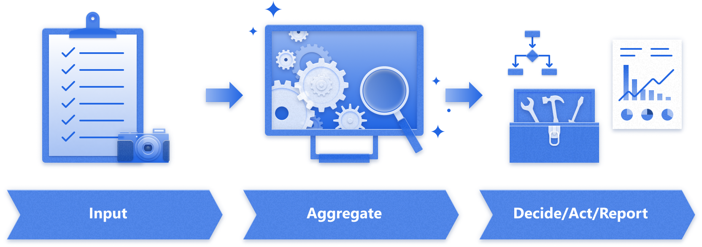
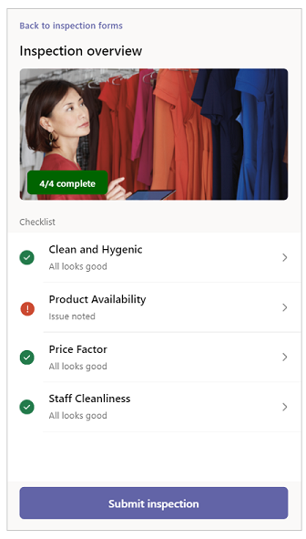
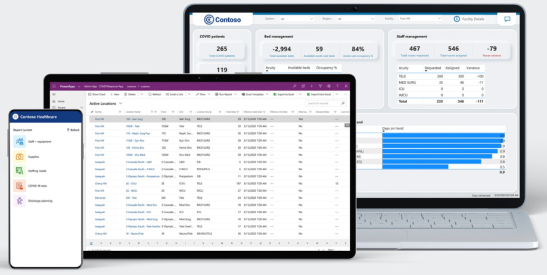
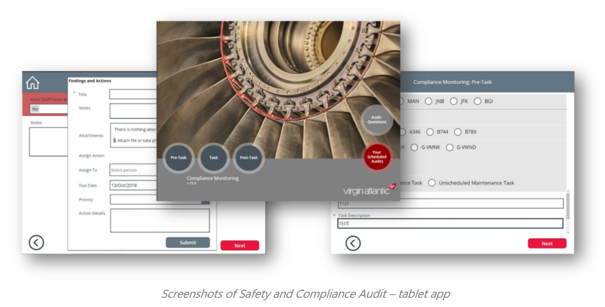
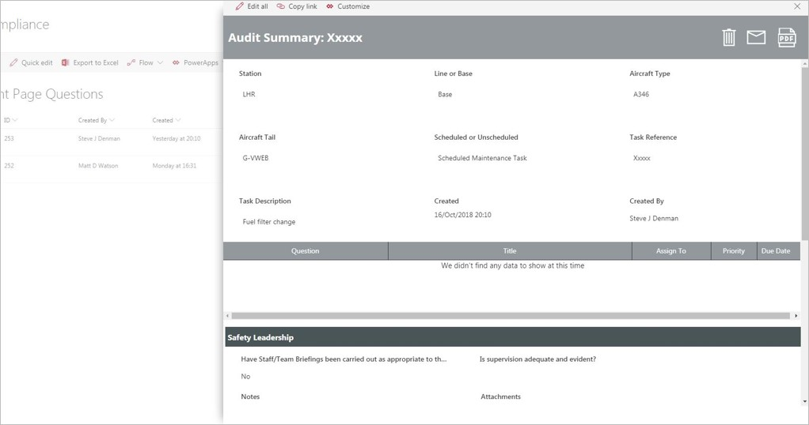
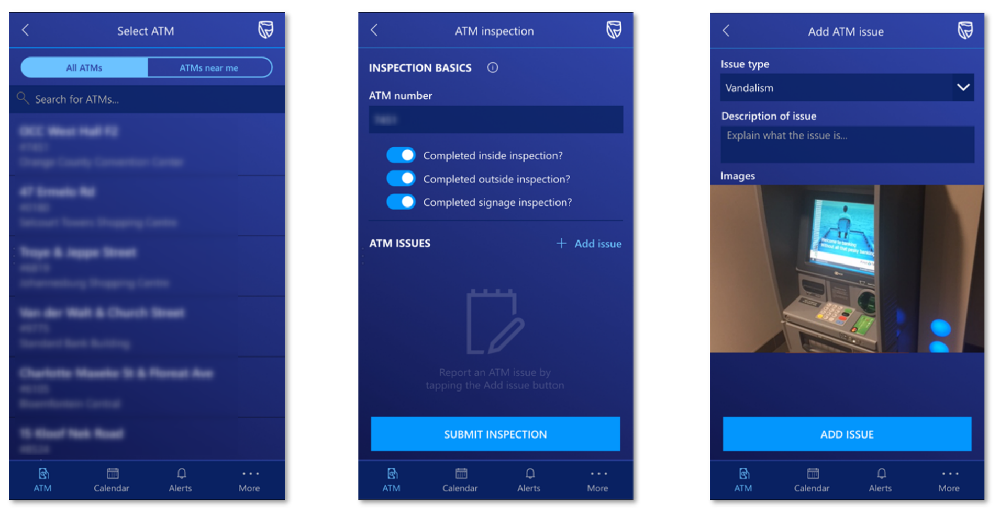
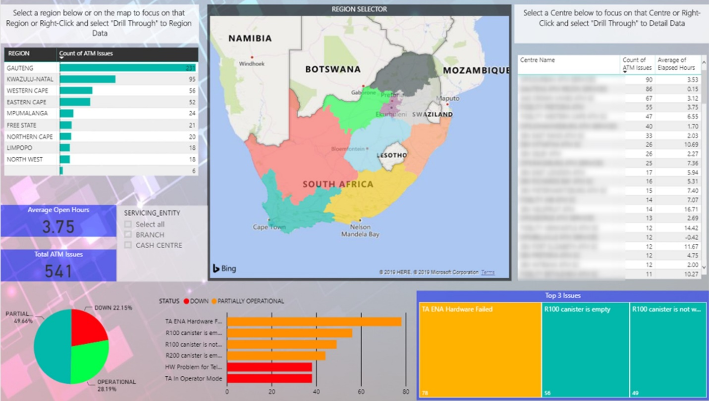
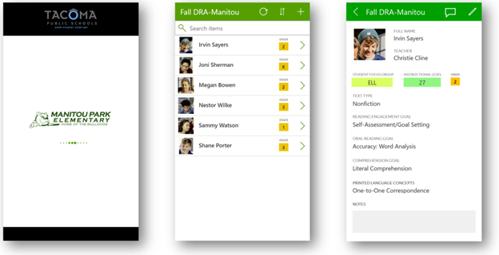

# Pattern: Inspection

There are a variety of reasons why organizations need to perform inspections,
and Microsoft Power Platform provides a no-code or low-code solution for enabling
inspection, analysis, and action. In this pattern, an app user fills out a
structured assessment, which is then uploaded to a centralized location for
analysis, reporting, and potential action. You might call this an audit, an
inspection, quality control, taking inventory, a checkup, a checklist, and so forth.

This article provides several real-world examples of how customers have used
Microsoft Power Platform to create timely, efficient, and actionable inspections, from
aircraft maintenance to elementary school.

## How to recognize the inspection pattern

In a typical inspection scenario:

1. Someone (for example, an employee or a customer) fills out a standardized
    checklist or form, and submits it.

    - This might happen on a recurring basis, such as a daily quality check, a
        monthly inventory, or a scheduled checkup.

    - Data can be collected from the public, such as crowd-sourced vandalism
        reporting.

1. Then, typically in a centralized function, all the answers are aggregated
    for review or reporting.

    - For example, you might report on how many vehicles require maintenance,
        or the history of a vehicle's status over the last year.

1. Often, an inspection results in needing to take action.

    - For example, you might see that a vehicle has failed its inspection and
        decide to take it out of service. Or the centralized report might show that daily
        maintenance standards need to be improved in a particular location.

## Template: Inspection solution for Microsoft Teams

The Inspection solution for Microsoft Teams is a general inspection app that can be used to inspect anything from a location (such as a retail store or manufacturing plant) to assets and equipment (such as vehicles and machines). The solution includes an app for performing inspections as well as an app for configuring and managing inspections.

Learn more about the solution:  [Video](https://aka.ms/TeamsInspectionVideo) |  [Documentation](https://aka.ms/TeamsInspectionDocs) |  [Teams app installer](https://aka.ms/TeamsInspection)

## Template: Hospital Emergency Response sample solution

The Hospital Emergency Response sample solution provides a set of capabilities
for healthcare organizations to collect data for situational awareness of
available beds and supplies, COVID-19&ndash;related patients, staffing, and pending
discharges. This solution implements the inspection pattern by collecting an
inventory of available hospital beds and supplies. It also uses dashboards to
summarize key data and insights for users to make informed decisions, resulting
in efficient deployment and usage of resources.

The main components of the Hospital Emergency Response solution are:

- **Mobile app for frontline staff**: Frontline staff, such as nurses and
    medical practitioners, can use the mobile app to quickly view and enter
    information as required.

- **Web app for hospital admins**: Hospital admins can use this app to add and
    manage system data required for the solution to work.

- **Dashboards for healthcare decision makers**: Decision makers can use dashboards to quickly
    view important data and metrics to help make decisions efficiently.

Learn more about the solution: [Video](https://youtu.be/Dg-i3F9G01I) | [Documentation](../../sample-apps/emergency-response/overview.md) | [Blog post](https://powerapps.microsoft.com/blog/emergency-response-solution-a-microsoft-power-platform-solution-for-healthcare-emergency-response/)

## How customers are using the inspection pattern

### Virgin Atlantic safety and compliance app

Virgin Atlantic uses Microsoft Power Platform to do a safety and compliance audit for
their aircraft. Aircraft engineers use a simple Power Apps canvas app on their
mobile devices, with pre-loaded checklists to perform ad-hoc and scheduled
inspections.

[Read the whole story.](https://powerapps.microsoft.com/blog/virgin-atlantic-drives-agile-wins-for-mobile-workforce-with-the-power-platform/)

Aircraft engineers use a canvas app on their corporate iPads to perform ad-hoc
and scheduled inspections. They can view what audits are scheduled for them and review audit questions. After an inspection is completed, expected answers are
highlighted in green to provide a visual aid. Unexpected answers are highlighted
in red and followed up with a prompt, which the engineer can use to record a finding
and assign a follow-up task to a manager.

Engineering compliance managers use a Power Apps canvas app integrated within a
SharePoint list to review completed inspections and view all inspection
findings. They can also generate HTML and PDF inspection summaries from the app
if an inspector or executive requires further information.

### Standard Bank ATM inspection app

The Cash Tribe team in Retail Banking South Africa was responsible for 8,000
ATMs. They needed to perform manual inspections of these ATMs on a regular basis
for problems&mdash;such as vandalism, broken screens, and dirty surroundings&mdash;that weren't flagged through automated alerts. The inspections were done on a clipboard
and the team was buried in reams of paperwork.

[Read the whole story.](https://powerapps.microsoft.com/blog/standard-bank-south-africa-creates-a-center-of-excellence-for-the-power-platform/)

With Microsoft Power Platform, Standard Bank was able to build a mobile app for inspecting
ATMs. Over 300 inspectors use the Power Apps canvas app to generate over 5,000
inspection reports each month. The app uses the device GPS capabilities to find
nearby ATMs and the device camera to take pictures when issues need to be
reported.

[Watch a demo of the ATM inspection.](https://youtu.be/-JRUIA8ItWE?t=1469)

An important part of the inspection pattern is the ability to review the
collected data. For this app, the data is stored in SharePoint Online lists,
which is their central data repository to enable business intelligence to aid in
future improvements. Power BI dashboards and reports are used to visualize the
aggregate data.

### Tacoma Public schools reading assessment

[Read the whole story.](https://powerapps.microsoft.com/blog/assistant-principal-builds-power-platform-solution-to-improve-reading-assessments/)

[Watch a video.](https://www.youtube.com/watch?v=v5xWpOT1V78)

Schools in Tacoma, Washington, use the (Developmental Reading Assessment, 2nd
Edition (DRA2), in which teachers read with students to assess their reading level and
abilities. Teachers systematically observe, record, and evaluate how a student's
reading performance changes over time, and use this data to set reading goals
for the student.

Rather than fill out paper forms as before, teachers now access this app from
their mobile device or Surface tablets provided by the school. Teachers use the
app to enter detailed information from each student's reading assessment, such
as oral reading goals and comprehension goals.

### Additional stories

- [Pinnacle Group – Helpdesk employee leads transition from paper to digital](https://powerapps.microsoft.com/blog/pinnacle-group/)

- [Kelly Roofing uses Power Apps to capture photos at work sites](https://powerapps.microsoft.com/blog/kellyroofing/)
- [G & J Pepsi – Transforming in-store merchandising and auditing to achieve targeted business goals](https://customers.microsoft.com/story/gj-pepsi-consumer-goods-powerapps)

### Microsoft Power Apps Community

- [App sample gallery: Audit](https://powerusers.microsoft.com/t5/forums/searchpage/tab/message?advanced=false&allow_punctuation=false&filter=location&location=forum-board:AppFeedbackGallery&q=audit)

