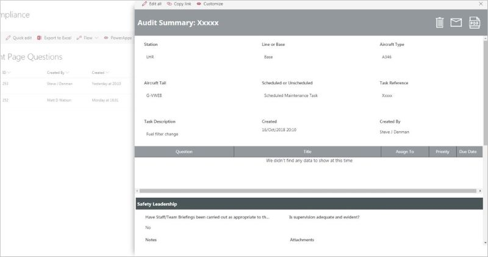

# Pattern: Inspection, Audit, Questionnaire

There are a variety of reasons why organizations need to perform inspections,
and Power Platform provides a no-code or low-code solution for enabling
inspection, analysis, and action. In this pattern, an app user fills out a
structured assessment, which then uploaded to a centralized location for
analysis, reporting, and potential action. You may call this an audit, an
inspection, quality control, taking inventory, a checkup, a checklist, a
questionnaire, and so forth.

This article provides several real-world examples of how customers have used
Power Platform to create timely, efficient, and actionable inspections, from
aircraft maintenance to elementary school.

## How to recognize the Inspection pattern

In a typical inspection scenario:

1. Someone (for example an employee or a customer) fills out a standardized
    checklist or questionnaire and submits it.

    - This may happen on a recurring basis, such as a daily quality check, a
        monthly inventory, or a scheduled checkup.

    - Data could be collected from the public, such as crowd-sourced vandalism
        reporting or filling in a personal health questionnaire.

1. Then, typically in a centralized function, all the answers are aggregated
    for review or reporting.

    - For example, you might report on how many vehicles require maintenance,
        or the history of a vehicle’s status over the last year.

1. Often, an inspection results in needing to take an action.

    - For example, you may decide that a vehicle has failed its inspection and
        take it out of service. Or the centralized report may show that daily
        maintenance standards need to be improved in a particular location.

## How customers are using the Inspection pattern

### Virgin Atlantic safety and compliance app

Virgin Atlantic uses the Power Platform to do a safety and compliance audit for
their aircraft. Aircraft engineers use a simple Power Apps canvas app on their
mobile devices, with pre-loaded checklists to perform ad-hoc and scheduled
inspections.

[Read the whole
story](https://powerapps.microsoft.com/blog/virgin-atlantic-drives-agile-wins-for-mobile-workforce-with-the-power-platform/)

#### Performing the inspection

Aircraft engineers use a canvas app on their corporate iPads to perform ad-hoc
and scheduled inspections. They can view what inspections are scheduled and what
the inspection questions are. On completing an inspection, expected answers are
highlighted in green to provide a visual aid. Unexpected answers are highlighted
in red and followed up with a prompt to allow the Engineer to record a finding
and assign a follow-up task to a manager.

#### Reviewing and taking action

Engineering Compliance Managers use a Power Apps canvas app integrated within a
SharePoint list to review completed inspections and view all inspection
findings. They can also generate HTML and PDF inspection summaries from the app
if an inspector or executive requires further information.

### Virgin Atlantic Spa Check-in app

How is a health spa similar to aircraft maintenance? Both use the inspection
pattern.

[Read the whole
story](https://powerapps.microsoft.com/blog/virgin-atlantic-drives-agile-wins-for-mobile-workforce-with-the-power-platform/)

#### Filling out the questionnaire

Clubhouse Spas in Heathrow, Gatwick and JFK use an app that connects directly to
customer data in Dynamics 365 to allow therapists and hosts to search for
customers and check if they have recently completed the mandatory Health
Questionnaire. If they haven’t, the app allows the therapist to complete the
questionnaire, a key component of the inspection pattern, at check-in with the
customer. This replaces a tedious paper process.

### Standard Bank ATM inspection app

The Cash Tribe team in Retail Banking South Africa was responsible for 8,000
ATMs. They needed to perform manual inspections of these ATMs on a regular basis
for problems such as vandalism, broken screens and dirty surroundings, that were
not flagged through automated alerts. The inspections were done on a clipboard
and the team was buried in reams of paperwork.

[Read the whole
story](https://powerapps.microsoft.com/blog/standard-bank-south-africa-creates-a-center-of-excellence-for-the-power-platform/)

#### Performing the inspection

With Power Platform, Standard Bank was able to build a mobile app for inspecting
ATMs. Over 300 inspectors use the Power Apps canvas app to generate over 5,000
inspection reports each month. The app uses the device GPS capabilities to find
nearby ATMs and the device camera to take pictures when issues need to be
reported.

[Watch a demo of the ATM Inspection](https://youtu.be/-JRUIA8ItWE?t=1469).

#### Reviewing and taking action

An important part of the inspection pattern is the ability to review the
collected data. For this app, the data is stored in SharePoint Online lists,
which is their central data repository to enable business intelligence to aid in
future improvements. Power BI dashboards and reports are used to visualize the
aggregate data.

### Tacoma Public schools reading assessment

[Read the whole
story](https://powerapps.microsoft.com/blog/assistant-principal-builds-power-platform-solution-to-improve-reading-assessments/)

Tacoma, Washington, schools use the DRA2 (Developmental Reading Assessment, 2nd
Edition) in which teachers read with students to assess their reading level and
abilities. Teachers systematically observe, record and evaluate how a student’s
reading performance changes over time, and use this data to set reading goals
for the student.

Rather than fill out paper forms as before, teachers now access this app from
their mobile device or Surface tablets provided by the school. Teachers use the
app to enter detailed information from each student’s reading assessment, such
as oral reading goals, comprehension goals, etc.

### Hospital Emergency Response sample solution

The Hospital Emergency Response sample solution provides a set of capabilities
for healthcare organizations to collect data for situational awareness of
available beds and supplies, COVID-19 related patients, staffing, and pending
discharges. This solution implements the inspection pattern by collecting an
inventory of available hospital beds and supplies. It also uses dashboards to
summarize key data and insights for users to make informed decisions resulting
in efficient deployment and usage of resources.

The main components of the Hospital Emergency Response solution are:

- **Mobile app for frontline staff**: Frontline staff, such as nurses and
    medical practitioners, can use the mobile app to quickly view and enter
    information as required.

- **Web app for Hospital admins**: Hospital admins can use this app to add and
    manage system data required for the solution to work.

- **Dashboards for healthcare decision makers**: Use dashboards to quickly
    view important data and metrics that will help you in efficient decision
    making.

[Watch the video](https://youtu.be/Dg-i3F9G01I)

Learn more about the solution: [documentation](https://docs.microsoft.com/powerapps/sample-apps/emergency-response/overview) | [blog post](https://powerapps.microsoft.com/blog/emergency-response-solution-a-microsoft-power-platform-solution-for-healthcare-emergency-response/)

### Additional stories

- [Pinnacle Group – Helpdesk employee leads transition from paper to digital](https://powerapps.microsoft.com/blog/pinnacle-group/)

- [Hexion – Global chemical manufacturer streamlines sales processes with Microsoft Power Platform and AI Builder (Automating customer surveys)](https://customers.microsoft.com/story/810656-hexion-manufacturing-power-platform)

- [Kelly Roofing uses Power Apps to capture photos at work sites](https://powerapps.microsoft.com/blog/kellyroofing/)

- [Community video: Paul Culmsee - Inside the Universal Audit App: See what Power Apps and Flow are capable of](https://www.youtube.com/watch?v=6Wn47bDOMEE)
