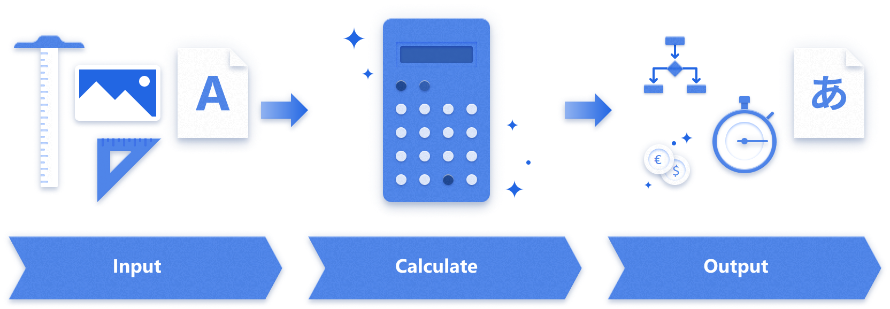

# Power Apps patterns

With Microsoft Power Platform, you can easily create apps that are tailored to your
organization's specific needs. Although your needs might be unique, we see some
common patterns among apps that organizations typically create to meet their
most-pressing needs.

Different scenarios, across different industries, often use the same basic 
patterns. For example, an app for doing aircraft inspections, a situational awareness app for hospitals, and an app for tracking kids' reading levels all
have a similar structure, even though they have very different purposes and
audiences.

In this set of articles, we've identified some of the uses we've seen for Microsoft Power Platform
and the patterns that successful makers have used to bring these
solutions to life. Each article contains links to real-world
customer stories that include best practices for structuring data, using the
elements of Microsoft Power Platform, and integrating into the overall business.

In the list below, look for a scenario that's similar to what you need and then
select the pattern to learn more.

We'll continue to add patterns over time.

:::row:::
    :::column:::
       **Approvals**
    :::column-end:::
    :::column:::
    :::column-end:::
    :::column:::
    :::column-end:::
:::row-end:::
:::row:::    
    :::column:::
       [Read more about the approvals pattern, including real-world use cases](approval-pattern.md)
    :::column-end:::
    :::column:::
        Collect approval from one or more sources

    :::column-end:::
    :::column:::
        Example use cases: 
      - Automated granting of permissions
      - Employee travel request
      - Overtime request
      - Timesheet submission
    :::column-end:::
:::row-end:::
:::row:::
    :::column:::
       **Asset management**
    :::column-end:::
    :::column:::
    :::column-end:::
    :::column:::
    :::column-end:::
:::row-end:::
:::row:::
    :::column:::
       [Read more about the asset management pattern, including real-world use cases](asset-management-pattern.md)
    :::column-end:::
    :::column:::
        Manage inventory or other assets

    :::column-end:::
    :::column:::
        Example use cases: 
      - Asset check-out
      - Asset rollout
      - Inventory management
      - Supply order management
    :::column-end:::
:::row-end:::
:::row:::
    :::column:::
       **Calculation/transformation**
    :::column-end:::
    :::column:::
    :::column-end:::
    :::column:::
    :::column-end:::
:::row-end:::
:::row:::
   :::column span="":::
      [Read more about the calculator pattern, including real-world use cases](calculator-pattern.md)
   :::column-end:::
   :::column span="":::
      Calculate or transform data

   :::column-end:::
   :::column span="":::
      Example use cases
      - Cost estimation
      - Decision support
      - Field technician app
      - Generating a work order or estimate
      - Project estimation
      - Tracking digital value
      - Tracking monthly sales goals
      - Translation of common phrases
   :::column-end:::
:::row-end:::
:::row:::
    :::column:::
       **Communication/announcement**
    :::column-end:::
    :::column:::
    :::column-end:::
    :::column:::
    :::column-end:::
:::row-end:::
:::row:::
   :::column span="":::
      [Read more about the communication pattern, including real-world use cases](communication-pattern.md)
   :::column-end:::
   :::column span="":::
      Publish news or information to employees or customers

   :::column-end:::
   :::column span="":::
      Example use cases
      - Announcement viewer
      - Company-wide communications
      - Corporate news management
      - Learning catalog
      - Product catalog
   :::column-end:::
:::row-end:::
:::row:::
    :::column:::
       **Inspection/audit**
    :::column-end:::
    :::column:::
    :::column-end:::
    :::column:::
    :::column-end:::
:::row-end:::
:::row:::
   :::column span="":::
      [Read more about the inspection pattern, including real-world use cases](inspection-pattern.md)
   :::column-end:::
   :::column span="":::
      Create standardized questionnaires to be filled out and acted on

   :::column-end:::
   :::column span="":::
      Example use cases
      - Collection of customer data
      - Daily job-site inspection
      - Incident reporting
      - IoT-based monitoring
      - Quality control checklist
      - Safety and compliance audit
      - Store audit
      - Supply tracking
   :::column-end:::
:::row-end:::
:::row:::
    :::column:::
       **Project management**
    :::column-end:::
    :::column:::
    :::column-end:::
    :::column:::
    :::column-end:::
:::row-end:::
:::row:::
    :::column:::
       [Read more about the project management pattern, including real-world use cases](project-management-pattern.md)
    :::column-end:::
    :::column:::
        Track a project from inception to completion

    :::column-end:::
    :::column:::
        Example use cases: 
      - Project management
    :::column-end:::
:::row-end:::
:::row:::
    :::column:::
       **Event management**
    :::column-end:::
    :::column:::
    :::column-end:::
    :::column:::
    :::column-end:::
:::row-end:::
:::row:::
    :::column:::
       [Find real-world event management use cases](more-patterns.md#event-management)
    :::column-end:::
    :::column:::
        Manage registration, planning, or conducting an event
    :::column-end:::
    :::column:::
        Example use cases: 
      - Attendance
      - Attendee bios
      - Registration
      - Session scheduling
    :::column-end:::
:::row-end:::
:::row:::
    :::column:::
       **Lifecycle or workflow management**
    :::column-end:::
    :::column:::
    :::column-end:::
    :::column:::
    :::column-end:::
:::row-end:::
:::row:::
    :::column:::
       [Find real-world workflow management use cases](more-patterns.md#lifecycle-or-workflow-management)
    :::column-end:::
    :::column:::
        Track and move a record through a well-defined process
    :::column-end:::
    :::column:::
        Example use cases: 
      - Contract lifecycle tracker
      - Email routing
      - Employee onboarding
      - Employee promotion evaluation
      - Expense reporting process
      - Request management
      - Service desk tickets
    :::column-end:::
:::row-end:::
:::row:::
    :::column:::
       **Scheduling**
    :::column-end:::
    :::column:::
    :::column-end:::
    :::column:::
    :::column-end:::
:::row-end:::
:::row:::
    :::column:::
       [Find real-world scheduling use cases](more-patterns.md#scheduling)
    :::column-end:::
    :::column:::
        Assign resources based on calendar availability
    :::column-end:::
    :::column:::
        Example use cases: 
      - Book a meeting room
      - Find an available sales associate
      - Reserve a tool
      - Find rooms for employee touchdown space
      - Schedule customer appointment
      - Schedule crew members
      - Book vehicles
    :::column-end:::
:::row-end:::

[!INCLUDE[footer-include](../../includes/footer-banner.md)]